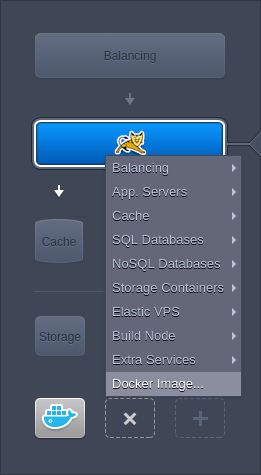
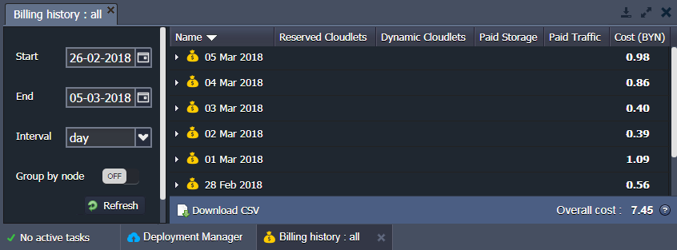

<a id="back"></a>

# Virtuozzo Application Platform 5.4

*This document is preliminary and subject to change.*  
In this document, you will find all of the new features, enhancements and visible changes included to the **PaaS 5.4** release.

{}
{}
## Container Firewall Management via User Interface
New *Firewall* section added to environment *Settings*, allowing to manage custom firewall rules via graphical user interface
{}

{}
## Private Network Isolation
For now, each user account is assigned a dedicated private network, allowing to create isolated environment groups
{}

{}
## Extra Environment Layers for All Supported Engines
A possibility to add multiple *Extra* environment layers and combine both Docker containers and platform-managed stacks within a single environment
{}

{}
## Go Support Integration
Extending the list of supported engines and technologies with *Go* programming language, delivered by means of the *Golang* application server stack
{}

{}
## UI/UX Improvements
* New option to choose among *simultaneous* and *sequential* modes when (re-)deploying or restarting multiple containers within a single node group
* Possibility to select and remove multiple items within the *Deployment Manager's* archive list at once
{}

{}
## Deployment Improvements
* Possibility to deploy application from the container's local file
* Allowing Maven build node to operate with projects from within VCS repositories subdirectory and/or to compile applications without specifying a target environment
{}

{}
## Webhooks for Application Build and Deploy Operations
Automation of environment lifecycle management with *Webhooks* to execute custom scripts before and/or after application deployment
{}

{}
## Web SSH Connection via Guacamole
Integration of web-based Guacamole client to access containers via SSH directly through the platform dashboard
{}

{}
## Container Restart Command Standardization
Support of unified commands for calling *start*, *stop* and *restart* operations similarly within alll dockerized software stacks
{}
{}


{}
{}
## UI/UX Improvements
* Updated layout for platform API documentation UI
* Updated UI for the *502* error pages
* Displaying node group and comprised stack(s) name for layers and a dedicated icon for the master node
* A possibility to expand the *Environment Management* panel with a double-click
* Allowed scrolling of the *Filters* section content in *Billing history* tab in case it doesn not fit the allocated space frame
* Dashboard notification for optional (but not forced) access to the *(re-)deploy* and *restart* actions log after the appropriate operation execution
* Ability to accumulate and view node *Statistics* data with a 1-month period
* Updating the NGINX server logo in dashboard to its latest official version
{}

{}
## Composer Dependency Manager for PHP Servers
Integration of the *Composer* dependency manager to the default Apache and NGINX-PHP application server builds
{}

{}
## HTTP 2.0 Support by Shared Balancer and Environment-Dedicated Load Balancers
Integration of the HTTP 2.0 protocol support for processing incoming requests to both common Shared Balancer and dedicated load-balancer nodes within user environments
{}

{}
## Logging of the Request Source Port Number
Fetching and storing target port number of each incoming request which has been received by the platform's Shared Load Balancer
{}

{}
## Cloud Scripting Engine Optimization
Automatic provisioning of the default API parameters and case-insensibility integration
{}

{}
## Short Aliases for Namespaces in API List for Tokens
Possibility to define the allowed API methods during tokens management by means of namespace aliases
{}

{}
## AutoFS Package to Support Mounting on Certified Templates
Reducing the number of permanently active mount points with the *AutoFS* tool and its as-needed approach
{}

{}
## Add-ons Button for the Load Balancer Layer
Permanent display of the *Add-ons* button for the nodes within load balances layer
{}

{}
## Adding VCS Directory Shortcut to the List of Favorites
Adding the */var/lib/jelastic/vcs* directory to the list of default shortcuts within containers, created upon platform-managed stack templates
{}

{}
## Environment Name within Load Alert Email Subject (build 3)
Displaying environment name in the load alerts email *Subject* to visually separate such notifications for different environments within user Inbox
{}

{}
## Clarification for Docker Container Credentials Email
Updated *Docker container created* email template to help new users with further possible steps on its use and management
{}

{}
## Detailed Response for the Image not Found Issue
Extended description for the *Image not found* error during Docker containers creation
{}

{}
## Software Stack Versions
Actualized list of supported OS templates and software stack versions
{}
{}

{}
{}
## Locked Environment Issue Handling 
There was an error when trying to manage container with the ongoing backup process
{}

{}
## Private Docker Container Credentials Change
Custom Docker containers deployed from within a custom user registry, could not be scaled after changing the access credentials
{}

{}
## Fixes Compatible with prior Versions
Bug fixes implemented in the current release and integrated to the preceding platform versions through the appropriate patches
{}

{}
## Bug Fixes
List of fixes applied to the platform within the present release
{}
{}

<style><!--
.changes-container{position:relative;padding-top:30px;padding-bottom:10px;padding-left:120px;border-top:1px solid #ddd}.changes-container:first-child{padding-top:0}.changes-container:first-child:before{top:15px}.changes-container:before{font-size:22px;position:absolute;top:45px;left:5px;width:110px;padding-top:42px;text-align:center;background-repeat:no-repeat;background-position:top}.changes-container>div{line-height:1.9;overflow:auto;margin-bottom:10px;padding:14px 20px;color:#282828;border-radius:3px}.changes-container>div:after{display:table;clear:both;content:""}.changes-container>div h6{font-size:18px;margin:0 0 16px}.changes-container>div .changes-more{position:relative;float:right;text-decoration:none}.changes-container>div .changes-more:after{margin-left:5px;content:">>"}.changes-container.changes-container--new:before{content:"New";background-image:url(data:image/png;base64,iVBORw0KGgoAAAANSUhEUgAAACoAAAAeCAYAAABaKIzgAAAAGXRFWHRTb2Z0d2FyZQBBZG9iZSBJbWFnZVJlYWR5ccllPAAAAyFpVFh0WE1MOmNvbS5hZG9iZS54bXAAAAAAADw/eHBhY2tldCBiZWdpbj0i77u/IiBpZD0iVzVNME1wQ2VoaUh6cmVTek5UY3prYzlkIj8+IDx4OnhtcG1ldGEgeG1sbnM6eD0iYWRvYmU6bnM6bWV0YS8iIHg6eG1wdGs9IkFkb2JlIFhNUCBDb3JlIDUuNi1jMTQyIDc5LjE2MDkyNCwgMjAxNy8wNy8xMy0wMTowNjozOSAgICAgICAgIj4gPHJkZjpSREYgeG1sbnM6cmRmPSJodHRwOi8vd3d3LnczLm9yZy8xOTk5LzAyLzIyLXJkZi1zeW50YXgtbnMjIj4gPHJkZjpEZXNjcmlwdGlvbiByZGY6YWJvdXQ9IiIgeG1sbnM6eG1wPSJodHRwOi8vbnMuYWRvYmUuY29tL3hhcC8xLjAvIiB4bWxuczp4bXBNTT0iaHR0cDovL25zLmFkb2JlLmNvbS94YXAvMS4wL21tLyIgeG1sbnM6c3RSZWY9Imh0dHA6Ly9ucy5hZG9iZS5jb20veGFwLzEuMC9zVHlwZS9SZXNvdXJjZVJlZiMiIHhtcDpDcmVhdG9yVG9vbD0iQWRvYmUgUGhvdG9zaG9wIENDIChXaW5kb3dzKSIgeG1wTU06SW5zdGFuY2VJRD0ieG1wLmlpZDozOEQ2OURDQjJDNDUxMUU4OEFDM0Q0OUYzRjVDQTUwMiIgeG1wTU06RG9jdW1lbnRJRD0ieG1wLmRpZDozOEQ2OURDQzJDNDUxMUU4OEFDM0Q0OUYzRjVDQTUwMiI+IDx4bXBNTTpEZXJpdmVkRnJvbSBzdFJlZjppbnN0YW5jZUlEPSJ4bXAuaWlkOjM4RDY5REM5MkM0NTExRTg4QUMzRDQ5RjNGNUNBNTAyIiBzdFJlZjpkb2N1bWVudElEPSJ4bXAuZGlkOjM4RDY5RENBMkM0NTExRTg4QUMzRDQ5RjNGNUNBNTAyIi8+IDwvcmRmOkRlc2NyaXB0aW9uPiA8L3JkZjpSREY+IDwveDp4bXBtZXRhPiA8P3hwYWNrZXQgZW5kPSJyIj8+NUw/0AAAAnNJREFUeNrMmE1oE0EYhjdLIz1IBDG1JdRqEdGCYPojqQgeWjA5xDYHpWBKPYhQaE+lLZTeTBHEq/bkpTUIIil6Mf6c0lLxUigShd6CBrTWHtQWD9L0/ei3MAzJmp2dDXnhgQy7M/Nmfr75Zn3Gq0eGBvnAGRAHN8A5cBj8Ae/AM/AG/JQrlqKjVXXQoMHkZfAcHC/zjMwOMqQX4DbYctqJ6cLgIbAEliuYLKcB8AMMOe1MdUQbwTpPt4qegtMg5eWIUp0VFyYt3QXDXhqdAl2GHi34svPNOozSbm4FvaAbnAf3DL16ArOu1miEd2mT4a36AI3qN5URTYL3NTBpaVBl6lvAolFbDasYnTVqr0tYp0G7tVrO6B2PzPwFWZvnm+A7zCaA+T+jPk3HqqwtXu8xGj2b9+idDPgMs012Rkv8z3RqF5wFv7mcr6IOHSZFmD1ZyWiIzerSPzYpZk3jDo73jzDbKBuluPnVQYJRjcLgi7S7Uw7qU/b1+GBNHuSjJ0BB85RfATmh3A/eKrYVNHkD5RQqU6d+cARsSM+uS22GXZgkXSOjPaBNofJ9XoO/QKewCcc4kbbUDtZczk7S5IxbRSPC7x2+ftBh8VAKN3kNy6iLjCZU/yWYEMrbYE4oBygecpLtVgEyesxFAw/AzQo3gE/gqKaNWTSl8KGUT3KqZsnPmVdIYwTJkNHXGhqiK/Ekx0naOBc0h7o0xdEIj0C9atuKox80TL+Xipeio3smn+2xOjVJsXpVPOvz/HGgnkSXyGnrk4+YlLwEHR6c+U61ybfeGfG7lJwkU4A+BS6CW+Aql71WgT8PpSlq0JqUX9gXYACycXnWqP0g9wAAAABJRU5ErkJggg==)}.changes-container.changes-container--new>div{background-color:#e4ffee}.changes-container.changes-container--changed:before{content:"Changed";background-image:url(data:image/png;base64,iVBORw0KGgoAAAANSUhEUgAAACoAAAAeCAYAAABaKIzgAAAAGXRFWHRTb2Z0d2FyZQBBZG9iZSBJbWFnZVJlYWR5ccllPAAAAyFpVFh0WE1MOmNvbS5hZG9iZS54bXAAAAAAADw/eHBhY2tldCBiZWdpbj0i77u/IiBpZD0iVzVNME1wQ2VoaUh6cmVTek5UY3prYzlkIj8+IDx4OnhtcG1ldGEgeG1sbnM6eD0iYWRvYmU6bnM6bWV0YS8iIHg6eG1wdGs9IkFkb2JlIFhNUCBDb3JlIDUuNi1jMTQyIDc5LjE2MDkyNCwgMjAxNy8wNy8xMy0wMTowNjozOSAgICAgICAgIj4gPHJkZjpSREYgeG1sbnM6cmRmPSJodHRwOi8vd3d3LnczLm9yZy8xOTk5LzAyLzIyLXJkZi1zeW50YXgtbnMjIj4gPHJkZjpEZXNjcmlwdGlvbiByZGY6YWJvdXQ9IiIgeG1sbnM6eG1wPSJodHRwOi8vbnMuYWRvYmUuY29tL3hhcC8xLjAvIiB4bWxuczp4bXBNTT0iaHR0cDovL25zLmFkb2JlLmNvbS94YXAvMS4wL21tLyIgeG1sbnM6c3RSZWY9Imh0dHA6Ly9ucy5hZG9iZS5jb20veGFwLzEuMC9zVHlwZS9SZXNvdXJjZVJlZiMiIHhtcDpDcmVhdG9yVG9vbD0iQWRvYmUgUGhvdG9zaG9wIENDIChXaW5kb3dzKSIgeG1wTU06SW5zdGFuY2VJRD0ieG1wLmlpZDo0QzNGRThBNjJDNDUxMUU4QTcyREYwOUUwQ0JFM0M4QiIgeG1wTU06RG9jdW1lbnRJRD0ieG1wLmRpZDo0QzNGRThBNzJDNDUxMUU4QTcyREYwOUUwQ0JFM0M4QiI+IDx4bXBNTTpEZXJpdmVkRnJvbSBzdFJlZjppbnN0YW5jZUlEPSJ4bXAuaWlkOjRDM0ZFOEE0MkM0NTExRThBNzJERjA5RTBDQkUzQzhCIiBzdFJlZjpkb2N1bWVudElEPSJ4bXAuZGlkOjRDM0ZFOEE1MkM0NTExRThBNzJERjA5RTBDQkUzQzhCIi8+IDwvcmRmOkRlc2NyaXB0aW9uPiA8L3JkZjpSREY+IDwveDp4bXBtZXRhPiA8P3hwYWNrZXQgZW5kPSJyIj8+c2zvogAAAidJREFUeNrUmM0rBVEYxueOmywuWfj+VlIkFje6ZEeJ8rURRVnIn0DJjlL+BxuSkogiiQ0iCwpJ3boLX/nOggXJx/PqvTVNXWbeOXO7nvot7rlnznnmzHnnfc94tOUPTYE8oBg0gw5QAnzgBayDWbAGHs0XfjXpFidwbrQWzIF0C30XQR94sGtUd2AwHiyALYsmSa3gHnTancwrNJkADvlxSzQDisCo1QskK0rXbDswGdYI6HHT6ADwa2o06Vn5zFARTBTNOcw7eANHmlptgPq/guq3PRrgKE3T3FUdoFW9kTz6brAbBZNhtUn2aCaY0qKrHonRYS36qkFQpQJbRvsdTBgCWUzI5rV34BZm24H+l1GPgyQQBGXgminjNjuimJgHpzCb9pvRL74zickK8Gpoe+W2oGA8SiZXMFsQyWg2m7WjfVBuMmk0W859JOn9GGYTzEbpvXlpo8AIm6zmRBBJb9xHYpZKxQljZsoDZ4KBErnmtDrps3D/p+ocQJvCAXwu9TWrhYxWgnzhABTdT+A8Qo3Zyf89cV+pur1ccTtRMuOLsIq5ChKCn1a0XYt9JZHRlH9g9IqMXigaLM5im0TzZHRV0WBdpveyzm0qNE3v0QDXnrEqOlqn013vKXz8bqgVx5Sfcopye2OMmhwHO8Zcf8IfB2JJY2AwfOgzbv4lUCrM+Sp1x0XMkPFkai6ST0EhqAK9oIF/u60z/jw0DQ5oT5o7fAswAKxgepYzbixFAAAAAElFTkSuQmCC)}.changes-container.changes-container--changed>div{background-color:#def6ff}.changes-container.changes-container--fixed:before{content:"Fixed";background-image:url(data:image/png;base64,iVBORw0KGgoAAAANSUhEUgAAACoAAAAeCAYAAABaKIzgAAAAGXRFWHRTb2Z0d2FyZQBBZG9iZSBJbWFnZVJlYWR5ccllPAAAAyFpVFh0WE1MOmNvbS5hZG9iZS54bXAAAAAAADw/eHBhY2tldCBiZWdpbj0i77u/IiBpZD0iVzVNME1wQ2VoaUh6cmVTek5UY3prYzlkIj8+IDx4OnhtcG1ldGEgeG1sbnM6eD0iYWRvYmU6bnM6bWV0YS8iIHg6eG1wdGs9IkFkb2JlIFhNUCBDb3JlIDUuNi1jMTQyIDc5LjE2MDkyNCwgMjAxNy8wNy8xMy0wMTowNjozOSAgICAgICAgIj4gPHJkZjpSREYgeG1sbnM6cmRmPSJodHRwOi8vd3d3LnczLm9yZy8xOTk5LzAyLzIyLXJkZi1zeW50YXgtbnMjIj4gPHJkZjpEZXNjcmlwdGlvbiByZGY6YWJvdXQ9IiIgeG1sbnM6eG1wPSJodHRwOi8vbnMuYWRvYmUuY29tL3hhcC8xLjAvIiB4bWxuczp4bXBNTT0iaHR0cDovL25zLmFkb2JlLmNvbS94YXAvMS4wL21tLyIgeG1sbnM6c3RSZWY9Imh0dHA6Ly9ucy5hZG9iZS5jb20veGFwLzEuMC9zVHlwZS9SZXNvdXJjZVJlZiMiIHhtcDpDcmVhdG9yVG9vbD0iQWRvYmUgUGhvdG9zaG9wIENDIChXaW5kb3dzKSIgeG1wTU06SW5zdGFuY2VJRD0ieG1wLmlpZDpEM0FFMDgwQzJDNDUxMUU4Qjk2NUQ1RjM3QjZEQTIwQyIgeG1wTU06RG9jdW1lbnRJRD0ieG1wLmRpZDpEM0FFMDgwRDJDNDUxMUU4Qjk2NUQ1RjM3QjZEQTIwQyI+IDx4bXBNTTpEZXJpdmVkRnJvbSBzdFJlZjppbnN0YW5jZUlEPSJ4bXAuaWlkOkQzQUUwODBBMkM0NTExRThCOTY1RDVGMzdCNkRBMjBDIiBzdFJlZjpkb2N1bWVudElEPSJ4bXAuZGlkOkQzQUUwODBCMkM0NTExRThCOTY1RDVGMzdCNkRBMjBDIi8+IDwvcmRmOkRlc2NyaXB0aW9uPiA8L3JkZjpSREY+IDwveDp4bXBtZXRhPiA8P3hwYWNrZXQgZW5kPSJyIj8+p2cxQAAAAm5JREFUeNrMmN1LFFEYxmeHTfdChWRdM+xDEiG7XJQtRCKFKNDdINTCBS+68E5CUBDxpiDqIugP6MaPShHDuihCbyoUb4K09NpsQfy4KQ1M3fV5l3dgmMbdmXPObPvAD+brnHnmPfOe8874Uq98mgJRJzWgBbSBi6AI7IAZMAE+gO1/WrYnHd3Ar8BkA5gE5TbnyGyMIU2De2DL7U10CYMF4DX4dIxJO0XBJuhwezPRiAbAVx5uEb0E1eChlxGlNp8lTBp6AOJeGu0DYU2NhrVx/ZSjbM2S9XSyktkHe2BRU6tZ0Jwt+zO9oxHO0pDmrZoARXVdZOg7wXwOTBqKibyjFWBEwc0PwDL45eDauIjRQUmDf8BVUAgugUYHba4gqcqAq2Tal1yxKPESvE1Gv7louwG607nRnkxmiqhP0uRjk8kClyY1zokpsILohjIZTfFTiWrUtP0XzFleiTN8PJtq0g88rp8/zuhpcChhdNeyfwe8ZZMXwE+uqJwu70swG7AajfCwVUgYDVj2f4BWUMzz5AlQ6qI/qr6em42e5XlTRjfT75a9jMS4LdDvXUQ1qHMCfVRg8l2Wa+rAC8H+W/3cwTkPTF4Dv8FJ0MPXiarTzxW3apODXMapUpiG/pbE+mxnckixSVIJRTQouExO2xx/Cu57ULQkKKJrAg39nIS5MEmaIqPvBT/senlepOLjmYcmSWNUlEQUzKFeij6tyymiC4LDnytFqZLSuRC5kacmnxiFjbGEfuefA/mkR6Df+OgzFyVvQC1Y/c8Gqcy8DAbMX6bWIpmKiipQD7rAdd73Wqv8e2gMfLFW96QjAQYAvVZ8VxrR76cAAAAASUVORK5CYII=)}.changes-container.changes-container--fixed>div{background-color:#fef6e6}@media (max-width:479px){.changes-container{padding-top:80px!important;padding-right:10px;padding-left:10px}.changes-container:first-child:before{top:25px}.changes-container:last-child{margin-bottom:0!important}.changes-container:last-child:after{display:none!important}.changes-container:before{top:25px;left:auto;width:auto;margin-left:0;padding-top:6px;padding-left:55px;background-position:0 0}.changes-container.changes-container--changed,.changes-container.changes-container--fixed,.changes-container.changes-container--new{position:relative;margin-bottom:40px;border-bottom:0}.changes-container.changes-container--changed:after,.changes-container.changes-container--fixed:after,.changes-container.changes-container--new:after{position:absolute;right:0;bottom:0;left:0;display:block;height:1px;content:"";background-color:#dedede}.changes-container.changes-container--changed>div,.changes-container.changes-container--fixed>div,.changes-container.changes-container--new>div{padding:0;background-color:transparent}.changes-container.changes-container--changed .changes-more,.changes-container.changes-container--fixed .changes-more,.changes-container.changes-container--new .changes-more{line-height:1.4}.changes-container.changes-container--changed .changes-more:before,.changes-container.changes-container--fixed .changes-more:before,.changes-container.changes-container--new .changes-more:before{bottom:2px}.changes-container.changes-container--new{background:-webkit-gradient(linear,left top,left bottom,from(#e4ffee),to(#ffffff));background:-webkit-linear-gradient(top,#e4ffee,#ffffff);background:-o-linear-gradient(top,#e4ffee,#ffffff);background:linear-gradient(180deg,#e4ffee,#ffffff)}.changes-container.changes-container--changed{background:-webkit-gradient(linear,left top,left bottom,from(#def6ff),to(#ffffff));background:-webkit-linear-gradient(top,#def6ff,#ffffff);background:-o-linear-gradient(top,#def6ff,#ffffff);background:linear-gradient(180deg,#def6ff,#ffffff)}.changes-container.changes-container--fixed{background:-webkit-gradient(linear,left top,left bottom,from(#fef6e6),to(#ffffff));background:-webkit-linear-gradient(top,#fef6e6,#ffffff);background:-o-linear-gradient(top,#fef6e6,#ffffff);background:linear-gradient(180deg,#fef6e6,#ffffff)}}
--></style>


## Container Firewall Management via User Interface
One of the major features of PaaS 5.4 release is a newly implemented possibility to manage firewall rules through a comfortable graphical interface on the container level (excluding custom [Docker-](/dockers-overview) and [Windows-](/iis8)based nodes) - the dedicated same-named section was added to the environment **Settings** menu.


Here, the following three tabs are available:

* ***Overview*** - provides general information on the feature, allows to change *Firewall State* (which is enabled for all containers by default) and shows Isolated Env Group(s) the current environment is included to
* ***Inbound Rules*** - allows to manage incoming requests (not listed ones will be denied by default)
* ***Outbound Rules*** - allows to control outgoing connections (not listed ones will be allowed by default)


A number of default rules is automatically added to the *inbound* section by the Platform to make your node operable. Rules within the list are grouped by layers and are marked with the following color labels:

* *gray* for the default non-editable records (i.e. the obligatory ones)
* *white* for other default (stack-related) and user-added (either by an environment owner or his collaborators) rules

{}**Note:** Apply changes to the default rules only in the case you know exactly what you are doing, since these records are required to ensure stack specific functionality and to provide particular features support (e.g. to allow *SSH*, *HTTP*, *HTTPS* or *FTP* connections).{}

The very first record is has the highest priority (*1*) and allows platform infrastructure to access a container. Also, subsequent execution of some container management operations (e.g. creating mount points, installing FTP add-on, etc.) can result in automatic complementation of the default rules list. Herewith, each rule is added with a 10 points priority step, so that you would be able to insert new ones in between the default records without the necessity to edit the already applied connection permissions. 

At the dedicated section, the tools panel above the list contains a set of buttons for a convenient firewall rules management, namely: *Add*, *Edit*, *Remove*, *Disable* (*Enable*) and *Refresh*. When adding a new rule, the following parameters should be defined:

* **Nodes** - allows to select the required environment layer
* **Name** - to provide name for this record (can be expanded to select from a number of the commonly used rules)
* **Protocol** - to set the required protocol type (*TCP*, *UDP* or *TCP/UDP*)
* **Port Range** - to define a particular port (e.g. *80*) or their range (e.g. *1024-2048*) to be opened/closed for connection; leave this field blank to apply the rule to *all* ports
* **Source** - to select the request source:
    * *Custom IP Address(es)* - a comma-separated list of IPv4/IPv6 addresses and CIDR blocks (e.g. *10.0.0.1*,*10.0.0.0/24*)
    * redefined ranges - *All*, *All IPv4*, *All IPv6*, *Local Network*, *Internet (Public Access)*
    * *Environment Nodes* - node type (layer) from any environment on an account (after appliance this rule will be automatically adjusted upon the appropriate layer scaling)
* **Priority** - to set a rule priority (where rules with lower value will be applied first)
* **Action** - to define the required action upon receiving the matching request (either *allow* or *deny*)

Subsequently, if meeting the necessity to edit any of predefined rules, you'll be able to adjust all of the above-described parameters except of the Nodes field (i.e. target layer can not be switched). Also, with testing purposes, you can temporarily exclude some firewall records and reapply them later on with the appropriate **Disable/Enable** buttons. After some adjustment (for example, topology change), you may need to update the list of rules with the **Refresh** button.

{}**Note:** Rules, listed within the [iptables-custom](/custom-firewall#ssh) file, won't be displayed within the dashboard UI, but will be applied before them<a id="network-isolation"></a>.{}{}{}


## Private Network Isolation
In confines of PaaS 5.4 release, an automatic account isolation was implemented at a Platform. This explicitly prohibits any unallowed connections between environments of different users via internal platform network (i.e. even in a case some malefactor has managed to gains access to such data as [domain name, node ID, internal IP](/container-dns-hostnames), etc.).

This results in another essential newly added possibility to create a so-called &ldquo;secure&rdquo; [environment groups](/environment-groups), intended to isolate environments of a single account from each other. Just turn on a new *Network Isolation* switcher within the **Add** or **Edit** **Group** frame.


Platform automatically creates a dedicated IP set for each isolated group, which is composed of the appropriate containers internal addresses. This allows to control access between nodes (i.e. if IPs are within the same set - interconnection is allowed, if not - denied). Also, Platform detects all the appropriate account changes to automatically keep sets up-to-date (e.g. due to environment removal, nodes scaling, etc.).

Also, while managing *Network Isolation*, the following peculiarities should be considered:  

* the feature can be enabled for the top-level group only (i.e. not for [subgroups](/environment-groups-management#add-subgroup))
* environment groups with enabled isolation are provided with a custom icon for better recognition
* [shared environments](/share-environment) can not be included into isolated groups by collaborators
* access from outside of the Platform (e.g. via [Public IP](/public-ipv4)) could not be limited by this <a id="extra-environment-layers"></a>feature
{}{}


## Extra Environment Layers for All Supported Engines
In order to support even greater variety of solutions (through a more flexible topology constructor), a number of special adjustments were applied to the environment wizard:

* all layers include an additional **Docker image** option now, whilst sections within the ***Docker*** tab were complemented with platform-managed templates instead; this allows to combine both certified and custom [Docker containers](/dockers-overview) in confines of a single environment
* within the ***App. Server*** layer the possibility to select servers for any programming language was added (you'll be automatically switched to the appropriate tab)
* the ***Extra*** layer option was integrated to all tabs, allowing to deploy any platform-managed stack template or Docker container image within the required environment layer; herewith, any required number of additional layers can be created
* added possibility to specify custom layer names via topology wizard



Such changes ensure environments versatility, allowing to create the one, which will suit you the most<a id="go-support"></a>.{}{}


## Go Support Integration
The most notable stack provisioning update in confines of PaaS 5.4 release is addition of a new programming language to the list of supported ones - [Go](https://golang.org/). This free and open-source language (originally developed by Google) allows you to leverage with multiple built-in features:

* a *concurrency mechanisms* to get the most of the multicore systems
* *modular program construction* to achieve advanced flexibility
* *fast compilation* into machine codes
* a convenient *garbage collection* for efficient memory utilization


Go is easy to write on due to utilizing a set of simple tools and commands for operating with code. Below, you can find a list of the most common commands (refer to the [official documentation](https://golang.org/cmd/go/) for the complete list):

* ***go build*** - compiles packages and builds Go binaries
* ***go test*** - tests packages
* ***go fmt*** - formats package source code
* ***go get*** - downloads and installs packages
* ***go vet*** - reports potential errors in code
* ***go run*** - builds and executes code
* ***go doc*** - displays documentation
* ***go generate***- generates Go files by processing code

The integration of a *Golang* application server was implemented through addition of the appropriate platform-developed dockerized stack templates, providing the *1.9.1*, *1.9.2*, *1.9.4* and *1.10* versions of the stack. A new app server supports all of the functionality required to work with Go and provides access to the platform native benefits (e.g. vertical and [horizontal scaling](/app-server-horizontal-scaling), files and logs management, statistics monitoring and load alerts, etc.). Herewith, due to the Go engine specifics, it supports only VCS deployment type (i.e. deployment from archive is not available), whilst the appropriate server could operate with just a single project (context) at once<a id="ui"></a>.{}{}


## UI/UX Improvements

* [API Documentation Redesign](#ui-api-documentation)
* [Environment Error Pages Restyle](#ui-error-page-restyle)
* [Parallel Containers (Re-)Deploy and Restart](#ui-deployment-types)
* [Environment Layer and Master Node Designation](#ui-master-node)
* [Simultaneous Removal of Multiple Deployment Archives](#ui-archives-bulk-removal)
* [Improved Environment Management Panel Accessibility](#ui-management-panel-accessibility)
* [Scrollable Filters Section for Billing History](#ui-scrolable-billing-filters)
* [Action Logs for Container (Re-)Deploy and Restart Operations](#ui-action-logs)
* [Container Consumption Statistics for the Last Month](#ui-month-statistics)
* [Official NGINX Logo Integration](#ui-nginx-logo){}{}


#### API Documentation Redesign
Within the current platform upgrade, a major redesign of [platform API documentation](https://www.virtuozzo.com/application-platform-api-docs/) has been implemented. The new style corresponds to the current [site](https://jelastic.com/) and [documentation](/) color scheme and ensures better appeal in general. So, currently, API documentation includes three default tabs, which can not be closed:

* *Home* - general overview of platform API and the common points/recommendations on its usage
* *API Documentation* - the main section, where the categorized methods list is displayed, allowing to browse through all of the API requests
* *Examples* - list of useful samples to demonstrate some basic procedures and automation flows, which could be implemented by means of platform API


Additionally, a few functionality optimization were applied to provide better user experience. For example, newly added drop-down list at the top left corner of the page, allows to select platform version (i.e. to display only the appropriate API requests). Next to it, you can find a ***Search*** field, which helps to find any API method. Also, for each section, the quick *Filter class members* field was added (top-right corner) to easily search through this particular group of requests.

[More info](https://www.virtuozzo.com/application-platform-api-docs/)
{}{}

#### Environment Error Pages Restyle
If URL in the address bar points to environment, which can not be reached (e.g. for the reason it does not exist at a platform, or is stopped, or is down due to some maintenance activities, etc.) a dedicated error page will be displayed. Herewith, the platform automatically detects the issue occurred and provides the appropriate description with some of the most common steps (recommendations) to avoid or fix it. In the present PaaS 5.4 release, the corresponding set of error pages were updated, including their redesign to match the latest platform corporate style. Also, the link for contacting the platform support team was moved to the bottom of the page.


<a id="ui-deployment-types"></a>
{}{}

#### Parallel Containers (Re-)Deploy and Restart
In the PaaS 5.4 release, there was added a possibility to choose between two ways of [horizontally scaled nodes](/horizontal-scaling) managing was implemented:

* ***simultaneously*** (i.e. all containers at once), which apply changes in a single run, but cause a brief service downtime
* ***sequentially*** (i.e. one by one), where nodes are adjusted consecutively with predefined delay between operation on each two containers - to avoid service downtime


Herewith, the first one can be a preferable option during testing/development, while the second one is mandatory for applications in production to ensure constant service operability. The required deployment type can be chosen by means of the appropriate options, which were added to the restart, [deploy](/deployment-guide) and [update](/docker-update) dialog boxes (for horizontally scaled layers only)<a id="ui-master-node"></a>.
{}{}

#### Environment Layer and Master Node Designation
Due to the [extra environment layer](#extra-environment-layers) feature, you are able to completely change the default topology structure (e.g. to place same stack within several environment layers). Upon working with such custom topologies, in order to avoid confusion, the new more explicit designation was provided to show node group (layer) and the comprized stack(s) name simultaneously.

Such a change was implemented within all of the corresponding dashboard sections and dialog frames (e.g. *load alerts*, *endpoints*, *firewall*, *Docker container linking*, etc.). Herewith, upon hovering over a particular item within any of the node group lists, an additional information will be displayed in a pop up.


Also, the very first container within each layer of an environment is automatically considered by the platform as *master*. This node is required for some specific operations and can additionally be used in the following cases:

* is used as origin for any [subsequent container](/horizontal-scaling) on the load balancers, application servers and VPS layers, i.e. new nodes will be a copy of this initial one
* is required for the [cloning](/clone-environment) operation
* can be configured as a [storage server](/master-container-storage) for sharing data within the whole layer
* is recommended to store the main configurations for a cluster, to ensure your data won't be lost during scale in (as *master* is the last node to be removed)

In case of a simultaneous creation of the multiple containers, *master* is not always the first node displayed in the platform dashboard, so, starting with the 5.4 release, the appropriate designation was provided. For now, if layer has more than one node, the special icon will be displayed before the master one, allowing to quickly identify it<a id="ui-archives-bulk-removal"></a>.
{}{}

#### Simultaneous Removal of Multiple Deployment Archives
When working with multiple projects and/or their copies, your **Deployment Manager** could be occasionally over-filled with numerous *Archives*, uploaded to it. Such a mess makes it difficult to find the required package, decreasing the service usability in general. So, in order to make the task of unnecessary projects removal quicker and more comfortable, the possibility to delete multiple packages at once was implemented. Just select all of the unnecessary items with the appropriate check boxes and click the **Delete** button from the tools menu.


<a id="ui-management-panel-accessibility"></a>
{}{}

#### Improved Environment Management Panel Accessibility
For quicker access and more convenient usage of the **Environment Management** panel within the platform dashboard, the possibility to easily expand it to a full-screen size was implemented. Just double-click anywhere on the tabs pane at the top of a frame to fill the whole dashboard space with the current section (i.e. *Deployment Manager*, *Tasks* or a particular environment *Settings*). This allows to percept and manage the required configurations more comfortable. And in order to quickly return to the previous size of the *Environment Management* panel, just double-click at the top of the frame once more.


<a id="ui-scrolable-billing-filters"></a>
{}{}

#### Scrollable Filters Section for Billing History
The platform [Billing History](/consumed-resources#billing) frame provides an important information about account balance charges. Here, you can review all spends (either per environment or for the whole account) and see all of the appropriate resources (i.e which were [charged](/chargeable-resources) for). Using the filters section to the left of the tab, you can adjust the *Start* and *End* date, select the required *Interval*, enable or disable the *Group by node* feature and *Refresh* results.



And starting with the current Platform release, there was implemented the possibility to operate with the filtering section in case of a cramped space (i.e. low *Billing History* frame height). For now, the appropriate scrolling bar will automatically appear in case elements can not be fitted within the filtering section.

[More info](/consumed-resources#billing)
{}{}

#### Action Logs for Container (Re-)Deploy and Restart Operations
By default, the platform automatically provides details on container(s) restart, deploy and [redeploy](/docker-update) operations by opening a dedicated tab in the *Environment Management* panel, where the information on the appropriate action is displayed. Currently, such flow was optimized, providing just a dashboard notification with the **Show Logs** button. This allows to open action log only in case it's actually necessary. Herewith, for Docker containers the button will expand a drop-down menu with possibility to review both **Action Log** and **Run Log** files.

<a id="ui-month-statistics"></a>
{}{}


#### Container Consumption Statistics for the Last Month
In order to allow better analysis of a resource usage on nodes, the [Statistics](/view-app-statistics) section was adjusted to display data for the whole past month (rather than just a week). If needed, such enlarged period can be selected from the appropriate **Duration** drop-down list within the **Statistics** tab. Herewith, it can be used only with the *1 hour* and *1 day* intervals, which provide the appropriate level of data granulation.


<a id="ui-nginx-logo"></a>
{}{}


#### Official NGINX Logo Integration
In the present 5.4 Platform release, the [NGINX](https://nginx.org/) server logo in the platform dashboard was replaced with its most recent official version. Herewith, changes (with the appropriate recolor to match [layers](/paas-components-definition/#layer) color scheme) were provided for the NGINX PHP/Ruby application servers and load balancer. Such an implementation ensures a more accurate reference to the stack.


<a id="deploy"></a>
{}{}


## Deployment Improvements

* [Application Deployment from Container Local File](#deploy-local-file)
* [Maven Build Node Amendments](#deploy-maven-node){}{}

#### Application Deployment from Container Local File
Within the current Platform upgrade, a possibility to deploy application to container from archive located on the same node was implemented. This can be performed through the *URL* section of the deployment frame by providing address using the ***file://*** protocol with path to local file (e.g. *file:///path/to/archive.war*). Herewith, such functionality works with external NFS storages through [mount points](/mount-points). For example, you can mount directory with Java projects, which were built by [Maven](/java-vcs-deployment/), to your application server, ensuring faster deployment (due to skipping file upload step).


<a id="deploy-maven-node"></a>
{}{}


#### Maven Build Node Amendments
In the present 5.4 Platform release, functionality of the [Maven](/java-vcs-deployment/) build node was extended with a number of new possibilities, aimed to enhance users experience during the appropriate Java projects deployment:

* Added possibility to *add*, *edit*, *remove* and *build* project without specifying the target environment, i.e. allowing just to add a new project to the *Deployment Manager* and/or pre-build it within Maven without its actual deployment. As one of the main advantages, this eliminates the necessity to predefine repository data and re-build a project with exact target environment parameters upon deploying it to multiple environments.

* The Maven build node stack template was provided with a dedicated **/opt/maven/conf/<i>variables.conf**</i> file, which, in conjunction with the pre-installed ***[java-memory-agent](https://github.com/jelastic-jps/java-memory-agent)*** add-on, allows to define values for the most essential Java server options (e.g. -*Xmx*, *-Xms*, *-Xmn*, etc.). Also, the ***MAVEN_RUN_ARGS*** and ***MAVEN_RUN_ARGS\_\{project\}*** variables were added to the node's default build, allowing to specify additional [Maven command-line parameters](http://maven.apache.org/ref/3.1.0/maven-embedder/cli.html) for either all or a particular project respectively (where, the ***{project}*** name should be stated with underscores "*_*" instead of spaces and dashes).

* Also, there was added a possibility to deploy Java projects, located in the VCS repository subdirectory, allowing to store various app versions within a single repo and organize them properly. This was implemented through the addition of a new **Working Directory** field within the ***Git / SVN*** deployment form (available for Java instances only). Here, if needed, you can set a repository subfolder with the required application sources.


* The Maven build process was adjusted to be run under the *jelastic* user to support the [webhooks implementation](#deployment-hooks). For now, as both operations are executed by the same user, all of the created files are accessible without any additional changes required. For example, with the appropriate post hook, this allows to run your project immediately after it was built.
{}{}


## Webhooks for Application Build and Deploy Operations
Webhook is a term used to indicate a code insertion to customize original flow of operations based on a certain condition. In the current Platform upgrade, such webhooks were added to provide a possibility to run custom script on nodes before and/or after application *deployment*. Additionally, for the Maven build node and the [Golang](#go-support) application server the pre- and post-*build* hooks were implemented as well. Such functionality was added to all of the deployment forms (archive, URL, Git/SVN) at dashboard and is located within a new ***Hooks*** section of the appropriate frames.


Selecting the **Pre** or **Post** hook from the deployment form will open a code editor window, where you can provide your custom script. Herewith, any preferable programming language can be used, you just need to specify the appropriate program for code interpretation (should be pre-installed on container). For example:


Also, you can break your hook (and the appropriate deployment / build operation) execution at any point by providing an exit code, for example *exit 1*. Herewith, the *0* value is used to indicate success, while any other value assumes an error (will be shown at dashboard). Additionally, in case of a webhook failure, the dashboard notification will point to the appropriate ***hook.log*** file, providing details required for troubleshooting.
[More info](/deployment-hooks){}{}


## Web SSH Connection via Guacamole
Within the present PaaS 5.4 upgrade, the platform integrated the latest [0.9.13-incubating](https://guacamole.incubator.apache.org/releases/0.9.13-incubating/) version of the Guacamole Gateway into the Platform to provide SSH connection to a container of any type directly in browser. Just click a new **Web SSH** button next to the required node and a dedicated tab with terminal emulator will be opened. Herewith, you'll be automatically connected to the appropriate container without necessity to provide SSH key or perform any other additional actions.


In the tools panel of the opened frame, you are able to switch between nodes of the [horizontally-scaled](/horizontal-scaling) layer. *<u>Starting with the 3rd build of the 5.4 release</u>*, the **Duplicate Session** button was added to open another tab with connection to the current container. This option allows to perform several simultaneous operations on a single node (e.g. tail log in one terminal window and manage your application in another).

[More info](/web-ssh-client){}{}


## Composer Dependency Manager for PHP Servers
[Composer](https://getcomposer.org/) is one of the most popular dependency managers for PHP, which provides all of the required packages and libraries for your applications. Being run on the per project basis, Composer allows each one to have a different set of dependencies installed directly into the appropriate working directory. Also, it can automatically load updates to keep your packages up-to-date.


Within the present 5.4 release, the Composer was integrated into both *Apache* and *NGINX PHP* application servers (located at the **usr/local/bin** folder). In order to be further operable from anywhere on the node, this tool was automatically added to the *PATH* variable and can be called with a *composer* shortcut (e.g. *composer* *about*). Additionally, in case the appropriate project has a ***composer.json*** file, such implementation allows to manage dependencies directly during the deploy operation with the appropriate post [hook script](#deployment-hooks). Namely, you need to move to your project directory and run the install command:

```bash
cd $WEBROOT/ {project_name}  
composer install
```

Herewith, Composer is automatically provided for all of the newly created PHP application servers, so you are able to operate dependencies even on the Platforms below 5.4 (e.g. through SSH). In order to work with Composer on the already existing nodes, follow the appropriate guide for <a href="/php-composer" target="_blank" id="http2-support">manual installation</a>.{}{}


## HTTP 2.0 Support for Shared and Dedicated Load Balancers

The [Shared Load Balancer](/shared-load-balancer) processes all of the incoming requests to the platform (excluding direct connections to [Public IP](/public-ipv4) addresses) and routes them to the destination nodes. In the current PaaS release, to ensure a secure connections over SSL protocol, an [OpenSSL](https://www.openssl.org/) tool on SLB was updated to its *1.0.2.k* version. The new version additionally supports an ALPN (Application-Layer Protocol Negotiation) extension, which allows Shared Load Balancer to work over the [HTTP 2.0](https://en.wikipedia.org/wiki/HTTP/2) protocol, when SSL is enabled.


Herewith, to support direct access via Public IP, the *NGINX* and *Varnish* load balancers were similarly upgraded. In such a way, for the most cases a quicker request processing (compared to the commonly used HTTP 1.1) can be achieved without necessity to adjust your application, i.e. through improved compression of web pages, reduces latency, etc.

{}**Note:** The HTTP 2.0 support on the *HAProxy* and *Apache* load balancers will be implemented in future releases during the appropriate stacks conversion into dockerized templates<a id="ports-logging"></a>.{}{}{}


## Logging of Requests Source Port
Starting with the present PaaS release, each platform's entry point node - so-called [Shared Load Balancer](/shared-load-balancer) - was configured to automatically log the source port of each incoming requests. For example, such implementation allows to successfully track the users' activity over the mobile internet access, where source client can not be identified with the standard login<a id="cs-optimization"></a>.{}{}


## Cloud Scripting Engine Optimization
In the current platform 5.4 upgrade, a number of optimizations were implemented for the Cloud Scripting engine to provide a better interaction with API methods:

* all parameters became case insensitive, so you can can define them in any preferable way
* optional parameters can be skipped entirely (instead of providing the *null* value)
* the *appid* (unique environment identifier) and *session* (unique session of a current user) parameters are specified automatically for all API request<a id="api-namespace-aliases"></a>s{}{}


## Short Aliases for Namespaces in API List for Tokens
[Tokens](/release-notes-53#access-tokens) is an authentication method to provide extra consistency compared to the default session-based implementation. It is commonly used within automatization scripts or for access sharing with other users (allowing just the specified range of commands). In the current PaaS release, the possibility to define a list of methods for token (the ***apiList*** parameter) using the appropriate API namespace aliases were implemented. Namely, the following shortcuts were allowed:

* ***env*** - for the *environment* group of methods, e.g. *env.control.CreateEnvironment*
* ***dev*** - for the *development* namespace, e.g. *dev.applications.GetAppHosts*
* ***mgmt*** - for the *management API*, e.g. *mgmt.account.AddSHHKey*
* ***util*** - for the *utils* methods, e.g. *util.scheduler.GetTasks*

<div>

[More info](/release-notes-53#access-tokens){}{}


## AutoFS Package to Support Mounting on Certified Templates
**AutoFS** is a tool to automate [directories mounting](/mount-points) operations and to achieve an &ldquo;as-needed&rdquo; approach, which implies that shared folders are mounted only upon being accessed. Also, it automatically unmounts directories after a predefined period of inactivity (10 minutes by default for the platform). Such implementation provides a better overall performance compared to the static mounts. Namely, it reduces containers start up time (as no mounting is done during a boot time) and improves network efficiency (through reducing a number of the permanently active mount points).

[More info](/mount-points){}{}


## Add-ons Button for the Load Balancer Layer
The platform provides a number of [add-ons](/marketplace#add-ons), which are suitable not only for the application servers, but for the load balancers as well. For example, one of the most popular [Let's Encrypt](https://github.com/jelastic-jps/lets-encrypt) solution to issue a free SSL certificate or the recently added [NGINX Amplify](https://github.com/jelastic-jps/nginx-amplify) one to monitor and configure alerts for NGINX servers. In order to help you find and install such add-ons, the appropriate **Add-ons** button was permanently added to the load balancers layer (is displayed upon hovering over).


<a id="locked-environment"></a>{}{}


## Locked Environment Issue Handling
Some of the hosting service providers implement an automatic environments backup within the platform to ensure data safety. The process is run periodically on each container, temporarily locking node for other management operations (e.g. *stop*, *restart*, etc.). Occasionally, an action can be called during the ongoing backup process on container, causing an error.

Starting with the current platform release, in case such issue occurs, the called process will be automatically repeated every 10 seconds. Herewith, the auto-retry will continue for an hour and, if container is still locked, an error with the appropriate description will be provided - *Node with id **NodeID** is locked by another process*. In most cases, this improvement allows to completely avoid any errors, causing only a brief delay of the executed operation<a id="private-registry-credentials"></a>.{}{}


## Private Docker Container Credentials Change

The platform provides an ability to work with Docker templates from [custom registry](/docker-custom-registry) in the same way as with any public image. Herewith, in case repository is password-protected, the authentication credentials are stored and are automatically provided whenever needed (e.g. for the new containers creation, horizontal scaling or redeploy).  
Herewith, in case one of these operations can not be performed due to the authentication failure (i.e. in case the access credentials to the appropriate repo were changed), the dashboard will respond with a warning notification, which provides the **Update Credentials** button. Starting with the Platform 5.4 upgrade, in case of the [automatic horizontal scaling](/automatic-horizontal-scaling) failure (due to the same authentication issue), the appropriate **Verify Authentication** button will be displayed within the *Event History* details. This allows to immediately update your access credentials, ensuring the success of the sequential auto-scaling operations.


Also, an ability to redefine authentication data for custom Docker containers, using the redeployment [API requests](https://www.virtuozzo.com/application-platform-api-docs/), was implemented. Such possibility is available through a new ***RedeployContainers*** API method, which is provided with two optional parameters (*login* and *password*) to specify a new authentication credentials for your custom registry. Additionally, it can be used to redeploy either just a particular container or all nodes within a layer.

{}**Tip:** The ***RedeployContainerById*** and ***RedeployContainerByGroup*** API methods are considered deprecated, but still can be used for compatibility reasons and even utilize the new *login* and *password* parameters<a id="commands-standardization"></a>.{}{}{}

## Container Restart Command Standardization
In the present PaaS release, a unified way to call container *start*, *stop* and *restart* operations for all dockerized software stack was developed. Simply execute one of the following commands via terminal and the required service will be detected automatically, allowing to process the required action:

* *jem service stop*
* *jem service start*
* *jem service restart* 


With such improvement, it's no longer necessary to memorize all of the stack specific commands, which simplifies operating with containers (e.g. during scripting or automatization)<a id="vcs-folder-shortcut"></a>.{}{}


## Adding VCS Directory Shortcut to the List of Favorites
The **/var/lib/jelastic/vcs** directory is used by the platform to store configuration files for VCS projects and the appropriate SSH keys for authentication. In case of a frequent and/or multiple deployments (e.g. during development or testing), this folder is oftenly required by developers to review and manage projects. So, in the current PaaS 5.4 upgrade, to allow a quick access to the **/var/lib/jelastic/vcs** directory, it was added to the list of *favorites* on the *Apache PHP*, *NGINX PHP*, *Node.js*, [*Go*](#go-support) and *Maven* nodes.

<a id="emails-alert-subject"></a>{}{}


## Environment Name within Load Alert Email Subject (build 3)
In the current PaaS 5.4 release, the email notifications, which are sent due to [load alert](/load-alerts) triggers execution, were provided with a new subject. Here, the appropriate environment and node names are displayed. Such a change allows users to analyze and separate multiple monitoring alerts directly from inbox without necessity to process the content of each email.


[More info](/load-alerts){}{}


## Clarification for Docker Container Credentials Email

When creating environment based on the platform-certified templates, which includes database server or compute node with some management panel, you automatically get an email with the appropriate admin console credentials. Herewith, such data can not be extracted for custom [Docker container](/dockers-overview), so Platform only sends credentials to gain a full root access to a node (for connections over [Public IP](/public-ipv4)).


Sometimes, when creating custom Docker container, a conflict between *expected* (admin panel access) and *actual* (external access) data can lead to these two concepts being confused. To avoid this issue, texts in the appropriate **Docker container created** email template were reviewed and rewritten to clarify the provided information<a id="error-clarification"></a>.{}{}


## Detailed Response for the Image not Found Issue
Rarely, while creating a [Docker container](/dockers-overview) at the platform, you can face the &ldquo;*Image not found*&rdquo; error. It can be caused by various reasons such as network issues, remote registry unavailability, etc. So, in the present PaaS release, an additional description was provided for such type of errors, explicitly identifying the root of the problem<a id="compatible-fixes"></a>.{}{}


## Fixes Compatible with Prior Versions
Below, you can find lists of fixes which except of being implemented within PaaS 5.4 release, have been also integrated to preceding platform versions by means of the appropriate patches:

{}
**#**|**Compatible from**|**Description**
---|---|---
JE-35639|3.3|The *Jetty 8* application server does not start after engine version change
JE-35858|3.3|The platform-managed *Neo4j 2.3* software stack cannot be created
JE-36069|3.3|The */opt/shared/conf/my.cnf* file is absent in the *Percona* database node
JE-36162|3.3|The platform-managed *Percona* stack should be provided with IPv6 support
JE-36999|3.3|A warning message is displayed within the *php_errors.log* file during the *OwnCloud* JPS solution installation
JE-37232|3.3|The *IonCube* add-on can not be installed on the application servers with the *PHP 7.1 / 7.2* versions
JE-38794|3.3|The *IonCube* add-on can not be installed on the environments created via platform Marketplace
JE-39285|3.3|The *File Synchronization* add-on can not be installed
JE-39305|3.3|An error occurs, while installing the *WebMail* solution from platform Marketplace
JE-37345|4.6|An icon is missing for the *Plesk* solution in platform Marketplace
JE-38803|4.6|Incorrect spacing for the *Plesk* solution icon in platform Marketplace
JE-36089|4.9.1|The *Let's Encrypt* add-on can not be installed, in case specified domain name is attached not to the first IP of the target container
JE-32799|4.9.5|Unhandled error, while scaling the *WordPress Cluster* solution 
JE-33367|4.9.5|New posts can not be created with the *WordPress Cluster* solution from platform Marketplace
JE-35823|4.9.5|Incorrect domain names validation within the *Let's Encrypt* add-on
JE-37367|4.9.5|The home page for the *Magento Cluster* solution is not opened with the *Open in browser* button
JE-37521|4.9.5|The *ROOT* context is removed during the *Git-Push-Deploy* add-on deployment
JE-34735|5.0|Sometimes, database with the *#mysql50#* prefix is added, while creating *MySQL* or *MariaDB* stack
JE-38166|5.0|An incorrect category is specified for the *Docker Swarm Cluster* and *Docker Engine CE* solutions in platform Marketplace
JE-31241|5.0.5|Incorrect favicon and browser tab name for the deployed *WordPress Cluster* solution
JE-31690|5.0.5|Incorrect automatic horizontal scaling triggers configuration for the *WordPress Cluster* solution
JE-35186|5.0.5|The *Tomcat 9* stack template can not be accessed via SSH after container redeploy
JE-35550|5.0.5|An error within the application server log files after successful installation of the *WordPress Cluster* solution
JE-35607|5.0.5|The *postgis* extension should be successfully installed for the dockerized *PostgreSQL* stack template
JE-35609|5.0.5|An admin panel for the dockerized *PostgreSQL* stack template can not be accessed with the credentials sent via email
JE-35620|5.0.5|A post created with the *WordPress Cluster* solution can not be accessed after changing its initial link
JE-35628|5.0.5|The default *webadmin* user does not exist on the dockerized *PostgreSQL* stack template after container redeploy
JE-35656|5.0.5|The dockerized *PostgreSQL 10* stack template can not be accessed via SSH
JE-35688|5.0.5|The *Tomcat* application server can not be accessed after environment stop and start operations
JE-35696|5.0.5|In the admin panel of the *WordPress Cluster* solution, comments are logged with an SLB address instead of the appropriate user IP
JE-35698|5.0.5|The cache folder of the *wpsupercache* plugin within the *WordPress Cluster* solution should be writable
JE-35734|5.0.5|Some folders (e.g. *keys*, *backup*) for the dockerized templates should be writable
JE-35735|5.0.5|An error occurs, while updating time zone on Java application servers with *tzupdater.jar* via SSH
JE-35980|5.0.5|The *Tomcat* stack based on the *JDK 6* can not be started
JE-36001|5.0.5|The *Let's Encrypt* add-on can not be installed into environments with the *Varnish 4.1.8* load balancer
JE-36145|5.0.5|Custom SSL certificates are applied incorrectly for the *Payara* application server
JE-36251|5.0.5|The *cron* folder is empty on the *PostgreSQL* stack templates
JE-36276|5.0.5|Unhandled error, while adding project with login and password credentials to some versions of the *Maven* build node
JE-36278|5.0.5|The *MariaDB 10.2.8* database can not be accessed with the default credentials sent via email
JE-36438|5.0.5|A warning dashboard notification should be displayed, in case of the added *SVN* project authentication failure
JE-36587|5.0.5|Sometimes, *MySQL* is not launched after environment stop and start operations
JE-36665|5.0.5|The *NGINX PHP 1.10.3* stack template is not started due to an error, while loading the *libyajl.so.2* shared library
JE-36783|5.0.5|The *MySQL* database dump file can not be saved locally on the same container
JE-36787|5.0.5|An error occurs, while trying to rename context of the deployed application on the *GlassFish* application server
JE-36937|5.0.5|The platform *GC agent* is started from two different sources on some Java containers
JE-36947|5.0.5|The tag name of the *PostgreSQL* image should correspond with the provided database version
JE-37079|5.0.5|An application can not be build on the *Maven* node after container redeploy due to the *.m2* folder absence
JE-37089|5.0.5|The */usr/bin/java -D[Server:worker]* process is not started for the *WildFly* node in the *domain* mode
JE-37161|5.0.5|The *nginx.conf* file is not editable on the *Varnish* load balancer node
JE-37652|5.0.5|Unhandled error, while trying to uninstall the *DripStat* add-on
JE-38257|5.0.5|Sometimes, a *zero* tag is displayed for software stacks in dashboard
JE-38893|5.0.5|The *8080* and *3000* ports should be allowed through the firewall rules on the *Node.js* stacks by default
JE-39139|5.0.5|The */var/lib/pgsql/data* folder is not accessible via FTP on the *PostgreSQL* node
JE-23087|5.1|The *mail* log file on the PHP instances should be accessible via dashboard
JE-36345|5.1|The *Let's Encrypt* add-on can not be installed on the *Payara* application server
JE-37408|5.1|The *Tomcat 8 / 9* application server is not started in the *high availability* mode
JE-37443|5.1|Redirect from the *443* to *8743* port is missing on the *Tomcat* application server after *Let's Encrypt* add-on installation
JE-37493|5.1|Backups upon the *dumpall* and *dump db* actions are not stored on the *MariaDB* database
JE-37725|5.1|The */var/lib/jelastic/vcs* folder on the *NodeJS* application server should not be overwritten during container redeploy
JE-37907|5.1|The *variables.conf* file is absent on some of the *Maven* build node tags
JE-37935|5.1|The *jelastic-cli.jar* file is absent on the *Maven* build node
JE-37984|5.1|The *Docker Swarm Cluster* solution can not be installed due to incorrect *iptables* rules
JE-38209|5.1|An error occurs, while trying to create a *Storage* container
JE-38234|5.1|The *keys* redirect in the *Favorites* list is not working for the *Docker Swarm Cluster* solution
JE-38306|5.1|The *memcached* file is marked as folder in the *Favorites* list on the *Memcached* node
JE-38362|5.1|The redirect rule for the *443* port is absent on the *TomEE* application server, if account is provided with the firewall feature
JE-38774|5.1|An error occurs, while trying to rename context of the deployed application on the *GlassFish* application server after container redeploy
JE-38960|5.1|An error occurs, while installing the *WordPress Cluster* solution
JE-34025|5.3|The *connection refused* error appears, while trying to resolve some of the platform-managed software stacks with *IPv6* enabled
JE-36170|5.3|Certificates provided by the *Let's Encrypt* add-on are not automatically updated via cron
JE-35824|5.3.2|The *TomEE 7* application server of the *plus*, *webrofile* and *plume* versions is not started after creation
JE-37720|5.3.2|Sometimes, Docker image manifest could not be get from registry
JE-38038|5.3.2|The *keys* folder is not editable on the *HAProxy* load balancer
JE-38786|5.3.2|The *GlassFish Cluster* solution can not be accessed after application server stop and start operations
JE-35621|5.4|Custom Docker containers based on *Fedora* OS can not be created
JE-35960|5.4|Some OS are not recognised correctly during the custom Docker containers creation
JE-36945|5.4|Environments with the *high availability* feature enabled for application server in wizard can not be created
JE-37168|5.4|Data synchronization between two environments using the *File Synchronization* add-on is not working
JE-37180|5.4|The *PHP Composer* dependency manager should be run with the *composer* command
JE-37489|5.4|The *Git-Push-Deploy* add-on should be applicable for the *GlassFish* and *WildFly* application servers
JE-37499|5.4|The *Open in browser* button within the installation success window of the *MariaDB Database Replication* solution is not working
JE-37999|5.4|The application deployment success text is not displayed within pop-up after *Docker Swarm Cluster* solution deployment
JE-38175|5.4|The *--silent* flag in platform CLI does not disable confirmation to work over HTTP, in case the Platform does not have a correct SSL
{}
<a id="software"></a>{}{}


## Software Stack Versions
Within the PaaS 5.4 release, the most notable innovation is addition of the [Go](#go-support) programming language (check the linked section for additional details). Also, the **Debian 9** OS [template support](/docker-supported-distributions) was implemented for Docker containers. 

Below, you can check the list of the most accurate software stacks for the current platform version:


|Stack|PaaS 5.4|
|---|---|
|***Tomcat 6***|6.0.53|
|***Tomcat 7***|7.0.85|
|***Tomcat 8***|8.5.29|
|***Tomcat 9***|9.0.6|
|***TomEE***|7.0.4|
|***Jetty 6***|6.1.26|
|***Jetty 8***|8.1.17|
|***Jetty 9***|9.3.7|
|***GlassFish 3***|3.1.2.2|
|***GlassFish 4***|4.1.2|
|***GlassFish 5***|5.0|
|***JBoss***|7.1|
|***Payara 4***|4.1.2.174|
|***Payara 5***|5.0.0.174|
|***Railo***|9.1.3|
|***SmartFoxServer 2X***|2X|
|***SpringBoot 2.0***|2.0|
|***WildFly 9***|9.0|
|***WildFly 10***|10.1.0|
|***WildFly 11***|11.0.0|
|***WildFly 12***|12.0.0|
|***Java 6***|1.6.0_45 |
|***Java 7***|1.7.0_79|
|***Java 8***|1.8.0_162|
|***Java 9***|9.0.4|
|***Java 10***|10|
|***OpenJDK 7***|1.7.0.161|
|***OpenJDK 8***|1.8.0.161|
|***MariaDB***|5.5.58 / 10.2.12|
|***MongoDB 2.6***|2.6.11|
|***MongoDB 3.0***|3.4|
|***MySQL 5***|5.7.20|
|***MySQL 8***|8.0.3|
|***PostgreSQL 9***|9.6.8|
|***PostgreSQL 10***|10.3|
|***CouchDB***|1.6.1|
|***Cassandra 1***|1.2.5|
|***Cassandra 2***|2.2.4|
|***Cassandra 3***|3.0|
|***Couchbase***|5.0.1|
|***Neo4j 1***|1.9|
|***Neo4j 2***|2.3|
|***Neo4j 3***|3.2|
|***OrientDB 1***|1.7.4|
|***OrientDB 2***|2|
|***Redis 2***|2.8|
|***Redis 3***|3.2|
|***Redis 4***|4.0|
|***MSSQL***|2012|
|***Perconadb 5***|5.6|
|***NGINX***|1.12.2|
|***HAProxy***|1.6.3|
|***Maven***|3.5.2|
|***Centos 5***|5|
|***Centos 6***|6.7|
|***Centos 7***|7.2|
|***Ubuntu***|16.04|
|***Windows***|2012|
|***Memcached***|1.5.4|
|***Apache***|2.4.6-45|
|***NGINX PHP***|1.12.2|
|***NGINX Ruby***|1.12.0|
|***PHP 5.3***|5.3.29|
|***PHP 5.4***|5.4.45|
|***PHP 5.5***|5.5.38|
|***PHP 5.6***|5.6.33|
|***PHP 7***|7.0.27|
|***PHP 7.1***|7.1.7|
|***PHP 7.2***|7.2.1|
|***Ruby 2.2***|2.2.7|
|***Ruby 2.3***|2.3.4|
|***Ruby 2.4***|2.4.1|
|***Python 2.7***|2.7.12|
|***Python 3.3***|3.3.6|
|***Python 3.4***|3.4.5|
|***Python 3.5***|3.5.2|
|***Node.js 6***|6.12.3|
|***Node.js 8***|8.9.4|
|***Node.js 9***|9.4.0|
|***Golang***|1.10<a id="bug-fixes">|

<span></span>{}{}


## Bug Fixes

In the table below, you can see the list of bug fixes in PaaS & CaaS 5.4:

{}
**#**|**Description**
---|---
JE-7941|In case an environment includes only Maven build node, the Java engine version for it could not be changed
JE-8723|Before adjusting environment topology, it should be checked if there are enough free public IP addresses on the platform
JE-20478|Before creating environment, it should be checked if there are enough free public IP addresses on the platform
JE-21271|Email addresses with uncommon top level domain names (e.g. "*.technology*") can not be invited into collaboration
JE-22694|It's possible to deploy application into Ruby environment with a busy context (i.e. with an ongoing deployment task)
JE-23762|The *Apply* button is active within the Maven project *Edit* form even without any actual changes performed
JE-23837|It is possible to add special symbols and html tags within the *load alerts* names
JE-23847|The platform Marketplace window is not closed with the *Esc* button after adding Docker container as favorite
JE-25651|Unhandled error, while uploading big files via the *ftp://* link
JE-25929|Outdated connection description for the VPS nodes within the *Info* pop-up window
JE-27266|An error appears upon executing the *applySqlPatch* cloud scripting action
JE-28050|The file rename field can go outside of the *Deployment Manager* tab upon scrolling
JE-28281|If there is not enough Public IPs during topology adjustment, the actually attached external addresses are not displayed for nodes
JE-28455|Environment creation / adjustment via API or CLI does not return an error upon enabling *Built-in SSL* for account with the appropriate quota disabled
JE-28640|The *Exporting* dialog hangs for collaborator, if environment owner does not have an export permission
JE-28967|Unhandled error, when collaborator with the *view* permissions tries to disable Built-in SSL for a shared environment
JE-30343|Internal domain name is not displayed within the platform dashboard for environments without compute node
JE-30971|Before creating environment, it should be checked if there are enough free public IP addresses on the platform
JE-31025|The legacy (orange colored) border is displayed for the environment groups
JE-31140|A warning notification should be displayed, when importing environment with external IP(s) into account without the appropriate permission
JE-31416|Unhandled error, while importing JPS package with a preset environment group and, simultaneously, creating a same-named one via dashboard
JE-31421|A list of domain names for the applied SSL certificate should be scrollable in the environment *Settings &gt; Custom SSL* section
JE-31686|The failed (due to insufficient account quotas) Docker Swarm installation is displayed as &ldquo;in progress&rdquo; within dashboard
JE-31725|An "*Invalid context name specified*" error appears upon using some of the special characters in context name during application deployment
JE-32267|Some special characters in the Docker container *CMD / Entry Point* configs cause an error
JE-32701|Platform dashboard can not be accessed using the *Internet Explorer* browser of the 9-11th versions
JE-32970|In case some specific characters are used within Docker container environment variable, the whole list can not be displayed in dashboard
JE-33345|An error occurs upon scaling node with external mount point configured
JE-33671|Unhandled error, while trying to deploy a *Git/SVN* project with incorrect credentials from the Deployment Manager
JE-34040|The *FIREWALL_ENABLED* setting from the */etc/jelastic/metainf.conf* file is reset during container redeploy
JE-34123|The *server.log* file is absent within the *Logs* section on the *GlassFish 4* node
JE-34202|An SVN application can not be deployed, if a very long remote repository password is used
JE-34212|Sometimes, *Action Log* can not be opened after container reboot
JE-34224|Remote desktop connection to the *Windows-based* nodes using the Guacamole client is not working
JE-34315|The deployed projects are not displayed for environment clones within dashboard
JE-34324|Mount points addition is failed, if the *Mount to all nodes* option is enabled
JE-34365|A software stack should not be displayed in dashboard, if is not supplemented with at least one versions by hosting provider
JE-34386|An error appears before CLI command response, if the *jelastic.cli.send_err_confirm* property is set as *true*
JE-34390|A container with the *Ubuntu 17.10* Docker image can not be created
JE-34394|Incorrect response for the empty parameter name error in the *CreateGroup* API method
JE-34462|The *Java Memory Agent* add-on is not started within the *jboss/wildfly* container
JE-34474|Sometimes, an environment creation is failed due to the *java.lang.ArrayIndexOutOfBoundsException* error
JE-34478|An extra environment is displayed in dashboard upon installing JPS solution, which executes some other package
JE-34490|The admin password should not be reset during the *GlassFish* or *Payara* server cloning
JE-34491|The *Neo4j* admin panel can not be accessed with credentials provided via email
JE-34536|An unhandled error should not be displayed, when trying to unmount path, which is already unmounted 
JE-34557|A *space* character is added after password in some email templates
JE-34598|The *WildFly* server admin panel can not be accessed, if created in non default environment region
JE-34625|An error within the */var/log/messages* file upon creating some of the platform-managed stacks
JE-34635|The collaboration invitation is not valid, if the specified email name is in uppercase
JE-34660|The archive download possibility should be prohibited till it is fully uploaded to Deployment Manager
JE-34699|The Git project can not be deployed,in case a repository password starts with the '*$*' symbol
JE-34721|Unhandled error, while deploying multiple applications to the *GlassFish* or *Payara* cluster
JE-34749|A typo in the no free external IPv4 addresses error description in *Tasks* manager
JE-34781|Some custom files from the */var/log* folder are not displayed within the *Log* section
JE-34803|Unhandled error, while trying to reset password on the MySQL node (after redeployment with the *Keep volumes* option enabled)
JE-34823|The lastly used authentication method (*Password* or *SSH Key*) should be selected by default, while editing Git project
JE-34826|GlassFish admin panel can not be accessed on some platforms
JE-34861|*Windows-based* environments with Public IP can not be cloned
JE-34865|After being transferred, an environment belongs to the environment group of the initial customer
JE-34913|The *nodeId* alias for the *nodeid* parameter should be supported in cloud scripting
JE-35063|It is possible to call the unmount action for the same mount point twice
JE-35070|Incorrect automatic horizontal scaling action description in the *Events History* section
JE-35198|The *Tasks* manager tab is not displayed, when working in the *Windows Edge* browser
JE-35299|Sometimes, network interfaces are not started on Docker containers with the *Debian 9* OS
JE-35416|The opened tabs of the stopped environment should be inactive (except for the statistics one)
JE-35420|Incorrect error code for the *GetEnvInfo* API method, when using not valid *appid* and *session* parameters
JE-35489|An existing application is not removed, while deploying other project to the same context on the *SpringBoot* sever
JE-35547|If JPS solution calls an execution of another package, an incorrect success pop-up can be displayed
JE-35557|The *Building* status is not displayed for the Maven build node, if it is added during the Git/SVN project deployment with the &ldquo;*Add a new node*&rdquo; option
JE-35599|An environment with the *Python* application server and the default *HelloWorld.zip* package deployed can not be cloned 
JE-35663|The *group:ssh-access:rw-* ACL (access control list) rule is absent for node after container redeploy
JE-35922|Sometimes, internal and external IPv4 addresses are not released after environment deletion
JE-36003|Network interfaces are not started on Docker containers with the *Debian 9* OS after restart
JE-36193|The *Delete* button can be clicked several times for the same load alert, scaling trigger or firewall rule
JE-36236|*NGINX* load balancer can not be started, if there is no IPv6 support on the latform
JE-36410|*NodeJS* application server should have a possibility to enable *custom SSL* using load balancer node
JE-36539|Some elements within the *Auto refill* tab are displayed incorrectly, in case a big sum is specified within the *Balance less than* field or if using the *Safari* browser
JE-36744|Empty placeholder values should be automatically replaced in cloud scripting 
JE-36815|The *Delete* button for a particular file in the *Logs* section should be displayed only upon hovering over
JE-36888|The number of cloudlets is set incorrectly, if the appropriate cloud scripting parameter value is defined as *string*
JE-37020|Unhandled error, while creating environment via API with the *nodeGrout* name not matched by the <b>^\[a-z0-9._\\-+]+$</b> regex
JE-37056|The *BuildAndDeploy* action in API calls fails, in case its value contains a semicolon separator
JE-37174|The border for the environment group icons does not match corporate style
JE-37487|The *ExecCmdInner* API request fails, in case an empty *nodeType* parameter is provided
JE-37590|Sometimes, the *50x* error pages are displayed incorrectly
SITE-1230|The *Feedback* textbox field in the Cloud Union page should have a fixed minimal size
SITE-1303|Incorrect highlighting of the validated fields in forms on the platform site
SITE-1315|Some elements of the main website are displayed incorrectly using *Safari* browser
SITE-1317|The *Sign up* button is cropped in the Cloud Union page, if displayed in some of the mobile resolutions
SITE-1318|An empty space is displayed within the *Price* drop-down list in the Cloud Union page, if viewed on a mobile phone
{}{}{}