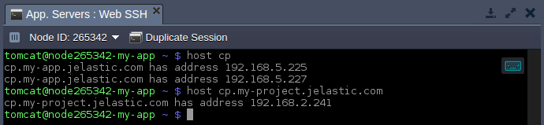

<a id="back"></a>

# Virtuozzo Application Platform 5.4.5/6/7
*This document is preliminary and subject to change.*

In this document, you will find all of the new features, enhancements and visible changes included to the **PaaS 5.4.5/6/7** releases.

{}
{}
## Environment List Lazy Loading
Possibility to speed up obtaining of the environment list via the *GetEnvs* API by loading just the main metadata
{}
 
{}
## Domain Names for Node Group Layer
Added a dedicated hostname for each particular node group layer
{}
{}

{}
{}
## Container Provisioning Optimization
Decreased container provisioning time by optimizing the creation flow and refactoring the appropriate processes codebase
{}

{}
## UI/UX Improvements
Updated a set of the dashboard icons (*Settings, Maven, Golang*) to improve elements recognition
{}

{}
## Web SSH Optimization
Improved performance of web client and implemented automatic input operations focus upon switching to the *Web SSH* tab
{}

{}
## Deploying Application via SSH
Application deploy is now can be initiated directly via SSH console with *jelastic* user
{}

{}
## All Nodes Restart for Clusterized Solutions
Possibility to restart services on all layer nodes for dockerized stacks with the clusterization property
{}

{}
## Favourites.conf File Alias for JPS Packages
An alternative name for the *Favourites.conf* file can be used in the JPS solutions
{}

{}
## Software Stack Versions
Actualized list of supported OS templates and software stack versions
{}
{}


{}
{}
## Decreasing Delay for Logs Display
Increased a number of new lines displayed per log update
{}

{}
## Bug Fixes
List of fixes applied to the platform starting from the current release
{}
{}

<a id="container-provisioning"></a>

<style><!--
.changes-container{position:relative;padding-top:30px;padding-bottom:10px;padding-left:120px;border-top:1px solid #ddd}.changes-container:first-child{padding-top:0}.changes-container:first-child:before{top:15px}.changes-container:before{font-size:22px;position:absolute;top:45px;left:5px;width:110px;padding-top:42px;text-align:center;background-repeat:no-repeat;background-position:top}.changes-container>div{line-height:1.9;overflow:auto;margin-bottom:10px;padding:14px 20px;color:#282828;border-radius:3px}.changes-container>div:after{display:table;clear:both;content:""}.changes-container>div h6{font-size:18px;margin:0 0 16px}.changes-container>div .changes-more{position:relative;float:right;text-decoration:none}.changes-container>div .changes-more:after{margin-left:5px;content:">>"}.changes-container.changes-container--new:before{content:"New";background-image:url(data:image/png;base64,iVBORw0KGgoAAAANSUhEUgAAACoAAAAeCAYAAABaKIzgAAAAGXRFWHRTb2Z0d2FyZQBBZG9iZSBJbWFnZVJlYWR5ccllPAAAAyFpVFh0WE1MOmNvbS5hZG9iZS54bXAAAAAAADw/eHBhY2tldCBiZWdpbj0i77u/IiBpZD0iVzVNME1wQ2VoaUh6cmVTek5UY3prYzlkIj8+IDx4OnhtcG1ldGEgeG1sbnM6eD0iYWRvYmU6bnM6bWV0YS8iIHg6eG1wdGs9IkFkb2JlIFhNUCBDb3JlIDUuNi1jMTQyIDc5LjE2MDkyNCwgMjAxNy8wNy8xMy0wMTowNjozOSAgICAgICAgIj4gPHJkZjpSREYgeG1sbnM6cmRmPSJodHRwOi8vd3d3LnczLm9yZy8xOTk5LzAyLzIyLXJkZi1zeW50YXgtbnMjIj4gPHJkZjpEZXNjcmlwdGlvbiByZGY6YWJvdXQ9IiIgeG1sbnM6eG1wPSJodHRwOi8vbnMuYWRvYmUuY29tL3hhcC8xLjAvIiB4bWxuczp4bXBNTT0iaHR0cDovL25zLmFkb2JlLmNvbS94YXAvMS4wL21tLyIgeG1sbnM6c3RSZWY9Imh0dHA6Ly9ucy5hZG9iZS5jb20veGFwLzEuMC9zVHlwZS9SZXNvdXJjZVJlZiMiIHhtcDpDcmVhdG9yVG9vbD0iQWRvYmUgUGhvdG9zaG9wIENDIChXaW5kb3dzKSIgeG1wTU06SW5zdGFuY2VJRD0ieG1wLmlpZDozOEQ2OURDQjJDNDUxMUU4OEFDM0Q0OUYzRjVDQTUwMiIgeG1wTU06RG9jdW1lbnRJRD0ieG1wLmRpZDozOEQ2OURDQzJDNDUxMUU4OEFDM0Q0OUYzRjVDQTUwMiI+IDx4bXBNTTpEZXJpdmVkRnJvbSBzdFJlZjppbnN0YW5jZUlEPSJ4bXAuaWlkOjM4RDY5REM5MkM0NTExRTg4QUMzRDQ5RjNGNUNBNTAyIiBzdFJlZjpkb2N1bWVudElEPSJ4bXAuZGlkOjM4RDY5RENBMkM0NTExRTg4QUMzRDQ5RjNGNUNBNTAyIi8+IDwvcmRmOkRlc2NyaXB0aW9uPiA8L3JkZjpSREY+IDwveDp4bXBtZXRhPiA8P3hwYWNrZXQgZW5kPSJyIj8+NUw/0AAAAnNJREFUeNrMmE1oE0EYhjdLIz1IBDG1JdRqEdGCYPojqQgeWjA5xDYHpWBKPYhQaE+lLZTeTBHEq/bkpTUIIil6Mf6c0lLxUigShd6CBrTWHtQWD9L0/ei3MAzJmp2dDXnhgQy7M/Nmfr75Zn3Gq0eGBvnAGRAHN8A5cBj8Ae/AM/AG/JQrlqKjVXXQoMHkZfAcHC/zjMwOMqQX4DbYctqJ6cLgIbAEliuYLKcB8AMMOe1MdUQbwTpPt4qegtMg5eWIUp0VFyYt3QXDXhqdAl2GHi34svPNOozSbm4FvaAbnAf3DL16ArOu1miEd2mT4a36AI3qN5URTYL3NTBpaVBl6lvAolFbDasYnTVqr0tYp0G7tVrO6B2PzPwFWZvnm+A7zCaA+T+jPk3HqqwtXu8xGj2b9+idDPgMs012Rkv8z3RqF5wFv7mcr6IOHSZFmD1ZyWiIzerSPzYpZk3jDo73jzDbKBuluPnVQYJRjcLgi7S7Uw7qU/b1+GBNHuSjJ0BB85RfATmh3A/eKrYVNHkD5RQqU6d+cARsSM+uS22GXZgkXSOjPaBNofJ9XoO/QKewCcc4kbbUDtZczk7S5IxbRSPC7x2+ftBh8VAKN3kNy6iLjCZU/yWYEMrbYE4oBygecpLtVgEyesxFAw/AzQo3gE/gqKaNWTSl8KGUT3KqZsnPmVdIYwTJkNHXGhqiK/Ekx0naOBc0h7o0xdEIj0C9atuKox80TL+Xipeio3smn+2xOjVJsXpVPOvz/HGgnkSXyGnrk4+YlLwEHR6c+U61ybfeGfG7lJwkU4A+BS6CW+Aql71WgT8PpSlq0JqUX9gXYACycXnWqP0g9wAAAABJRU5ErkJggg==)}.changes-container.changes-container--new>div{background-color:#e4ffee}.changes-container.changes-container--changed:before{content:"Changed";background-image:url(data:image/png;base64,iVBORw0KGgoAAAANSUhEUgAAACoAAAAeCAYAAABaKIzgAAAAGXRFWHRTb2Z0d2FyZQBBZG9iZSBJbWFnZVJlYWR5ccllPAAAAyFpVFh0WE1MOmNvbS5hZG9iZS54bXAAAAAAADw/eHBhY2tldCBiZWdpbj0i77u/IiBpZD0iVzVNME1wQ2VoaUh6cmVTek5UY3prYzlkIj8+IDx4OnhtcG1ldGEgeG1sbnM6eD0iYWRvYmU6bnM6bWV0YS8iIHg6eG1wdGs9IkFkb2JlIFhNUCBDb3JlIDUuNi1jMTQyIDc5LjE2MDkyNCwgMjAxNy8wNy8xMy0wMTowNjozOSAgICAgICAgIj4gPHJkZjpSREYgeG1sbnM6cmRmPSJodHRwOi8vd3d3LnczLm9yZy8xOTk5LzAyLzIyLXJkZi1zeW50YXgtbnMjIj4gPHJkZjpEZXNjcmlwdGlvbiByZGY6YWJvdXQ9IiIgeG1sbnM6eG1wPSJodHRwOi8vbnMuYWRvYmUuY29tL3hhcC8xLjAvIiB4bWxuczp4bXBNTT0iaHR0cDovL25zLmFkb2JlLmNvbS94YXAvMS4wL21tLyIgeG1sbnM6c3RSZWY9Imh0dHA6Ly9ucy5hZG9iZS5jb20veGFwLzEuMC9zVHlwZS9SZXNvdXJjZVJlZiMiIHhtcDpDcmVhdG9yVG9vbD0iQWRvYmUgUGhvdG9zaG9wIENDIChXaW5kb3dzKSIgeG1wTU06SW5zdGFuY2VJRD0ieG1wLmlpZDo0QzNGRThBNjJDNDUxMUU4QTcyREYwOUUwQ0JFM0M4QiIgeG1wTU06RG9jdW1lbnRJRD0ieG1wLmRpZDo0QzNGRThBNzJDNDUxMUU4QTcyREYwOUUwQ0JFM0M4QiI+IDx4bXBNTTpEZXJpdmVkRnJvbSBzdFJlZjppbnN0YW5jZUlEPSJ4bXAuaWlkOjRDM0ZFOEE0MkM0NTExRThBNzJERjA5RTBDQkUzQzhCIiBzdFJlZjpkb2N1bWVudElEPSJ4bXAuZGlkOjRDM0ZFOEE1MkM0NTExRThBNzJERjA5RTBDQkUzQzhCIi8+IDwvcmRmOkRlc2NyaXB0aW9uPiA8L3JkZjpSREY+IDwveDp4bXBtZXRhPiA8P3hwYWNrZXQgZW5kPSJyIj8+c2zvogAAAidJREFUeNrUmM0rBVEYxueOmywuWfj+VlIkFje6ZEeJ8rURRVnIn0DJjlL+BxuSkogiiQ0iCwpJ3boLX/nOggXJx/PqvTVNXWbeOXO7nvot7rlnznnmzHnnfc94tOUPTYE8oBg0gw5QAnzgBayDWbAGHs0XfjXpFidwbrQWzIF0C30XQR94sGtUd2AwHiyALYsmSa3gHnTancwrNJkADvlxSzQDisCo1QskK0rXbDswGdYI6HHT6ADwa2o06Vn5zFARTBTNOcw7eANHmlptgPq/guq3PRrgKE3T3FUdoFW9kTz6brAbBZNhtUn2aCaY0qKrHonRYS36qkFQpQJbRvsdTBgCWUzI5rV34BZm24H+l1GPgyQQBGXgminjNjuimJgHpzCb9pvRL74zickK8Gpoe+W2oGA8SiZXMFsQyWg2m7WjfVBuMmk0W859JOn9GGYTzEbpvXlpo8AIm6zmRBBJb9xHYpZKxQljZsoDZ4KBErnmtDrps3D/p+ocQJvCAXwu9TWrhYxWgnzhABTdT+A8Qo3Zyf89cV+pur1ccTtRMuOLsIq5ChKCn1a0XYt9JZHRlH9g9IqMXigaLM5im0TzZHRV0WBdpveyzm0qNE3v0QDXnrEqOlqn013vKXz8bqgVx5Sfcopye2OMmhwHO8Zcf8IfB2JJY2AwfOgzbv4lUCrM+Sp1x0XMkPFkai6ST0EhqAK9oIF/u60z/jw0DQ5oT5o7fAswAKxgepYzbixFAAAAAElFTkSuQmCC)}.changes-container.changes-container--changed>div{background-color:#def6ff}.changes-container.changes-container--fixed:before{content:"Fixed";background-image:url(data:image/png;base64,iVBORw0KGgoAAAANSUhEUgAAACoAAAAeCAYAAABaKIzgAAAAGXRFWHRTb2Z0d2FyZQBBZG9iZSBJbWFnZVJlYWR5ccllPAAAAyFpVFh0WE1MOmNvbS5hZG9iZS54bXAAAAAAADw/eHBhY2tldCBiZWdpbj0i77u/IiBpZD0iVzVNME1wQ2VoaUh6cmVTek5UY3prYzlkIj8+IDx4OnhtcG1ldGEgeG1sbnM6eD0iYWRvYmU6bnM6bWV0YS8iIHg6eG1wdGs9IkFkb2JlIFhNUCBDb3JlIDUuNi1jMTQyIDc5LjE2MDkyNCwgMjAxNy8wNy8xMy0wMTowNjozOSAgICAgICAgIj4gPHJkZjpSREYgeG1sbnM6cmRmPSJodHRwOi8vd3d3LnczLm9yZy8xOTk5LzAyLzIyLXJkZi1zeW50YXgtbnMjIj4gPHJkZjpEZXNjcmlwdGlvbiByZGY6YWJvdXQ9IiIgeG1sbnM6eG1wPSJodHRwOi8vbnMuYWRvYmUuY29tL3hhcC8xLjAvIiB4bWxuczp4bXBNTT0iaHR0cDovL25zLmFkb2JlLmNvbS94YXAvMS4wL21tLyIgeG1sbnM6c3RSZWY9Imh0dHA6Ly9ucy5hZG9iZS5jb20veGFwLzEuMC9zVHlwZS9SZXNvdXJjZVJlZiMiIHhtcDpDcmVhdG9yVG9vbD0iQWRvYmUgUGhvdG9zaG9wIENDIChXaW5kb3dzKSIgeG1wTU06SW5zdGFuY2VJRD0ieG1wLmlpZDpEM0FFMDgwQzJDNDUxMUU4Qjk2NUQ1RjM3QjZEQTIwQyIgeG1wTU06RG9jdW1lbnRJRD0ieG1wLmRpZDpEM0FFMDgwRDJDNDUxMUU4Qjk2NUQ1RjM3QjZEQTIwQyI+IDx4bXBNTTpEZXJpdmVkRnJvbSBzdFJlZjppbnN0YW5jZUlEPSJ4bXAuaWlkOkQzQUUwODBBMkM0NTExRThCOTY1RDVGMzdCNkRBMjBDIiBzdFJlZjpkb2N1bWVudElEPSJ4bXAuZGlkOkQzQUUwODBCMkM0NTExRThCOTY1RDVGMzdCNkRBMjBDIi8+IDwvcmRmOkRlc2NyaXB0aW9uPiA8L3JkZjpSREY+IDwveDp4bXBtZXRhPiA8P3hwYWNrZXQgZW5kPSJyIj8+p2cxQAAAAm5JREFUeNrMmN1LFFEYxmeHTfdChWRdM+xDEiG7XJQtRCKFKNDdINTCBS+68E5CUBDxpiDqIugP6MaPShHDuihCbyoUb4K09NpsQfy4KQ1M3fV5l3dgmMbdmXPObPvAD+brnHnmPfOe8874Uq98mgJRJzWgBbSBi6AI7IAZMAE+gO1/WrYnHd3Ar8BkA5gE5TbnyGyMIU2De2DL7U10CYMF4DX4dIxJO0XBJuhwezPRiAbAVx5uEb0E1eChlxGlNp8lTBp6AOJeGu0DYU2NhrVx/ZSjbM2S9XSyktkHe2BRU6tZ0Jwt+zO9oxHO0pDmrZoARXVdZOg7wXwOTBqKibyjFWBEwc0PwDL45eDauIjRQUmDf8BVUAgugUYHba4gqcqAq2Tal1yxKPESvE1Gv7louwG607nRnkxmiqhP0uRjk8kClyY1zokpsILohjIZTfFTiWrUtP0XzFleiTN8PJtq0g88rp8/zuhpcChhdNeyfwe8ZZMXwE+uqJwu70swG7AajfCwVUgYDVj2f4BWUMzz5AlQ6qI/qr6em42e5XlTRjfT75a9jMS4LdDvXUQ1qHMCfVRg8l2Wa+rAC8H+W/3cwTkPTF4Dv8FJ0MPXiarTzxW3apODXMapUpiG/pbE+mxnckixSVIJRTQouExO2xx/Cu57ULQkKKJrAg39nIS5MEmaIqPvBT/senlepOLjmYcmSWNUlEQUzKFeij6tyymiC4LDnytFqZLSuRC5kacmnxiFjbGEfuefA/mkR6Df+OgzFyVvQC1Y/c8Gqcy8DAbMX6bWIpmKiipQD7rAdd73Wqv8e2gMfLFW96QjAQYAvVZ8VxrR76cAAAAASUVORK5CYII=)}.changes-container.changes-container--fixed>div{background-color:#fef6e6}@media (max-width:479px){.changes-container{padding-top:80px!important;padding-right:10px;padding-left:10px}.changes-container:first-child:before{top:25px}.changes-container:last-child{margin-bottom:0!important}.changes-container:last-child:after{display:none!important}.changes-container:before{top:25px;left:auto;width:auto;margin-left:0;padding-top:6px;padding-left:55px;background-position:0 0}.changes-container.changes-container--changed,.changes-container.changes-container--fixed,.changes-container.changes-container--new{position:relative;margin-bottom:40px;border-bottom:0}.changes-container.changes-container--changed:after,.changes-container.changes-container--fixed:after,.changes-container.changes-container--new:after{position:absolute;right:0;bottom:0;left:0;display:block;height:1px;content:"";background-color:#dedede}.changes-container.changes-container--changed>div,.changes-container.changes-container--fixed>div,.changes-container.changes-container--new>div{padding:0;background-color:transparent}.changes-container.changes-container--changed .changes-more,.changes-container.changes-container--fixed .changes-more,.changes-container.changes-container--new .changes-more{line-height:1.4}.changes-container.changes-container--changed .changes-more:before,.changes-container.changes-container--fixed .changes-more:before,.changes-container.changes-container--new .changes-more:before{bottom:2px}.changes-container.changes-container--new{background:-webkit-gradient(linear,left top,left bottom,from(#e4ffee),to(#ffffff));background:-webkit-linear-gradient(top,#e4ffee,#ffffff);background:-o-linear-gradient(top,#e4ffee,#ffffff);background:linear-gradient(180deg,#e4ffee,#ffffff)}.changes-container.changes-container--changed{background:-webkit-gradient(linear,left top,left bottom,from(#def6ff),to(#ffffff));background:-webkit-linear-gradient(top,#def6ff,#ffffff);background:-o-linear-gradient(top,#def6ff,#ffffff);background:linear-gradient(180deg,#def6ff,#ffffff)}.changes-container.changes-container--fixed{background:-webkit-gradient(linear,left top,left bottom,from(#fef6e6),to(#ffffff));background:-webkit-linear-gradient(top,#fef6e6,#ffffff);background:-o-linear-gradient(top,#fef6e6,#ffffff);background:linear-gradient(180deg,#fef6e6,#ffffff)}}
--></style>


## Container Provisioning Optimization
Within the current 5.4.5 PaaS release, a noticeable optimization was applied to the custom Docker container and certified dockerized templates creation process through refactoring and updating the platform internal scripts. The general performance boost is around 20%, with even greater results upon consecutive installation of the same image<a id="ui"></a>.{}{}


## UI/UX Improvements
Starting with the PaaS 5.4.5 release, some visual updates were applied to the dashboard to provide the latest and most accurate icons for elements and stacks, improving their recognition:

* the environment ***[Settings](/dashboard-guide#settings)*** tab was provided with the wrench-style icon (the same one as on the appropriate **Settings** button)
* the ***Golang*** application server logo was replaced with its latest official design 
* a dashboard icon for the ***[Maven](/java-vcs-deployment/)*** build node was renewed, and the outdated hint for the *Maven* template in topology wizard was removed

[More info](/dashboard-guide){}{}


## Performance Improvements

* [Environment List Lazy Loading](#performance-lazy-loading)
* [Web SSH Optimization](#performance-web-ssh){}{}


#### Environment List Lazy Loading
When hosting multiple environments, you can notice a slight slowdown of the **environments > Control > *[GetEnvs](https://docs.jelastic.com/api/#!/api/environment.Control-method-GetEnvs)*** API method. Such a delay is caused by the necessity to load all data for each environment. But usually you need to manage no more than just a few environments at a time.

So, within the PaaS 5.4.5 release, only the main environment metadata (e.g. name, alias, domain, etc.) can be loaded by setting a new optional ***lazy*** parameter as *true*. The complete info on a particular environment will be provided on demand, i.e. upon usage of the *[GetEnvInfo](https://docs.jelastic.com/api/#!/api/environment.Control-method-GetEnvInfo)* request. Also, using this improvement, the platform was able to notably speed up the first connection to [SSH Gate](/ssh-gate)<a id="performance-web-ssh"></a>.

{}[Back to the list of Performance Improvements](#performance){}


#### Web SSH Optimization
With the current platform upgrade, some polishing was applied to the recently implemented [Web SSH](/web-ssh-client) feature. As a result, the general performance and reliability of the web client was improved. Also, in order to provide better user experience, an automatic section focus was implemented. Namely, when you switch to the **Web SSH** tab in the dashboard, it will be automatically set as active, allowing to start typing commands immediately (i.e. without necessity to additionally click on the area within the section)<a id="ssh-deploy"></a>.

{}[Back to the list of Performance Improvements](#performance){}


## Deploying Application via SSH
The platform-specific deployment, which allows to automatically install application archive into environment compute node(s), was adjusted to be run under the *jelastic* user. With such implementation, it's possible to call deploy action directly via SSH console by running the following command:
```bash
jem compute deploy -a  {atomicDeploy} -c  {context} -u {packageUrl}
```
where:

* ***{atomicDeploy}*** - allows to either enable (*true*) or disable (*false*) a [zero downtime deployment](/php-zero-downtime-deploy) mode for PHP
* ***{context}*** - sets a context name for the project
* ***{packageUrl}*** - provides link to the application archive to be deployed<a id="layer-hostnames"></a>{}{}


## Domain Names for Node Group Layer
Starting with the 5.4.5 version, all new environments are provisioned with a dedicated hostname for a particular node layer:

***${nodeGroup}.${envName}.${platformDomain}***

where:

* ***${nodeGroup}*** - denomination of the [layer](https://docs.cloudscripting.com/creating-manifest/selecting-containers/#all-containers-by-group) (e.g. *cp*, *bl*, *storage*, etc.)
* ***${envName}*** - environment name (not an [alias](/environment-aliases))
* ***${platformDomain}*** - domain name of a [hosting service provider](/paas-hosting-providers/)
{}**Tip:** While working inside the environment and referring to itself, just a short hostname (***${nodeGroup}***) can be used.{}



Each time a new container is created (or removed) a list of records for the appropriate layer is automatically updated.

[More info](/container-dns-hostnames){}{}


## All Nodes Restart for Clusterized Solutions
Previously, only master node was restarted in the cluster. Starting with the PaaS 5.4.5 release, this flow was ceased for the platform-managed dockerized templates, allowing to call restart for all nodes or for specific one in the layer. And in order to keep the backward compatibility, this change was not applied to the platform certified templates (e.g. GlassFish)<a id="logs-delay"></a>.{}{}


## Decreasing Delay for Logs Display
While [viewing a log file](/view-log-files), the platform allows to automatically update a displayed content (the ***Tail*** mode) to keep you up-to-date with the ongoing operations. Rarely, in case of a great amount of logged data, it can temporarily fall behind of the actual actions occurred on the node. So, in the current platform release, a number of new lines, which can be displayed per update (i.e. every 3 seconds) was increased from 249 up to 999. This change helps to be always provided with the most recent data in log files.

[More info](/view-log-files){}{}


## Favourites.conf File Alias for JPS Packages
While setting up a [JPS package](/jps), you can manually define a default list of folders and files that will be displayed as *Favorites* for your instances in the [configuration file manager](/application-configuration). For this, you need to adjust the appropriate ***/etc/jelastic/favourites.conf*** file in the following format:

```
[directories]  
{directories_list}  
[files]  
{files_list}
```

For example, the next command can be used:

```yaml
cmd [cp]: echo -e "[directories]\n/home" >/etc/jelastic/favourites.conf
```

Starting with the PaaS 5.4.5 release, an alternative ***/etc/jelastic/favorites.conf*** name can be used for this file. Herewith, if both *favorites.conf* and *favourites.conf* configs are provided, only the latter one will be considered.

[More info](/application-configuration){}{}


## Software Stack Versions

Check out the list of the most accurate software stacks for the current platform version:

|Stack|PaaS 5.4.5/6/7|
|---|---|
*Apache Balancer*|2.4|
|*Apache PHP*|2.4.6|
|*Apache Python*|2.4|
|*Apache Ruby*|2.4.6-45|
|*Cassandra 2*|2.2.4|
|*Cassandra 3*|3.0|
|*CentOS 6 (VPS)*|6.8|
|*CentOS 7 (VPS)*|7.2|
|*Couchbase*|5.0.1|
|*CouchDB*|1.6.1|
|*Docker Engine CE*|18.03|
|*GlassFish 3*|3.1.2.2|
|*GlassFish 4*|4.1.2|
|*GlassFish 5*|5.0|
|*Golang*|1.10|
|*HAProxy*|1.8.9|
|*IIS*|8|
|*Jetty 6*|6.1.26|
|*Jetty 8*|8.1.17|
|*Jetty 9*|9.3.7|
|*MariaDB 5*|5.5.60|
|*MariaDB 10*|10.3.7|
|*Maven*|3.5.3|
|*Memcached*|1.5.6|
|*MongoDB 2*|2.6.11|
|*MongoDB 3*|3.4.0|
|*MSSQL*|2012|
|*MySQL*|5.7.22|
|*Neo4j*|1.9|
|*Neo4j 2*|2.3|
|*Neo4j 3*|3.2|
|*NGINX Balancer*|1.12.2|
|*NGINX PHP*|1.12.2|
|*NGINX Ruby*|1.14.0|
|*NodeJS 6*|6.14.1|
|*NodeJS 8*|8.11.3|
|*NodeJS 9*|9.11.1|
|*NodeJS 10*|10.4.1|
|*OrientDB*|1.7.4|
|*OrientDB 2*|2|
|*Payara 4*|4.1.2.181|
|*Payara 5*|5.181|
|*PerconaDB*|5.6|
|*PostgreSQL 9*|10.4|
|*PostgreSQL 10*|9.6.9|
|*Redis*|4.0.9|
|*Spring Boot*|2|
|*Tomcat 6*|6.0.53|
|*Tomcat 7*|7.0.88|
|*Tomcat 8*|8.5.31|
|*Tomcat 9*|9.0.8|
|*TomEE*|7.0.4|
|*Ubuntu (VPS)*|16.04|
|*Varnish 4*|4.1.8|
|*Varnish 5*|5.2.1|
|*Varnish 6*|6.0.0|
|*WildFly 10*|10.1.0|
|*WildFly 11*|11.0.0|
|*WildFly 12*|12.0.0|
|*Windows (VPS)*|2012|

|**Engine**|**#**|
|---|---|
|*JDK*|1.6.0_45<br>1.7.0_79<br>1.8.0_172<br>9.0.4<br>10.0.1|
|*Open JDK*|1.7.0._161<br>1.8.0_162|
|*PHP*|5.3.29<br>5.4.45<br>5.5.38<br>5.6.33<br>7.0.27<br>7.1.13<br>7.2.1|
|*Ruby*|2.2.10<br>2.3.7<br>2.4.4|
|*Python*|2.7.12<br>3.3.6<br>3.4.5<br>3.5.2|
|*Node.js*|6.14.1<br>8.11.3<br>9.11.1<br>10.4.1|
|*.NET*|4|
|*Go*|1.10<a id="bug-fixes"></a>|

{}[Back to the top](#back){}


## Bug Fixes
In the table below, you can see the list of bug fixes applied to the platform starting from PaaS 5.4.5/6/7 releases:

{}
{}
**#**|**Description**
---|---
JE-34189 |Unhandled error appears, while trying to add custom SSL for some platform-managed templates
JE-37284 |The error response, while setting horizontal scaling triggers, should point directly to the incorrectly specified parameter
JE-37315 |The *java.lang.NullPointerException* error appears, while trying to change environment topology
JE-38633 |The *java.lang.NullPointerException* error appears, while trying to bind external domain
JE-38639 |The *java.lang.NullPointerException* error appears, while trying to read hooks
JE-38694 |The *java.lang.NullPointerException* error appears, while trying to install the *Wordpress Cluster* solution from platform Marketplace
JE-39078 |The Guacamole login form appears, when connecting node via *Web SSH* in dashboard
JE-39087 |The *java.lang.NullPointerException* error appears, while trying to start environment
JE-39212 |A confirmation pop-up should be displayed upon closing or refreshing browser tab with an active *Web SSH* connection
JE-39249 |The *java.lang.NullPointerException* error appears, while trying to create environment
JE-39463 |The *setGlobals* action doesn't work, if called from a custom button
JE-39557 |The *Ruby* application server becomes inaccessible via SSH after the *Let's Encrypt* add-on installation
JE-39647 |Incorrect solution name is displayed in the dashboard task manager, when installing a JPS package via API / CLI
{}
{}

{}
{}
**#**|**Description**
---|---
JE-39989|Inability to send email from the platform to yourself
JE-40091|The *Open in browser* button is absent at the platform dashboard for a set of the software stacks within the *extra* layer
{}
{}

{}
{}
**#**|**Description**
---|---
JE-40208|The *onBeforeServiceScaleOut* Cloud Scripting event is executed, while being just added
JE-40239|Custom SSL should be allowed via default firewall rules on the *NGINX* nodes
{}
{}

{}[Back to the top](#back){}