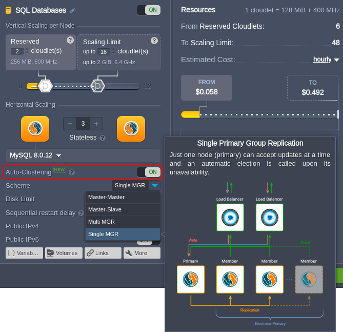
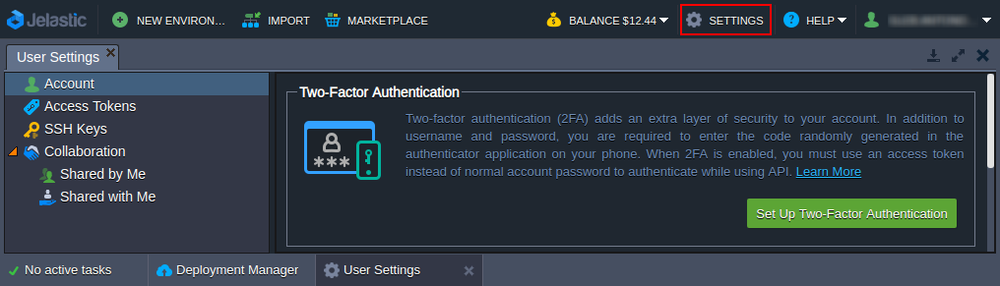
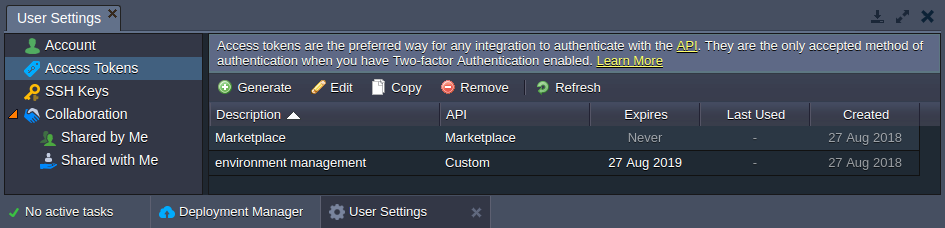
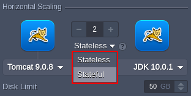
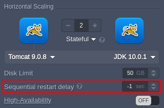
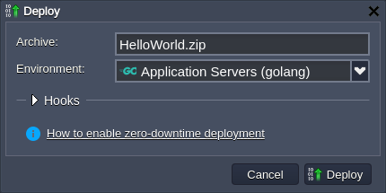
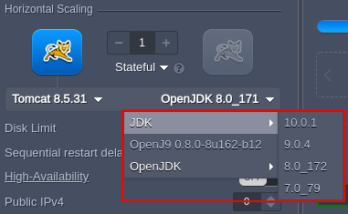

<a id="back"></a>

# Virtuozzo Application Platform 5.5.1/2/3
*This document is preliminary and subject to change.*

In this document, you will find all of the new features, enhancements and visible changes included to the **PaaS 5.5.1/2/3** releases.

{}
{}
## Templates Auto-Clustering (5.5.3)
An automated configuration of separate nodes into the reliable cluster for a set of the managed templates
{}

{}
## Two-Factor Authentication
An additional security layer for PaaS account, to ensure environments safety
{}

{}
## UI for Access Tokens
A user interface for the convenient personal access tokens management directly in the dashboard
{}

{}
## Go Archive Deployment
Implemented automated projects deployment from archives for the Go programming language
{}

{}
## Cloud Scripting Engine Version Comparison (5.5.3)
Added placeholder for platform CS engine version and function placeholder for two CS versions comparison
{}

{}
## Prohibit Deployment for Layer (5.5.3)
A possibility to forbid deployment into specific layer(s) with the <i>isDeploySupport</i> node group property
{}

{}
## Cloud Scripting Transfer Events
The new *onBeforeConfirmTransfer* and *onAfterConfirmTransfer* events added to Cloud Scripting
{}
{}

{}
{}
## Node Group Scaling Mode
A possibility to set the stateless (simultaneous) or stateful (sequential) scaling mode for environment layers
{}

{}
## API for Scaled Nodes Management
Refactored API methods for scaled nodes management to reduce the number of used parameters
{}

{}
## HelloWorld Package
Adjusted the universal HelloWorld package to ensure successful installation into all supported application servers
{}

{}
## Engine Versions Grouping
Simplified engine versions selection in topology wizard grouping them by type and major release
{}

{}
## Collaboration Adjustments
Hiding the inappropriate options of the environment owner during environment creation as the collaborator
{}

{}
## Cloud Scripting Console Optimization
Improved auto-refresh functionality for the Cloud Scripting console to simplify logs analysis
{}

{}
## Software Stack Versions
Actualized list of supported OS templates and software stack versions
{}

{}


{}
{}
## Bug Fixes
List of fixes applied to the platform starting from the current release
{}

{}

<style><!--
.changes-container{position:relative;padding-top:30px;padding-bottom:10px;padding-left:120px;border-top:1px solid #ddd}.changes-container:first-child{padding-top:0}.changes-container:first-child:before{top:15px}.changes-container:before{font-size:22px;position:absolute;top:45px;left:5px;width:110px;padding-top:42px;text-align:center;background-repeat:no-repeat;background-position:top}.changes-container>div{line-height:1.9;overflow:auto;margin-bottom:10px;padding:14px 20px;color:#282828;border-radius:3px}.changes-container>div:after{display:table;clear:both;content:""}.changes-container>div h6{font-size:18px;margin:0 0 16px}.changes-container>div .changes-more{position:relative;float:right;text-decoration:none}.changes-container>div .changes-more:after{margin-left:5px;content:">>"}.changes-container.changes-container--new:before{content:"New";background-image:url(data:image/png;base64,iVBORw0KGgoAAAANSUhEUgAAACoAAAAeCAYAAABaKIzgAAAAGXRFWHRTb2Z0d2FyZQBBZG9iZSBJbWFnZVJlYWR5ccllPAAAAyFpVFh0WE1MOmNvbS5hZG9iZS54bXAAAAAAADw/eHBhY2tldCBiZWdpbj0i77u/IiBpZD0iVzVNME1wQ2VoaUh6cmVTek5UY3prYzlkIj8+IDx4OnhtcG1ldGEgeG1sbnM6eD0iYWRvYmU6bnM6bWV0YS8iIHg6eG1wdGs9IkFkb2JlIFhNUCBDb3JlIDUuNi1jMTQyIDc5LjE2MDkyNCwgMjAxNy8wNy8xMy0wMTowNjozOSAgICAgICAgIj4gPHJkZjpSREYgeG1sbnM6cmRmPSJodHRwOi8vd3d3LnczLm9yZy8xOTk5LzAyLzIyLXJkZi1zeW50YXgtbnMjIj4gPHJkZjpEZXNjcmlwdGlvbiByZGY6YWJvdXQ9IiIgeG1sbnM6eG1wPSJodHRwOi8vbnMuYWRvYmUuY29tL3hhcC8xLjAvIiB4bWxuczp4bXBNTT0iaHR0cDovL25zLmFkb2JlLmNvbS94YXAvMS4wL21tLyIgeG1sbnM6c3RSZWY9Imh0dHA6Ly9ucy5hZG9iZS5jb20veGFwLzEuMC9zVHlwZS9SZXNvdXJjZVJlZiMiIHhtcDpDcmVhdG9yVG9vbD0iQWRvYmUgUGhvdG9zaG9wIENDIChXaW5kb3dzKSIgeG1wTU06SW5zdGFuY2VJRD0ieG1wLmlpZDozOEQ2OURDQjJDNDUxMUU4OEFDM0Q0OUYzRjVDQTUwMiIgeG1wTU06RG9jdW1lbnRJRD0ieG1wLmRpZDozOEQ2OURDQzJDNDUxMUU4OEFDM0Q0OUYzRjVDQTUwMiI+IDx4bXBNTTpEZXJpdmVkRnJvbSBzdFJlZjppbnN0YW5jZUlEPSJ4bXAuaWlkOjM4RDY5REM5MkM0NTExRTg4QUMzRDQ5RjNGNUNBNTAyIiBzdFJlZjpkb2N1bWVudElEPSJ4bXAuZGlkOjM4RDY5RENBMkM0NTExRTg4QUMzRDQ5RjNGNUNBNTAyIi8+IDwvcmRmOkRlc2NyaXB0aW9uPiA8L3JkZjpSREY+IDwveDp4bXBtZXRhPiA8P3hwYWNrZXQgZW5kPSJyIj8+NUw/0AAAAnNJREFUeNrMmE1oE0EYhjdLIz1IBDG1JdRqEdGCYPojqQgeWjA5xDYHpWBKPYhQaE+lLZTeTBHEq/bkpTUIIil6Mf6c0lLxUigShd6CBrTWHtQWD9L0/ei3MAzJmp2dDXnhgQy7M/Nmfr75Zn3Gq0eGBvnAGRAHN8A5cBj8Ae/AM/AG/JQrlqKjVXXQoMHkZfAcHC/zjMwOMqQX4DbYctqJ6cLgIbAEliuYLKcB8AMMOe1MdUQbwTpPt4qegtMg5eWIUp0VFyYt3QXDXhqdAl2GHi34svPNOozSbm4FvaAbnAf3DL16ArOu1miEd2mT4a36AI3qN5URTYL3NTBpaVBl6lvAolFbDasYnTVqr0tYp0G7tVrO6B2PzPwFWZvnm+A7zCaA+T+jPk3HqqwtXu8xGj2b9+idDPgMs012Rkv8z3RqF5wFv7mcr6IOHSZFmD1ZyWiIzerSPzYpZk3jDo73jzDbKBuluPnVQYJRjcLgi7S7Uw7qU/b1+GBNHuSjJ0BB85RfATmh3A/eKrYVNHkD5RQqU6d+cARsSM+uS22GXZgkXSOjPaBNofJ9XoO/QKewCcc4kbbUDtZczk7S5IxbRSPC7x2+ftBh8VAKN3kNy6iLjCZU/yWYEMrbYE4oBygecpLtVgEyesxFAw/AzQo3gE/gqKaNWTSl8KGUT3KqZsnPmVdIYwTJkNHXGhqiK/Ekx0naOBc0h7o0xdEIj0C9atuKox80TL+Xipeio3smn+2xOjVJsXpVPOvz/HGgnkSXyGnrk4+YlLwEHR6c+U61ybfeGfG7lJwkU4A+BS6CW+Aql71WgT8PpSlq0JqUX9gXYACycXnWqP0g9wAAAABJRU5ErkJggg==)}.changes-container.changes-container--new>div{background-color:#e4ffee}.changes-container.changes-container--changed:before{content:"Changed";background-image:url(data:image/png;base64,iVBORw0KGgoAAAANSUhEUgAAACoAAAAeCAYAAABaKIzgAAAAGXRFWHRTb2Z0d2FyZQBBZG9iZSBJbWFnZVJlYWR5ccllPAAAAyFpVFh0WE1MOmNvbS5hZG9iZS54bXAAAAAAADw/eHBhY2tldCBiZWdpbj0i77u/IiBpZD0iVzVNME1wQ2VoaUh6cmVTek5UY3prYzlkIj8+IDx4OnhtcG1ldGEgeG1sbnM6eD0iYWRvYmU6bnM6bWV0YS8iIHg6eG1wdGs9IkFkb2JlIFhNUCBDb3JlIDUuNi1jMTQyIDc5LjE2MDkyNCwgMjAxNy8wNy8xMy0wMTowNjozOSAgICAgICAgIj4gPHJkZjpSREYgeG1sbnM6cmRmPSJodHRwOi8vd3d3LnczLm9yZy8xOTk5LzAyLzIyLXJkZi1zeW50YXgtbnMjIj4gPHJkZjpEZXNjcmlwdGlvbiByZGY6YWJvdXQ9IiIgeG1sbnM6eG1wPSJodHRwOi8vbnMuYWRvYmUuY29tL3hhcC8xLjAvIiB4bWxuczp4bXBNTT0iaHR0cDovL25zLmFkb2JlLmNvbS94YXAvMS4wL21tLyIgeG1sbnM6c3RSZWY9Imh0dHA6Ly9ucy5hZG9iZS5jb20veGFwLzEuMC9zVHlwZS9SZXNvdXJjZVJlZiMiIHhtcDpDcmVhdG9yVG9vbD0iQWRvYmUgUGhvdG9zaG9wIENDIChXaW5kb3dzKSIgeG1wTU06SW5zdGFuY2VJRD0ieG1wLmlpZDo0QzNGRThBNjJDNDUxMUU4QTcyREYwOUUwQ0JFM0M4QiIgeG1wTU06RG9jdW1lbnRJRD0ieG1wLmRpZDo0QzNGRThBNzJDNDUxMUU4QTcyREYwOUUwQ0JFM0M4QiI+IDx4bXBNTTpEZXJpdmVkRnJvbSBzdFJlZjppbnN0YW5jZUlEPSJ4bXAuaWlkOjRDM0ZFOEE0MkM0NTExRThBNzJERjA5RTBDQkUzQzhCIiBzdFJlZjpkb2N1bWVudElEPSJ4bXAuZGlkOjRDM0ZFOEE1MkM0NTExRThBNzJERjA5RTBDQkUzQzhCIi8+IDwvcmRmOkRlc2NyaXB0aW9uPiA8L3JkZjpSREY+IDwveDp4bXBtZXRhPiA8P3hwYWNrZXQgZW5kPSJyIj8+c2zvogAAAidJREFUeNrUmM0rBVEYxueOmywuWfj+VlIkFje6ZEeJ8rURRVnIn0DJjlL+BxuSkogiiQ0iCwpJ3boLX/nOggXJx/PqvTVNXWbeOXO7nvot7rlnznnmzHnnfc94tOUPTYE8oBg0gw5QAnzgBayDWbAGHs0XfjXpFidwbrQWzIF0C30XQR94sGtUd2AwHiyALYsmSa3gHnTancwrNJkADvlxSzQDisCo1QskK0rXbDswGdYI6HHT6ADwa2o06Vn5zFARTBTNOcw7eANHmlptgPq/guq3PRrgKE3T3FUdoFW9kTz6brAbBZNhtUn2aCaY0qKrHonRYS36qkFQpQJbRvsdTBgCWUzI5rV34BZm24H+l1GPgyQQBGXgminjNjuimJgHpzCb9pvRL74zickK8Gpoe+W2oGA8SiZXMFsQyWg2m7WjfVBuMmk0W859JOn9GGYTzEbpvXlpo8AIm6zmRBBJb9xHYpZKxQljZsoDZ4KBErnmtDrps3D/p+ocQJvCAXwu9TWrhYxWgnzhABTdT+A8Qo3Zyf89cV+pur1ccTtRMuOLsIq5ChKCn1a0XYt9JZHRlH9g9IqMXigaLM5im0TzZHRV0WBdpveyzm0qNE3v0QDXnrEqOlqn013vKXz8bqgVx5Sfcopye2OMmhwHO8Zcf8IfB2JJY2AwfOgzbv4lUCrM+Sp1x0XMkPFkai6ST0EhqAK9oIF/u60z/jw0DQ5oT5o7fAswAKxgepYzbixFAAAAAElFTkSuQmCC)}.changes-container.changes-container--changed>div{background-color:#def6ff}.changes-container.changes-container--fixed:before{content:"Fixed";background-image:url(data:image/png;base64,iVBORw0KGgoAAAANSUhEUgAAACoAAAAeCAYAAABaKIzgAAAAGXRFWHRTb2Z0d2FyZQBBZG9iZSBJbWFnZVJlYWR5ccllPAAAAyFpVFh0WE1MOmNvbS5hZG9iZS54bXAAAAAAADw/eHBhY2tldCBiZWdpbj0i77u/IiBpZD0iVzVNME1wQ2VoaUh6cmVTek5UY3prYzlkIj8+IDx4OnhtcG1ldGEgeG1sbnM6eD0iYWRvYmU6bnM6bWV0YS8iIHg6eG1wdGs9IkFkb2JlIFhNUCBDb3JlIDUuNi1jMTQyIDc5LjE2MDkyNCwgMjAxNy8wNy8xMy0wMTowNjozOSAgICAgICAgIj4gPHJkZjpSREYgeG1sbnM6cmRmPSJodHRwOi8vd3d3LnczLm9yZy8xOTk5LzAyLzIyLXJkZi1zeW50YXgtbnMjIj4gPHJkZjpEZXNjcmlwdGlvbiByZGY6YWJvdXQ9IiIgeG1sbnM6eG1wPSJodHRwOi8vbnMuYWRvYmUuY29tL3hhcC8xLjAvIiB4bWxuczp4bXBNTT0iaHR0cDovL25zLmFkb2JlLmNvbS94YXAvMS4wL21tLyIgeG1sbnM6c3RSZWY9Imh0dHA6Ly9ucy5hZG9iZS5jb20veGFwLzEuMC9zVHlwZS9SZXNvdXJjZVJlZiMiIHhtcDpDcmVhdG9yVG9vbD0iQWRvYmUgUGhvdG9zaG9wIENDIChXaW5kb3dzKSIgeG1wTU06SW5zdGFuY2VJRD0ieG1wLmlpZDpEM0FFMDgwQzJDNDUxMUU4Qjk2NUQ1RjM3QjZEQTIwQyIgeG1wTU06RG9jdW1lbnRJRD0ieG1wLmRpZDpEM0FFMDgwRDJDNDUxMUU4Qjk2NUQ1RjM3QjZEQTIwQyI+IDx4bXBNTTpEZXJpdmVkRnJvbSBzdFJlZjppbnN0YW5jZUlEPSJ4bXAuaWlkOkQzQUUwODBBMkM0NTExRThCOTY1RDVGMzdCNkRBMjBDIiBzdFJlZjpkb2N1bWVudElEPSJ4bXAuZGlkOkQzQUUwODBCMkM0NTExRThCOTY1RDVGMzdCNkRBMjBDIi8+IDwvcmRmOkRlc2NyaXB0aW9uPiA8L3JkZjpSREY+IDwveDp4bXBtZXRhPiA8P3hwYWNrZXQgZW5kPSJyIj8+p2cxQAAAAm5JREFUeNrMmN1LFFEYxmeHTfdChWRdM+xDEiG7XJQtRCKFKNDdINTCBS+68E5CUBDxpiDqIugP6MaPShHDuihCbyoUb4K09NpsQfy4KQ1M3fV5l3dgmMbdmXPObPvAD+brnHnmPfOe8874Uq98mgJRJzWgBbSBi6AI7IAZMAE+gO1/WrYnHd3Ar8BkA5gE5TbnyGyMIU2De2DL7U10CYMF4DX4dIxJO0XBJuhwezPRiAbAVx5uEb0E1eChlxGlNp8lTBp6AOJeGu0DYU2NhrVx/ZSjbM2S9XSyktkHe2BRU6tZ0Jwt+zO9oxHO0pDmrZoARXVdZOg7wXwOTBqKibyjFWBEwc0PwDL45eDauIjRQUmDf8BVUAgugUYHba4gqcqAq2Tal1yxKPESvE1Gv7louwG607nRnkxmiqhP0uRjk8kClyY1zokpsILohjIZTfFTiWrUtP0XzFleiTN8PJtq0g88rp8/zuhpcChhdNeyfwe8ZZMXwE+uqJwu70swG7AajfCwVUgYDVj2f4BWUMzz5AlQ6qI/qr6em42e5XlTRjfT75a9jMS4LdDvXUQ1qHMCfVRg8l2Wa+rAC8H+W/3cwTkPTF4Dv8FJ0MPXiarTzxW3apODXMapUpiG/pbE+mxnckixSVIJRTQouExO2xx/Cu57ULQkKKJrAg39nIS5MEmaIqPvBT/senlepOLjmYcmSWNUlEQUzKFeij6tyymiC4LDnytFqZLSuRC5kacmnxiFjbGEfuefA/mkR6Df+OgzFyVvQC1Y/c8Gqcy8DAbMX6bWIpmKiipQD7rAdd73Wqv8e2gMfLFW96QjAQYAvVZ8VxrR76cAAAAASUVORK5CYII=)}.changes-container.changes-container--fixed>div{background-color:#fef6e6}@media (max-width:479px){.changes-container{padding-top:80px!important;padding-right:10px;padding-left:10px}.changes-container:first-child:before{top:25px}.changes-container:last-child{margin-bottom:0!important}.changes-container:last-child:after{display:none!important}.changes-container:before{top:25px;left:auto;width:auto;margin-left:0;padding-top:6px;padding-left:55px;background-position:0 0}.changes-container.changes-container--changed,.changes-container.changes-container--fixed,.changes-container.changes-container--new{position:relative;margin-bottom:40px;border-bottom:0}.changes-container.changes-container--changed:after,.changes-container.changes-container--fixed:after,.changes-container.changes-container--new:after{position:absolute;right:0;bottom:0;left:0;display:block;height:1px;content:"";background-color:#dedede}.changes-container.changes-container--changed>div,.changes-container.changes-container--fixed>div,.changes-container.changes-container--new>div{padding:0;background-color:transparent}.changes-container.changes-container--changed .changes-more,.changes-container.changes-container--fixed .changes-more,.changes-container.changes-container--new .changes-more{line-height:1.4}.changes-container.changes-container--changed .changes-more:before,.changes-container.changes-container--fixed .changes-more:before,.changes-container.changes-container--new .changes-more:before{bottom:2px}.changes-container.changes-container--new{background:-webkit-gradient(linear,left top,left bottom,from(#e4ffee),to(#ffffff));background:-webkit-linear-gradient(top,#e4ffee,#ffffff);background:-o-linear-gradient(top,#e4ffee,#ffffff);background:linear-gradient(180deg,#e4ffee,#ffffff)}.changes-container.changes-container--changed{background:-webkit-gradient(linear,left top,left bottom,from(#def6ff),to(#ffffff));background:-webkit-linear-gradient(top,#def6ff,#ffffff);background:-o-linear-gradient(top,#def6ff,#ffffff);background:linear-gradient(180deg,#def6ff,#ffffff)}.changes-container.changes-container--fixed{background:-webkit-gradient(linear,left top,left bottom,from(#fef6e6),to(#ffffff));background:-webkit-linear-gradient(top,#fef6e6,#ffffff);background:-o-linear-gradient(top,#fef6e6,#ffffff);background:linear-gradient(180deg,#fef6e6,#ffffff)}}
--></style>


## Templates Auto-Clustering (5.5.3)

It is a well-known fact that clusterization is virtually an obligatory requirement for production solutions to ensure applications and services high availability. However, the configuration of a reliable cluster is not a trivial task even for the experienced developers. So, within the present 5.5.3 PaaS release, the platform introduces the out-of-box clusterization of the managed templates to significantly decrease the time-to-market for users' projects.

The ***[Auto-Clustering](/auto-clustering)*** feature by the platform can be enabled through the same-named switcher in the central part of the topology wizard (if available for the selected stack). Herewith, upon enabling, some additional cluster customization options may be added to the wizard. For example, for the MySQL database stack, it is possible to choose the preferred clusterization scheme (i.e. *Master-Slave*, *Master-Master*, *Single MGR* or *Multi MGR*):


Currently, ***auto-clustering*** is available for the following software templates (more stacks will be supported by this feature in the future):

* *MySQL*, *MariaDB 10* and *Couchbase* databases
* *GlassFish*, *Payara* and *WildFly* application servers

Based on the particular cluster requirement some topology restriction may be applied (e.g. the minimum/maximum number of nodes, scaling mode, etc.). The similar ***validation*** can be implemented for any JPS package through [Cloud Scripting](https://docs.cloudscripting.com/):
```yaml
validation:
   minCount: 2
   maxCount: 3
   scalingMode: stateful
```

[More info](/auto-clustering)<a id="2fa"></a>
{}[Back to the top](#back){}


## Two-Factor Authentication
In order to massively increase your account safety, the platform implemented a possibility to set up access based on the ***two-factor authentication*** (2FA). As an additional layer of security alongside with your username/password credentials, the platform allows using access codes generated in the authentication application on your mobile phone (e.g. [Google Authenticator](https://support.google.com/accounts/answer/1066447)). In such a way with 2FA enabled, even if someone gets your password, it won't be enough to connect to or manage your account.  
The two-factor authentication can be enabled from a new **Account** section added to the **Settings** (accessible from the panel at the top of the dashboard). Here, you can manage your 2FA (*set up*, *view recovery codes* and *disable*) and change a regular account password.


To successfully **Set Up Two-Factor Authentication** click the appropriate button and, after confirming the password, follow the displayed instruction to interconnect your authentication application and account (either scan the QR code or provide the required details manually). After the authenticator is configured, it will return a six-digit code, which should be provided in the dashboard to proceed. Next, you'll be shown the *recovery codes*, which can be used as a one-time alternative to the authentication codes generated by the mobile app.

{}**Note:** Ensure your recovery codes are saved, as otherwise, in case of your phone unavailability, you won't be able to connect to your account. Also, they are *the only option* to restore access upon device loss.{}
For accounts with configured 2FA, you can **View Recovery Codes** with the same-named button as well as generate a set of new codes (the old ones will no longer be viable) with the appropriate link. Also, it is possible to **Disable Two-Factor Authentication**, e.g. to rebind to another device. Both these actions require a password confirmation to be performed.
Be aware, that in order to manage accounts with 2FA via API, the [access tokens](#access-tokens) should be used.

[More info](/two-factor-authentication)
{}[Back to the top](#back){}


## UI for Access Tokens
[Personal Access Tokens](/release-notes-53#access-tokens) are the alternative way to authenticate API requests in the platform. Also, for the accounts with the [two-factor authentication](#2fa) enabled, this option allows to avoid the complexity of the authenticator app code provisioning in custom scripts. So, within the 5.5.1 platform release, the appropriate subsection for **Access Tokens** is added to the **Settings** tab (accessible from the panel at the top of the dashboard).

Here, you can see the list of existing tokens (including ones created before UI addition, i.e. during previous releases) with the following information displayed in columns:

* ***Description*** - custom description provided for token
* ***API*** - the name of the predefined API requests set (*IDE Plugins*, *Marketplace*, *Maven Plugin*) or *Custom* one (hover over to view the exact methods)
* ***Expires*** - the date the current token is valid till (the expired ones can be regenerated or deleted)
* ***Last Used*** - the time of this token last usage
* ***Created*** - the date of the creation



The tools panel above the list provides access to the following buttons:

* **Generate** - creates a new token by providing the description, expiration date and selecting the required API methods (either from predefined sets or manually)
* **Edit** - adjusts the existing token or regenerates it (i.e. sets a new name, while maintaining all other parameters)
* **Copy** - creates a new token using parameters of the existing one as a basis
* **Remove** - deletes selected token
* **Refresh** - displays the most recent changes to the list

All the token changes on account require an obligatory confirmation with the password before being applied.

[More info](/personal-access-tokens)
{}[Back to the top](#back){}


## Node Group Scaling Mode
Starting with the PaaS 5.5.1 upgrade, it is possible to explicitly set the [scaling mode](/horizontal-scaling) for each node group in the environment. Just select the required one using a new drop-down list in the *Horizontal Scaling* section of the topology wizard.


There are two scaling modes:

* ***Stateless*** - creates a new node from the base image template; the scaling is performed simultaneously
* ***Stateful*** - copies file system of the master container into a new node; the scaling is performed sequentially (simultaneously during the initial layer creation)

The first option is comparatively faster, while the second one automatically copies all custom configurations (e.g. deployments or [Custom SSL](/custom-ssl)). Herewith, the transfer of custom files for the *stateless* mode can be done manually or configured via the [Cloud Scripting](https://docs.cloudscripting.com/) automation.

The default scaling mode value is *stateful* for the load balancer, application server, VPS stacks and *stateless* for others. Herewith, when configuring a custom JPS package, the preferable scaling type can be defined with a new ***scalingMode*** property (using the **new** or **clone** value for the *stateless* or *stateful* mode respectively).

[More info](/horizontal-scaling)
{}[Back to the top](#back){}


## API for Scaled Nodes Management
The API methods for the management of the [scaled nodes](/horizontal-scaling) (e.g. *Deploy*, *DeployApp*, *RestartNodes*, etc.) were refactored to simplify their usage. Namely, the ***isSequential*** parameter was deprecated (but still available for the compatibility reasons) and its logic added into the ***delay*** one:

* *if set to &ldquo;-1&rdquo;* - the called action will be performed simultaneously (i.e. altogether)
* *if the value is &gt;= 0* - operations will be done sequentially (i.e. one by one) with the specified delay between actions

{}**Note:** In case both parameters are provided with contradictory values, e.g. *isSequential = true* and *delay = -1*, the delay will have a higher priority.{}

Currently, such a change is already integrated into the dashboard topology wizard, allowing to set the default restart delay for the layer (can be set differently during the operation itself).

<a id="go-archive-deploy"></a>

{}[Back to the top](#back){}


## Go Archive Deployment
Improving [integration of the Go](/release-notes-54#go-support) programming language, an ability to deploy Go project from the archive was implemented in the current PaaS release. The [deployment process](/deployment-guide#archive) is the same as for any other application server and could be done in a few clicks - just upload or provide a link to the archive with sources of your Go project and select the desired target environment. Optionally, configure any other configs (e.g. hooks or deploy strategy) and click **Deploy** for the platform to install your application automatically.

<a id="helloworld-package"></a>
<a id="helloworld-package"></a>
{}[Back to the top](#back){}


## HelloWorld Package Update
The platform provides and maintains a universal [HelloWorld package](https://github.com/jelastic/HelloWorld-CI-CD), which can be deployed automatically on top of any certified application server stack. In such a way this solution supports all of the platform programming languages - *Java*, *PHP*, *Python*, *Ruby*, .*NET* and *Node.js*.

Due to the [Go archive deployment](#go-archive-deploy) integration within the current 5.5.1 release, the appropriate adjustments were applied to the *HelloWorld* package, ensuring its successful deployment into the *Golang* server. Also, to support the specifics of the *Spring Boot* Java application server, the *.jar* version of this solution was integrated into the package as well<a id="engines-grouping"></a>.
{}[Back to the top](#back){}


## Engine Versions Grouping
Aiming to increase clarity and ensure better usability of the topology wizard, a grouping of the programming language engine versions was implemented. Now, the right-hand drop-down list within the *Horizontal Scaling* section automatically groups the available engine versions in the easy-to-find form, i.e by the major version (*PHP 7.x.x*, *PHP 5.x.x*) or type (*JDK*, *OpenJDK*, *OpenJ9*).



Also, as a part of this improvement, the displayed version names of the *Java 7* and *8* engines were adjusted to match the latest releases pattern. For example, the old *1.8.0_172* denomination is now displayed as *8.0_172<a id="collaboration-adjustments"></a>*.
{}[Back to the top](#back){}


## Collaboration Adjustments
When being included into [collaboration](/collaboration-create) with permission to create environments on the primary account, a user will be able to select *Environment Owner* through the appropriate pop-up. Starting with the present 5.5.1 PaaS release, if a new environment cannot be created due to [limitations](/quotas-system) of a particular account, the appropriate user email option will be hidden in the drop-down menu of the *Environment Owner* pop-up.

[More info](/collaboration-create)
{}[Back to the top](#back){}


## Cloud Scripting Console Optimization
Cloud Scripting (CS) console allows tracking actions performed due to the [JPS packages](/jps/) installation. It is accessible via the *[{hosterDomain}](/paas-hosting-providers/)/console* URL (should be already logged into PaaS account) and provides real-time information on the CS code execution. Herewith, to keep the displayed data up to date, the **Auto-Refresh** feature can be enabled with the same-named button at the top of the page.

In the current 5.5.1 release, the behavior of the *Auto-Refresh* option was adjusted to simplify CS logs analysis:

* automatic switching to the latest records will be performed only if scrolled to the bottom of the console (i.e. upon changing screen position, it won't be jumping down, allowing to conveniently read/analyze logs)
* upon selecting some text in the console, the *Auto-Refresh* feature will be immediately disabled
* option re-enabling with the appropriate button will deselect text in the consol<a id="cs-comparison"></a>e


## Cloud Scripting Engine Version Comparison (5.5.3)
Within the present PaaS release, a new ***${engine}*** placeholder was added. It returns a [CS engine version](https://docs.cloudscripting.com/virtuozzo-cs-correspondence/) used on the platform, which can be used in scripts to adjust called actions based on the obtained value. Also, for the convenient comparison two new functional placeholders were implemented:

* ***${fn.compare(version1, version2)}*** - compares any two comma-separated versions, returning the following results:
    * ***0*** - *version1* is equal to *version2*
    * ***1*** - *version1* is greater than *version2*
    * ***-1*** - *version1* is less than *version2*
* ***${fn.compareEngine(version)}*** - compares platform CS engine version with the given version, returning the following results:
    * ***0*** - platform CS version is equal to the provided *version*
    * ***1*** - platform CS version is greater than the provided *version*
    * ***-1*** - platform CS version is less than the provided *version*

[More info](https://docs.cloudscripting.com/)
{}[Back to the top](#back){}


## Prohibit Deployment for Layer (5.5.3)
Some solutions may require to forbid deployment into the specific layer(s). For example in the *[GlassFish cluster](https://www.virtuozzo.com/company/blog/glassfish-payara-auto-clustering-cloud-hosting/)* package, deployment should be performed via the DAS container (not through the worker nodes). Such a possibility was implemented via the new ***isDeploySupport*** node group property, which can be set as *true* or *false* to allow/prohibit deployment respectively.

{}**Tip:** In order to add this property the appropriate ***<a href="https://docs.jelastic.com/api/#!/api/environment.Control-method-ApplyNodeGroupData" target="_blank">ApplyNodeGroupData</a>*** API method can be called<a id="software"></a>.{}

{}[Back to the top](#back){}


## Software Stack Versions

Check out the list of the most accurate software stacks for the current platform version:

|                        Stack                        |                        PaaS 5.5.1/2/3                        |
|---|---|
|*Apache Balancer*|2.4.35|
|*Apache PHP*|2.4.35|
|*Apache Python*|2.4.35|
|*Apache Ruby*|2.4.35|
|*CentOS 6 (VPS)*|6.8|
|*CentOS 7 (VPS)*|7.2|
|*Couchbase*|5.1.1|
|*CouchDB*|1.6.1|
|*Docker Engine CE*|18.03|
|*GlassFish 3*|3.1.2.2|
|*GlassFish 4*|4.1.2|
|*GlassFish 5*|5.0|
|*Golang*|1.10.3|
|*HAProxy*|1.8.12|
|*IIS*|8|
|*Jetty 9*|9.4.12|
|*MariaDB 5*|5.5.61|
|*MariaDB 10*|10.3.9|
|*Maven*|3.5.4|
|*Memcached*|1.5.10|
|*MongoDB 2*|2.6.12|
|*MongoDB 3*|3.6.8|
|*MongoDB 4*|4.0.2|
|*MSSQL*|2012|
|*MySQL 5*|5.7.22|
|*MySQL 8*|8.0.12|
|*NGINX Balancer*|1.14.0|
|*NGINX PHP*|1.14.0|
|*NGINX Ruby*|1.14.0|
|*NodeJS 6*|6.14.1|
|*NodeJS 8*|8.11.3|
|*NodeJS 9*|9.11.1|
|*NodeJS 10*|10.8.0|
|*Payara 4*|4.1.2.181|
|*Payara 5*|5.182|
|*PerconaDB*|5.6|
|*PostgreSQL 9*|9.6.10|
|*PostgreSQL 10*|10.5|
|*Redis*|4.0.11|
|*Spring Boot*|2|
|*Tomcat 7*|7.0.88|
|*Tomcat 8*|8.5.34|
|*Tomcat 9*|9.0.12|
|*TomEE*|7.0.5|
|*Ubuntu (VPS)*|16.04|
|*Varnish 4*|4.1.8|
|*Varnish 5*|5.2.1|
|*Varnish 6*|6.1.0|
|*WildFly 10*|10.1.0|
|*WildFly 11*|11.0.0|
|*WildFly 12*|12.0.0|
|*WildFly 13*|13.0.0|
|*WildFly 14*|14.0.1|
|*Windows (VPS)*|2012|

|**Engine**|**#**|
|---|---|
|*JDK*|6.0_45<br>7.0_79<br>8.0_181<br>9.0.4<br>10.0.2|
|*Open JDK*|7.0._181<br>8.0_181|
|*OpenJ9*|0.9.0-8u162-b12<br>0.9.0-9.0.4.12<br>0.9.0-10.0.2|
|*PHP*|5.3.29<br>5.4.45<br>5.5.38<br>5.6.37<br>7.0.31<br>7.1.21<br>7.2.9|
|*Ruby*|2.2.10<br>2.3.7<br>2.4.4<br>2.5.1|
|*Python*|2.7.15<br>3.4.9<br>3.5.6<br>3.6.6<br>3.7.0|
|*Node.js*|6.14.1<br>8.11.3<br>9.11.1<br>10.8.0|
|.*NET*|4|
|*Go*|1.10.3<a id="bug-fixes"></a>|

{}[Back to the top](#back){}


## Bug Fixes
In the tables below, you can see the list of bug fixes applied to the platform starting from PaaS 5.5.1/2/3 releases:

{}
{}
**#**|**Description**
---|---
[JE-19106](https://jelastic.team/browse/JE-19106)|Email templates for some managed stacks are not provided with environment name and admin panel link
JE-28131|The *Add/Remove Nodes* auto-horizontal scaling triggers are still ticked in UI after being automatically disabled due to the *more than 100%* and *less than 0%* load conditions
JE-34803|Unhandled error during password reset on the *MySQL* node, after redeployment from the *5.7* version to the *5.6* one
JE-35161|Crash report is not displayed, upon invoking the *RestartNodesByGroup* API method on the custom Docker container
JE-35199|The long names of the Java engine versions are clipped in topology wizard
JE-35558|The custom Docker containers based on the *Ubuntu 16.10* cannot be created
JE-38074|An error is displayed within dashboard task manager, while following tutorial as a trial user
JE-39861|The email repors on the OOM killer execution within containers are not provided
JE-40002|The project link displayed in the dashboard *Deployments* column is not updated for the *Golang* server after context redeploy
JE-40877|The free resources displayed in the *Quotas & Pricing* window should be colored in green
JE-41094|Incorrect engine versions order in the appropriate topology wizard list
JE-41152|Dashboard tutorial is displayed incorrectly due to the corrupted styles
JE-41423|When working with multiple mount points, the one selected after unmounting becomes unselectable
JE-41543|Web SSH console is flickering during connection establishment
JE-41562|Error, while creating Docker-based containers
JE-41757|The redeploy operation fails, if container is busy with some external process
JE-41823|Windows-based nodes are not accessible via RDP protocol
JE-41909|After creating *Couchbase* cluster, the admin credentials should be sent for the master node only
JE-41915|If the default description for access token is used, it should be automatically adjusted after switching to another API preset
JE-41942|The &ldquo;*-1*&rdquo; value for sequential restart delay is not saved through the topology wizard
JE-41954|The status for the password protected actions (e.g. 2FA and access tokens related) is not displayed in tasks manager
JE-41970|Custom Docker containers based on the *CentOS 6* image are missing the *iptables-services* package
JE-41988|Some API requests cannot be authenticated by the access tokens with sufficient permissions
JE-41996|Error, while cloning environment with a configured layers linking
JE-42109|Error, while reading logs and redeploying custom Docker container simultaneously
JE-42120|Incorrect description for the access tokens expiration date hint
JE-42178|Error, while trying to authenticate the *SignOut* and *CheckSign* API methods with token
JE-42192|Error, while trying to mount the *Ubuntu/Debian* Docker containers as storage
{}
{}

{}
{}
**#**|**Description**
---|---
JE-42338|The *org.hibernate.LazyInitializationException* error occurs while executing the *GetEnvs* API request on account with a lot of environments
JE-42390|Container run command cannot be executed if specified for non-root user and the */usr/bin/nologin*, */usr/bin/false* or similar shell is used
JE-42409|*Alpine-based* Docker images cannot be used as the NFS clients
JE-42567|Ability to name one environment with the *AppID* of another
JE-42591|The *access denied* error occurs while working with file manager due to incorrect permissions of the */etc/sudoers.d/jelastic* file
JE-42767|Incorrect behavior when switching back to the dashboard tab after its hibernation by the *Chrome* browser
JE-42789|The *java.lang.NullPointerException* error occurs while executing the *GetEnvs* API request on account with a lot of environments
JE-42862|Incorrect behaviour of the stack and engine selection lists on the *PHP* tab of the topology wizard
JE-42984|The *JDBCConnectionException* error occurs while executing the *GetEnvs* API request on account with a lot of environments
{}
{}

{}
{}
**#**|**Description**
---|---
JE-34793|An *HTTP transport* error appears while creating an environment via the *WHMCS* panel
JE-35378|The logs on building a project via the *Maven* node should be displayed for the collaborators with the *admin* permissions
JE-42260|The projects build by collaborators via the *Maven* node are displayed within the *Deployment Manager* of the primary account instead of the appropriate collaborator
JE-43338|Environment unlinked from one collaborator is removed from others as well
JE-43735|Unhandled error, while creating an environment with the *auto-clustering* feature enabled and the *ON_ENV_INSTALL* variable specified
{}
{}
{}[Back to the top](#back){}