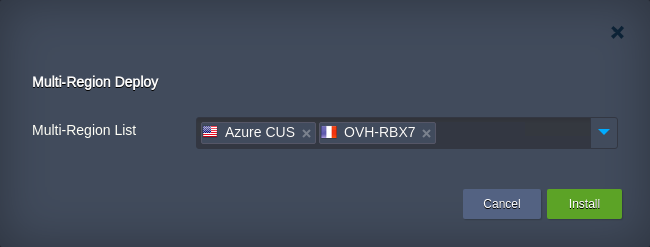
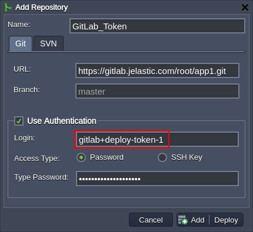
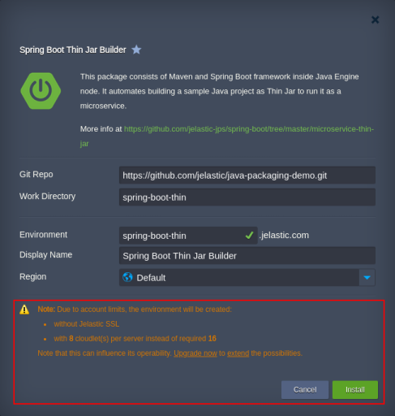
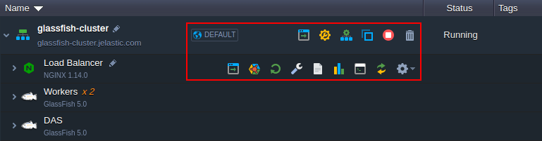
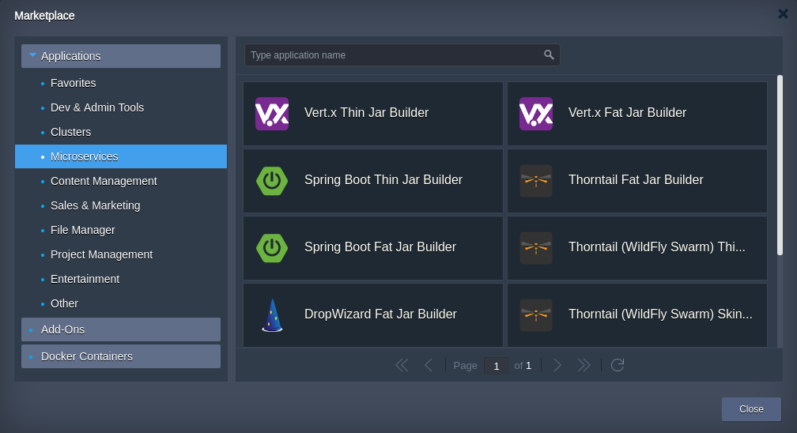
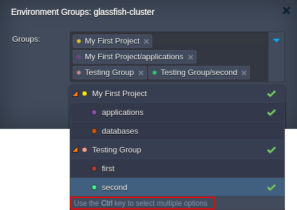
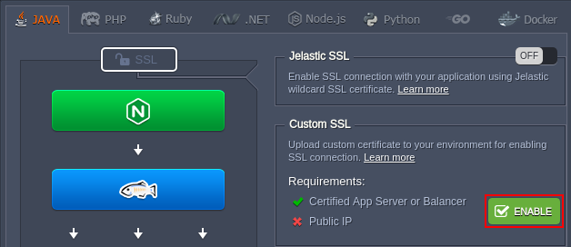

# Virtuozzo Application Platform 5.6.1/2

*This document is preliminary and subject to change.*

In this document, you will find all of the new features, enhancements and visible changes included to the **PaaS 5.6.1 / 2** releases.

{}
{}
## Multi-Region Deploy of Packaged Applications
An ability to receive and work with multiple environment regions in the JPS packages
{}

{}
## Custom IPv6 Firewall Rules
Implemented possibility to provide custom IPv6 firewall rules for the containers
{}

{}
## GitLab Deploy Tokens Support
Changed validation on the VCS deployment form to support logins generated by GitLab for deploy tokens
{}

{}
## Data Sharing: Export Config Validation
Automatic validation of the export file when sharing data with the external NFS storage
{}

{}

{}
{}
## Container Redeploy with Automatic Backups and Rollback on Failure
Improved reliability of the redeployment process through creating container backups and implementing automatic rollback on failure
{}

{}
## API Improvements
* optional parameter for the *AddMountPointById* and *AddMountPointByGroup* methods to mount data by IP address
* detailed error description upon the *BindSSL* API method failure
{}

{}
## Installation Package with Limited Resources
Listing resources on the package installation frame, which will be downscaled due to insufficient account quotas
{}

{}
## UI/UX Improvements
* renovated functional icons for the dashboard
* simplified environment group selection flow
* restyled button for automatic custom SSL dependencies appliance
{}

{}
## Extended Description for the Unreachable NFS Error
The unreachable NFS error was supplemented with the *Server IP* and *Client IP* details
{}

{}
## Software Stack Versions
Actualized list of supported OS templates and software stack versions
{}
{}

{}
{}
## Bug Fixes
List of fixes applied to the platform starting from the current release
{}

{}

## Multi-Region Deploy of Packaged Applications
In the current 5.6 PaaS release, the ***[regionlist](https://docs.cloudscripting.com/creating-manifest/visual-settings/#regionlist)*** field was provided with a possibility to select multiple [environment regions](/environment-regions), when preconfiguring a package installation. The following new optional parameters were added to support such integration:

* ***multiSelect*** - allows selecting multiple regions (*false* by default)
* ***min*** - sets the minimum number of regions required for the package installation (*0* by default)
* ***max*** - sets the maximum number of regions required for the package installation
* ***required*** - makes the field obligatory for the provisioning (*false* by default)
* ***delimiter*** - defines a delimiter for the multi-select (*,* by default)

{}**Note:** The ***[list](http://docs.cloudscripting.com/creating-manifest/visual-settings/#list)*** field was also supplemented with the *multiSelect* and *delimiter* options, allowing to implement the similar to the above-described functionality for any custom list.{}

With such an improvement, it is possible to automate installations across multiple regions in a single package. For example, you can prepare a solution, which will create instances of your application in different regions, negating risks of unavailability.

<a href="https://docs.cloudscripting.com/creating-manifest/visual-settings/#regionlist" target="_blank" id="container-redeploy">More info</a>
{}[Back to the top](#back){}

## Container Redeploy with Automatic Backups and Rollback on Failure

[Container redeploy](/container-redeploy) is a powerful tool to keep your software solutions up to date. Howerer, there are always risks of your application or some specific configs incompatibility with the new container version. As a result, your project can become partially or entirely unavailable till the problem is resolved.

Aiming to eliminate even such a slight possibility, the platform developed a new algorithm for containers redeploy with the main innovation of creating a backup. In such a way, if an error occurs during container update, the platform automatically and painlessly restores node's previous version, displaying the appropriate action in the dashboard task manager.  
Here are some other specifics of the implementation:

* you are not charged for the redeployment backups created by the platform
* failure during the sequential redeployment interrupts the process so that it won't be initiated on the remaining containers; the appropriate warning will be shown in the dashboard
* if faced some problems after successful redeploy, contact your service hosting provider support team to restore the previously used container version (usually, only the latest redeploy operation can be reverted)

<a href="/container-redeploy" target="_blank" id="fw-custom-ipv6">More info</a>
{}[Back to the top](#back){}

## Custom IPv6 Firewall Rules

Most of the firewall configurations can be performed via the dedicated [user interface](/custom-firewall), which allows configuring the *inbound* and *outbound* rules. Herewith, for more flexible management (for example, to configure NAT redirects), you can set [custom firewall rules](/custom-firewall#ssh) for your container.

In the current 5.6 platform release, the possibility to create custom rules for the IPv6 connects was implemented. Similarly to the flow implemented for IPv4, you need to define the required rules in the dedicated ***/etc/sysconfig/ip6tables-custom*** file (using the *iptables-save* tool format) and apply changes with the ***sudo /usr/bin/jem firewall fwstart*** command.

<a href="/custom-firewall#ssh" target="_blank" id="api">More info</a>

[Back to the top](#back)

## API Improvements

* [Add Mount Point by IP Address](#api-mount-by-ip)
* <a href="#api-bindssl-error-description" id="api-mount-by-ip">BindSSL Error Response Clarification</a>
{}[Back to the top](#back){}

#### Adding Mount Point by IP Address

To support various project requirements, the platform implemented a possibility to add mount points via IP address instead of the domain name. The appropriate **[AddMountPointById](https://docs.jelastic.com/api/#!/api/environment.File-method-AddMountPointById)** and **[AddMountPointByGroup](https://docs.jelastic.com/api/#!/api/environment.File-method-AddMountPointByGroup)** API methods were supplemented with the optional ***sourceAddressType*** parameter, which can be set as either *DOMAIN* (by default) or *IP*. The first option corresponds to the mount point binding by the domain name, while the second one - by IP address. Additionally, for the convenience of these methods usage, the ***protocol*** parameter was redefined as optional one and set to *NFS* by default.

Also, the **[GetMountPoints](https://docs.jelastic.com/api/#!/api/environment.File-method-GetMountPoints)** method was adjusted to return the appropriate *sourceAddressType* value in the response.

<a href="https://docs.jelastic.com/api/" target="_blank" id="api-bindssl-error-description">More info</a>
{}[Back to the list of API Improvements](#api){}

#### BindSSL Error Response Clarification

The ***[BindSSL](https://docs.jelastic.com/api/#!/api/environment.Binder-method-BindSSL)*** API method allows securing connection to an environment with a custom SSL certificate. As the task is not trivial, in the current PaaS 5.6 upgrade, the error response was provided with the additional clarification details to simplify the debugging process for developers. For now, if a problem with custom SSL certificate addition occurs, the root cause can be discovered much quicker, and the whole issue resolved faster.

<a href="https://docs.jelastic.com/api/#!/api/environment.Binder-method-BindSSL" target="_blank" id="gitlab-tokens">More info</a>
{}[Back to the list of API Improvements](#api){}

## GitLab Deploy Tokens Support
The validation of the **Login** field in the deployment form was adjusted to provide the support of the [Gitlab deploy tokens](https://docs.gitlab.com/ee/user/project/deploy_tokens/) and allow quick and simple deployment from the repository without the necessity to configure [authentication based on SSH key](/git-ssh). Namely, the &ldquo;**+**&rdquo; and &ldquo;**-**&rdquo; special symbols, which are used in the generated by GitLab tokens (e.g. *gitlab+deploy-token-1*), were allowed.

<a href="/deployment-manager#vcs" target="_blank" id="export-config">More info</a>
{}[Back to the top](#back){}

## Data Sharing: Export Config Validation

The platform allows you to [share data](/data-storage-container) between containers by exporting it on one node and mounting on the other using the NFS protocol. Herewith, if files should be [exported](/storage-exports#manage) to the external server, the appropriate ***/etc/exports*** configuration file should be manually adjusted. The automatic validation of the file content was implemented in the 5.6 platform upgrade to simplify the process for you. Namely, the duplicated records and the lines without options are commented by during a new export addition/removal. Also, the backup file of the original exports configurations is saved in the same **/etc** folder with the ***.backup-{date}*** extension.

<a href="/storage-exports#manage" target="_blank" id="jps-limited-resources">More info</a>
{}[Back to the top](#back){}

## Installation Packages with Limited Resources
The platform allows to proceed with the package installation (for example, from [Marketplace](/marketplace) or imported form [JPS Collection](https://github.com/jelastic-jps)) even if some of the account limits are lower than the ones stated in the manifest. Herewith, the appropriate notification is displayed on the installation frame:

Starting with the current 5.6 platform release, you can proceed with installation even if the package requires [Built-In SSL](/built-in-ssl/), which is not available for your account. Also, all of the cut resources are listed explicitly within the warning message at the bottom of the install confirmation frame.

In case any of the package requirements cannot be downscaled to match resources available for your account, the appropriate button to contact support is displayed (or the **[Upgrade now](/upgrade-refill-account)** one for *trial* users).
{}[Back to the top](#back){}

## UI/UX Improvements

* [Dashboard Functional Icons Renovation](#ui-icons-renovation)
* [Microservices Packages in Marketplace](#ui-microservices-marketplace)
* [Environment Groups Selection](#ui-environment-groups)
* <a href="#ui-custom-ssl" id="ui-icons-renovation">Custom SSL Dependencies Configuration</a>
{}[Back to the top](#back){}

#### Dashboard Functional Icons Renovation
[Platform dashboard](/dashboard-guide) is a powerful GUI panel for the environments hosting and management. It provides access to the main functionality of the platform, allowing to comfortably manage all the aspects of your application lifecycle directly in the browser without the necessity of additional software installation. The most common operations are available through the context menu (displayed upon hovering over the environment, layer or node), where each element is presented in the form of the appropriate functional icon.

In the present 5.6 PaaS release, these icons were restyled making them larger and more distinguishable.

<a href="/dashboard-guide" target="_blank" id="ui-microservices-marketplace">More info</a>
{}[Back to the list of UI/UX Improvements](#ui){}

#### Microservice Packages in Marketplace
The platform provides numerous pre-packaged solutions based on the microservices architecture, which are globally available via the [Marketplace](/marketplace). In the present 5.6 platform release, the new ***Microservices*** section was added to the platform Marketplace to group all of the relevant solutions (for example, *Spring Boot Fat/Thin Jar Builder*, *Vert.x Fat/Thin Jar Builder*, *Docker Swarm Cluster*).

<a href="/marketplace" target="_blank" id="ui-environment-groups">More info</a>
{}[Back to the list of UI/UX Improvements](#ui){}

#### Environment Groups Selection
[Environment groups](/environment-groups) functionality allows organizing projects within your dashboard. Herewith, often you need to [assign](/environment-groups-management#assign-group) environment to just a single group, so, for now, the list is automatically collapsed after selecting an option. To choose multiple groups straight away, click on the required items while holding the **Ctrl** or **Cmd** key on the dashboard (the appropriate tip was added at the bottom of the form).

<a href="/environment-groups" target="_blank" id="ui-custom-ssl">More info</a>
{}[Back to the list of UI/UX Improvements](#ui){}

#### Custom SSL Dependencies Configuration
To secure an application with [custom SSL](/custom-ssl), you need to correctly configure your environment topology and attach the appropriate custom domain (the one SSL certificate is issued for). The platform can automatically fulfill the topology requirements by including the certified application server or load balancer with the attached public IP. Just access the ***SSL*** section in the wizard and click the **Enable** button (is hidden if no reconfiguration is required).

In the present PaaS release, this button was visually upgraded to match the latest dashboard style. Also, the appropriate hint in the environment settings about custom SSL usage was updated as well.

<a href="/custom-ssl" target="_blank" id="nfs-error-description">More info</a>
{}[Back to the list of UI/UX Improvements](#ui){}

## Extended Description for the Unreachable NFS Error

The "*Destination NFS server is not reachable*" error was supplemented with the additional details to simplify analysis of the NFS related issues (i.e. with [mount points](/mount-points) and [data export](/storage-exports)). Namely, the information on the target *Server IP* and the source *Client IP* was added to the response, allowing jump immediately into the investigation.
{}[Back to the top](#back){}

## Software Stack Versions

Check out the list of the most accurate software stacks for the current platform version:

|Stack|PaaS 5.6.1 / 2|
|---|---|
|*Apache Balancer*|2.4.37|
|*Apache PHP*|2.4.37|
|*Apache Python*|2.4.37|
|*Apache Ruby*|2.4.37|
|*CentOS (VPS)*|6.8; 7.2|
|*Couchbase CE*|5.1.1; 6.0.0|
|*CouchDB*|1.6.1|
|*Docker Engine CE*|17.12; 18.09|
|*GlassFish*|3.1.2.2; 4.1.2; 5.0|
|*Golang*|1.11.4|
|*HAProxy*|1.8.14|
|*IIS*|8|
|*Jetty*|9.4.12|
|*MariaDB*|5.5.62; 10.3.12|
|*Maven*|3.6.0|
|*Memcached*|1.5.12|
|*MongoDB*|2.6.12; 3.6.8; 4.0.2|
|*MSSQL*|2012|
|*MySQL CE*|5.7.24; 8.0.13|
|*NGINX Balancer*|1.14.2|
|*NGINX PHP*|1.14.2|
|*NGINX Ruby*|1.14.2|
|*NodeJS*|6.16.0; 8.15.0; 9.11.2; 10.15.0; 11.6.0|
|*Payara*|4.1.2.181; 5.184|
|*PerconaDB*|5.6|
|*PostgreSQL*|9.6.11; 10.6; 11.1|
|*Redis*|4.0.11; 5.0.3|
|*Spring Boot*|2|
|*Tomcat*|7.0.92; 8.5.37; 9.0.14|
|*TomEE*|7.1.0|
|*Ubuntu (VPS)*|16.04|
|*Varnish*|4.1.8; 5.2.1; 6.1.1|
|*WildFly 10*|10.1.0; 11.0.0; 12.0.0; 13.0.0; 14.0.1; 15.0.0|
|*Windows (VPS)*|2012|

|Engine|#|
|---|---|
|*JDK*|6.0_45; 7.0_79; 8.0_201; 9.0.4; 10.0.2; 11.0.1|
|*Open JDK*|7.0_201; 8.0_191; 10.0.2; 11.0.1; 12.ea-b28; 13.ea-b4|
|*OpenJ9*|0.9.0-8u181-b13; 0.9.0-9.0.4.12; 0.9.0-10.0.2; 0.11.0-8u192-b12; 0.11.0-11.0.1|
|*PHP 5*|5.3.29; 5.4.45; 5.5.38; 5.6.40|
|*PHP 7*|7.0.33; 7.1.26; 7.2.14; 7.3.1|
|*Ruby*|2.2.10; 2.3.8; 2.4.5; 2.5.3; 2.6.0|
|*Python 2*|2.7.15|
|*Python 3*|3.4.9; 3.5.6; 3.6.7; 3.7.1|
|*Node.js*|6.16.0; 8.15.0; 9.11.2; 10.15.0; 11.6.0|
|.*NET*|4|
|*Go*|1.11.4|  
  
{}[Back to the top](#back){}

## Bug Fixes

In the tables below, you can see the list of bug fixes applied to the platform starting from PaaS 5.6.1 / 2 releases:

{}
**#**|**Description**
---|---
JE-26588|The *Favorites* shortcut cannot be removed if the target file was deleted
JE-30175|Custom domains are bound to a single instance only, even when there are multiple entry points for environment
JE-32438|The *Apply* button on the *Environments Groups* frame should become active only after some changes are provided
JE-34748|The custom-specified number of cloudlets for a node should persist after changing region in topology wizard
JE-35600|The *User* column in the *Tasks* panel should be displayed if only there are records with appropriate information
JE-36823|The mount points to the */var* directory should be prohibited
JE-37219|The *Tomcat 8.5* templates cannot be installed via JPS packages
JE-37660|A collaborator with admin permissions cannot add or edit endpoints of the shared environment
JE-37968|Incorrect link to the context deployed to the application server layer in the dashboard
JE-38087|The double-click on the arrows for navigation between the environment management tabs should not trigger the full-screen mode
JE-38218|Incorrect position for the long region names on the *Migration* dashboard tab
JE-38427|Error, while swapping external IP between nodes via API/CLI
JE-38429|Incorrect link to the used API method details in CLI
JE-38706|The firewall rules are dropped on the *Ubuntu VPS* after a restart
JE-38790|A folder becomes inaccessible through the dashboard file manager after creating a file with the &ldquo;*\*&rdquo; symbol inside
JE-38810|The price section is cropped on the *Upgrade Account* frame
JE-39312|Unhandled error, while trying to install JPS with the *jpsVersion* parameter value incompatible with the platform version
JE-40929|The *Auto-Refill* option description is displayed incorrectly on some resolutions
JE-41316|Some external IPs are not displayed in the dashboard after simultaneous addition of the IPv4 and IPv6 addresses
JE-41399|Unhandled error, while adding custom SSL with an invalid key
JE-41639|The *skipNodeEmails* parameter provided by the map is not applied when installing CS package
JE-41661|The *Golang* template icon is cropped within the *Deploy* frame
JE-41812|The RAM cache/buffer usage should be limited for the *Git-Push-Deploy* add-on
JE-41936|The currently selected file in the *Log* section should be opened after changing node
JE-41976|An error occurs while creating a new file/folder via the dashboard file manager for the first time
JE-41986|The long platform domain name is displayed incorrectly within the installation frames from Marketplace
JE-42006|The number of *Mbps* for the *Network* load is displayed incorrectly within the *Load Alerts &gt; Events History* section
JE-42038|The platform managed templates should be importable regardless of the custom Docker containers availability for the account
JE-42143|Incorrect *Description* is shown within the personal access token *Edit* frame if accessing after the *Copy* one
JE-42164|*Shared Storage* container mount points should be restored after node redeploy
JE-42199|Multiple levels of the custom registry name should be supported (e.g. *registry.gitlab.com/user/image/optional-image-name:tag*)
JE-42244|The *Auto Horizontal Scaling* section jumps up (if scrolled) after clicking on the graph's slider
JE-42328|The Ruby application context is renamed to *ROOT* if VCS project is added without the *Auto-resolve conflicts* option
JE-42330|An &ldquo;*Unknown mime-type file*&rdquo; error occurs while deploying an archive to the *Apache* or *Golang* application server
JE-42340|Error, while redeploying VCS context for application server added to the *Extra* layer
JE-42345|The *PEAR* extension for PHP should be allowed to be run with *sudo*
JE-42359|Incorrect minimum resource requirements for the *MySQL 8* template
JE-42369|Error, while unmounting multiple mount points simultaneously
JE-42439|The *Auto-Refresh* option is stopped after selecting text in the CS console and should restore its previous state after deselecting
JE-42485|Separate errors (e.g. mount/unmount or auxiliary packages installation) should be provided for the most frequent redeployment issues
JE-42574|The name of the deprecated admin panel is specified in the email for the *MongoDB* database
JE-42589|Access denied error, while accessing some empty folders in the dashboard configuration file manager
JE-42667|Mount points cannot be created on the *Ubuntu VPS*
JE-42769|The *SwapExtIps* API method should not work, when the provided *sourceNode* does not have public IP attached
JE-42771|The *SwapExtIps* API method description is not complete within the platform API documentation
JE-42852|The *Domains* for the custom SSL certificates are displayed with the HTTP protocol instead of the HTTPS one in the dashboard
JE-42934|The *Web SSH* tab is constantly refreshing after the appropriate layer horizontal scaling
JE-43065|Duplicated firewall rules are configured for the old containers after redeploy
JE-43128|Duplicated dashboard popup for the corrupted archive deployment error for PHP
JE-43131|The *GetMountPoints* API method returns an unhandled error when neither *nodeID* nor *nodeGroup* parameters are provided
JE-43143|The *setGlobals* CS action doesn't work during the *onAfterScaleOut* and *onBeforeScaleIn* events
JE-43175|The *GetAddHdNodeCmd* API method should return a correct SSH command for a new hardware node addition
JE-43219|Error, when refreshing the dashboard login form
JE-43258|If the invalid record is added to the */etc/exports* file, all the subsequent mount points will fail with an error
JE-43383|The "*storage mount*" and "*auth add*" errors during mount point creation should be handled correctly
JE-43464|It is possible to select *Elastic VPS* within topology wizard on accounts with this feature being prohibited
JE-43482|The layer is not enabled when a default tag is selected from the appropriate list within topology wizard
JE-43486|The *Statistics* graphs should be displayed on the opened tab without delay
JE-43550|The *502 HTTP transport error* occurs upon reloading the dashboard
JE-43647|The *OOM Killer* alerts are duplicated in the *Events History* tab upon the layer sequential removal and re-addition
JE-43686|Insufficient number of cloudlets are provided by default for the *WildFly* and *Payara* stacks
JE-43753|The images within the *Auto-Clustering* tooltips should be loaded without delay
JE-43900|A collaborator cannot edit container *Variables*, *Links*, *Volumes*, and *CMD* parameters for the non-standard layers
JE-43941|Add-on installations should not be supplemented with the *Owner* field for accounts in collaboration
JE-43947|Incorrect number of public IP addresses are allowed per node when compared to the account quotas
JE-43953|An error occurs when trying to add mount points with the *space* symbol within the source path
JE-43955|Web SSH session is lost after connecting to another node or duplicating current session
JE-44061|The elements layout is incorrect in the *Deploy* form
JE-44090|Error due to the creation of a mount point using the restricted paths should be handled
JE-44124|The value selected via radio-button list cannot be adjusted after applying changes for the first time
JE-44126|The *Maven* build node is not centered in the topology wizard
JE-44139|The **.properties* file is removed after pre-deploy hook failure for the VCS project deployment
JE-44155|Error, while installing the *Debian-based* custom Docker containers
JE-44163|The correct description should be provided for the error after mounting directory to the file
JE-44205|The shared environment *Clone* button should be hidden for collaborators
JE-44206|A corrupted email template for the environment migration notifications
JE-44209|Incorrect dashboard warning upon migrating environment with *IPv6* to the region without free addresses available
JE-44269|The possibility to rename deployed context should be hidden for the *Apache Python* application server
JE-44335|No warning on the install JPS confirmation frame about public IP usage for the accounts without external IP addresses support
JE-44351|Incorrect link to the environment regions documentation within the platform welcome tutorial
JE-44375|The *DjangoCMS* package cannot be installed from the platform Marketplace
JE-44395|The *tip* icon for scaling mode is shifted within the topology wizard
JE-44406|Error, while connecting to nodes over *Web SSH*
JE-44451|Java projects cannot be deployed using the *Maven plugin 1.9.1*
JE-44495|Docker containers within the platform should be stopped gracefully using the *SIGTERM* signal
JE-44502|The platform *Shared Storage* container cannot be added via the appropriate section on the custom *Docker* tab in the topology wizard
JE-44520|Both IPv4 and IPv6 firewall rules should be generated for containers
JE-44579|Email notification after creating a personal access token is not sent
JE-44662|Environments, which includes the old VPS nodes with firewall feature enabled, cannot be cloned
JE-44672|Some *asserts* are failed after the *setGlobals* action in the CS scripts
JE-44699|Invalid behavior of the platform welcome tutorial for collaborators without permission to create environments
JE-44727|The warning message should be shown for collaborator upon trying to add Public IPs to the shared environment, where an owner doesn't have the appropriate permissions
JE-44736|Error during environment migration between regions
JE-44750|Clicking on the environment icon (or account menu button) with the appropriate tab already existing, but collapsed, should re-open the panel
JE-44805|The post-installation packages are not installed for the custom Docker containers based on the *Ubuntu 18.04* images
JE-44806|When collaborator creates an environment on a shared account, the owner's limitations should be applied in the topology wizard
JE-44889|The *Detach IP* button is absent for collaborator upon working with the owner's environment
JE-44931|When collaborator imports JPS package to the shared account, the warnings on the owner's limitations should be displayed
JE-44969|The *Detach IP* button is displayed for the first (primary) public IP when there are multiple addresses attached to a node
JE-44974|The *not authenticated (different session key)* error occurs, while executing some API requests with personal access tokens
JE-44987|Public IPs should be restored correctly on the environment after the failed migration process
JE-44993|Incorrect error description if the called API method is not allowed by the used personal access token
JE-45009|The custom Docker container tags cannot be fetched in topology wizard after selecting an image from the private repository
JE-45044|Error, when trying to download a file from the dashboard configuration file manager
JE-45090|Mount points cannot be created due to lack of permissions for the */etc/exports* file for the default container's user
JE-45104|Error, while creating a mount point for the first time
{}

{}
**#**|**Description**
---|---
JE-44412|The default user in the platform containers cannot use the *sendmail* tool
JE-44704|The *NGINX* load balancer should be provided with the *keepalive* parameter by default
JE-45225|The container's disk space is reduced after the redeploy operation
{}
{}[Back to the top](#back){}