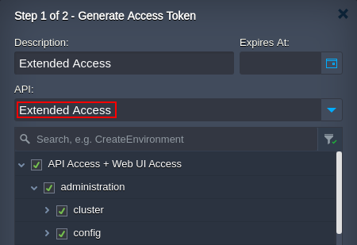
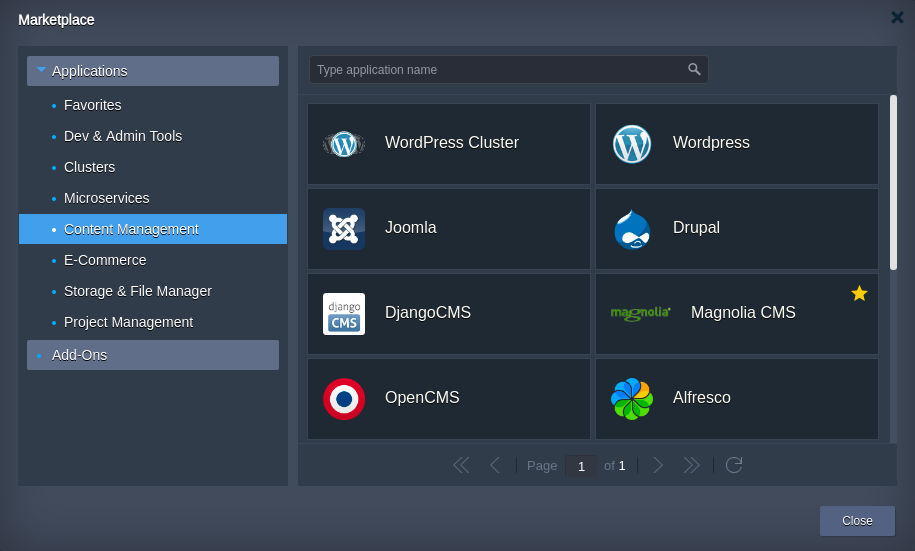

# Virtuozzo Application Platform 5.6.4-9

*This document is preliminary and subject to change.*

In this document, you will find all of the new features, enhancements and visible changes included to the **PaaS 5.6.4-9** releases.

{}
{}
## Additional Domains for Environments
API methods to assign additional domains for a whole environment, its node groups or particular containers
{}

{}
## Sign In with Tokens
An ability to access the dashboard using the appropriate token instead of the account password
{}

{}
## Parallel Actions in CS (5.6.8)
The possibility to define asynchronous actions within the Cloud Scripting packages
{}

{}
## onBefore-/onAfterInstallAddon CS Events (5.6.9)
Two new Cloud Scripting events to automatically perform actions before or after add-on installation
{}

{}

{}
{}
## Additional Domains Enhancement (5.6.7)
A new parameter for the <i>AddDomains</i> API method to provision node/layer additional domains on the same level as environment domain
{}

{}
## Marketplace Amendments
Categories reorganization and the <i>Docker Containers</i> section removal
{}

{}
## Redeploy Optimization (5.6.6)
Redeploy operation optimizations, adjustments, and fixes
{}

{}
## Software Stack Versions
Actualized list of supported OS templates and software stack versions
{}

{}

{}
{}
## Bug Fixes
List of fixes applied to the platform starting from the current release
{}

{}

## Additional Domains for Environments
The platform provides multiple [default domain names](/container-dns-hostnames) for environments, node groups, and separate containers. Starting with the current 5.6.4 platform release, a possibility to assign additional domain names was implemented. Three new *BinderService* API methods were developed to support a new functionality:

* <i>**AddDomains**(envName, session, domains, [nodeGroup], [nodeId])</i> - assigns additional *domains* to the specified *envName* environment. Using the optional *nodeGroup* or *nodeId* (has a higher priority if both are specified) parameters, you can set domains for the particular layer or node
{}**Notes:** 

* Multiple *domains* can be provided as a comma- or semicolon-separated list.
* *Domains* are provided in a short form, i.e. ***${envName}*** for the environment (*${envName}.${platformDomain}*) or ***${subDomain}*** for the layer/container (*${subDomain}.${envName}.${platformDomain}*).
* The provided environment domains (*${envName}*) should be no less than five characters and are validated across the existing DNS records; the maximum length for subdomains (*${subDomain}*) is 32 characters.
* If adding *domains* for the whole environment (not for the particular layer or node), they are assigned to the appropriate entry-point (i.e. load balancer or application server layer)
{}

* <i>**RemoveDomains**(envName, session, domains, [group], [nodeId)</i> - detaches the listed *domains* from the whole environment or its particular layer/node (provide <b>*</b> to remove all of the additional domains). Herewith, the default domains are skipped, so only custom ones can be removed
* <i>**GetDomains**(envName, session, [nodeGroup], [nodeId], [inShort, default=true])</i> - lists all the domains assigned to the *envName* environment. The response can be narrowed by the optional *nodeGroup* or *nodeId* (has a higher priority if both are specified) parameters. Set the *inShort* parameter as *false* to view domains in the extended form

Also, the response of the ***GetEnvs*** and ***GetEnvInfo*** API methods was extended with the new *aliases* section, where the assigned domains are listed in a short form.

[More info](https://www.virtuozzo.com/application-platform-api-docs/)
{}[Back to the top](#back){}

## Additional Domains Enhancement (5.6.7)
In the 5.6.7 PaaS release, a possibility to provide [additional domains](#additional-domains) for nodes/layers on the same level as environment domain was integrated. Such implementation is achieved through the new ***subdomain*** parameter for the **AddDomains** API call:

* ***false*** - crates the node/layer additional domains with the &ldquo;**-**&rdquo; separator, i.e. *${subdomain}-${envName}.${platformDomain}*
* ***true*** (by default) - uses the default &ldquo;**.**&rdquo; separator, i.e. *${subdomain}.${envName}.${platformDomain}*

Herewith, the availability of this feature on the particular platform depends on your hosting provider settings. So, if you've faced an error while adding domain with the &ldquo;*-*&rdquo; separator, contact platform support for assistance.

[More info](https://www.virtuozzo.com/application-platform-api-docs/)
{}[Back to the top](#back){}

## Sign In with Tokens
Within the PaaS 5.6.4 release, a possibility to share access to the dashboard via personal access tokens was implemented. Herewith, such operation requires ***Extended Access***, which can be selected from the *API* drop-down list within the **Generate Access Token** form.

{}**Note:** The dashboard access cannot be provided via a custom token with a full *API Access*, as it requires an *API Access + Web UI Access* (which can be obtained via the ***Extended Access*** API set only).{}
After successful logging in with a token, all the functionality of the account owner will be available, excluding the possibilities to change the *account password*, manage *two-factor authentication* and adjust *access tokens*.

[More info](/personal-access-tokens)
{}[Back to the top](#back){}

## Marketplace Amendments
In the present 5.6.4 platform upgrade a major revision of the [platform Marketplace](/marketplace) was done. The existing categorization system was thoroughly reviewed and updated, removing the unpopular groups and including the trading topics. Within these categories, the packages were reorganized by positioning the most frequently used solutions at the beginning, which ensures simpler and quicker access to them.

Another notable change is the removal of the ***Docker Containers*** section from the **Marketplace** tab, where its presence becomes excessive. This functionality is fully covered in the topology wizard frame, where it can be managed with greater convenience and additional possibilities (for example, to build complex environments with multiple custom Docker containers).

[More info](/marketplace)
{}[Back to the top](#back){}

## Redeploy Optimization (5.6.6)

Based on the data obtained after the recent [redeployment algorithm update](/release-notes-56#container-redeploy), some optimization adjustments and fixes were applied in the 5.6.6 PaaS release. Also, the default timeout for the operation was enlarged up to *75* minutes. The additional 15 minutes (one hour previously) allows completing redeployment of the large containers successfully. Herewith, the exact timeout can vary based on your particular service hosting provider settings.

[More info](/container-redeploy)
{}[Back to the top](#back){}

## Parallel Actions in CS (5.6.8)
To optimize Cloud Scripting packages installation time, the possibility to perform some actions in parallel was developed in the PaaS 5.6.8 version. Currently, there are four main actions, which support asynchronous execution:

* *[install](http://docs.cloudscripting.com/creating-manifest/actions/#install)*
* *[cmd](http://docs.cloudscripting.com/creating-manifest/actions/#cmd)*
* *[api](http://docs.cloudscripting.com/creating-manifest/actions/#api)*
* *[script](http://docs.cloudscripting.com/creating-manifest/actions/#script)*

In order to call the actions in parallel, you can define them using the filter by nodes, via the array or their combination. For the detailed example and list of specifics follow the linked guides.

[More info](https://docs.cloudscripting.com/)
{}[Back to the top](#back){}

## onBefore-/onAfterInstallAddon CS Events (5.6.9)
Within the current 5.6.9 platform upgrade, two new [Cloud Scripting events](https://docs.cloudscripting.com/creating-manifest/events/) were implemented:

* ***onBeforeInstallAddon*** - executes provided actions before add-on installation
* ***onAfterInstallAddon*** - runs specified commands after add-on installation

The usage is straightforward, subscribe to these events within the required environment and, upon installation of the specified add-on, your custom action will be executed automatically.

<a href="https://docs.cloudscripting.com/" target="_blank" id="software">More info</a>
{}[Back to the top](#back){}

## Software Stack Versions

Check out the list of the most accurate software stacks for the current platform version:

|Stack|PaaS 5.6.4-9|
|---|---|
|*Apache Balancer*|2.4.37|
|*Apache PHP*|2.4.37|
|*Apache Python*|2.4.37|
|*Apache Ruby*|2.4.37|
|*CentOS (VPS)*|6.8; 7.2|
|*Couchbase CE*|5.1.1; 6.0.0|
|*Docker Engine CE*|17.12; 18.09.2|
|*GlassFish*|3.1.2.2; 4.1.2; 5.1.0|
|*Golang*|1.12.1|
|*HAProxy*|1.9.3|
|*IIS*|8|
|*Jetty*|9.4.12|
|*MariaDB*|5.5.63; 10.3.13|
|*Maven*|3.6.0|
|*Memcached*|1.5.12|
|*MongoDB*|2.6.12; 3.6.8; 4.0.2|
|*MSSQL*|2012|
|*MySQL CE*|5.7.25; 8.0.15|
|*NGINX Balancer*|1.14.2|
|*NGINX PHP*|1.14.2|
|*NGINX Ruby*|1.14.2|
|*NodeJS*|6.16.0; 8.15.0; 9.11.2; 10.15.1; 11.11.0|
|*Payara*|4.1.2.181; 5.184|
|*Percona*|5.7.24|
|*PostgreSQL*|9.6.12; 10.7; 11.2|
|*ProxySQL*|14.13|
|*Redis*|4.0.11; 5.0.4|
|*Shared Storage*|NFS 3|
|*Spring Boot*|2|
|*Tomcat*|7.0.93; 8.5.38; 9.0.16|
|*TomEE*|7.1.0|
|*Ubuntu (VPS)*|16.04|
|*Varnish*|4.1.8; 5.2.1; 6.2.0|
|*WildFly*|10.1.0; 11.0.0; 12.0.0; 13.0.0; 14.0.1; 15.0.1; 16.0.0|
|*Windows (VPS)*|2012|

|Engine|#|
|---|---|
|*JDK*|6.0_45; 7.0_79; 8.0_202; 9.0.4; 10.0.2; 11.0.2|
|*Open JDK*|7.0_201; 8.0_191; 10.0.2; 11.0.2; 12; 13.ea-b12|
|*OpenJ9*|0.9.0-8u181-b13; 0.9.0-9.0.4.12; 0.9.0-10.0.2; 0.11.0-8u192-b12; 0.11.0-11.0.1|
|*PHP 5*|5.3.29; 5.4.45; 5.5.38; 5.6.40|
|*PHP 7*|7.0.33; 7.1.27; 7.2.16; 7.3.3|
|*Ruby*|2.2.10; 2.3.8; 2.4.5; 2.5.5; 2.6.2|
|*Python 2*|2.7.15|
|*Python 3*|3.4.10; 3.5.7; 3.6.8; 3.7.2|
|*Node.js*|6.16.0; 8.15.0; 9.11.2; 10.15.3; 11.12.0|
|.*NET*|4|
|*Go*|1.11.5

{}[Back to the top](#back){}

## Bug Fixes

In the table below, you can see the list of bug fixes applied to the platform starting from PaaS 5.6.4-9 releases:

{}
**#**|**Description**
---|---
JE-28476|The default firewall rules on the *Memcached* node restrict NFS mounts
JE-31090|A prolonged delay for SSH connection to containers based on the *Fedora 25* OS
JE-32212|The *Cannot find function error in object* error occurs during some of the operations
JE-36483|The *diskLimit* property is absent in the manifest of the exported environment
JE-36754|The validation tooltip about the whitespaces at the beginning and end of a filename is not displayed
JE-39755|The *java.lang.NullPointerException* error occurs while adjusting the external IPs count for a node
JE-43611|The *Destination NFS server is not reachable* error occurs while creating mount points
JE-43681|A single node cannot be redeployed if there are multiple containers in the layer
JE-43945|A dedicated icon for the master container is not provided in the nodes drop-down list of the file manager
JE-44985|Incorrect styles of the warning message in the *Traffic Distributor* package
JE-45231|Redeployment enables *sendmail* on the containers with this service being disabled
JE-45261|Unhandled error while restarting service via the dashboard
JE-45269|Incorrect links parsing in the Cloud Scripting packages
JE-45306|The */var/lib/jelastic/SSL* directory for custom SSL certificates is removed during redeploy
JE-45403|The *stateless* scaling mode is set for all layers in installations from platform Marketplace
JE-45452|An error occurs while scaling environments with a custom domain attached
JE-45461|Unhandled error while redeploying containers with public IP attached
JE-45465|Container redeployment fails if the new tag is based on a different OS distribution
JE-45478|The manifest files with the *diskLimit* property should be imported successfully
JE-45508|An error occurs while redeploying the *Alpine-based NGINX* container to the *Debian-based* one
JE-45532|Environment cannot be created on the collaborator account if the target region is unavailable for the current user
JE-45581|Placeholders are not substituted with the appropriate values in some of the email notifications
JE-45586|An *Access denied* warning occurs while accessing container file manager via the dashboard
JE-45589|An error occurs while deleting environment with a custom domain attached
JE-45694|An error occurs while renaming the existing environment isolation group
{}

{}
**#**|**Description**
---|---
JE-45817|Unhandled error during the prolonged container redeployment
{}

{}
**#**|**Description**
---|---
JE-45675|The *Open in Browser* dashboard pop-up is blocked in the latest *Chrome* browser
JE-45723|The *iptables* service is inactive on the *WildFly* application server after container restart
JE-45986|The *SSH* service is inactive on the containers based on the *Ubuntu 18.04* OS templates
JE-46011|Billing history cannot be downloaded due to the incorrect protocol in the export link
JE-46052|An error occurs while redeploying stopped container
{}

{}
**#**|**Description**
---|---
JE-46214|The scheduler processes are not deleted after the associated instance removal
{}

{}
**#**|**Description**
---|---
JE-41046|When requesting an unexisting node/layer, the warning message should define the instance explicitly to provide more clarity
JE-41226|The */root/.ssh/authorized_keys* folder on the custom Docker containers should always contain the SSH Gate public key after redeploy
JE-46116|Some JPS packages (including platform Marketplace applications) cannot be installed on the particular environment regions
JE-46136|Unhandled error while redeploying container with incorrect NFS export configs
JE-46205|Container linking is discarded after redeploy
JE-46297|The installation dialog is not opened in the dashboard when following the solution deployment link
JE-46316|The *network* service is down on the *alpine-based* images after redeploy
{}

{}
**#**|**Description**
---|---
JE-45273|The list of environment variables should be updated automatically every *40* seconds
JE-45974|An error occurs while redeploying container with a symlink added as a volume
JE-46414|An environment cannot be imported via the JPS manifest obtained through the *export* feature
JE-46423|Files within the container volumes are converted into the same-named folders after redeploy
JE-46555|Unhandled error while redeploying to the image tag with a broken container
{}

{}[Back to the top](#back){}