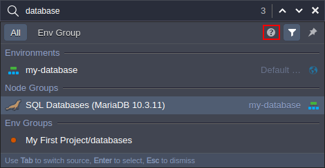
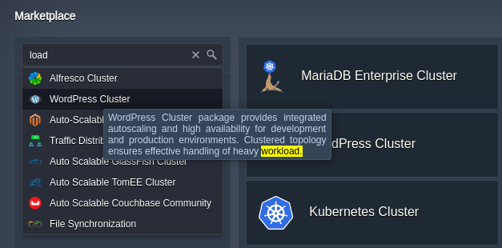
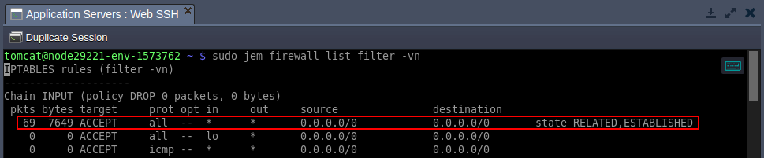
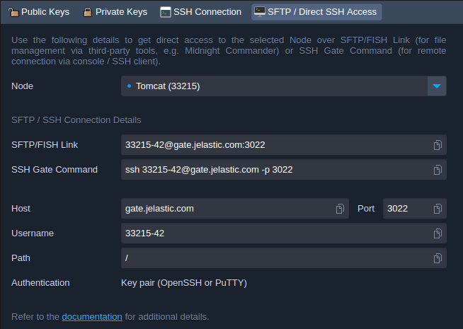
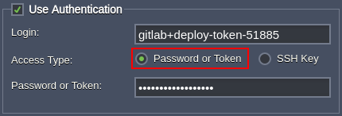
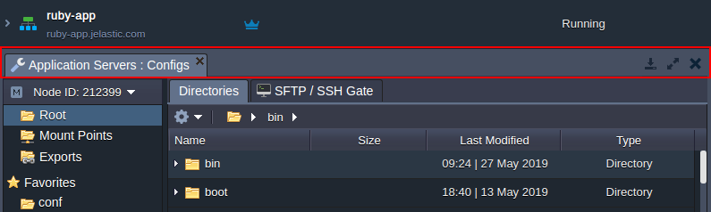

# Virtuozzo Application Platform 5.7

*This document is preliminary and subject to change.*

In this document, you will find all of the new features, enhancements and visible changes included to the **PaaS 5.7** release.

{}

{}
## Dashboard Search
Integrated a built-in search panel for the dashboard to easily locate the required elements (environments, containers, deployments, etc.)
{} 

{}
## Cloud Scripting Improvements
* A possibility to get data (the *globals*, *actions*, *addons*, *responses* sections) from another manifests using a new *mixins* directive
* Improved conditioning via scripting with the new *else*, *elif*, *switch* actions
* Multi-select functionality for the [*Envlist*](https://docs.cloudscripting.com/creating-manifest/visual-settings/#envlist) visual setting (with an ability to set the minimum/maximum number of required environments, delimiter symbol, etc.)
* Multiple new functions for data processing (*join*, *toJSON*, *print*, *contains*, *toBase64*, *md5*, *fromBase64*)
* Provided additional logging for the creation/deletion of the CS application
{}

{}
## NFSv4 Support
Provided full support of the latest NFSv4 protocol for the platform *Shared Storage Container*
{} 

{}
## UI for Direct SSH/SFTP Access Links
Added a dedicated *SFTP / Direct SSH Access* tab to the dashboard to simplify these features utilization
{} 
{}

{}
{}
## Extended Marketplace Search
Improved the search option for the platform Marketplace by including the package description into the search sources
{} 

{}
## Firewall Optimization
Updated container firewall rules to ensure the *ESTABLISHED* and *RELATED* connections are always accepted.
{}

{}
## UI/UX Amendments
Updated captions, visual and usability of some dashboard elements to improve user experience.
{}

{}
## Software Stack Versions
Actualized list of supported OS templates and software stack versions
{}
{}

{}
{}
## Bug Fixes
List of fixes applied to the platform starting from the current release
{}
{}

## Dashboard Search
Starting with the platform 5.7 release, PaaS provides built-in search functionality for the developer's dashboard. The core functionality is straightforward - access the *Search* form at the top-right corner (or use the **Ctrl+F**/**Cmd+F** shortcut), type a search term(s) and hit **Enter**. For example, you can locate a container by its IP/ID; or search for the particular deployed project/environment; or deploy applications from [platform Marketplace](/marketplace).

Herewith, the implemented search engine is highly customizable, allowing you to get the most accurate results for the requests. Among the main options:

* *special characters* for search expression (e.g. &ldquo;***-***&rdquo; prefix to exclude a term or &ldquo;<b>*</b>&rdquo; wildcard)
* *search source* (either whole account or the current [environment group](/environment-groups))
* *categories filter* to search among the selected entities (e.g. exclude the [Marketplace](/marketplace) packages or look for IPs only)

We highly recommend reading the *help* hint within the search form (circled in the image above) for a detailed overview.
{}[Back to the top](#back){}

## Extended Marketplace Search
[Platform Marketplace](/marketplace) is an excellent source of the numerous managed solutions, which can be installed in one click on the platform. In order to help with locating the required package, the search option was improved for the appropriate frame and within the [dashboard search](#dashboard-search). For now, the provided phrase is looked for in the package description as well as in its name.

Also, the position of the search box was adjusted, allowing to utilize space within the **Marketplace** frame with higher efficiency.

<a href="/marketplace" target="_blank" id="nfs4">More info</a>
{}[Back to the top](#back){}

## NFSv4 Support

The Network File System (**NFS**) is a widely used protocol for data sharing, as it allows accessing files over a network in the same way as on a local machine. Herewith, the platform provides out-of-the-box support for the functionality for all of the containers (*NFSv3*), allowing to easily share data between instances through the [mount points](/mount-points).

In the present 5.7 platform release, the **[Shared Storage Container](/shared-storage-container)** was updated to fully support the latest (fourth) version of the NFS protocol, allowing to use it as NFSv4 server. For now, new [exports](/storage-exports) from the shared storage are configured over NFSv4 by default, while existing ones should be re-created to get the benefits of the latest version - improved performance (especially for a large number of files), stronger security, support of the [FUSE](https://github.com/libfuse/libfuse) directories export, and more.
{}**Note:** Any platform-managed container can receive mounts over the fourth version of the protocol, but only Shared Storage Container can export data over NFSv4.{}
{}[Back to the top](#back){}

## Firewall Optimization
The *[ESTABLISHED and RELATED](https://linux.die.net/man/8/iptables)* connections are accepted via [container firewall](/custom-firewall) on all of the platform nodes by default. In the present 5.7 platform release, the appropriate rules (for both IPv4 and IPv6) were moved to the top of the *iptables* list. Such adjustment speeds up access over the already established connections (by preventing the traffic flow through a whole list of rules).

<a href="/custom-firewall" target="_blank" id="ui-sftp">More info</a>
{}[Back to the top](#back){}

## UI for Direct SSH/SFTP Access Links

The platform provides multiple options for remote connection to the container file system, some of them may not be obvious (especially for the new users) - [SFTP/FISH protocols](/ssh-protocols) and [direct SSH access](/ssh-gate-access#container). In the current platform upgrade, the dedicated **SFTP / Direct SSH Access** tab was added to the dashboard to emphasize such feature availability and simplify its utilization. The new section can be accessed from the:

* ***Account Settings &gt; SSH Access &gt; SFTP / Direct SSH Access***
* ***Environment Settings &gt; SSH Access &gt; SFTP / Direct SSH Access***
* ***[Configuration File Manager](/configuration-file-manager) &gt; SFTP / SSH Gate***
* <i>**Additionally > SFTP / Direct SSH Access** (within the functional icons of the node or layer)</i>

{}**Note:** The feature requires at least one [public SSH key](/ssh-add-key) to be added to the account. If this requirement is not met, the section will be locked, displaying the appropriate notification with a link to the SSH key addition form.{}

Within the ***Direct SSH Access*** frame, you can select the required *Node* to view/copy the automatically generated *SFTP/FISH Link* and *SSH Gate Command* for direct access. The former one is suitable for file management via third-party tools (e.g. *Midnight Commander*), and the later one - for remote connection via console / SSH client.

Additionally, if working via the container file manager, the current directory will be included in the provided commands, allowing to switch to it automatically upon establishing a connection.
{}[Back to the top](#back){}

## UI/UX Amendments
Several UI adjustments were applied in the current PaaS release to improve user experience:

* denomination of one of the authentication options for the [Git / SVN projects'](/deployment-manager#vcs) deployment was renamed to ***Password or Token***, which explicitly highlights the support of the access tokens (e.g. for [GitHub](https://help.github.com/en/articles/creating-a-personal-access-token-for-the-command-line) or [GitLab](https://docs.gitlab.com/ee/user/project/deploy_tokens/))

* resize possibility for the management section at the bottom of the dashboard was simplified; for now, the whole toolbar can be dragged instead of just the border at the top, which was removed to make the transition between the dashboard parts smoother

* the **Upgrade** and **Contact Us** buttons within the topology wizard were recolored to match the latest interface style
{}[Back to the top](#back){}

## Software Stack Versions

Check out the list of the most accurate software stacks for the current platform version:

Stack|PaaS 5.7
---|---
*Apache Balancer*|2.4.37
*Apache PHP*|2.4.37
*Apache Python*|2.4.37
*Apache Ruby*|2.4.37
*CentOS (VPS)*|6.8; 7.2
*Couchbase CE*|5.1.1; 6.0.0
*Docker Engine CE*|17.12; 18.09.2
*GlassFish*|3.1.2.2; 4.1.2; 5.1.0
*Golang*|1.12.5
*HAProxy*|1.9.7
*IIS*|8
*Jetty*|9.4.12
*MariaDB*|5.5.64; 10.3.14
*Maven*|3.6.1
*Memcached*|1.5.14
*MongoDB*|2.6.12; 3.6.8; 4.0.2
*MSSQL*|2012
*MySQL CE*|5.7.26; 8.0.16
*NGINX Balancer*|1.16.0
*NGINX PHP*|1.14.2
*NGINX Ruby*|1.14.2
*NodeJS*|6.17.1; 8.16.0; 9.11.2; 10.15.3; 11.15.0; 12.1.0
*Payara*|4.1.2.181; 5.184
*Percona*|5.7.24
*PostgreSQL*|9.6.13; 10.8; 11.3
*ProxySQL*|1.4.13
*Redis*|4.0.11; 5.0.4
*Shared Storage*|NFS 4
*Spring Boot*|2
*Tomcat*|7.0.94; 8.5.40; 9.0.19
*TomEE*|7.1.0
*Ubuntu (VPS)*|16.04
*Varnish*|4.1.8; 5.2.1; 6.2.0
*WildFly*|10.1.0; 11.0.0; 12.0.0; 13.0.0; 14.0.1; 15.0.1; 16.0.0
*Windows (VPS)*|2012

Engine|#
---|---
*JDK*|6.0_45; 7.0_79; 8.0_202; 9.0.4; 10.0.2; 11.0.2
*Open JDK*|7.0_211; 8.0_212; 10.0.2; 11.0.2; 12.0.1; 13.ea-b21
*OpenJ9*|0.9.0-8u181-b13; 0.9.0-9.0.4.12; 0.9.0-10.0.2; 0.11.0-8u192-b12; 0.11.0-11.0.1
*PHP 5*|5.3.29; 5.4.45; 5.5.38; 5.6.40
*PHP 7*|7.0.33; 7.1.29; 7.2.18; 7.3.5
*Ruby*|2.3.8; 2.4.6; 2.5.5; 2.6.3
*Python 2*|2.7.15
*Python 3*|3.4.10; 3.5.7; 3.6.8; 3.7.3
*Node.js*|6.17.1; 8.16.0; 9.11.2; 10.15.3; 11.15.0; 12.1.0
.*NET*|4
*Go*|1.12.5
{}[Back to the top](#back){}

## Bug Fixes

In the table below, you can see the list of bug fixes applied to the platform starting from PaaS 5.7 release:

{}
**#**|**Description**
---|---
JE-20439|Unhandled error while trying to clone an environment with the maximum number of allowed environments reached
JE-23064|Slow download speed from the platform
JE-25093|The *Application Name* field should be automatically filled when installing *New Relic APM* add-on
JE-31531|Custom *forms* have incorrect margins in Cloud Scripting
JE-34010|Incorrect behavior if a container is removed during creation
JE-34302|The "*/*" character should be validated within the context name field
JE-34397|Custom Docker containers based on the *Fedora 26/27/28* OS templates cannot be created
JE-35765|Clicking on the particular log should display its latest file (several ones can be available due to the *logrotate* feature)
JE-37058|Git project with "*error*" in its name cannot be deployed
JE-38040|Incorrect styles for the *Nodes* list in the environment *Settings &gt; Monitoring &gt; Events History* tab
JE-40724|An error occurs when signing out of the dashboard
JE-41897|The *Welcome Tutorial* is not displayed for the beta users
JE-43118|A symlink from the ROOT folder is not deleted after the project removal on the *Golang* nodes
JE-43639|Error in the environment *Settings &gt; Monitoring &gt; Events History* tab when the *Network (out ext.)* trigger is executed
JE-43912|Ports auto-redirect does not work with IPv6 on the custom Docker containers
JE-44162|An error should occur when trying to mount a directory to a file
JE-44679|An error occurs when installing custom Docker container from the private repository
JE-44763|Incorrect behavior when creating a mount point of the *Master Container* type
JE-44815|A command to view custom *IPv6* firewall rules should be added
JE-44966|Incorrect IP routes on a container after decreasing the number of public addresses
JE-45444|Auto-deploy is not working for the VCS projects added over the *ssh://* protocol
JE-45594|Icon for the *Golang* application server is displayed incorrectly in the *FireFox* browser
JE-45604|Local mount points are added incorrectly
JE-45674|The permissions list is not refreshed after switching to the different template in the *Generate Access Token* frame if the *Only Checked* filter is enabled
JE-45739|Brief access downtime for comprized nodes during rename of the environment group with *Network Isolation* enabled
JE-45787|Authentication session becomes broken when logged in via the *Extended Access* token and working for a prolonged period
JE-45855|Containers cannot be connected via the *21* port after the *FTP* add-on installation
JE-45905|A mount point of the *Master Container* type cannot be re-added if removed via the *Exports* tab
JE-45927|An error occurs when viewing tooltips for the *MySQL/MariaDB* auto-clustering in topology wizard
JE-45941|Custom Docker containers cannot be created due to failure with the symbolic link override
JE-45973|Incorrect email template for the Docker container node addition
JE-46013|The *jem fwset* command is called during custom Docker container redeploy
JE-46095|Credentials to the custom Docker container repository are cached even upon authentication error
JE-46098|Incorrect error description for the container redeploy
JE-46102|Default value provided for the *settings* placeholder via *globals* in Cloud Scripting cannot be redefined
JE-46103|Account password reset email should be sent considering the currently selected language
JE-46123|Unhandled error, if remote registry becomes unavailable during custom Docker container redeploy
JE-46140|The *getRules* request has a different response via Cloud Scripting and API
JE-46235|The *Sticky Session* option does not work correctly for *Traffic Distributor*
JE-46280|Success window format is corrupted for the Traffic Distributor package
JE-46281|The standard *jem service start (stop)* and *jem service compute deploy* commands should be executable without sudo password
JE-46347|The *Cannot read property 'getUpdater' of null* error occurs during installation of the add-ons
JE-46424|The *Duplicate Session* button terminates the existing connection
JE-46507|The */etc/resolv.conf* symlink is not working after a restart of the custom Docker containers based on the *Ubuntu 18.04* operating system
JE-46550|Collaborator without access to the custom domains functionality should be able to manage them on the shared environments if admin permissions were granted
JE-46651|The password fields should be unlimited by the characters number
JE-46671|Incorrect behavior for the *set* action in Cloud Scripting
JE-46677|The *forEach* Cloud Scripting iteration should work with the nested arrays
JE-46681|The *getExportedDirList: command not found* error occurs while executing the *jem redeploy* command
JE-46696|Error report cannot be sent after clicking the *View Invoices* button if billing integration is broken
JE-46699|A warning appears during the password reset for the *MySQL* container
JE-46729|The text within layer aliases should be displayed as encoded HTML
JE-46730|An error occurs when switching between localization languages in the dashboard
JE-46768|Unhandled error during endpoint creation if there are no free public ports on the platform
JE-46775|Custom Docker images based on the *RHEL* operating system cannot be created
JE-46796|Network does not start after redeploying custom Docker containers based on *CentOS*, *Fedora*, *Ubuntu* operating systems
JE-46821|An error description for the mount point creation timeout should be provided
JE-46861|A new *vtype:domainlist* field should be added in Cloud Scripting for domain names validation
JE-46864|An error occurs when installing JPS with the *envName: ${settings.envName}* code
JE-46871|The alternative styles for the *toggle* visual setting in topology wizard should look the same as *Auto-Clustering* one
JE-46875|The *Run Command* adjustments are not saved via topology wizard if no other changes were applied
JE-46905|The *${this}* placeholder does nor work as a node selector for other Cloud Scripting methods
JE-46926|An error occurs when enabling isolation for the environment group with a long name
JE-46927|An error occurs when renaming environment group with a long name and isolation enabled
JE-46930|The custom height of the *Deployment Manager* section is restored to the default after the dashboard page refresh
JE-46955|An error occurs when the *code* parameter is used within the *script* Cloud Scripting action
JE-47076|Environment export should be disabled for collaborator if this feature is restricted for owner
JE-47094|An error occurs while editing the *auto_alert_oom_killer* load alert
JE-47097|Cloud Scripting console can be accessed over the insecure *HTTP* protocol
JE-47099|The *skipEmail* Cloud Scripting parameter is not working
JE-47311|SSL option should be displayed in uppercase within the Billing History tab
JE-47356|The *BeforeSetCloudletCount* Cloud Scripting event should be executed only on the appropriate layer
JE-47359|The *event.response.nodes* placeholder doesn't work with multiple events
JE-47378|An error occurs while trying to delete an environment
JE-47396|An error occurs when trying to scale out application server and scale in balancer layers simultaneously
JE-47427|One node is created for the layer even if the count is set to *0* within th
{}

{}[Back to the top](#back){}