

# Virtuozzo Application Platform 5.7.2-5.7.5

*This document is preliminary and subject to change.*

In this document, you will find all of the new features, enhancements and visible changes included to the **PaaS 5.7.2-5.7.5** releases.

{}
{}
## GlusterFS Storage with Auto-Clustering (5.7.4)
Implemented new Shared Storage template with the Gluster software support and auto-clustering option
{}

{}
## Kubernetes Cluster
Added pre-packaged *Kubernetes Cluster* solution to platform Marketplace for automated installation within the platform
{}

{}
## LiteSpeed Software Stacks
Implemented support of the *LiteSpeed Web Server* and *LiteSpeed Web ADC* as a separate stack containers
{}

{}
## LEMP Software Stack
Adopted a popular *LEMP* software bundle model and implemented as a separate stack container
{}

{}
## Custom JDK Distributions
Added support of the *AdoptOpenJDK*, *Amazon Corretto*, *GraalVM CE*, *Liberica JDK*, *Zulu Community* custom JDK distributions
{}

{}
## Custom Container Timeouts (5.7.4)
The */etc/jelastic/timeouts.conf* configuration file became editable, allowing to adjust timeouts for the container management operations
{}

{}
## Cloud Scripting Improvements

* added support of the *showIf* parameter (displays elements upon specific option selection) for all of the *[fields](https://docs.cloudscripting.com/creating-manifest/visual-settings/#supported-fields)* visual settings
* optimized installation dialog layout, making it more space-efficient
* implemented a new *tooltip* field type and a same-named property for the other *[fields](https://docs.cloudscripting.com/creating-manifest/visual-settings/#supported-fields)* in CS
* added *forceSelection* parameter to restrict the editable [list](https://docs.cloudscripting.com/creating-manifest/visual-settings/#list) to one of the predefined values
* added a new *columns* option for the *radiolist*, *radio-fieldset*, *checkboxlist* [fields](http://docs.cloudscripting.com/creating-manifest/visual-settings/#supported-fields)
* Added *jps* variable to the *[onBeforeInit](https://docs.cloudscripting.com/creating-manifest/events/#onbeforeinit_1)* and *[onBeforeInstall](https://docs.cloudscripting.com/creating-manifest/events/#onbeforeinstall_1)* events to provide access to all manifest fields (5.7.4)
* added possibility to define *[targetNodes](http://docs.cloudscripting.com/creating-manifest/visual-settings/#target-nodes)* in a single line (the provided values are considered as *nodeType*) and to force installation on the environment level with a new *none* parameter (5.7.5)
* added custom images support for the *[dockertags](https://docs.cloudscripting.com/creating-manifest/visual-settings/#dockertag)* field (5.7.5)
{}

{}

{}
{}
## Default Stack Versions
Updated algorithm for the default tag determination by considering both minor and major versions of the stack
{}

{}
## UI/UX Improvements
* provided a dedicated icon for the auto-clusters created via the dashboard and the appropriate label for the layer
* adjusted the description of the *built-in SSL* in the topology wizard (5.7.4)
* removed the *&ldquo;new&rdquo;* label for Auto-Clustering and added the &ldquo;*beta*&rdquo; one for the Shared Storage cluster (5.7.4)
{}

{}
## Tasks Duration
The *Tasks* panel was extended with the additional column for the operation duration
{}

{}
## Ruby Rake Deploy Adjustment (5.7.4)
Running commands from the *rake_deploy* file from under the "jelastic" user instead of the "root" one
{}

{}
## Deployment Archives Types (5.7.4)
Extended a list of the supported archives types for the automatic deployment
{}

{}
## Network Labels for Statistics
Adjusted labels for the *Network* usage in the *Statistics* tab for better clarity
{}

{}
## Custom Color for Extra Layer in Topology Wizard (5.7.5)
Added possibility to redefine the background color of the certified stacks in the extra layer of topology wizard in JPS by adding the *mission* parameter
{}

{}
## API Changes
Listed all the changes to the public platform API in the current release
{}

{}
## Software Stack Versions
Actualized list of supported OS templates and software stack versions
{}
{}

{}

{}
## Dashboard Search Amendment (5.7.4)
Added a domain name to the environment alias in the dashboard search results
{}

{}
## Fixes Compatible with Prior Versions
Bug fixes implemented in the current release and integrated to the previous platform versions through the appropriate patches
{}

{}
## Bug Fixes
List of fixes applied to the platform starting from the current release
{}

{}

## GlusterFS Storage with Auto-Clustering (5.7.4)

Starting with the current 5.7.4 platform release, the [Shared Storage Container](/shared-storage-container/) was upgraded to the second (2.0) version. It provides built-in **[Gluster](https://www.gluster.org/)** support with the appropriate version (6.3) represented in the stack name - ***Shared Storage 2.0-6.3***.

The *GlusterFS* RPM packages are provided by default to support clusterization of the Shared Storage nodes, but are not enabled on the standalone storage container. The former one can be enabled with the **[Auto-Clustering](/auto-clustering/)** switcher in the topology wizard. Consider the following specifics:

* auto-clustering requires *Shared Storage 2.0* (i.e. created after the platform upgrade) and is not available for the preceding versions; however, you can use [redeploy](/container-redeploy/) to update your old storage to 2.0 and then turn on Auto-Clustering via the wizard
* Shared Storage auto-clustering requires the latest [Virtuozzo 7](https://www.virtuozzo.com/products/vz7.html) virtualization used on the [environment region](/environment-regions/) (depends on your hosting provider)
* for existing environments, auto-clustering can be enabled only in case the storage node is not scaled yet; herewith, the data is replicated to all new containers
* storage auto-cluster requires 2 or more nodes and cannot be disabled after creation

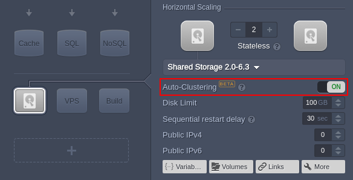

During creation, the GlusterFS volume is mounted into the **/data** folder and is accessible over NFSv4 protocol. Consequently, when [mounting](/mount-points/) from/to your storage cluster, it is managed as a single component (i.e. not a collection of separate storage containers). In case of failure of one or several nodes, the *AutoFS* client automatically switches to the working instances, which ensures HA for your storage.

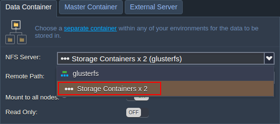

Additionally, within the dashboard, a [dedicated icon and label](#auto-clusters-designation) are provided for your storage auto-cluster.

[More info](/shared-storage-container/)

{}[Back to the top](#back){}

## Kubernetes Cluster

[Kubernetes](https://kubernetes.io/docs/concepts/overview/what-is-kubernetes/) is a portable, extensible, open-source platform for managing containerized workload and services, that facilitates both declarative configuration and automation. It correlates greatly with the platform, allowing to set up applications based on the Kubernetes system directly inside the platform.

Herewith, configuring a Kubernetes system by yourself can be quite a tricky and time-consuming process, so the platform has automated all the required steps in the appropriate ***[Kubernetes Cluster](https://github.com/jelastic-jps/kubernetes)*** package. Being available via the [Marketplace](/marketplace/), the solution can be installed on any platform of 5.4 and higher version in one-click.

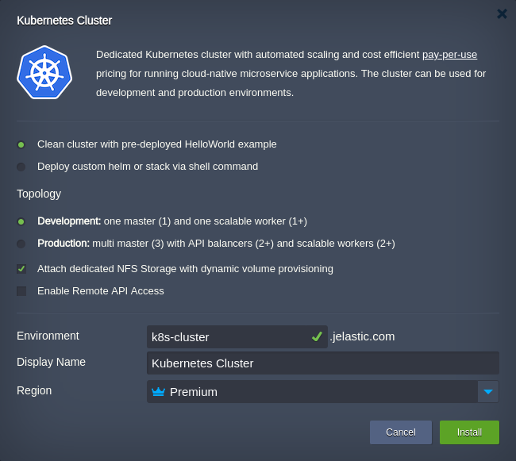

Based on your particular needs, you can customize the following options within the installation frame:

* choose the pre-deployed application
    * *Clean cluster with pre-deployed HelloWorld example*
    * *Deploy custom helm or stack via shell command* - an additional field for your custom code will appear upon selection
* select the preferred topology structure
    * *Development: one master (1) and one scalable worker (1+)*
    * *Production: multi master (3) with API balancers (2+) and scalable workers (2+)*
* enable additional options via appropriate checkboxes
    * *Attach dedicated NFS Storage with dynamic volume provisioning* - adds a Shared Storage into the topology, to use its functionality to serve Kubernetes POD storage requests
    * *Enable Remote API Access* - allows Kubernetes cluster management via API
* define basic options like *Environment* and *Display Name* ([alias](/environment-aliases/)), *[Region](/environment-regions/)* (if available)

Click **Install** after declaring the preferred topology, and the platform will configure everything automatically.

{}**Tip:** More specifics and in-depth description with use case examples are provided in the appropriate **[Kubernetes Cluster](https://www.virtuozzo.com/company/blog/kubernetes-cluster-scaling-pay-per-use-hosting/)** article on our blog.{}

{}[Back to the top](#back){}

## LiteSpeed Software Stacks

[LiteSpeed](https://www.litespeedtech.com/) is a software solution, which offers both advanced performance, latest technologies implementation, and security to suit the most demanding developers. Starting with the current 5.7.2 PaaS release, platform provides integration with the following products:

* *[LiteSpeed Web ADC](https://www.litespeedtech.com/products/litespeed-web-adc)* (load balancer) - a load balancing solution, which not only distribute traffic, but also to make your web server faster due to HTTP/2 & QUIC integration, ESI caching, etc
* *[LiteSpeed Web Server](https://www.litespeedtech.com/products/litespeed-web-server)* (PHP application server) - a lightweight server, which conserves resources without sacrificing performance, security, compatibility, or convenience

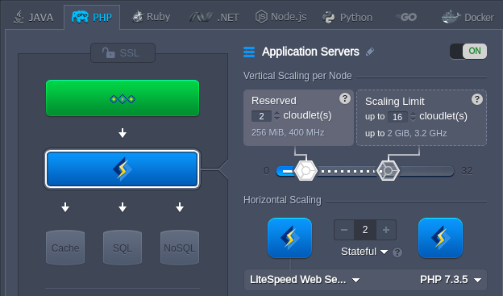

The availability of these software stacks depends on your hosting provider settings (requires a commercial license being purchased) and can be unavailable on your particular platform. Also, if working with the LiteSpeed stacks, you will be charged an additional fee for the above-mentioned license usage. Refer to your hosting provider pricing page for the precise details.

{}[Back to the top](#back){}

## LEMP Software Stack

LEMP is an acronym for a software bundle solution based on the following components: *Linux* operating system, *NGINX* HTTP web server, *MariaDB* database, and *PHP* programming language. This model is a popular choice among developers as it is sufficient to host a wide variety of website frameworks, e.g. *WordPress*.

During the PaaS 5.7.2 development, the appropriate LEMP server was configured and packed into a certified software stack available for installation via the topology wizard. It combines all the above-mentioned components in a single container, making it simultaneously powerful, convenient, and cost-efficient solution. Herewith, the LEMP stack is available on all PaaS installations starting with the current 5.7.2 release.

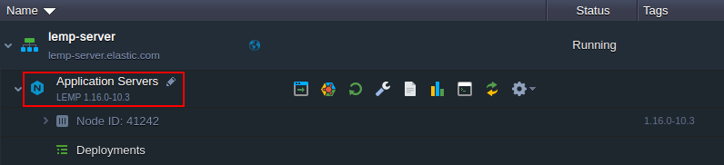

The platform implementation of the server provides the following specifics:

* *MariaDB 10* is used instead of the standard MySQL option
* access to *phpMyAdmin* can be restricted via the ***PHPMYADMIN_ENABLED*** [variable](/environment-variables/)
* an additional *Redis 5* database service is launched by default
* *Redis* databases is accessible without a password but only from within the container (i.e. *localhost*)
* memory distribution between services inside the container can be adjusted up to your needs via the appropriate ***CP_MEM_LIMIT*** (*NGINX*), ***CACHE_MEM_LIMIT*** (*Redis*), ***DB_MEM_LIMIT*** (*MariaDB*) [variables](/environment-variables/):
  * the default values are 50%, 10%, and 40% respectively
  * you can specify units of the provided values: megabytes (*m|mb|M|MB*), gigabytes (*g|gb|G|GB*), or percentages (*%*)
  * if units are omitted, the values are considered as percentages by default

{}**Tip:** If your platform provides [LiteSpeed support](#litespeed-software-stacks), an additional ***LLSMP*** stack (*Linux*, *LiteSpeed*, *MariaDB*, *PHP*) could be available for you.{}

{}[Back to the top](#back){}

## Custom JDK Distributions

In the current 5.7.2 platform release, PaaS integrates several of the most popular JDK distributions. Such custom Java engines are based on the official OpenJDK source code with some vendor-specific customization. All of the adopted distributions are certified by the [Java Community Process](https://en.wikipedia.org/wiki/Java_Community_Process), which verifies these engines are "Java SE compatible" (i.e. meet the Java standards) with the [Technology Compatibility Kit](https://en.wikipedia.org/wiki/Technology_Compatibility_Kit).

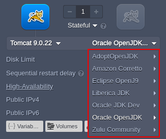

For now, in addition to the already supported **[Oracle JDK Dev](https://www.oracle.com/technetwork/java/javase/downloads/index.html)**, **[Oracle OpenJDK](http://jdk.java.net/)**, and **[Eclipse OpenJ9](https://www.eclipse.org/openj9/)**, the following custom JDK engines are adopted by the platform:

* **[AdoptOpenJDK](https://adoptopenjdk.net/)**
* **[Amazon Corretto](https://aws.amazon.com/corretto/)**
* **[GraalVM CE](https://www.graalvm.org/)** (currently, for *Java Engine* and *Maven* only)
* **[Liberica JDK](https://bell-sw.com/)**
* **[Zulu Community](https://www.azul.com/downloads/zulu/)**

These new distributions are integrated for the *Tomcat*, *TomEE*, *Java Engine*, *Jetty*, *Spring Boot*, and *Maven* Java stacks.

[More info](/java-versions/)

{}[Back to the top](#back){}

## Default Stack Versions

When any software stack is selected within the topology wizard, the platform provides its latest release and, for application servers, engine version by default. Such recommendation helps to ensure that all features are available and the most recent vulnerability fixes are applied. In the current 5.7.2 upgrade, an algorithm for the above-described behavior was improved to detect the newest major release of the stack (previously, switched to the latest minor version of the same major one).

{}**Note:** Based on the particular hosting provider settings, the default version for software stacks could be configured differently.{}

{}[Back to the top](#back){}

## Dashboard Search Amendment (5.7.4)

The [dashboard search](/dashboard-guide/#dashboard-search) for environments is performed via name (domain) and [alias](/environment-aliases/), so starting with the PaaS 5.7.4 release, the search results in the appropriate *Environments* section are provided with both these values. Compared with the initial implementation of just an alias being displayed, the current one helps to avoid confusion in some cases (e.g. when several environments are provided with the same aliases).

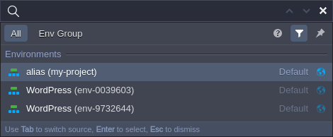

[More info](/dashboard-guide/#dashboard-search)

{}[Back to the top](#back){}

## UI/UX Improvements

* [Auto-Clusters Designation](#auto-clusters-designation)
* [Built-In SSL Description (5.7.4)](#built-in-ssl-description-574)
* [Auto-Clustering Labels (5.7.4)](#auto-clustering-labels-574)
{}[Back to the top](#back){}

### Auto-Clusters Designation

The platform provides an out-of-box [automatic clusterization option](/auto-clustering/) for some of the managed stacks. In the 5.7.2 platform upgrade, a dedicated icon was designed to highlight the use of such solutions within the dashboard. Also, for better designation, the *auto-clustering* label was added to the **Tags** column next to the appropriate layer.

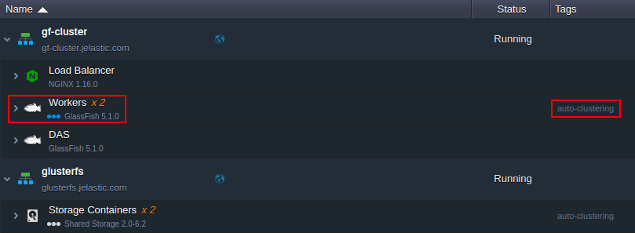

[More info](/auto-clustering/)

{}[Back to the list of UI/UX Improvements](#uiux-improvements){}

### Built-In SSL Description (5.7.4)

The [built-in SSL](/built-in-ssl/) option allows securing your environment with the enterprise-level data encryption as easily as switching a toggle. If enabled, the platform automatically configures a wildcard SSL certificate on the [Shared Load Balancers (SLB)](/shared-load-balancer/).

Herewith, to highlight the incompatibility of such implementation with direct access provided by [public IP](/public-ip/), the appropriate denotation was added to the description in the topology wizard. It will help to avoid misconfigurations when establishing a secure connection to the application.

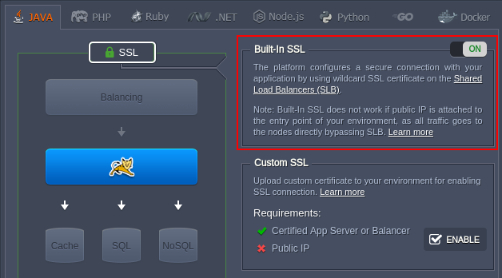

{}**Tip:** If working over public IP, consider utilizing the [Let's Encrypt SSL](https://www.virtuozzo.com/company/blog/free-ssl-certificates-with-lets-encrypt/) (free-of-charge option) to automatically issue certificates for your environment. Alternatively, you can manually provide your [custom SSL](/custom-ssl/) certificates.{}

[More info](/built-in-ssl/)

{}[Back to the list of UI/UX Improvements](#uiux-improvements){}

### Auto-Clustering Labels (5.7.4)

In the current 5.7.4 PaaS release, the "***new***" label for the [auto-clustering](/auto-clustering/) option in the topology wizard was removed for all of the supported stacks by default. Herewith, for the newly implemented clusterization of the [Shared Storage](#glusterfs-storage-with-auto-clustering-574) container, a "***beta***" label was added.

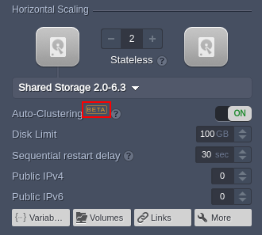

[More info](/auto-clustering/)

{}[Back to the list of UI/UX Improvements](#uiux-improvements){}

## Tasks Duration

The **[Tasks](/dashboard-guide/#tasks-panel)** panel provides information on the activity within the account. It tracks the on-going actions and stores the log of them afterward (with the appropriate task's *Name*, *Date* and resulting *Status* details). For now, this data was extended with an additional column, which shows the ***Duration*** of each performed operation.

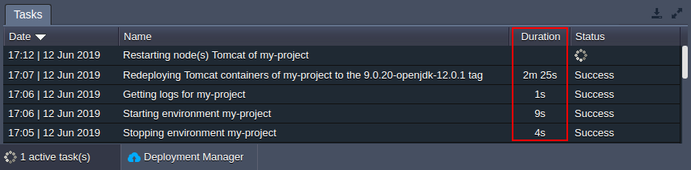

[More info](/dashboard-guide/#tasks-panel)

{}[Back to the top](#back){}

## Custom Container Timeouts (5.7.4)

All of the platform-managed containers are provided with the ***/etc/jelastic/timeouts.conf*** file, which defines timeouts for various management operations on that particular container. The values provided by default are optimal for most solutions. However, to support specific cases (e.g. large *Git* projects, [deployment hooks](/deployment-hooks/) with a slow script, etc.), some adjustments may be required.

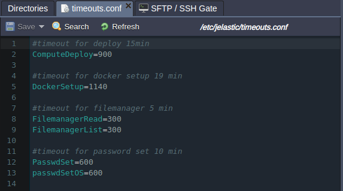

Starting with the 5.7.4 platform upgrade, the ***/etc/jelastic/timeouts.conf*** configuration file became editable, allowing to adjust timeouts for the specific needs (if required). Such a change ensures greater flexibility when managing projects at the platform.

{}[Back to the top](#back){}

## Ruby Rake Deploy Adjustment (5.7.4)

**[Rake](/ruby-post-deploy-configuration/)** is a software task management and builds automation tool for ***Ruby*** used by the platform. It automatically performs commands from the ***rake_deploy*** file (located in the root folder of the project) after the Apache/NGINX server restart. Starting with the current 5.7.4 platform release, the commands from ***rake_deploy*** will be run from under the *jelastic* user instead of the *root* one. Such an adjustment provides better compatibility with projects as it is the default user for all of the Ruby containers.

[More info](/ruby-post-deploy-configuration/)

{}[Back to the top](#back){}

## Deployment Archives Types (5.7.4)

[Archive deployment](/deployment-guide/#archive-deployment-configurations) is a quick and simple option to install your application in the platform. The provided package (either as *local file* or via *URL*) is automatically processed by the platform, making your application available for usage without any manual steps required. A support for the following archive types was added in the PaaS 5.7.4: ***gzip*** (*.gz*, *.tgz*, *.taz*), ***compress*** (*.Z*, *.taZ*), ***bzip2*** (*.bz2*, *.tz2*, *.tbz*, *.tbz2*), ***lzip*** (*.lz*), ***lzma*** (*.lzma*, *.tlz*), ***lzop*** (*.lzo*), ***xz*** (*.xz*), ***zstd*** (*.zst*, *.tzst*).

[More info](/deployment-guide/#archive-deployment-configurations)

{}[Back to the top](#back){}

## Network Labels for Statistics

In the 5.7.2 PaaS release, the labels for the ***Network*** usage in **[Statistics](/view-app-statistics/)** section were updated to explicitly indicate that resource usage is monitored in bytes and not bits. Namely, the previously used denominations (*Gb*, *Mb*, etc.) were replaced with the appropriate new ones (*GB*, *MB*, etc.). The same changes were applied to the tooltip, where additionally, the ***Out. ext. limit*** was adjusted to show the limit in the *Mbps* units.

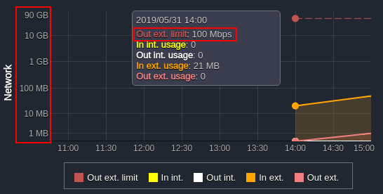

[More info](/view-app-statistics/)

{}[Back to the top](#back){}

## Custom Color for Extra Layer in Topology Wizard (5.7.5)

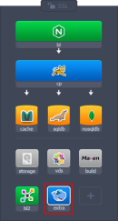

The platform provides a convenient and intuitive [color legend](/container-dns-hostnames/#hostnames-for-specific-layers) for the certified containers based on the ***nodeGroup*** parameter. It helps to determine the role of each stack visually:

* *Load Balancers* ("***bl***") are green
* *Application Servers* ("***cp***" - compute nodes) are blue
* *Databases* and *cache* nodes ("***cache***", "***sqldb***", "***nosqldb***") are orange
* *VPS*, *build*, and *storage* nodes ("***vds***", "***build***", "***storage***") are gray

Herewith, all the custom images are added to the *extra* layers and are gray by default. Starting with the 5.7.5 platform upgrade, it is possible to manually redefine a color for such custom nodes by adding the ***mission*** parameter for [layer](https://docs.cloudscripting.com/creating-manifest/selecting-containers/#all-containers-by-group) in your JPS. Use the highlighted shortcuts from the list above as a value to set the required color.

{}[Back to the top](#back){}

## API Changes

Below, you can find a list of all changes to the public API in the 5.7.2-5.7.5 platform versions (compared to the preceding [5.7](/release-notes-57/) one).
*<u>In the 5.7.4 platform version:</u>*

* the group ***ID*** parameter was added to the response of the ***Environment.GetGroups*** method
* the access level of the ***Scheduler.RemoveTask*** method was changed from public to private

[More info](https://www.virtuozzo.com/application-platform-api-docs/)

{}[Back to the top](#back){}

## Fixes Compatible with Prior Versions

{}
**#**|**Compatible from**|**Description**
---|:---:|---
JE-31234|Any|Unhandled error while deploying *Git-Push-Deploy* add-on with the incorrect *Git Repo Url* or *Token* values
JE-35170|3.3|The Ruby engine version should be dynamically defined when installing the *Redmine* package
JE-37017|3.3|The *404 HTTP Error* when clicking the *Open in Browser* button for the successfully installed *Alfresco* and *Liferay* packages
JE-37656|3.3|Admin panel password is not displayed within the after-installation pop-up and email for the *WildFly Continuous Deployment* package
JE-38760|3.3|The *Alfresco* application should be displayed within the environment deployments list after the appropriate package installation
JE-45117|3.3|The *Auto-Scalable Spring Boot Cluster* package deployment fails due to the *Scheme missing* error
JE-45145|3.3|The *ionCube* add-on does not support the *7.3 PHP* version
JE-45254|3.3|The *Let's Encrypt* add-on cannot be installed on the environment without nodes in the application server or load balancer layers
JE-45322|3.3|Error while uninstalling the *File Synchronization* add-on from the *Shared Storage* node
JE-45345|3.3|Unhandled error while deploying *Redmine* package from the platform Marketplace
JE-45501|3.3|The password for the *Plesk* package should be generated randomly
JE-45732|3.3|The regex validation for the custom domains in the *Let's Encrypt* add-on should allow Punycode
JE-45782|3.3|The slave database cannot be connected after the *PostgreSQL Cluster* package installation
JE-45897|3.3|The *MongoDB Cluster* package should verify the container firewall support for the account before the installation
JE-46056|3.3|The *tar* command should be used by the *Let's Encrypt* add-on when the *zip* one is not available
JE-46099|3.3|The "*Could not find gem roadie-rails (~&gt; 1.1.1)*" error occurs while installing the *Redmine* package
JE-46114|3.3|The *coma*, *comma with space*, and *space* separators should be allowed by the custom domains regex in the *Let's Encrypt* add-on
JE-46285|3.3|The task created by collaborator via the *Env Start/Stop Scheduler* add-on is not removed after uninstalling this add-on as owner
JE-46367|3.3|The *LimeSurvey* application is stuck after the appropriate package installation
JE-46369|3.3|The *Moodle* and *qdPM* packages are not accessible after installation
JE-47264|3.3|An error occurs while installing the *Cyclos 3 CE* package
JE-47299|3.3|The *Rocket.Chat* configuration page cannot be accessed after the package installation
JE-47440|3.3|Timezone is set to *not available* after applying the *TimeZone Change* add-on
JE-47607|3.3|The *Env Start/Stop Scheduler* add-on cannot be removed
JE-47860|3.3|Maven build fails during the installation of the *Spring Boot Fat Jar Builder* package form the Marketplace
JE-37601|4.9.5|Access credentials are not displayed within the success pop-up after the *MariaDB/MongoDB/PostgresDB Cluster* packages installation
JE-41506|5.0|The *Let's Encrypt* add-on should allow up to 100 domains per certificate and provide IDN support
JE-42889|5.0|More details should be provided via email notification after the *Let's Encrypt* add-on update
JE-44933|5.0|SSL certificate added with the *Let's Encrypt* add-on should be successfully updated upon load balancer layer addition/removal
JE-46254|5.0|Prolonged creation and redeployment time for the custom Docker images based on the *Alpine* OS distributions
JE-42653|5.0.5|The list of default PHP modules and their versions should be updated for all of the certified *Apache PHP* containers
JE-45134|5.0.5|The Docker Engine CE package cannot be installed using the *Connect to an existing swarm cluster* option
JE-45430|5.0.5|The */var/log/nginx/php-fpm.log* file should be readable by the default user on the certified *NGINX PHP* containers
JE-45963|5.0.5|The *Let's Encrypt* add-on should be installed successfully for all types of load balancers
JE-46526|5.0.5|The post create operations on the custom Docker images based on the *Alpine* OS distributions should be executed successfully
JE-46716|5.0.5|The */etc/sysconfig/php-fpm* file on the certified *NGINX PHP* containers should be editable
JE-46721|5.0.5|The deployed project is replaced with the default one upon enabling *Auto-Clustering* for the *WildFly* node
JE-47974|5.0.5|The *oauth.so* module is missing on all of the *PHP 5.x* version containers
JE-47975|5.0.5|The *Oracle OpenJDK* distribution should be selected by default for all of the Java stacks
JE-46723|5.0.5|Error while enabling Auto-Clustering for a single WildFly node
JE-40772|5.1|Incorrect behavior of the Java memory agent when JVM creation fails
JE-42069|5.1|The */usr/java/latest* folder should be editable on the certified Java images with *OpenJDK* engine
JE-45292|5.3.2|Load balancer node in the *WildFly Cluster* package should be provided with a custom alias
JE-34393|5.4|Terminated RDP connections to the *Windows-based* nodes should not be stored in the *CLOSE_WAIT* state
JE-35548|5.4|Incorrect admin user password is provided via email after the *WordPress Cluster* installation
JE-37501|5.4|Applications cannot be deployed to the *IIS* server from the archive
JE-40964|5.4|A static cache should be enabled for the *WordPress Cluster* after installation
JE-43168|5.4|Incorrect tags are displayed for the *Apache PHP* application server in the topology wizard
JE-45014|5.4|The *jem compute deploy* command does not work on the *Golang* application server
JE-44766|5.5|The *Let's Encrypt* add-on cannot be updated after transferring environment to another account
{}

{}
**#**|**Compatible from**|**Description**
---|:---:|---
JE-45598|3.3|Application cannot be installed via the *Deploy Stack YML* option of the *Docker Swarm Cluster* solution, if the target file is located in the GitHub project subdirectory
JE-48638|5.0.5|Variables with spaces in the value are processed incorrectly on the *NodeJS* application servers
{}

{}
**#**|**Compatible from**|**Description**
---|:---:|---
JE-49088|3.3|The *FTP Users* add-on cannot be installed for the *Shared Storage* node
JE-49120|3.3|The *Magento Standalone* package cannot be installed on some of the PaaS installations
JE-49243|4.9.5|Incorrect version is selected by default for the *Eclipse Che* package
{}

{}[Back to the top](#back){}

## Software Stack Versions

Check out the list of the most accurate software stacks for the current platform version:

|Stack|PaaS 5.7.2-5.7.5|
|---|---|
|*Apache Balancer*|2.4.37|
|*Apache PHP*|2.4.37|
|*Apache Python*|2.4.37|
|*Apache Ruby*|2.4.37|
|*CentOS (VPS)*|7.6|
|*Couchbase CE*|5.1.1; 6.0.0|
|*Debian (VPS)*|9.8|
|*Docker Engine CE*|17.12; 18.09.7; 19.03.1|
|*GlassFish*|3.1.2.2; 4.1.2; 5.1.0|
|*Golang*|1.12.6|
|*HAProxy*|1.9.7; 2.0|
|*IIS*|8|
|*Jetty*|9.4.12|
|*Kubernetes*|1.15.0|
|*LiteSpeed Web ADC*|2.4|
|*LiteSpeed Web Server*|5.3.8|
|*MariaDB*|5.5.64; 10.4.6|
|*Maven*|3.6.1|
|*Memcached*|1.5.16|
|*MongoDB*|2.6.12; 3.6.13; 4.0.10|
|*MSSQL*|2012|
|*MySQL CE*|5.7.26; 8.0.16|
|*NGINX Balancer*|1.16.0|
|*NGINX PHP*|1.14.2|
|*NGINX Ruby*|1.14.2|
|*NodeJS*|6.17.1; 8.16.0; 9.11.2; 10.16.0; 11.15.0; 12.4.0|
|*Payara*|4.1.2.181; 5.184|
|*Percona*|5.6.6.44; 5.7.26|
|*PostgreSQL*|9.6.14; 10.9; 11.4|
|*ProxySQL*|1.4.13|
|*Redis*|4.0.11; 5.0.5|
|*Shared Storage*|2.0-6.3|
|*Spring Boot*|2|
|*Tomcat*|7.0.94; 8.5.43; 9.0.22|
|*TomEE*|7.1.0|
|*Ubuntu (VPS)*|16.04; 18.04|
|*Varnish*|4.1.8; 5.2.1; 6.2.0|
|*WildFly*|10.1.0; 11.0.0; 12.0.0; 13.0.0; 14.0.1; 15.0.1; 16.0.0; 17.0.1|
|*Windows (VPS)*|2012|

|Engine|#|
|---|---|
|*AdoptOpenJDK*|8.0_212; 9.0.4; 10.0.2; 11.0.3; 12.0.1|
|*Amazon Corretto*|8.212.04.2; 11.0.3.7.1|
|*Eclipse OpenJ9*|0.9.0-9.0.4.12; 0.9.0-10.0.2; 0.11.0-8u192-b12; 0.11.0-11.0.1|
|*GraalVM CE*|19.0.0|
|*Liberica JDK*|8.0_212; 11.0.3; 12.0.1|
|*Oracle JDK Dev*|7.0_79; 8.0_202; 9.0.4; 10.0.2; 11.0.2|
|*Oracle OpenJDK*|7.0_211; 8.0_212; 10.0.2; 11.0.2; 12.0.1; 13.ea-b26|
|*Zulu Community*|8.0_212; 11.0.3; 12.0.1|
|*PHP 5*|5.3.29; 5.4.45; 5.5.38; 5.6.40|
|*PHP 7*|7.0.33; 7.1.30; 7.2.19; 7.3.6|
|*Ruby*|2.3.8; 2.4.6; 2.5.5; 2.6.3|
|*Python 2*|2.7.16|
|*Python 3*|3.4.10; 3.5.7; 3.6.9; 3.7.4|
|*Node.js*|6.17.1; 8.16.0; 9.11.2; 10.16.0; 11.15.0; 12.4.0|
|.*NET*|4|
|*Go*|1.12.6|

{}[Back to the top](#back){}

## Bug Fixes

In the table below, you can see the list of bug fixes applied to the platform starting from PaaS 5.7.2-5.7.5 releases:

{}
**#**|**Description**
---|---
JE-7179|The *user-agent* and *accept-language* header should be removed from the session
JE-30241|Prolonged captions for the fields are displayed incorrectly within the package installation frame
JE-31425|Unhandled error while deploying an unsupported project to the *IIS* server
JE-36238|The "*Environment group 'My First Project' already exists*" error occurs on the first login to the dashboard
JE-39709|The "*java.lang.NullPointerException*" error occurs upon cloning environment
JE-41727|Error while closing the *Web SSH* tab before the connection is established
JE-42460|The "*java.lang.NullPointerException*" error occurs upon deploying an application from archive
JE-44159|An error occurs while installing JPS application
JE-44802|The "*domain not available*" error occurs while installing JPS application
JE-46319|Error when uninstalling several add-ons simultaneously
JE-46373|Unhandled error upon installing JPS manifest with invalid metadata
JE-46511|The *VCS* project cannot be updated or removed after scaling with *stateless* mode
JE-46648|The default value for the disableInactive CS parameter should be true
JE-46809|Different SSL certificates for the environment and layer hostnames
JE-46997|Error while deploying into some legacy containers
JE-47047|The "*java.lang.NullPointerException*" error occurs upon changing the public IPs count
JE-47090|Error after the cloning operation if logged in via several browsers simultaneously
JE-47372|Environment layers should be grouped under the same record within the drop-down list in the *add volume* wizard section
JE-47408|The "*Cannot read property 'options' of undefined*" error occurs while scaling out *GlassFish Cluster*
JE-47438|Firewall rules should not be available for the *Windows-based* nodes
JE-47460|The Docker image search section should not be displayed for the already created nodes in topology wizard
JE-47487|The drop-down list should be displayed for the *Repository* field in the *Edit Project* window instead of the edit button
JE-47504|Drop-down lists in the CS forms should be rendered to the top if there is not enough space below
JE-47517|The "*java.lang.NullPointerException*" error occurs upon trying to *View Invoices*
JE-47532|The "*Cannot read property 'className' of undefined*" error occurs while working with the *Tasks* panel in the dashboard
JE-47539|An environment with Elastic VPS node cannot be migrated to the different region
JE-47561|Incorrect spacing in emails received after packages installation from Marketplace
JE-47562|A container cannot be restored from its redeployment backup
JE-47565|Incorrect spacing for the default region icon in the dashboard search list
JE-47621|The "*java.lang.NullPointerException*" error occurs upon creating an environment with the *Memcached* node
JE-47775|Unhandled error when trying to edit a deleted firewall rule
JE-47842|A warning should be displayed in the topology wizard when adding the *Docker Engine CE* stack, but it cannot be installed in the currently selected region
JE-47863|The "*java.lang.NullPointerException*" error occurs upon trying to disable a deleted firewall rule
JE-47865|The "*Cannot read property 'indexOf' of undefined*" error occurs while updating account balance
JE-47869|The "*Cannot read property 'onIconClsChange' of undefined*" error occurs while working in the dashboard
JE-47872|The "*Cannot read property 'dom' of undefined*" error occurs while working with the *Statistics* panel in the dashboard
JE-47873|The "*Cannot read property 'data' of undefined*" error occurs while uploading archives to the *Deployment Manager*
JE-47874|The "*Cannot read property 'status' of undefined*" error occurs while installing JPS application
JE-47875|The "*TypeError: null is not an object*" error occurs while working in the dashboard
JE-47876|The *OpenJ9* Java engine name is displayed incorrectly in the topology wizard
JE-47889|The "*Cannot read property 'stopEditing' of undefined*" error occurs while running the platform tutorial after removing the default *HelloWorld* archive
JE-47890|The "*Cannot read property 'result' of undefined*" error occurs while working with Web SSH
JE-47920|The "*Cannot read property 'on' of undefined*" error occurs while creating a new environment
JE-47923|The "*Cannot read property 'getEl' of undefined*" error occurs while installing JPS application
JE-47924|The "*Cannot read property 'GetAppByName' of undefined*" error occurs while installing an application from Marketplace
JE-47926|The "*Cannot read property 'events' of undefined*" error occurs while working in topology wizard
JE-47982|An error should be displayed when trying to redeploy a locked container
JE-47984|Error during redeploy due to missing packages on the custom Docker containers
JE-48059|Incorrect documentation link within the *SFTP / SSH Gate* sections of the dashboard
JE-48175|Environment information is not updated within the dashboard after migration to another region
JE-48269|Unhandled error when trying to mount a directory from the custom Docker container based on the *Alpine* OS
JE-48312|*Web SSH* connection is lost during switching between nodes
JE-48313|DNS records for the Elastic VPS nodes should be correctly restored after awakening from hibernation and completely cleaned after environment removal
JE-48352|Files added via image unpack should override the symlinks on the container
{}

{}
**#**|**Description**
---|---
JE-48476|An error occurs when accessing the *Collaboration* section from the environment *Settings*
{}

{}
**#**|**Description**
---|---
JE-40867|The *screen* utility should be operable on the containers when working over SSH
JE-44616|Collaborators with the *view* permissions should not be able to create, edit, and delete files of the shared environment
JE-45315|Environment owner's quotas are not transferred when collaborator shares the environment shared to him
JE-45577|The *Billing History* icon for the environments is not centered vertically correctly
JE-47049|If specified, environment alias should be displayed instead of the environment name
JE-47374|*Auto Horizontal Scaling* actions are not displayed in the *Event History* section of the environment settings
JE-47785|Error when trying to install the *cocorico* custom Docker image
JE-48015|The *network start* operation fails on the *alpine-based* custom Docker images if the *openrc* package is installed
JE-48171|Custom Docker containers based on the *Alpine:3.10* image cannot be created
JE-48183|Incorrect spacing for the *SSL* section in the environment topology wizard
JE-48363|The layer name edit field in the topology wizard is displayed incorrectly when a prolonged caption is provided
JE-48404|The "*TypeError: m is null*" error occurs while opening a context via the dashboard
JE-48409|An error occurs while resizing browser window during the provision of the *User Settings &gt; Access Tokens &gt; Generate Token &gt; Expires At* data
JE-48726|External IP addition via API methods ignores account restrictions
JE-48731|The "*permission denied*" error occurs for the *rake_deploy.log* file during the *Redmine* installation
JE-48783|The *X-Forwarded-Port* header isn't transferred from Shared Load Balancer to the environments without public IP address attached
JE-48784|Icon for the shared environment is displayed incorrectly within the dashboard
{}

{}
**#**|**Description**
---|---
JE-48998|Incorrect container name after redeploy
JE-49060|After endpoint removal, connection remains available for a few minutes
JE-49103|Events filtering by *nodeGroupAlias* does not work in Cloud Scripting
JE-49131|The *settings* and *globals* placeholders don't work with *nodeGroupAlias* in Cloud Scripting
JE-49199|Iptables rules are removed incorrectly for endpoints
JE-49251|Stack colors in the left and central parts of the topology wizard do not match
JE-49268|Collaborator should be able to create an environment on another account in the regions of the environment owner
JE-49308|An incorrect home directory is set when the *rake_deploy* file is executed on the *Ruby* environments
{}

{}[Back to the top](#back){}