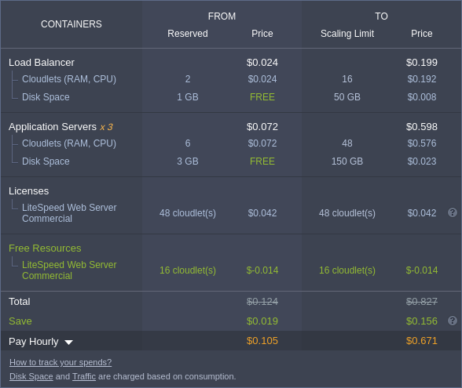
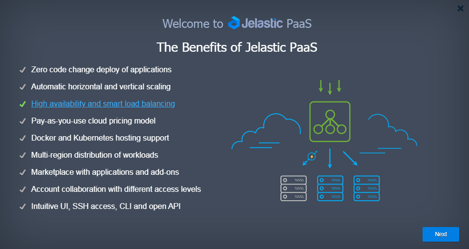
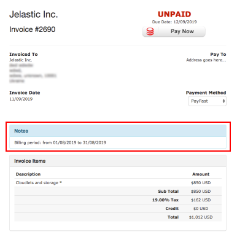
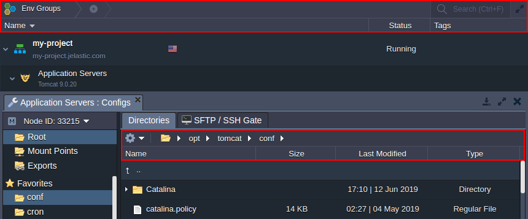
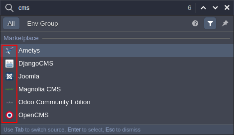

# Virtuozzo Application Platform 5.7.7

*This document is preliminary and subject to change.*

In this document, you will find all of the new features, enhancements and visible changes included to the **PaaS 5.7.7** release.

{}
{}
## Licenses Cost in Topology Wizard
Included license price to the *Estimated Cost* section in the topology wizard
{} 

{}
## Redeploy with Automatic Rollback from Snapshot
A new revision of the *container redeploy* feature, which significantly enhances operation speed and reliability
{}
{}

{}
{}
## Welcome Tutorial Update
Updated a list of the central platform features and renewed their appropriate illustrations
{}

{}
## Supported OS Distribution Revision
Ceased the support of the *Fedora-based* OS templates
{}

{}
## Invoiced Period for Post Payment User Groups
Added denotation about billing period to the post payments invoices
{}

{}
## Dashboard Headers Restyle
New modern style for the section's headers in the dashboard
{}

{}
## Icons for Marketplace Solutions in Dashboard Search
Marketplace packages located through the dashboard search are provided with their respective icons
{}

{}
## Software Stack Versions
Actualized list of supported OS templates and software stack versions
{}
{}

{}
{}
## GlusterFS Mount Timeout
Providing custom mount timeout for the *autofs* daemon when working with the *GlusterFS* cluster
{}

{}
## Fixes Compatible with Prior Versions
Bug fixes implemented in the current release and integrated to the previous platform versions through the appropriate patches
{}

{}
## Bug Fixes
List of fixes applied to the platform starting from the current release
{}
{}

## Licenses Cost in Topology Wizard
Starting with the current 5.7.7 PaaS release, the *Estimated Cost* section of the topology wizard was updated to consider and display details on the license price of the used stacks. Such a change allows providing better support of the recently added **[LiteSpeed Web Server](/litespeed-web-server)** and **[Web ADC](/litespeed-web-adc)** servers. Herewith, the license price of any other software stack will be displayed in the topology wizard as well.

Also, some other adjustments were provided for the *Estimated Cost* section to make it cleaner and more intuitive. For example, free resources and savings highlighting, pay period switcher, additional explanatory notes.{}[Back to the top](#back){}

## Redeploy with Automatic Rollback from Snapshot
In the present 5.7.7 release, a new revision of the [redeploy](/container-redeploy) feature is introduced. Compared to the [previous implementation](/release-notes-56#container-redeploy), it implements multiple optimizations, which result in the following benefits:

* Due to the optimization of the flow, a copy of all the custom data won't be created anymore. Thus, the operation speed is significantly enhanced, especially for big containers with lots of data.
* The redeploy actions are performed on the snapshot, which is discarded upon failure or merged upon success. Such a flow significantly boosts the reliability level of the container update operation.
* Multiple internal operations are omitted in the new algorithm, boosting the effectiveness and reliability (due to the lower number of failure points) of the redeploy operation even further.

As a result of these changes, the reliability level was considered sufficient to deprecate the *redeploy backups* option.

[More info](/container-redeploy){}[Back to the top](#back){}

## Welcome Tutorial Update

The platform [welcome tutorial](/welcome-tutorial) is a short presentation on the PaaS features and an interactive guide, which shows how to create an environment and deploy an application. It automatically starts on the very first login to the dashboard and can be manually called via the **Help &gt; Tutorial** menu. In the current 5.7.7 PaaS release, a list of the central platform features for the tutorial was updated and provided with the renewed illustrations.

[More info](/welcome-tutorial){}[Back to the top](#back){}

## Supported OS Distributions Revision

In the present 5.7.7 PaaS release, a [list of supported OS distributions](/docker-supported-distributions) for containers was actualized. Namely, the no-longer supported *Fedora-based* templates were removed. To run custom Docker containers based on the distributions that are not listed in the linked documentation, please [contact us](https://jelastic.com/contact/) to negotiate the appropriate OS support.

[More info](/docker-supported-distributions){}[Back to the top](#back){}

## Invoiced Period for Post Payment User Groups
Based on the particular service hosting provider settings, some customers can be charged based on the *post payment* approach. Namely, the platform can be used without restriction, but at the end of the month, an invoice for all the consumed resources will be sent. Starting with the present 5.7.7 PaaS release, such a charge additionally includes information on the billing period.

{}[Back to the top](#back){}

## GlusterFS Mount Timeouts

Due to the recently implemented *[GlusterFS storage with Auto-Clustering](/release-notes-572#storage-auto-clustering)*, the mount timeout for the *autofs* daemon was set to three seconds to ensure quick failover. Herewith, such a value is too low when working with the regular [Shared Storage](/shared-storage-container) and may cause errors. In the current 5.7.7 PaaS release, the algorithm for this timeout configuration was optimized to support both cases.

The new implementation sets the timeout in the ***/etc/autofs.conf*** file to *300* seconds by default. Then, in case a mount point from the GlusterFS node is created, the platform automatically switches the value to *three* seconds on the appropriate container.

[More info](/auto-clustering#shared-storage){}[Back to the top](#back){}

## Dashboard Headers Restyle
A new style was implemented for the headers of the different dashboard sections in the present 5.7.7 platform release. The updated view (e.g. elements and their separators color) is smoother and fits better with the latest dashboard visual scheme. Also, the styles for menus in tool panels were adjusted to ensure the correct display of the icons upon selecting a particular item.

[More info](/dashboard-guide)
{}[Back to the top](#back){}

## Icons for Marketplace Solutions in Dashboard Search

The **[Dashboard Search](/dashboard-guide#search-bar)** is a powerful tool that allows locating the required elements quickly. Among other possibilities, it can look for the pre-packaged solutions from the [platform Marketplace](/marketplace). Starting with the present 5.7.7 release, the packages discovered through the dashboard search are provided with their respective icons to improve applications' recognition.

[More info](/dashboard-guide#search-bar)

{}[Back to the top](#back){}

## Fixes Compatible with Prior Versions

Below, you can find the fixes that were implemented in PaaS 5.7.7 release and also integrated into previous platform versions by means of the appropriate patches.

{}
**#**|**Compatible from**|**Description**
---|---|---
JE-49488|3.3|The *Let's Encrypt* add-on cannot replace *envDomain* correctly for nodes with HTTPS protocol in URL
JE-31154|4.10|Error when reinstalling *Let's Encrypt* add-on on the environment after removal
JE-49595|5.6|Alpine-based custom Docker containers cannot be redeployed to the tags based on the *Debian 9* OS template
JE-50062|5.7.2|The *autofs* package (required to create mount points) cannot be installed on containers based on *Debian 10*
{}{}[Back to the top](#back){}

## Software Stack Versions

Check out the list of the most accurate software stacks for the current platform version:

|Stack|PaaS 5.7.7|
|---|---|
|*Apache Balancer*|2.4.41|
|*Apache PHP*|2.4.41|
|*Apache Python*|2.4.41|
|*Apache Ruby*|2.4.41|
|*CentOS (VPS)*|7.6|
|*Couchbase CE*|5.1.1; 6.0.0|
|*Debian (VPS)*|9.11; 10.0|
|*Docker Engine CE*|17.12; 18.09.7; 19.03.2|
|*GlassFish*|3.1.2.2; 4.1.2; 5.1.0|
|*Golang*|1.12.10; 1.13.1|
|*HAProxy*|1.9.7; 2.0.5|
|*IIS*|8|
|*Jetty*|9.4.12|
|*Kubernetes*|1.15.5|
|*LiteSpeed Web ADC*|2.5.1|
|*LiteSpeed Web Server*|5.4.1|
|*MariaDB*|5.5.65; 10.4.8|
|*Maven*|3.6.2|
|*Memcached*|1.5.19|
|*MongoDB*|2.6.12; 3.6.13; 4.0.10|
|*MSSQL*|2012|
|*MySQL CE*|5.6.45; 5.7.27; 8.0.17|
|*NGINX Balancer*|1.16.1|
|*NGINX PHP*|1.16.1|
|*NGINX Ruby*|1.16.1|
|*NodeJS*|6.17.1; 8.16.1; 9.11.2; 10.16.3; 11.15.0; 12.9.0|
|*Payara*|4.1.2.181; 5.192|
|*Percona*|5.6.6.44; 5.7.26|
|*PostgreSQL*|9.6.15; 10.9; 11.5; 12.0|
|*ProxySQL*|1.4.13|
|*Redis*|4.0.11; 5.0.5|
|*Shared Storage*|2.0-6.5|
|*Spring Boot*|2|
|*Tomcat*|7.0.96; 8.5.45; 9.0.24|
|*TomEE*|7.1.0; 8.0.0|
|*Ubuntu (VPS)*|16.04; 18.04|
|*Varnish*|4.1.8; 5.2.1; 6.3.0|
|*WildFly*|10.1.0; 11.0.0; 12.0.0; 13.0.0; 14.0.1; 15.0.1; 16.0.0; 17.0.1|
|*Windows (VPS)*|2012|

{}
|Engine|#|
|---|---|
|*AdoptOpenJDK*|8.0.222; 9.0.4; 10.0.2; 11.0.4; 12.0.2|
|*Amazon Corretto*|8.222.10.1; 11.0.4.11.1|
|*Eclipse OpenJ9*|0.9.0-9.0.4.12; 0.9.0-10.0.2; 0.11.0-8u192-b12; 0.11.0-11.0.1; 0.15.1-8u222-b10; 0.15.1-11.0.4; 0.15.1-12.0.2|
|*GraalVM CE*|19.1.1; 19.2.0|
|*Liberica JDK*|8.0.222; 11.0.4; 12.0.2|
|*Oracle JDK Dev*|7.0_79; 8.0_202; 9.0.4; 10.0.2; 11.0.2|
|*Oracle OpenJDK*|7.0.231; 8.0.222; 10.0.2; 11.0.4; 12.0.2; 13.ea-b33; 14.ea-b14|
|*Zulu Community*|7.0.232; 8.0.222; 11.0.4; 12.0.2|
|*PHP 5*|5.3.29; 5.4.45; 5.5.38; 5.6.40|
|*PHP 7*|7.0.33; 7.1.32; 7.2.22; 7.3.9|
|*Ruby*|2.3.8; 2.4.9; 2.5.7; 2.6.5|
|*Python 2*|2.7.17|
|*Python 3*|3.4.10; 3.5.7; 3.6.9; 3.7.5; 3.8.0|
|*Node.js*|6.17.1; 8.16.1; 9.11.2; 10.16.3; 11.15.0; 12.9.0|
|.*NET*|4|
|*Go*|1.12.10; 1.13.1|
{}

{}[Back to the top](#back){}

## Bug Fixes

In the table below, you can see the list of bug fixes applied to the platform starting from PaaS 5.7.7 release:

{}
**#**|**Description**
---|---
JE-28961|Unhandled error when selecting a *Windows-based* node as an NFS server for a mount point
JE-29661|Multiple services cannot be started on the *phusion/baseimage* Docker container
JE-29988|Custom SSL operations log two responses into the *jem.log* file
JE-35395|Public IP cannot be detached on accounts without access to the appropriate feature
JE-36785|Upload of the encrypted SSL keys should be restricted
JE-42116|SSL cannot be installed on the old *NodeJS* containers
JE-43821|The availability of the *mountd* procedure should be verified before mounting from external storage
JE-45734|Error when mounting from the external storage, which allows the whole network
JE-45992|Redeployment fails for containers with a huge number of files in volumes
JE-46322|Rename of the ROOT context should be prohibited on the *Java Engine* and *Spring Boot* stacks
JE-47294|Incorrect *width* is set by default for *slider* defined via Cloud Scripting
JE-47295|The *useTips* parameter does not work for *slider* defined via Cloud Scripting
JE-47647|Logs list is not refreshed via the dashboard when tailing any log file
JE-47815|Error when creating or scaling custom Docker containers based on the *Alpine* image
JE-47993|The *showIf* parameter does not work for *checkbox* defined via Cloud Scripting
JE-48181|Incorrect text in the* Custom SSL* section of the environment settings
JE-48308|Unhandled error when trying to swap domains for the environment with public IP attached not to all nodes within the load balancer layer
JE-48407|The "*Cannot read property 'archivename' of null*" error occurs while deleting the application context
JE-48488|The *Last Used* value in the dashboard is not updated for the personal access tokens
JE-48800|The expiration date is the same for all activation keys of a single account
JE-48817|Incorrect nesting for *Node.js* in the *Extra* layer of the topology wizard
JE-48977|The *default* parameter does not work for *slider* defined via Cloud Scripting
JE-49101|Custom Docker container creation fails for some OS versions
JE-49179|The cached Docker image manifest should be updated before redeploy
JE-49209|The "*java.lang.NullPointerException*" error occurs upon installing *FTP* add-on
JE-49265|Actions from the *Additionally* drop-down menu are performed for the hovered over element
JE-49437|The *envName* alias does not work for some of the API methods
JE-49482|Error while attaching add-on via the *AttachAddon* Cloud Scripting method
JE-49589|Access to the *run.log* file is denied on the containers created with the "*startService: false*" option
JE-49597|Error when creating the *screen* session on the container
JE-49603|Error while undeploying context via SSH if it was previously deployed-undeployed via the dashboard
JE-49606|The "*java.lang.NullPointerException*" error occurs upon removing the mount point
JE-49631|CLI methods for the *Custom SSL* operations do not work
JE-49686|The "*java.lang.NullPointerException*" error occurs upon installing JPS package
JE-49734|Error when accessing node via *Web SSH*
JE-49742|Error when cloning node
JE-49771|Symlink to the *resolv.conf* file is missing on containers, which are created based on the *Ubuntu 18.04* OS template
JE-49776|Error when adding mount point on the *Storage* node
JE-49797|Containers with a huge number of cloudlets cannot be created
JE-49999|The slow connection between nodes over NFS
{}

{}[Back to the top](#back){}