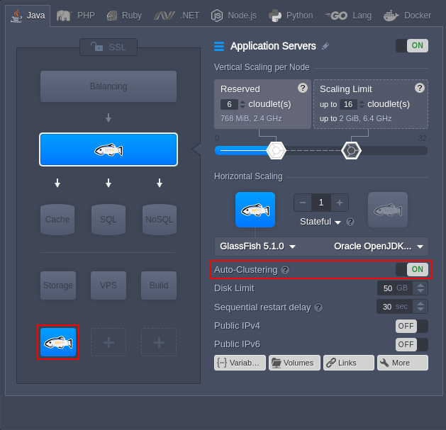

# Virtuozzo Application Platform 5.8

*This document is preliminary and subject to change.*

In this document, you will find all of the new features, enhancements and visible changes included to the **PaaS 5.8** release.

{}

{}
## New Tasks Panel
Reworked *Tasks Panel* in the dashboard to integrate additional tracking and troubleshooting features on top of a new modern design
{}

{}
## Extra Layers for Auto-Clustering in Topology Wizard
Added ability to preview additional nodes that will be created upon enabling template auto-clustering
{}

{}
## Dashboard Icons Optimization
Converted dashboard icons and stack logos to *SVG* format to get crisp, clear, and lightweight images
{}

{}
## Cloud Scripting Improvements
* added nesting support for the <a href="https://docs.cloudscripting.com/creating-manifest/visual-settings/#supported-fields" target="_blank">*ShowIf*</a> parameter, allowing using them one inside another
* added *minWidth* (button's minimum width) and *menu* (drop-down list for multiple actions) parameters for add-ons [custom buttons](https://docs.cloudscripting.com/creating-manifest/visual-settings/#custom-buttons)
{}
{}

{}
{}
## Container Provisioning Optimization
Improved container provisioning flow to decrease certified containers delivery time
{}
 
{}
## SSH Connection Security
Optimized SSH-related configs, ceased weak encryption algorithms support, and removed default SSH keys that are less than *2048* bits
{}

{}
## Redeploy Error Messages Review
Reviewed error messages related to container redeploy to improve existing notifications and clean up deprecated ones
{}

{}
## API Changes
Listed all the changes to the public platform API in the current release
{}

{}
## Software Stack Versions
Actualized list of supported OS templates and software stack versions
{}
{}

{}
{}
## Scaling Limit Reduction Adjustment
Added obligatory restart of the container(s) to correctly apply the new values upon decreasing the number of flexible cloudlets
{}

{}
## Fixes Compatible with Prior Versions
Bug fixes implemented in the current release and integrated to the previous platform versions through the appropriate patches
{}

{}
## Bug Fixes
List of fixes applied to the platform starting from the current release
{}
{}

## Container Provisioning Optimization

In the present 5.8 PaaS release, the container provisioning process was reviewed to boost the delivery time. Namely, the base OS image was cleaned up, making templates more lightweight (approximately 150MB less), and optimized, decreasing the number of after-creation adjustments. As a result, all Jelastis-managed containers are created up to two times faster (e.g. for Apache PHP) without any loss in functionality.

{}The exact impact depends on multiple factors, including stack template, platform configuration, and hardware. In general, the creation of new containers should be at least *50%* faster.{}

{}[Back to the top](#back){}

## New Tasks Panel

The **[Tasks panel](/dashboard-guide/#tasks-panel)** was completely redesigned to make this tool more modern and feature-rich. Among the UI changes, operation status details were moved to the start of each task and adjusted to use the following labeling: *spinner* (in progress), *green* (success) or *red* (error) dot. Additionally, a custom status icon is displayed for the actions performed by [collaborators](/account-collaboration/). Also, the operation target environment is now displayed in a separate column for better clarity.

Featurewise, almost each task can be expanded to get detailed information on the action parameters and server response, which is especially useful for error troubleshooting. Also, a second **Active Log** tab (opens upon clicking on the *magnifying glass* icon) was added to view all the actions performed on the account, i.e. not just recent ones. This new tab is supplemented with the built-in search and filter (error only and by date) options for quick and convenient activity analysis.

[More info](/dashboard-guide/#tasks-panel)

{}[Back to the top](#back){}

## Extra Layers for Auto-Clustering in Topology Wizard

Starting with the present 5.8 PaaS upgrade, the [auto-clustering](/auto-clustering/) feature activation in the topology wizard will explicitly display any extra nodes that will be added due to cluster configuration. For example, **Auto-Clustering** for the GlassFish application server creates the DAS node, which for now, will be displayed in the appropriate extra layer of the topology wizard. Such a change allows achieving transparency when working with templates auto-clustering.

Also, in the confines of this improvement, the highlighting of the fields that do not satisfy auto-clustering feature requirements (e.g. due to account limits) was implemented. Hover over the appropriate *cloudlets*, *node count*, *public IP*, *Auto-Clustering* fields in the topology wizard for additional details.

[More info](/auto-clustering/)

{}[Back to the top](#back){}

## SSH Connection Security

The platform considers security to be one of the priority points of the platform and, thus, regularly implements all the necessary updates and vulnerability fixes. In confines of the current platform upgrade, SSH connection to containers (including [SSH Gate](/ssh-gate/)) was improved through several configuration adjustments:

* The default host keys are removed from the container during creation, ensuring that keys from the appropriate Docker image are used. If there aren't any, they will be generated automatically.
* The configs of the containers are automatically adjusted to disable the ***ChallengeResponseAuthentication*** and ***AllowTcpForwarding*** settings. Also, the support of some weak server-to-client encryption algorithms is removed. The list of allowed ciphers is set to *chacha20-poly1305\@openssh.com*, *aes128-ctr*, *aes192-ctr*, *aes256-ctr*, *aes128-gcm\@openssh.com*, *es256-gcm\@openssh.com*.
* Within the certified containers, all the keys in the **/etc/ssh/moduli** directory that are less than *2048* bits are automatically removed during container setup.

[More info](/ssh-access/)

{}[Back to the top](#back){}

## Dashboard Icons Optimization

In the current 5.8 PaaS release, all the icons utilized in the platform [dashboard](/dashboard-guide/) were converted from the PNG to SVG format. SVG (Scalable Vector Graphics) is a vector image file format, which is drawn from the mathematically declared shapes and curves. Compared to the previously used PNG, which is made up of a fixed number of pixels (raster image), SVG remains crisp and clear for all resolutions and sizes.

Additionally, the SVG format is better suited for the icons and logos, as they are relatively simple (i.e. fewer details than in photographic images), which makes them more lightweight compared to the similar PNG images. In such a way, alongside the better visual, the improvement also slightly boosts the dashboard loading time.

{}**Note:** Some of the new icons and logos may not be the exact copies of the previously used images.{}

[More info](/dashboard-guide/)

{}[Back to the top](#back){}

## Scaling Limit Reduction Adjustment

In the present 5.8 PaaS release, an obligatory container restart was implemented for the case of decreasing the scaling limit (i.e. the number of the dynamic cloudlets) on the existing nodes. This operation is required to set a new amount of allocated resources correctly. For better awareness, such necessity will be indicated directly in the topology wizard through the appropriate icon (hover over for details) and additional confirmation upon changes appliance.

{}**Note:** The logic for increasing the cloudlets count remains the same - restart is required for the application, database, and cache servers only.{}

[More info](/automatic-vertical-scaling/)

{}[Back to the top](#back){}

## Redeploy Error Messages Review

Due to the recent implementation of the new [container redeploy](/release-notes-577/#redeploy-with-automatic-rollback-from-snapshot) version, all the relevant error messages were thoroughly reviewed to get rid of the deprecated, update existing, and add new ones. For now, error texts displayed in the dashboard notifications and stored within the appropriate container log files are more precise (i.e. provide better clarity), which helps to troubleshoot redeployment issues faster.

[More info](/container-redeploy/)

{}[Back to the top](#back){}

## API Changes

Below, you can find a list of all changes to the public API in the 5.8 platform version (compared to the preceding [5.7.2-5.7.5](/release-notes-572/#api-changes) ones):

* added IPv6 support for the ***<a href="https://docs.jelastic.com/api/#!/api/environment.Binder-method-SwapExtIps" target="_blank">SwapExtIps</a>*** method, allowing containers to exchange such addresses, as well as swap IPv4 with IPv6
* added information about the environment region to the response of the ***<a href="https://docs.jelastic.com/api/#!/api/environment.Control-method-GetEnvs" target="_blank">getEnvs</a>*** and ***<a href="https://docs.jelastic.com/api/#!/api/environment.Control-method-GetEnvInfo" target="_blank">getEnvInfo</a>*** API methods
* changes to the *[marketplace.jps](https://docs.jelastic.com/api/#!/api/marketplace.Jps)* service API:
    * a new ***ExecuteAppAction*** method was added
    * a new ***GetEngineVersion*** method was added
    * a new ***Uninstall*** method was added
    * a *token* alias was added for the *session* parameter of the ***Install*** and ***GetScriptingAppid*** methods
* changes to the *[environment.tracking](https://docs.jelastic.com/api/#!/api/environment.Tracking)* service API:
    * the *actionTypes* optional parameter was added to the ***GetUidActions*** method
    * a new ***SearchActions*** method was added

Also, to provide better clarity, the execution of the ***Install***, ***ExecuteAppAction***, ***Uninstall*** methods (the *marketplace.jps* service) is now logged in the [tasks panel](#new-tasks-panel) of the dashboard.

[More info](https://www.virtuozzo.com/application-platform-api-docs/)

{}[Back to the top](#back){}

## Fixes Compatible with Prior Versions

Below, you can find the fixes that were implemented in PaaS 5.8 release and also integrated into previous platform versions by means of the appropriate patches.

{}
**#**|**Compatible from**|**Description**
---|:---:|---
JE-50656|Any|Specifics of the *SwapExtIps* method usage are missing in the API documentation
JE-51309|Any|The *Ghost* package installation from Marketplace fails
JE-50323|3.3|Incorrect version of *Plesk* is provided after the appropriate package installation from Marketplace
JE-50402|3.3|Apache Python is missing in the list of supported templates for the *Git Push Deploy* add-on
JE-50905|3.3|Incorrect Apache Python template is used within the *DjangoCMS* package
JE-50962|3.3|Old installations of the *Let's Encrypt* add-on cannot update SSL certificates
JE-51575|3.3|Obsolete versions of *Joomla* and PHP are used in the appropriate package
JE-50705|5.0.5|Default firewall rules are not applied to the *Elastic VPS* stacks
JE-50986|5.0.5|Error upon adding *Apache balancer* and removing application server in a single change topology action
JE-50987|5.0.5|Error upon adding *HAProxy* balancer and removing application server in a single change topology action
JE-51039|5.0.5|Error upon adding *LiteSpeed ADC* balancer and removing application server in a single change topology action
JE-50320|5.4|Email notification should be skipped when scaling MariaDB nodes in *WordPress Cluster*
JE-51080|5.4|Galera cluster in the *WordPress Cluster* fails when more than half of MariaDB nodes are removed at once
JE-51407|5.4|Database auto-clustering fails for the *10.4.10* and *10.4.9* MariaDB versions
JE-50882|5.7.4|Default firewall rules are not applied on the *Debian 10* VPS stacks
{}

{}[Back to the top](#back){}

## Software Stack Versions

The software stack provisioning process is independent of the platform release, which allows new software solutions to be delivered as soon as they are ready. Herewith, due to the necessity to adapt and test new stack versions, there is a small delay between software release by its respective upstream maintainer and integration into the platform.

The most accurate and up-to-date list of the certified [software stack versions](/software-stacks-versions/) can be found on the dedicated documentation page.

[More info](/software-stacks-versions/)

{}[Back to the top](#back){}

## Bug Fixes

In the table below, you can see the list of bug fixes applied to the platform starting from PaaS 5.8 release:

{}
**#**|**Description**
---|---
JE-28613|An error occurs if collaboration is unlinked simultaneously by collaborator and account owner
JE-41731|Error during the *Storage* node restart if the */etc/exports* config includes the *\** character
JE-42909|Incorrect alignment for images within the minimized installation frames
JE-44207|An unhandled error occurs when trying to install an add-on as a collaborator immediately after access rights change from *admin* to *view* ones
JE-44309|Pop-up notification about the maximum number of allowed public IPs is displayed twice
JE-45466|Environments in the creation status should be considered by validation, restricting new nodes/environments creation if the limit is reached
JE-45945|Icon for the *Golang* stack is cropped in a tooltip at the *Exports* section of the file manager
JE-45983|Application installation from Marketplace fails in case of signing out during the process
JE-46112|Additional *ProxySQL* nodes that will be created due to auto-clustering should be considered by validation, restricting new nodes/environments creation if the limit is reached
JE-46290|Email length validation is absent in the dashboard *sign up* form
JE-46491|The drop-down list for nodes should be updated automatically upon an environment topology change
JE-46506|Incorrect size of the *Golang* icon in the *Quotas & Pricing > Pricing &gt; Software* window
JE-46678|Error during login to the dashboard on Mac OS
JE-47335|The *Click to Copy* tooltip should be the same for all the similar buttons in the dashboard
JE-47418|Environment migration *from* the region that was disabled for an account by the hosting provider should be allowed
JE-47579|Text in the tooltip for the name of the installed add-on is encoded
JE-48327|Incorrect notification is displayed in topology wizard when enabling auto-clustering with minimum requirements higher than account limits
JE-48371|Notification about insufficient account limits for *VPS* creation should be displayed immediately after node selection in the topology wizard
JE-48405|An error occurs while downloading files from the dashboard
JE-48411|The "*Cannot read property 'className' of undefined*" error occurs while working in the dashboard
JE-48412|The "*Cannot read property 'application' of undefined*" error occurs while working in the dashboard
JE-48413|The "*TypeError: c is null*" error occurs while working in the topology wizard
JE-48553|The *Add-Ons* button should be available for all node types
JE-48704|Stack name and engine version are cropped for a second after opening the topology wizard
JE-48761|Additional *DAS* nodes that will be created due to auto-clustering should be considered by validation, restricting new nodes/environments creation if the limit is reached
JE-48876|The "*java.lang.NullPointerException*" error occurs while trying to delete an environment
JE-48914|The "*java.lang.NullPointerException*" error occurs while trying to create an environment
JE-48940|Custom firewall rules on the layer should be copied to the new containers added through horizontal scaling
JE-48949|An external IP address is missing in firewall rules when the environment with scaled nodes (with public IPs) is added as a source
JE-49247|The *Apply* button at the *Edit Endpoints* frame should be disabled until some changes are performed
JE-49322|An application from *Marketplace* should be automatically installed in one of the available regions if there are problems with the one selected by default, and the appropriate selector is disabled by hosting provider
JE-49324|The region related information should be hidden/displayed based on whether environments on account (including the ones created through collaboration) are all from the same or different regions
JE-49325|An incorrect region name is displayed for collaborators after creating an environment under the owner in the otherwise unavailable region
JE-49331|Search for custom Docker images in topology wizard does not work when the &ldquo;*/*&rdquo; character is used
JE-49455|The *50x error* handler on Shared Load Balancer does not work correctly over HTTPS
JE-49458|Special symbols should be validated when configuring mount points via the dashboard
JE-49477|Incorrect notifications are displayed in topology wizard when account limits are lower than a stack minimum requirements
JE-49478|Special symbols should be validated in the *AddMountPoint* API requests
JE-49565|The *Auto-Clustering* switcher becomes visually editable in topology wizard after disabling and then enabling a layer with obligatory or already configured clusterization
JE-49594|Cloudlets' details bubble is misconnected with the slider in topology wizard when only reserved or dynamic cloudlets are specified
JE-49757|Whitespaces should be automatically trimmed at the start and end of the *sourceIp* and *targetIp* parameters of the *SwapExtIp* API method
JE-49802|The environment groups list should become scrollable in case of the vast number of environments on the account
JE-49892|The *500 error page* periodically appears when working with an external domain bound to an environment
JE-49935|Error when running API scripts via token and without the *user agent* header
JE-50046|A master node should always be selected by default when working with a layer (e.g. *Web SHH*, *Logs*, *Configs*)
JE-50105|Incorrect icon size for the *Golang* stack in the *Statistics* tab
JE-50151|Only limitations and permissions of the environment owner should be considered during the validation of a new environment creation or JPS installation as a collaborator
JE-50175|Disk space is not changed when modified simultaneously with the cloudlets count
JE-50291|The dashboard notification about insufficient account limits during public IP addition disappears too fast
JE-50322|The *jem service start* command responds with *"result":"0"* even upon failure
JE-50414|Error while connecting to the container via *Web SSH*
JE-50506|Environments with *Cyrillic* symbols in the name cannot be cloned
JE-50513|The required tag should be provided via the *image* parameter when adding node via API
JE-50529|The *iptables-restore* command responds with *"result":"0"* even upon failure
JE-50601|The current page number is aligned incorrectly in the Marketplace window and Docker section of the wizard when working in the *Firefox* browser
JE-50614|A length of the layer alias should be validated in the topology wizard
JE-50670|The deletion process gets stuck if it is called for the environment with the *Settings* panel opened
JE-50678|The dashboard language is changed to English each time the platform WHMCS UI is opened
JE-50730|The "*Cannot set property 'disabled' of undefined*" error occurs while working with the *Logs* panel and application installation dialogs
JE-50732|Elastic VPS nodes cannot be created due to incorrect validation of account limitations
JE-50772|Error when simultaneously removing application server and at least two database nodes
JE-50775|Disrupted layout in topology wizard if a new node is added while the SSL tab is active
JE-50791|Incorrect alignment for the image of the *Env Start/Stop Scheduler* add-on within the minimized installation frame
JE-50797|NFS exports are removed incorrectly upon target nodes scaling in
JE-50817|Buttons are aligned incorrectly within master add-on for *Kubernetes Cluster*
JE-50839|A length of the environment group name should be validated in the *Add Group* dialog at the dashboard
JE-50841|The *latest* tag is selected by default (even if it is not available) when adding the same image to multiple layers at the *Docker* tab of the topology wizard
JE-50872|A notification about permanent data loss should be displayed in the topology wizard upon deselecting database or storage layers
JE-50932|A notification about server capacities enlargement should be displayed for billing users upon selecting a maximum number of cloudlets per node in the topology wizard
JE-50937|A notification about the maximum allowed number of public IPv6 is not displayed in the topology wizard if the similar one was already provided for IPv4
JE-50941|A warning notification and confirmation dialog should be displayed when trying to remove additional nodes that are required by *Auto-Clustering*
JE-50970|The *Try Again* button is multiplied in the environment creation error notification on each successive failure
JE-51013|Removal of the files uploaded to the platform can affect other data
JE-51024|An unhandled error occurs when installing JPS manifest with auto-clustering enabled for a tag where it is not supported
JE-51052|The *SetExtIpCount* API method is called at the dashboard instead of the *AttachIp* one
JE-51072|An unnecessary notification is displayed in the topology wizard when disabling a layer where the maximum allowed cloudlets count is set
JE-51088|The *loading* spinner image is cropped in the dashboard
JE-51101|Environments from the sub-groups should be displayed in the parent ones since the creation
JE-51108|If the *baseUrl* value is not defined explicitly in the JPS manifest, it should be provided automatically for the package
JE-51122|A directory cannot be accessed on the client node after mounting from the *Shared Storage* cluster
JE-51130|Files cannot be exported over NFS from the *Debian-based* containers
JE-51145|The *Docker* tab in the topology wizard becomes inactive after switching to the different one during the image selection
JE-51146|The *More details* links for the Docker images in the topology wizard work incorrectly
JE-51268|The incorrect output is displayed for the *checkdomain* job if improper SSL certificates were provided for the environment
JE-51297|Files cannot be mounted over NFS to the *Debian VPS*
JE-51306|Redeployment failure due to immutable files in the containers
JE-51319|The ability to mount subdirectories of other mounts should be restricted
JE-51363|Incorrect data format in the response of the *CreateEnvironment* API method
JE-51404|Long text in the environment *Status* column of the dashboard is cropped incorrectly
JE-51411|The "*java.lang.NullPointerException*" error occurs when exporting billing history if some fields are *null*
JE-51425|Application deployment fails if the project directory on the application server is mounted from the *Shared Storage* node
JE-51478|Redeployment failure due to the low *prepool* timeout
JE-51484|An empty hint is displayed for the *Extended Access* token
JE-51516|An error occurs when adjusting the number of public IP addresses for the environment via the topology wizard
JE-51567|Typo in the *Storage & File Manager* category name in the Marketplace
JE-51785|The *InstallApp* task hangs during the MySQL Cluster package installation
JE-51996|The environment domain section of the topology wizard becomes uneditable after clicking the *Try Again* button after environment creation failure
{}

{}[Back to the top](#back){}