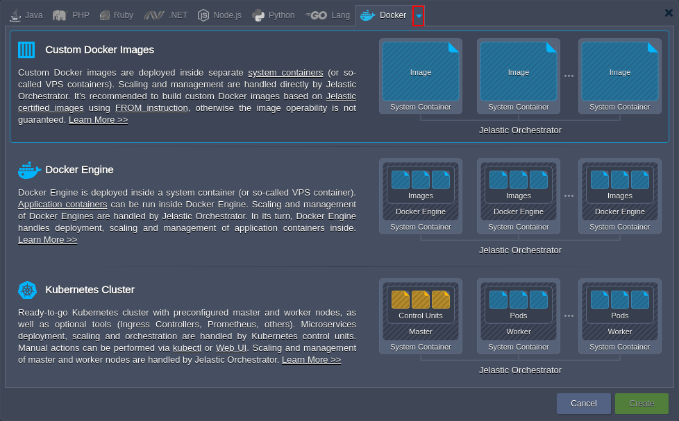

<a id="back"></a>

# Virtuozzo Application Platform 5.8.2

*This document is preliminary and subject to change.*

In this document, you will find all of the new features, enhancements and visible changes included to the **PaaS 5.8.2** release.

{}
{}
## Container Types in Wizard
Added information about deployment options available on the platform to the topology wizard
{}

{}
## Container Reboot via SSH
Added an SSH command to reboot individual container without the necessity to affect whole environment
{}
{}


{}
{}
## Tasks Panel Amendments
Tuned and optimized the *Tasks* panel to improve the user experience
{}

{}
## Isolation Timeout
Increased the timeout for isolation operations to one minute
{}

{}
## API Changes
Listed all the changes to the public platform API in the current release
{}

{}
## Software Stack Versions
Actualized list of supported OS templates and software stack versions
{}
{}


{}
{}
## Fixes Compatible with Prior Versions
Bug fixes implemented in the current release and integrated to the previous platform versions through the appropriate patches
{}

{}
## Bug Fixes
List of fixes applied to the platform starting from the current release
{}
{}

<style><!--
.changes-container{position:relative;padding-top:30px;padding-bottom:10px;padding-left:120px;border-top:1px solid #ddd}.changes-container:first-child{padding-top:0}.changes-container:first-child:before{top:15px}.changes-container:before{font-size:22px;position:absolute;top:45px;left:5px;width:110px;padding-top:42px;text-align:center;background-repeat:no-repeat;background-position:top}.changes-container>div{line-height:1.9;overflow:auto;margin-bottom:10px;padding:14px 20px;color:#282828;border-radius:3px}.changes-container>div:after{display:table;clear:both;content:""}.changes-container>div h6{font-size:18px;margin:0 0 16px}.changes-container>div .changes-more{position:relative;float:right;text-decoration:none}.changes-container>div .changes-more:after{margin-left:5px;content:">>"}.changes-container.changes-container--new:before{content:"New";background-image:url(data:image/png;base64,iVBORw0KGgoAAAANSUhEUgAAACoAAAAeCAYAAABaKIzgAAAAGXRFWHRTb2Z0d2FyZQBBZG9iZSBJbWFnZVJlYWR5ccllPAAAAyFpVFh0WE1MOmNvbS5hZG9iZS54bXAAAAAAADw/eHBhY2tldCBiZWdpbj0i77u/IiBpZD0iVzVNME1wQ2VoaUh6cmVTek5UY3prYzlkIj8+IDx4OnhtcG1ldGEgeG1sbnM6eD0iYWRvYmU6bnM6bWV0YS8iIHg6eG1wdGs9IkFkb2JlIFhNUCBDb3JlIDUuNi1jMTQyIDc5LjE2MDkyNCwgMjAxNy8wNy8xMy0wMTowNjozOSAgICAgICAgIj4gPHJkZjpSREYgeG1sbnM6cmRmPSJodHRwOi8vd3d3LnczLm9yZy8xOTk5LzAyLzIyLXJkZi1zeW50YXgtbnMjIj4gPHJkZjpEZXNjcmlwdGlvbiByZGY6YWJvdXQ9IiIgeG1sbnM6eG1wPSJodHRwOi8vbnMuYWRvYmUuY29tL3hhcC8xLjAvIiB4bWxuczp4bXBNTT0iaHR0cDovL25zLmFkb2JlLmNvbS94YXAvMS4wL21tLyIgeG1sbnM6c3RSZWY9Imh0dHA6Ly9ucy5hZG9iZS5jb20veGFwLzEuMC9zVHlwZS9SZXNvdXJjZVJlZiMiIHhtcDpDcmVhdG9yVG9vbD0iQWRvYmUgUGhvdG9zaG9wIENDIChXaW5kb3dzKSIgeG1wTU06SW5zdGFuY2VJRD0ieG1wLmlpZDozOEQ2OURDQjJDNDUxMUU4OEFDM0Q0OUYzRjVDQTUwMiIgeG1wTU06RG9jdW1lbnRJRD0ieG1wLmRpZDozOEQ2OURDQzJDNDUxMUU4OEFDM0Q0OUYzRjVDQTUwMiI+IDx4bXBNTTpEZXJpdmVkRnJvbSBzdFJlZjppbnN0YW5jZUlEPSJ4bXAuaWlkOjM4RDY5REM5MkM0NTExRTg4QUMzRDQ5RjNGNUNBNTAyIiBzdFJlZjpkb2N1bWVudElEPSJ4bXAuZGlkOjM4RDY5RENBMkM0NTExRTg4QUMzRDQ5RjNGNUNBNTAyIi8+IDwvcmRmOkRlc2NyaXB0aW9uPiA8L3JkZjpSREY+IDwveDp4bXBtZXRhPiA8P3hwYWNrZXQgZW5kPSJyIj8+NUw/0AAAAnNJREFUeNrMmE1oE0EYhjdLIz1IBDG1JdRqEdGCYPojqQgeWjA5xDYHpWBKPYhQaE+lLZTeTBHEq/bkpTUIIil6Mf6c0lLxUigShd6CBrTWHtQWD9L0/ei3MAzJmp2dDXnhgQy7M/Nmfr75Zn3Gq0eGBvnAGRAHN8A5cBj8Ae/AM/AG/JQrlqKjVXXQoMHkZfAcHC/zjMwOMqQX4DbYctqJ6cLgIbAEliuYLKcB8AMMOe1MdUQbwTpPt4qegtMg5eWIUp0VFyYt3QXDXhqdAl2GHi34svPNOozSbm4FvaAbnAf3DL16ArOu1miEd2mT4a36AI3qN5URTYL3NTBpaVBl6lvAolFbDasYnTVqr0tYp0G7tVrO6B2PzPwFWZvnm+A7zCaA+T+jPk3HqqwtXu8xGj2b9+idDPgMs012Rkv8z3RqF5wFv7mcr6IOHSZFmD1ZyWiIzerSPzYpZk3jDo73jzDbKBuluPnVQYJRjcLgi7S7Uw7qU/b1+GBNHuSjJ0BB85RfATmh3A/eKrYVNHkD5RQqU6d+cARsSM+uS22GXZgkXSOjPaBNofJ9XoO/QKewCcc4kbbUDtZczk7S5IxbRSPC7x2+ftBh8VAKN3kNy6iLjCZU/yWYEMrbYE4oBygecpLtVgEyesxFAw/AzQo3gE/gqKaNWTSl8KGUT3KqZsnPmVdIYwTJkNHXGhqiK/Ekx0naOBc0h7o0xdEIj0C9atuKox80TL+Xipeio3smn+2xOjVJsXpVPOvz/HGgnkSXyGnrk4+YlLwEHR6c+U61ybfeGfG7lJwkU4A+BS6CW+Aql71WgT8PpSlq0JqUX9gXYACycXnWqP0g9wAAAABJRU5ErkJggg==)}.changes-container.changes-container--new>div{background-color:#e4ffee}.changes-container.changes-container--changed:before{content:"Changed";background-image:url(data:image/png;base64,iVBORw0KGgoAAAANSUhEUgAAACoAAAAeCAYAAABaKIzgAAAAGXRFWHRTb2Z0d2FyZQBBZG9iZSBJbWFnZVJlYWR5ccllPAAAAyFpVFh0WE1MOmNvbS5hZG9iZS54bXAAAAAAADw/eHBhY2tldCBiZWdpbj0i77u/IiBpZD0iVzVNME1wQ2VoaUh6cmVTek5UY3prYzlkIj8+IDx4OnhtcG1ldGEgeG1sbnM6eD0iYWRvYmU6bnM6bWV0YS8iIHg6eG1wdGs9IkFkb2JlIFhNUCBDb3JlIDUuNi1jMTQyIDc5LjE2MDkyNCwgMjAxNy8wNy8xMy0wMTowNjozOSAgICAgICAgIj4gPHJkZjpSREYgeG1sbnM6cmRmPSJodHRwOi8vd3d3LnczLm9yZy8xOTk5LzAyLzIyLXJkZi1zeW50YXgtbnMjIj4gPHJkZjpEZXNjcmlwdGlvbiByZGY6YWJvdXQ9IiIgeG1sbnM6eG1wPSJodHRwOi8vbnMuYWRvYmUuY29tL3hhcC8xLjAvIiB4bWxuczp4bXBNTT0iaHR0cDovL25zLmFkb2JlLmNvbS94YXAvMS4wL21tLyIgeG1sbnM6c3RSZWY9Imh0dHA6Ly9ucy5hZG9iZS5jb20veGFwLzEuMC9zVHlwZS9SZXNvdXJjZVJlZiMiIHhtcDpDcmVhdG9yVG9vbD0iQWRvYmUgUGhvdG9zaG9wIENDIChXaW5kb3dzKSIgeG1wTU06SW5zdGFuY2VJRD0ieG1wLmlpZDo0QzNGRThBNjJDNDUxMUU4QTcyREYwOUUwQ0JFM0M4QiIgeG1wTU06RG9jdW1lbnRJRD0ieG1wLmRpZDo0QzNGRThBNzJDNDUxMUU4QTcyREYwOUUwQ0JFM0M4QiI+IDx4bXBNTTpEZXJpdmVkRnJvbSBzdFJlZjppbnN0YW5jZUlEPSJ4bXAuaWlkOjRDM0ZFOEE0MkM0NTExRThBNzJERjA5RTBDQkUzQzhCIiBzdFJlZjpkb2N1bWVudElEPSJ4bXAuZGlkOjRDM0ZFOEE1MkM0NTExRThBNzJERjA5RTBDQkUzQzhCIi8+IDwvcmRmOkRlc2NyaXB0aW9uPiA8L3JkZjpSREY+IDwveDp4bXBtZXRhPiA8P3hwYWNrZXQgZW5kPSJyIj8+c2zvogAAAidJREFUeNrUmM0rBVEYxueOmywuWfj+VlIkFje6ZEeJ8rURRVnIn0DJjlL+BxuSkogiiQ0iCwpJ3boLX/nOggXJx/PqvTVNXWbeOXO7nvot7rlnznnmzHnnfc94tOUPTYE8oBg0gw5QAnzgBayDWbAGHs0XfjXpFidwbrQWzIF0C30XQR94sGtUd2AwHiyALYsmSa3gHnTancwrNJkADvlxSzQDisCo1QskK0rXbDswGdYI6HHT6ADwa2o06Vn5zFARTBTNOcw7eANHmlptgPq/guq3PRrgKE3T3FUdoFW9kTz6brAbBZNhtUn2aCaY0qKrHonRYS36qkFQpQJbRvsdTBgCWUzI5rV34BZm24H+l1GPgyQQBGXgminjNjuimJgHpzCb9pvRL74zickK8Gpoe+W2oGA8SiZXMFsQyWg2m7WjfVBuMmk0W859JOn9GGYTzEbpvXlpo8AIm6zmRBBJb9xHYpZKxQljZsoDZ4KBErnmtDrps3D/p+ocQJvCAXwu9TWrhYxWgnzhABTdT+A8Qo3Zyf89cV+pur1ccTtRMuOLsIq5ChKCn1a0XYt9JZHRlH9g9IqMXigaLM5im0TzZHRV0WBdpveyzm0qNE3v0QDXnrEqOlqn013vKXz8bqgVx5Sfcopye2OMmhwHO8Zcf8IfB2JJY2AwfOgzbv4lUCrM+Sp1x0XMkPFkai6ST0EhqAK9oIF/u60z/jw0DQ5oT5o7fAswAKxgepYzbixFAAAAAElFTkSuQmCC)}.changes-container.changes-container--changed>div{background-color:#def6ff}.changes-container.changes-container--fixed:before{content:"Fixed";background-image:url(data:image/png;base64,iVBORw0KGgoAAAANSUhEUgAAACoAAAAeCAYAAABaKIzgAAAAGXRFWHRTb2Z0d2FyZQBBZG9iZSBJbWFnZVJlYWR5ccllPAAAAyFpVFh0WE1MOmNvbS5hZG9iZS54bXAAAAAAADw/eHBhY2tldCBiZWdpbj0i77u/IiBpZD0iVzVNME1wQ2VoaUh6cmVTek5UY3prYzlkIj8+IDx4OnhtcG1ldGEgeG1sbnM6eD0iYWRvYmU6bnM6bWV0YS8iIHg6eG1wdGs9IkFkb2JlIFhNUCBDb3JlIDUuNi1jMTQyIDc5LjE2MDkyNCwgMjAxNy8wNy8xMy0wMTowNjozOSAgICAgICAgIj4gPHJkZjpSREYgeG1sbnM6cmRmPSJodHRwOi8vd3d3LnczLm9yZy8xOTk5LzAyLzIyLXJkZi1zeW50YXgtbnMjIj4gPHJkZjpEZXNjcmlwdGlvbiByZGY6YWJvdXQ9IiIgeG1sbnM6eG1wPSJodHRwOi8vbnMuYWRvYmUuY29tL3hhcC8xLjAvIiB4bWxuczp4bXBNTT0iaHR0cDovL25zLmFkb2JlLmNvbS94YXAvMS4wL21tLyIgeG1sbnM6c3RSZWY9Imh0dHA6Ly9ucy5hZG9iZS5jb20veGFwLzEuMC9zVHlwZS9SZXNvdXJjZVJlZiMiIHhtcDpDcmVhdG9yVG9vbD0iQWRvYmUgUGhvdG9zaG9wIENDIChXaW5kb3dzKSIgeG1wTU06SW5zdGFuY2VJRD0ieG1wLmlpZDpEM0FFMDgwQzJDNDUxMUU4Qjk2NUQ1RjM3QjZEQTIwQyIgeG1wTU06RG9jdW1lbnRJRD0ieG1wLmRpZDpEM0FFMDgwRDJDNDUxMUU4Qjk2NUQ1RjM3QjZEQTIwQyI+IDx4bXBNTTpEZXJpdmVkRnJvbSBzdFJlZjppbnN0YW5jZUlEPSJ4bXAuaWlkOkQzQUUwODBBMkM0NTExRThCOTY1RDVGMzdCNkRBMjBDIiBzdFJlZjpkb2N1bWVudElEPSJ4bXAuZGlkOkQzQUUwODBCMkM0NTExRThCOTY1RDVGMzdCNkRBMjBDIi8+IDwvcmRmOkRlc2NyaXB0aW9uPiA8L3JkZjpSREY+IDwveDp4bXBtZXRhPiA8P3hwYWNrZXQgZW5kPSJyIj8+p2cxQAAAAm5JREFUeNrMmN1LFFEYxmeHTfdChWRdM+xDEiG7XJQtRCKFKNDdINTCBS+68E5CUBDxpiDqIugP6MaPShHDuihCbyoUb4K09NpsQfy4KQ1M3fV5l3dgmMbdmXPObPvAD+brnHnmPfOe8874Uq98mgJRJzWgBbSBi6AI7IAZMAE+gO1/WrYnHd3Ar8BkA5gE5TbnyGyMIU2De2DL7U10CYMF4DX4dIxJO0XBJuhwezPRiAbAVx5uEb0E1eChlxGlNp8lTBp6AOJeGu0DYU2NhrVx/ZSjbM2S9XSyktkHe2BRU6tZ0Jwt+zO9oxHO0pDmrZoARXVdZOg7wXwOTBqKibyjFWBEwc0PwDL45eDauIjRQUmDf8BVUAgugUYHba4gqcqAq2Tal1yxKPESvE1Gv7louwG607nRnkxmiqhP0uRjk8kClyY1zokpsILohjIZTfFTiWrUtP0XzFleiTN8PJtq0g88rp8/zuhpcChhdNeyfwe8ZZMXwE+uqJwu70swG7AajfCwVUgYDVj2f4BWUMzz5AlQ6qI/qr6em42e5XlTRjfT75a9jMS4LdDvXUQ1qHMCfVRg8l2Wa+rAC8H+W/3cwTkPTF4Dv8FJ0MPXiarTzxW3apODXMapUpiG/pbE+mxnckixSVIJRTQouExO2xx/Cu57ULQkKKJrAg39nIS5MEmaIqPvBT/senlepOLjmYcmSWNUlEQUzKFeij6tyymiC4LDnytFqZLSuRC5kacmnxiFjbGEfuefA/mkR6Df+OgzFyVvQC1Y/c8Gqcy8DAbMX6bWIpmKiipQD7rAdd73Wqv8e2gMfLFW96QjAQYAvVZ8VxrR76cAAAAASUVORK5CYII=)}.changes-container.changes-container--fixed>div{background-color:#fef6e6}@media (max-width:479px){.changes-container{padding-top:80px!important;padding-right:10px;padding-left:10px}.changes-container:first-child:before{top:25px}.changes-container:last-child{margin-bottom:0!important}.changes-container:last-child:after{display:none!important}.changes-container:before{top:25px;left:auto;width:auto;margin-left:0;padding-top:6px;padding-left:55px;background-position:0 0}.changes-container.changes-container--changed,.changes-container.changes-container--fixed,.changes-container.changes-container--new{position:relative;margin-bottom:40px;border-bottom:0}.changes-container.changes-container--changed:after,.changes-container.changes-container--fixed:after,.changes-container.changes-container--new:after{position:absolute;right:0;bottom:0;left:0;display:block;height:1px;content:"";background-color:#dedede}.changes-container.changes-container--changed>div,.changes-container.changes-container--fixed>div,.changes-container.changes-container--new>div{padding:0;background-color:transparent}.changes-container.changes-container--changed .changes-more,.changes-container.changes-container--fixed .changes-more,.changes-container.changes-container--new .changes-more{line-height:1.4}.changes-container.changes-container--changed .changes-more:before,.changes-container.changes-container--fixed .changes-more:before,.changes-container.changes-container--new .changes-more:before{bottom:2px}.changes-container.changes-container--new{background:-webkit-gradient(linear,left top,left bottom,from(#e4ffee),to(transparent));background:-webkit-linear-gradient(top,#e4ffee,transparent);background:-o-linear-gradient(top,#e4ffee,transparent);background:linear-gradient(180deg,#e4ffee,transparent)}.changes-container.changes-container--changed{background:-webkit-gradient(linear,left top,left bottom,from(#def6ff),to(transparent));background:-webkit-linear-gradient(top,#def6ff,transparent);background:-o-linear-gradient(top,#def6ff,transparent);background:linear-gradient(180deg,#def6ff,transparent)}.changes-container.changes-container--fixed{background:-webkit-gradient(linear,left top,left bottom,from(#fef6e6),to(transparent));background:-webkit-linear-gradient(top,#fef6e6,transparent);background:-o-linear-gradient(top,#fef6e6,transparent);background:linear-gradient(180deg,#fef6e6,transparent)}}
--></style>


## Container Types in Wizard

PaaS is an extremely versatile platform that supports multiple solutions for application development and hosting that will suit even the most demanding clients. However, it may not be obvious (especially for the new customers) which deployment options are available on the platform, so a dedicated list with explanations was added to the topology wizard.



By default, the wizard provides a categorized [list of platform-managed stacks](/software-stacks-versions) (the ones in the *Java*, *PHP*, *Ruby*, etc. tabs) that are already pre-configured and optimized for you in the most beneficial way. Additionally, such managed containers are fully compatible with the platform functionality (scaling, automated deployment, redeployment, SSL, etc.).

In case of switching to the ***Docker*** tab, you can review other deployment options available on the platform. Herewith, all the variants listed below are utilizing the basic [system container](/what-are-system-containers), which makes them compatible with most of the platform-distinguishing features (e.g. vertical and horizontal scaling):

* **Custom Docker Containers** - any *Docker image* (based on the [supported OS](/docker-supported-distributions)) deployed into the system container, which provides access to a great variety of solutions. However, the software operability and compatibility with the platform cannot be guaranteed (as the content is managed by respective image maintainers).
* **Docker Engine** - a *Docker Engine CE* deployed into the system container. It provides access to all the Docker native functionality, including deployment, scaling, and management of multiple [application containers](/what-are-application-containers) inside.
* **Kubernetes Cluster** - ready-to-go *[Kubernetes cluster](/kubernetes-cluster)* with preconfigured master and worker nodes created based on the system containers. Microservices deployment, scaling, and orchestration are handled by Kubernetes control units, while the platform manages control plane and worker nodes as a whole.

<a id="tasks-panel"></a>[More info](/setting-up-environment)
{}[Back to the top](#back){}


## Tasks Panel Amendments

A [new **Tasks** panel](/release-notes-58#tasks-panel), that was introduced in the previous release, obtained additional tuning for better user experience:

* In order to provide better clarity, the **Copy** and **Send Report** buttons were moved to the left part of the panel. Also, they will be displayed only upon hovering over the appropriate *Params* and *Response* sections.
* A new **Copy error text** button was added to get an error without the necessity to expand the corresponding task.
* The ***Params*** section was extended with a complete list of parameters used in the request (instead of just the main ones). Herewith, all the sensitive data (passwords, tokens, SSH keys, etc.) is automatically masked for security reasons.
* An internal ***actionkey*** parameter was removed from the tasks' response.
* Automatic sorting of the fields in the ***Params*** and ***Response*** sections was implemented. Herewith, the *result* and *error* (if present) responses are always displayed first.
* An ability to expand on-going tasks was added to get additional details on the action immediately after the start.

<a id="reboot-container"></a>[More info](/dashboard-guide#task)
{}[Back to the top](#back){}


## Container Reboot via SSH

In the present 5.8.2 PaaS release, the ability to reboot a server via SSH without additional permissions was implemented. Such an operation may be required in case of some major issue on the container, which cannot be resolved via service restart, e.g. the jem service restart command hangs. For now, it is possible to reboot the whole operating system of the container via the following new commands:

```
reboot
```
or
```
/usr/sbin/reboot
```
With such an improvement, it's no longer necessary to stop-start the whole environment so that only a problematic container will be affected by the reboot<a id="isolation-timeout"></a>.
{}[Back to the top](#back){}


## Isolation Timeout

**[Network Isolation](/environment-isolation)** is an important feature of the platform that allows managing groups of environments separately (by denying unintended connections via the internal network). Usually, all the isolation operations, such as group creation, nodes addition/removal, etc., are quick and need just a few seconds. However, in some cases (high platform load, network issues), these processes can require more time than the 30 seconds reserved by default. Thus, in the current 5.8.2 release, the timeout for isolation operations was increased to one minute.

<a id="api"></a>[More info](/environment-isolation)
{}[Back to the top](#back){}


## API Changes

Below, you can find a list of all changes to the public API in the 5.8.2 platform version (compared to the preceding [5.8](/release-notes-58#api) ones):

* added two optional parameters for the ***stopEvent*** action to provide notification after the event interruption:
    * **type** - the notification type based on the specified value: success (the default behavior without notification), *info/warning/error* ([pop-up style](https://docs.cloudscripting.com/creating-manifest/handling-custom-responses/) as described in the CS documentation)
    * **message** - a text that should be displayed in the pop-up (if not specified, the default notification is provided)
* improved the **domains** parameter description for the ***[AddDomains](https://docs.jelastic.com/api/#!/api/environment.Binder-method-AddDomains)*** method
* the **actionkey** parameter became optional for the ***[ChangeTopology](https://docs.jelastic.com/api/#!/api/environment.Control-method-ChangeTopology)*** method

<a id="compatible-fixes"></a>[More info](https://www.virtuozzo.com/application-platform-api-docs/)
{}[Back to the top](#back){}


## Fixes Compatible with Prior Versions

Below, you can find the fixes that were implemented in PaaS 5.8.2 release and also integrated into previous platform versions by means of the appropriate patches.

{}
**#**|**Compatible from**|**Description**
---|---|---
JE-51327|3.3|Installation of the *Redmine* package fails due to incorrect dependencies
JE-51381|3.3|Installation of the *PrestaShop* package fails due to the usage of the outdated *Apache PHP* version
JE-51851|3.3|The WordPress packages should install fake *Let&rsquo;s Encrypt* certificates for the default environment domains
JE-52144|3.3|Installation of the *Drupal* package fails due to the inability to extract from the *.tar.gz* archive format
JE-52210|3.3|Installation of the *Ghost* package fails due to the usage of the outdated *Node.js* version
JE-52353|3.3|Installation of the *Jenkins* package fails due to the usage of the outdated *Tomcat* version
JE-52359|3.3|An installation of the *Cyclos 4 PRO Cluster* package fails due to usage of the incorrect *Java* version
JE-52610|3.3|Old upstreams are not removed after changing backends in the *Traffic Distributor* package
JE-40350|5.3|Firewall rules are absent on the application server nodes after the creation of the *GlassFish/Payara* cluster
JE-47409|5.3|An error occurs while scaling out *GlassFish Cluster* with the deployed project
JE-40040|5.4|Firewall rules are absent on the *GlassFish/Payara* cluster nodes if created in the *extra* layer
JE-43619|5.4|The deployed projects are not available after scaling out the *GlassFish/Payara/WildFly* instance with the *Auto-Clustering* enabled
JE-49274|5.4|An email about a *DAS* node should not be sent upon the creation of the standalone *GlassFish* instance
JE-52810|5.5|New *GlassFish/Payara* instances are displayed with the &ldquo;Stopped&rdquo; status in the admin panel after the *DAS* node redeploy
JE-52722|5.7|The &ldquo;*old value for weight not found*&rdquo; error occurs during the *Traffic Distributor* package installation
JE-52168|5.7.2|Incorrect *uid* and *gid* permissions for the default *jelastic* user on the *LiteSpeed ADC* stack
JE-52197|5.7.2|The minimum cloudlets requirement for the *LLSMP* stack should be increased to ensure operability
JE-52437|5.7.4|The root login option is disabled in the *sshd_config* file of the *Debian VPS* instanc<a id="software"></a>e
{}
{}[Back to the top](#back){}


## Software Stack Versions

The software stack provisioning process is independent of the platform release, which allows new software solutions to be delivered as soon as they are ready. Herewith, due to the necessity to adapt and test new stack versions, there is a small delay between software release by its respective upstream maintainer and integration into the platform.

The most accurate and up-to-date list of the certified [software stack versions](/software-stacks-versions) can be found on the dedicated documentation page.

<a id="bug-fixes"></a>[More info](/software-stacks-versions)
{}[Back to the top](#back){}


## Bug Fixes

In the table below, you can see the list of bug fixes applied to the platform starting from PaaS 5.8.2 release:

{}
**#**|**Description**
---|---
JE-44341|The *password* placeholder doesn't work in cases when node groups are used in the JPS manifest
JE-51305|An error occurs when installing the *Jenkins* package from the Marketplace
JE-51956|An error is returned for the successful *Install* API call
JE-51959|If a node group in the load alert is edited, it should be displayed at a different layer immediately
JE-51965|Environment status is stuck in the &ldquo;*Creating*&rdquo; state when installing from JPS
JE-51970|Incorrect node tags provisions for environments installed from JPS
JE-51981|Environment status is not updated for the *Source > Environments Nodes* list in the *Firewall* section
JE-51983|Node icons in the *Source* column of the *Firewall* section are cropped
JE-51985|Disabled firewall rules should not be automatically enabled after edit
JE-51997|The *Destination* field is empty when editing existing outbound firewall rules with *Environment Node* as a destination
JE-52010|An incorrect environment domain name is displayed for the collaborators on the reseller platform
JE-52018|Text is aligned incorrectly in the "*To container(s)*" list when exporting folders from a container
JE-52021|An additional environment in the &ldquo;*Installing*&rdquo; state is displayed in the dashboard when cloning an environment with a cluster
JE-52022|During the *Let's Encrypt* add-on installation, the environment status is updated after external IP attachment and not after the whole operation completion
JE-52023|A package installation window is stuck on the &ldquo;*Configuring Environment*&rdquo; step if the action was called via API
JE-52029|Incorrect hint upon hovering over nodes in the *extra* layer of the topology wizard
JE-52053|Incorrect host IPs adjustment on the *NGINX load balancer* during the backends removal
JE-52067|Long folder names are displayed incorrectly in the *Exports* section of the configuration file manager
JE-52161|Environment status is stuck in the &ldquo;*Creating*&rdquo; state when creating a cluster or multiple environments
JE-52162|A special icon for the low disk space on a node is displayed cropped in the dashboard
JE-52164|The admin panel option should be displayed on the layer and not node level for the clusterized *GlassFish/Payara* templates
JE-52179|An application server is automatically added when switching from *Docker* to another programming language during the existing environment topology edit
JE-52202|An error occurs when restarting an *NGINX load balancer* with no backends
JE-52217|The long environment name is not cropped if the dashboard was refreshed during creation
JE-52233|An error occurs when restarting an *NGINX load balancer* after removing all of its backends
JE-52266|The tag of the *DAS* node in the *GlassFish/Payara* cluster should be the same as for workers and not editable
JE-52269|The ability to remove the *DAS* node should be disabled in the *GlassFish/Payara* cluster
JE-52364|One of the IP addresses is stack in the &ldquo;*Attaching*&rdquo; state when IPv4 and IPv6 are added simultaneously
JE-52365|The region icon is displayed incorrectly if the environment creation was finished while the *Tasks* panel was in fullscreen
JE-52405|Master node CPU usage is displayed in the *Usage* pop-up of the layer (instead of the sum of all nodes)
JE-52406|Topology wizard cannot be opened for environments with the legacy templates
JE-52450|An error occurs when removing all application server nodes for the *Payara* cluster
JE-52510|An error occurs when trying to mount an external server
JE-52515|The *Activity Log* tab works incorrectly when multiple tasks are in progress simultaneously
JE-52554|Incorrect collaboration invitation link for new users in the appropriate email
JE-52589|Package installation during container redeploy fails due to the *incomplete RPM metadata* error
JE-52600|The */var/tmp* folder is absent on the *Debian VPS* nodes
JE-52665|Incorrect &ldquo;*Log In Now*&rdquo; link in the email sent to new users after registration
JE-52666|An error occurs while creating environments with clusterization option for nodes via JPS
JE-52709|Errors with the *SetEnvStatus* API method should be correctly handled in the dashboard
JE-52752|The *Clone Environment* button should be locked if the maximum number of environments is reached
JE-52783|An error occurs while cloning the environment
JE-52857|Environment and Add-Ons window are stuck in the &ldquo;*Refreshing*&rdquo; state if the add-on installation fails
JE-52865|Environment status is stuck in the &ldquo;*Installing*&rdquo; state if the dashboard was refreshed during its creation (via Marketplace or Import)
JE-52871|Environment status is stuck in the &ldquo;*Applying Settings*&rdquo; state if the topology was adjusted via CLI
JE-52875|Topology changes via CLI should be immediately displayed on the dashboard after the operation is completed
JE-52881|An error occurs when opening the *Add-Ons* section for the *Tomcat* node
{}
{}[Back to the top](#back){}