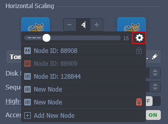

# Virtuozzo Application Platform 5.9

*This document is preliminary and subject to change.*

In this document, you will find all of the new features, enhancements and visible changes included to the **PaaS 5.9** release.

{}
{}
## Restrict Node Access via Shared Load Balancer (SLB)
Added ability to close external access to nodes via Shared Load Balancer
{}

{}
## Ability to Remove Any Container
Advanced nodes management during horizontal scaling
{}

{}
## Ubuntu 20.04 OS Template Support 
Implemented support for the containers based on the *Ubuntu 20.04* OS template
{}
{}

{}
{}
## API Changes
Listed all the changes to the public platform API in the current release
{}

{}
## Software Stack Versions
Actualized list of supported OS templates and software stack versions
{}
{}

{}
{}
## Fixes Compatible with Prior Versions
Bug fixes implemented in the current release and integrated to the previous platform versions through the appropriate patches
{}

{}
## Bug Fixes
List of fixes applied to the platform starting from the current release
{}
{}

## Restrict Node Access via Shared Load Balancer (SLB)

Each node at the platform can be accessed immediately after its creation without any additional configurations via its unique hostname. The connection is ensured with the help of the **[Shared Load Balancer](/shared-load-balancer/)** - an NGINX resolver for the whole platform. Although beneficial in most cases, such access may not be needed in some specific scenarios. For example, you may want to close public access to nodes intended for internal access only (e.g. databases) or forbid direct access via SLB to nodes with public IP address attached and custom domain configured.

In order to fulfill such a need, an option to control **Access via SLB** was implemented. It is located in the topology wizard and can be configured for each layer separately.

The option is enabled by default, which ensures the same behavior as before the PaaS 5.9 upgrade - nodes are accessible from the SLB via environment domain names using the default ports (*80*, *8080*, *8686*, *8443*, *4848*, *4949*, *7979*). If disabled, the nodes within the layer are inaccessible via SLB (including the **Open in Browser** button in the dashboard) and return the *403 Forbidden* error instead of the intended service. Herewith, [access via SSH](/ssh-access/) and through [endpoints](/endpoints/) is not affected.

In general, we recommend to use the *Access via SLB* option for your ***development*** and ***testing*** environments and disable it for the application in ***production*** (use [public IP](/public-ip/) with [custom domain](/custom-domains/) instead).

[More info](/shared-load-balancer/#deny-access-via-shared-load-balancer)

{}[Back to the top](#back){}

## Ability to Remove Any Container

By default, the platform provides a simplified nodes management, where you just need to specify the required number of containers in a layer. However, in some cases, you may want to remove a specific container instead of deleting the most recent one. Such a possibility was implemented in the current 5.9 PaaS release, allowing to manage nodes via:

* the ***Horizontal Scaling*** section in topology wizard - accessible using the **Change Environment Topology** button next to the required environment

* the dedicated ***Scaling Nodes*** form in the dashboard - accessible using the **Additionally > Scaling** Nodes option next to the layer or **Additionally > Delete** next to the particular node

It is possible to add new nodes and remove any particular container (except the initial "*master*" one) using these forms. Also, the confirmation form when applying changes to the environment was extended with notification about nodes to be removed and recommendations to back up any crucial data from these containers.

[More info](/horizontal-scaling/#managing-nodes-within-layer)

{}[Back to the top](#back){}

## Ubuntu 20.04 OS Template Support

The support of the custom Docker images based on the ***Ubuntu 20.04*** OS template was implemented for all the PaaS installations regardless of their current version. It is an LTS (long term support) release that will be maintained for five years. Compared to the preceding LTS version (*18.04*), it offers an updated kernel, optimized security and performance, as well as several new features (e.g. native ExFAT support, X11 fractional scaling, etc.). For more information on [Ubuntu 20.04](https://wiki.ubuntu.com/FocalFossa/ReleaseNotes), refer to the official release notes.

[More info](/docker-supported-distributions/)

{}[Back to the top](#back){}

## API Changes

Below, you can find a list of all changes to the public API in the 5.9 platform version (compared to the preceding [5.8.2](/release-notes-582/#api) ones):

* added a new ***SetSLBAccessEnabled*** method to the *environment.Control* service to support the **[Access via SLB](#restrict-node-access-via-shared-load-balancer-slb)** feature implementation

[More info](https://www.virtuozzo.com/application-platform-api-docs/)

{}[Back to the top](#back){}

## Fixes Compatible with Prior Versions

Below, you can find the fixes that were implemented in the PaaS 5.9 release and also integrated into previous platform versions by means of the appropriate patches.

{}
**#**|**Compatible from**|**Description**
---|---|---
JE-53221|3.3|An environment entry point should be checked for compatibility with the *Let's Encrypt* add-on during the add-on update
JE-53274|3.3|The *Let's Encrypt* add-on should check the necessity to update the certificate on the environment startup
JE-53707|3.3|The installation form of the *Let's Encrypt* add-on should provide details on the limitation of this solution
JE-53815|3.3|An error occurs when working with the *Let's Encrypt* add-on on the legacy stacks
JE-53104|5.0|The *Let's Encrypt* add-on installation hangs during the *generate-ssl-cert.sh* script execution
JE-53587|5.0|The *Let's Encrypt* add-on tries to attach public IP to the node twice during the add-on update
JE-43510|5.0.5|An error occurs during the *WildFly* auto-cluster creation
JE-53714|5.4|Implemented a new software stack based on the *.NET Core* template
JE-54059|5.7|The *ProxySQL* node addition is not available for the auto-clustering of the *MariaDB 10.4.x* versions
{}

{}[Back to the top](#back){}

## Software Stack Versions

The software stack provisioning process is independent of the platform release, which allows new software solutions to be delivered as soon as they are ready. Herewith, due to the necessity to adapt and test new stack versions, there is a small delay between software release by its respective upstream maintainer and integration into the platform.

The most accurate and up-to-date list of the certified [software stack versions](/software-stacks-versions/) can be found on the dedicated documentation page.

[More info](/software-stacks-versions/)

{}[Back to the top](#back){}

## Bug Fixes

In the table below, you can see the list of bug fixes applied to the platform starting from PaaS 5.9 release:

{}
**#**|**Description**
---|---
JE-52148|The *HAProxy* and *Apache* load balancers certified templates were updated to integrate container firewall support and enable the feature by default
JE-52560|An error occurs upon disabling and re-enabling container firewall for the *Docker Engine CE* stack via the dashboard
JE-52562|Critical firewall rules are missing for the *Memcached* nodes
JE-52632|Environment name length should be automatically validated according to the Unix restriction and region hostname
JE-52826|An error occurs when cloning environment with no free hardware on the host
JE-53444|Incorrect number of application server nodes is displayed in wizard after removing the load balancer layer
JE-53479|The *Sequential deployment with delay* value is cropped in the *Deploy* form
JE-53787|An error occurs when trying to create a *Windows-based* node
JE-53908|Container redeployment operation fails if relative paths are used in the *redeploy.conf* file
JE-53914|Custom SSL binding to the *Apache* node returns an error on the first attempt
JE-54013|Firewall rules are present in the container after redeploying node with disabled firewall
{}

{}[Back to the top](#back){}