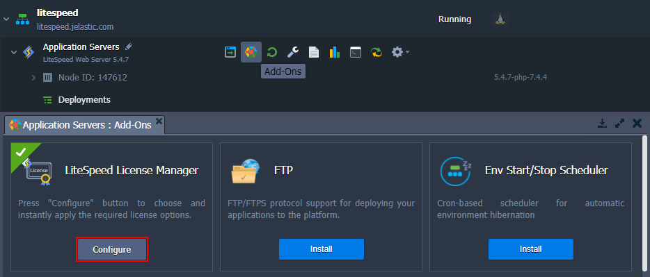
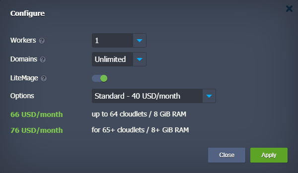
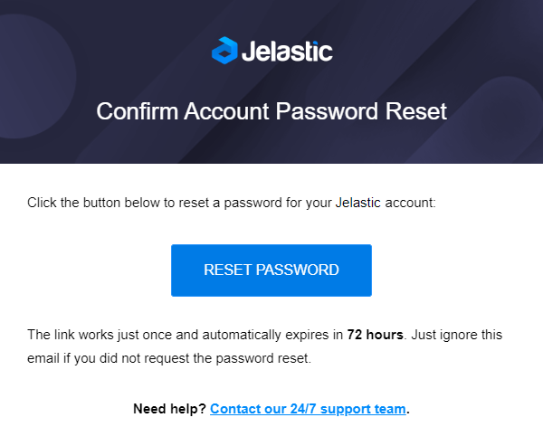
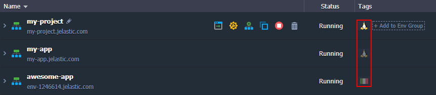
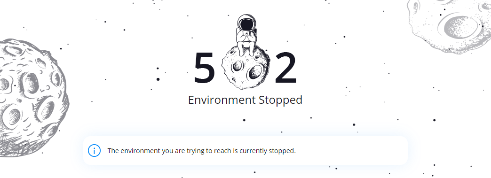
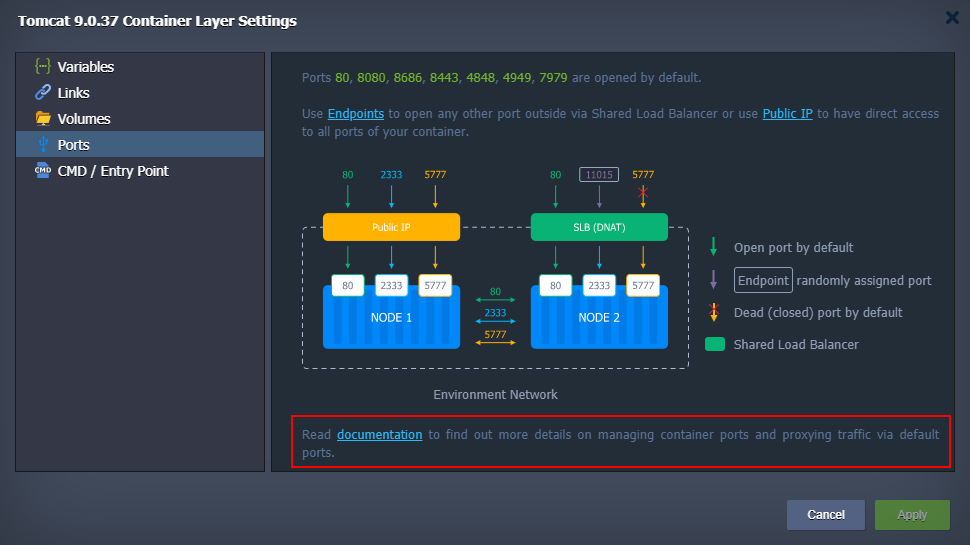
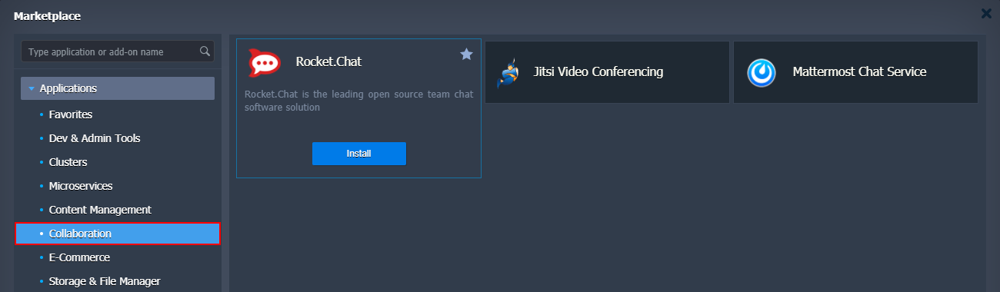
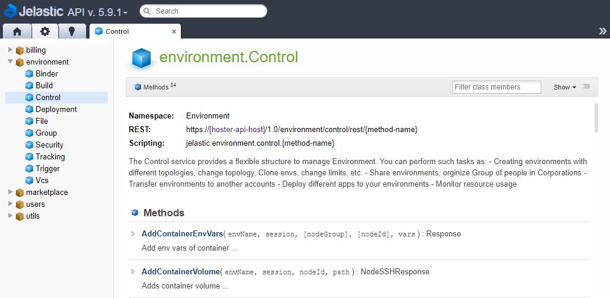

# Virtuozzo Application Platform 5.9.3

*This document is preliminary and subject to change.*

In this document, you will find all of the new features, enhancements and visible changes included to the **PaaS 5.9.3** release.

{}
{}
## LiteSpeed License Plans
Implemented support of multiple LiteSpeed license plans and the corresponding management add-on
{}

{}
## Password Reset Enhancement
A new secure flow to recover account password
{}

{}
## Simultaneous Installation for Multiple Auto-Clusters
Added support of multiple auto-clusters installation in parallel
{}

{}
## Batch Mode for Mount Operations
Implemented batch mode for the *NFS mount/unmount* operations to speed up operations
{}

{}
## Iptables for Bridge Interfaces in Containers
Added kernel flag to allow packets to be checked by the *iptables* rules when going through the bridge interfaces
{}

{}
## Cloud Scripting Improvements
Integrated engine improvements to boost performance and added new functionality to enhance the user experience
{}
{}

{}
{}
## UI Improvements
* relocated region icons for better clarity and support for the environment with prolonged names
* redesigned/reviewed error pages, and added new pages for specific issues
* added info about specifics of the default ports traffic proxying
* created a new *Collaboration* section in the Marketplace
{}

{}
## Container Stop Operation Optimization
Refactored code to speed up the container stop operation operation
{}

{}
## API Changes
Listed all the changes to the public platform API in the current release
{}

{}
## Software Stack Versions
Actualized list of supported OS templates and software stack versions
{}
{}

{}
{}
## Fixes Compatible with Prior Versions
Bug fixes implemented in the current release and integrated to the previous platform versions through the appropriate patches
{}

{}
## Bug Fixes
List of fixes applied to the platform starting from the current release
{}
{}

## LiteSpeed License Plans

**LiteSpeed** is a popular, high performance and low memory consumption [PHP web server](/litespeed-web-server/) and [load balancer](/litespeed-web-adc/). It is commercial software that requires developers to purchase a license for usage (or try out with a free starter plan). Herewith, the platform seamlessly integrates the cost of a license in accordance with the platform-distinctive [Pay-per-Use](/pricing-model/) principles and charges hourly a fraction of the total license cost. Such a structure allows you to opt-out of the deal or switch plans at any moment without any funds loss.

In the current 5.9.3 release, support of multiple new licenses was provided to give full control over the LiteSpeed instance. For this purpose, all of the LiteSpeed containers (including [LLSMP](/lemp-llsmp/)) are provided with the ***License Manager*** add-on.

Add-on allows configuring license based on the following parameters:

* **Workers** - choose the number of workers, which indicates how many processes will be spawned to do general server work
* **Domains** - select the domains' limit (only refers to top-level domains), any domain that exceeds the specified limit will result in a 403 error
* **LiteMage** - enable or disable the *LiteMage Cache* (fast, full page caching solution that caches dynamic pages as static files). If activated, an additional **Options** field will appear allowing to choose between the *Starter*, *Standard*, and *Unlimited* plans (*1500*, *25000*, and *unlimited* [publicly cached objects](https://www.litespeedtech.com/products/litespeed-web-server/lsws-pricing/lsws-litemage-pricing#objects) respectively)

At the bottom of the frame, you can see the cost of the current configuration. Click **Apply** to confirm changes and adjust your environment.

[More info](/litespeed-web-server/)

{}[Back to the top](#back){}

## Password Reset Enhancement

A new password reset flow was implemented in the platform 5.9.3 release. For now, after clicking on the **Reset Password** button and providing your email address, the platform will send you a confirmation email. The message has a button that redirects you (link automatically expires after three days) to the form where you can provide a new password. Additional information on the [password change and reset](/account-password-reset/) can be found in the documentation.

[More info](/account-password-reset/)

{}[Back to the top](#back){}

## UI Improvements

* [Environment Region Icons](#environment-region-icons)
* [Error Pages Redesign](#error-pages-redesign)
* [Default Ports Proxying](#default-ports-proxying)
* [Collaboration Marketplace Section](#collaboration-marketplace-section)

{}[Back to the top](#back){}

### Environment Region Icons

As the number of service hosting providers that support [multiple regions](/environment-regions/) increases, the feature gets more comprehensive feedback, allowing to improve it even further. In the current 5.9.3 PaaS release, the region icon was relocated from the environment **Name** column to the **Tags** one. Such a change serves two purposes:

* additional space within the **Name** column improves UX when working with prolonged environment names and [aliases](/environment-aliases/)
* region icon works as a label that helps to group environments, so it is rational to locate it among other [tags](/environment-groups-navigation/)

Also, clicking on the region icon now automatically filters an environment list by that particular region.

[More info](/environment-regions/)

{}[Back to the list of UI Improvements](#ui-improvements){}

### Error Pages Redesign

The design of the platform default error pages was updated in the PaaS 5.9.3 release to match the latest corporate styles. Two new pages were created to help handle the ***504 Gateway Timeout*** and ***503 SSL Disabled Environment*** issues. The existing pages were also thoroughly reviewed to clarify the cause of each particular problem - the error description and recommended resolution steps were updated.

{}[Back to the list of UI Improvements](#ui-improvements){}

### Default Ports Proxying

The platform provides several [ports](/container-ports/) that are open by default on all containers. These ports proxy traffic according to the following rules:

* ***80***, ***8080***, ***8686*** - proxies **HTTP** traffic to **HTTP** (*80* port)
* ***4848***, ***8443***, ***4901-4910*** - proxies **SSL** (HTTPS) traffic to **SSL**
* ***443*** - proxies **SSL** traffic is proxied to **HTTP** (*80* port)
* ***4949***, ***7979*** - proxies **SSL** traffic to **HTTP**

In order to highlight that proxying rules are not the same for all ports, the appropriate information was added to the dashboard with the link to the corresponding documentation page.

[More info](/container-ports/)

{}[Back to the list of UI Improvements](#ui-improvements){}

### Collaboration Marketplace Section

Due to the global pandemic situation, the collaboration applications have become increasingly popular. Such specialized tools can significantly reduce the negative effect of remote cooperation and hasten the establishment of a familiar workflow. Several applications within [platform Marketplace](/marketplace/) can help to keep people connected. In this 5.9.3 platform release, dedicated solutions were moved to a new **Collaboration** category. Currently, it includes three applications:

* *Rocket.Chat*
* *Jitsi Video Conferencing*
* *Mattermost Chat Service*

[More info](/marketplace/)

{}[Back to the list of UI Improvements](#ui-improvements){}

## Simultaneous Installation for Multiple Auto-Clusters

The logic for creating environments that contain several **[auto-clusters](/auto-clustering/)** was improved to perform the relevant tasks in parallel. The enhancement also affects the packages installed via the **ON_ENV_INSTALL** [variable](/environment-variables/) (if several ones are provided). The exact speed boost depends on the particular topology and complexity of the installed auto-clusters/packages. For example, the *WordPress Cluster* solution from the Marketplace can be created approximately five minutes faster than it was in the previous PaaS releases.

{}[Back to the top](#back){}

## Batch Mode for Mount Operations

The platform always strives to achieve maximum performance and regularly refactors code to implement new solutions and apply optimizations. In the current release, a batch mode was implemented for the [NFS mount/unmount](/mount-points/) operations. It allows performing actions in parallel, which provides a decent performance boost compared to the previous sequential mode. The batch mode is especially beneficial when a lot of simultaneous operations are requested (e.g. when working with the cluster solutions).

[More info](/mount-points/)

{}[Back to the top](#back){}

## Iptables for Bridge Interfaces in Containers

In the latest Linux kernel versions, new flags were added to either allow or forbid packets to be checked by the *iptables* rules when going through the bridge interfaces. Such functionality is critical for some solutions (for example, for the **portainer** GUI in the *[Docker Swarm](https://www.virtuozzo.com/company/blog/deploy-services-docker-swarm-cluster/)* package). The appropriate flags are automatically enabled in all platform containers to ensure the dependent services' operability (including platforms with versions preceding the 5.9.3).

{}[Back to the top](#back){}

## Container Stop Operation Optimization

In the current 5.9.3 platform upgrade, the container stop action code was refactored and optimized, resulting in the notable speed up of the operation. The change ensures that container/service stop action is performed quickly and without delays, improving the user experience and general appeal of the platform.

{}[Back to the top](#back){}

## Cloud Scripting Improvements

[Cloud Scripting](http://docs.cloudscripting.com/) is a programming language developed by the platform for application packaging, operation automation, and complex CI/CD flows integration. The following amendments were implemented for Cloud Scripting in the 5.9.3 platform release:

* **Rhino** JavaScript engine was updated to the latest version, resulting in a performance boost when working with the Cloud Scripting actions (e.g. JPS packages are created up to 40% faster).
* The ***[onBeforeInstall](https://docs.cloudscripting.com/creating-manifest/events/#onbeforeinstall_1)*** event was modified and now can be used with the add-ons (i.e. installations with *type: update*).
* Added a new ***permanent*** parameter for add-ons. If set as *true*, add-ons removal will be forbidden. The **Uninstall** button will be hidden on UI, and the *11043* error code will be returned via API.
* The ***force*** flag was implemented for the **UninstallApp** method. It is required to delete "*permanent*" add-ons and to force removal if the regular operation fails due to some error.
* Implemented the ***auto*** parameter (*\${event.params.auto}*), which is added for the [automatic horizontal scaling](/automatic-horizontal-scaling/) operations to distinguish them from the manual scaling.
* Automated the cloudlets' and nodes' count [values](https://docs.cloudscripting.com/creating-manifest/basic-configs/#nodes-definition) provisioning for the cases when the appropriate parameters were not defined explicitly. The algorithm takes into consideration account quotas, software requirements (e.g. for auto-clusters), and current values (for existing environments).
* Objects within the placeholders are serialized to JSON strings by default (i.e. without the [toJSON()](https://docs.cloudscripting.com/creating-manifest/placeholders/#42tojson) function).
* Implemented support of the ***[settings](https://docs.cloudscripting.com/creating-manifest/visual-settings/#custom-settings)*** placeholder for the ***extraNodes*** and ***recommended*** fields when configuring auto-cluster via JPS package. It allows passing the required settings from UI forms during the environment creation.
* The maximum allowed length for the text returned by the CS packages was enlarged to *16* MB.

{}[Back to the top](#back){}

## API Changes

In the present 5.9.3 PaaS release, the [API documentation](https://www.virtuozzo.com/application-platform-api-docs/) was migrated to the new modern engine, which allows automating a version control process. New API docs are automatically generated as soon as the new platform release is prepared. The engine also helps to implement numerous optimization (e.g. improved links structure) and clarification (e.g. response deserialization) of the displayed information. If needed, it is possible to switch platform versions (via the drop-down list at the top of the website) to view API for that particular release.

{}**Note:** A dedicated title page for the [API documentation](https://www.virtuozzo.com/application-platform-api-docs/) was created, allowing to switch between user and admin (authentication is required) methods. Also, all the corresponding links in the platform documentation and dashboard were updated.{}

Below, you can find a list of all changes to the public API in the 5.9.3 platform version (compared to the preceding [5.8.2](/release-notes-582/#api-changes) ones):

* added a new force optional parameter for the ***[Uninstall](https://docs.jelastic.com/api/#!/api/marketplace.Jps-method-Uninstall)*** method from the **jps** service
* removed the ***GetHdNodeStat*** method from the **cluster** service

[More info](https://www.virtuozzo.com/application-platform-api-docs/)

{}[Back to the top](#back){}

## Fixes Compatible with Prior Versions

Below, you can find the fixes that were implemented in the PaaS 5.9.3 release and also integrated into previous platform versions by means of the appropriate patches.

{}
**#**|**Compatible from**|**Description**
---|:---:|---
JE-54324|3.3|The installation of the *Let's Encrypt* add-on overwrites existing cron tasks
JE-37519|5.0|The *Windows-based* nodes should not be shown via the SSH Gate
JE-53104|5.0|An error occurs when installing the *Let's Encrypt* add-on
JE-54346|5.0|An error occurs when installing the *Redmine* package
JE-52537|5.0.5|Problems with access to the admin panel on the new *HAProxy* nodes after resetting the password
JE-52703|5.0.5|The *Uninstall* option should not be available for the *Jenkins Clustrization* add-on
JE-52778|5.3|The *\$WEBROOT* variable is missing for the *Jetty* stack
JE-52786|5.3|The *\$WEBROOT* variable is missing for the *Python* stack
JE-52787|5.3|The *\$WEBROOT* variable is missing for the *NodeJS* stack
JE-52788|5.3|The *\$WEBROOT* variable is missing for the *Ruby* stack
JE-45313|5.3.2|*WildFly Cluster* ignores variables that are defined via the *variables.conf* file
JE-48491|5.4|Different display names for the *WordPress EE* package after installation and page refresh
JE-54406|5.4|An error occurs when deploying the *Gogs* project for Golang
JE-54833|5.4|An error occurs when restarting the *Golang* node with a deployed project
JE-51915|5.7|An error occurs when scaling *MariaDB Cluster* without ProxySQL node
JE-53737|5.8.1|The number of workers defined within the installation frame for the *Jenkins* package is ignored
JE-54084|5.8.1|Connection via the *Apache* load balancer with public IP fails after redeployment
JE-54241|5.8.1|The *compatibleVersionsFrom* label is absent in the *Jenkins* package
JE-54393|5.8.1|Workers are not cloned during the *Jenkins* cluster cloning
JE-54420|5.8.1|Icons for *Jenkins* should be in the *SVG* format
{}

{}[Back to the top](#back){}

## Software Stack Versions

The software stack provisioning process is independent of the platform release, which allows new software solutions to be delivered as soon as they are ready. Herewith, due to the necessity to adapt and test new stack versions, there is a small delay between software release by its respective upstream maintainer and integration into the platform.

The most accurate and up-to-date list of the certified [software stack versions](/software-stacks-versions/) can be found on the dedicated documentation page.

[More info](/software-stacks-versions/)

{}[Back to the top](#back){}

## Bug Fixes

In the table below, you can see the list of bug fixes applied to the platform starting from PaaS 5.9.3 release:

{}
**#**|**Description**
---|---
JE-32816|Inviting yourself into collaboration should be validated on UI
JE-38799|Error when working with the reserved *Scratch* Docker image
JE-42201|Error when working with Docker images from the second and third hierarchy level of the registry
JE-42693|When connected to *SSH Gate*, the containers list disappears when the *Refresh* option is selected for the environment
JE-45673|Error during configuring *Auto-Clustering* for the existing *GlassFish* nodes
JE-45680|The errors related to the *personal access tokens* are not handled on the dashboard
JE-47141|The netmask for the internal interface is lost after using the *SwapIP* method
JE-47463|The *ExecCmdById* API method fails on the *Ubuntu 18.04* Docker image
JE-47604|The *openrc* package breaks the network in the *Alpine-based* containers
JE-49163|An error occurs when installing the *Auto-Scalable GlassFish Cluster* from the Marketplace
JE-49649|The *unfsd* process freezes during the Kubernetes redeploy
JE-49968|Unhandled error when handling cross-mounts
JE-50328|Container status should be checked before running the Docker setup procedure
JE-50993|Duplicated records for the common upstreams on the load balancers
JE-51506|Environment creation fails due to the "*Address already in use*" issue
JE-51535|Typo in the *RestoreDump* method example in the API documentation
JE-51775|Two error codes are returned upon the container redeploy failure
JE-52042|The volume folder is absent on the container after redeploy if the appropriate directory does not exist in the initial image
JE-52500|Incorrect alias is provided by default for the *extra* layers
JE-52598|An incorrect file is specified for error logs in the *my.cnf* config on the MySQL (MariaDB) containers
JE-52906|The *hidden* CS parameter does not work inside the *showIf* option
JE-53011|An error occurs when stopping a just created environment
JE-53041|The *Git auto check/deploy* options do not work with multiple projects on the same server
JE-53074|The marketplace packages selected for installation for a collaborator are still installed on the owner's account
JE-53182|The *Deploy Strategy* option is missing when deploying into the auto-clustering solution
JE-53283|Installed add-ons are not copied during the environment cloning
JE-53336|An incorrect error page is displayed for the *Gateway timeout* issue
JE-53347|Unhandled error when redeploying container that is locked by another process
JE-53355|Dependency packages cannot be installed on the *Debian 8 (Jessie)* containers
JE-53357|The Docker container start fails if the user's home directory does not exist
JE-53363|External IP is missing for the node after migration to another region
JE-53377|Response for some actions in the *Tasks* panel is missing if the task was expanded while still in progress
JE-53379|Price values are cropped on the *Refill* tab at the dashboard
JE-53380|An error occurs when installing a package with several nested add-ons
JE-53511|An error occurs during the rollback after the failed container redeploy
JE-53540|Incorrect notification pop-ups appear at the dashboard during the Kubernetes Cluster package upgrade
JE-53658|The *showmount* is not installed on the containers with the *rpcbind* utility
JE-53665|Hints for the tabs at the bottom of the dashboard should be displayed for the trimmed text only
JE-53666|The *Load Alerts* and *Auto Horizontal Scaling* tabs should be on par with other environment settings
JE-53677|Imprecise aggregation of the old *Billing History* data
JE-53692|Dependency packages are missing on the *Debian 10* based Docker containers
JE-53693|Dependency packages are missing on the Docker containers with the *multiarch-support* package requirement
JE-53776|An error occurs when importing a CS package with *NULL* action parameters
JE-53819|The "scale in" trigger does not work in accordance with the specified conditions
JE-53829|An error occurs during the *FTP* add-on installation
JE-53891|Corrupted values in the *response.out* and *globals* after the *Kubernetes Cluster* upgrade
JE-53910|An error occurs when changing the external IP addresses count
JE-53959|An error occurs upon removing a layer with any file (from that layer) opened in the dashboard's editor
JE-54020|The clone of the *Memcached* container has firewall rules for the nodes from the original environment
JE-54022|The clone of the *Memcached* container has firewall rules with internal IPs of the nodes from the original environment
JE-54028|Texts for some error pages should be improved
JE-54047|An error occurs when working with the firewall rules
JE-54154|An error occurs when creating *Jenkins* in the extra layer of the wizard
JE-54268|The VCS deployment *auto-update* option is disabled after containers redeploy
JE-54351|When deploying the *.ear* package to the same context as the existing *.war* one, the files from both archives are available
JE-54368|The after-installation notification is not displayed on the dashboard if the page was reloaded during the package installation
JE-54450|Docker containers from the custom registry cannot be created
JE-54594|Some parameters are not substituted in the Swap IP action in the dashboard's *Task* manager
JE-54602|*Ubuntu 20.04* containers cannot be connected via SSH
JE-54610|The file owner is changed upon adding a file to the Docker volume
JE-54687|The horizontal scaling element of the topology wizard is displayed incorrectly upon zooming in in the Firefox browser
JE-54794|When connected to *SSH Gate*, the containers list disappears when the *Refresh* option is selected for the environment
JE-54805|The *View Invoices* button does not work for the latest versions of the *Chrome* browser
JE-54814|Unhandled error when connected to *SSH Gate* and refreshing nodes list for the removed environment
JE-54843|The *GetEnvs* API call returns incorrect value for the *isInstalled* flag
JE-54844|An error occurs when adding a variable with a long numerical value
JE-54858|The registration form is displayed in the non-default language after redirection from the deployment confirmation link
JE-54887|The icon for the examples in API docs is broken
JE-55016|Firewall rules are empty for the VPS containers after creation
JE-55033|An error occurs when sharing multiple environments with a collaborator simultaneously
{}

{}[Back to the top](#back){}