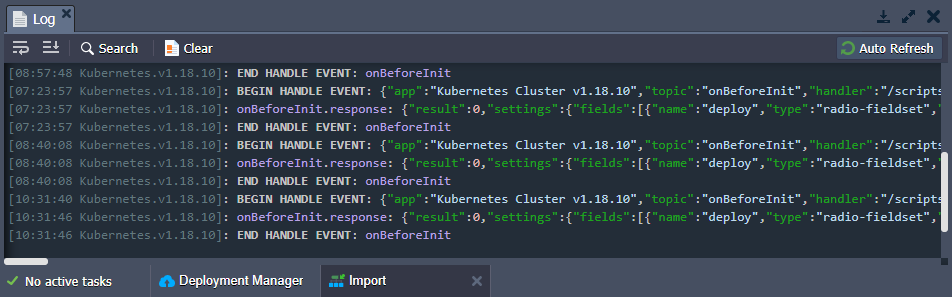

# Virtuozzo Application Platform 5.9.7

*This document is preliminary and subject to change.*

In this document, you will find all of the new features, enhancements and visible changes included to the **PaaS 5.9.7** release.

{}
{}
## JPS Console Integration
Integrated the Cloud Scripting console into the platform dashboard for tracking JPS packages execution
{}
{}

{}
{}
## Software Stack Versions
Actualized list of supported OS templates and software stack versions
{}
{}

{}
{}
## Fixes Compatible with Prior Versions
Bug fixes implemented in the current release and integrated to the previous platform versions through the appropriate patches
{}

{}
## Bug Fixes
List of fixes applied to the platform starting from the current release
{}
{}

## JPS Console Integration

The platform's Cloud Scripting console displays logs for the JPS packages execution and is commonly used during [JPS solutions development](/application-manifest/) for troubleshooting. In the current 5.9.7 platform upgrade, it was integrated into the dashboard (in addition to being available via a separate browser tab).

The JPS logs are available via the **[Import](/environment-import/) > JPS > View Logs** button, which opens a dedicated ***Import*** tab at the bottom of the dashboard. Here, you can view all the details about packages executed under your account. Smart code highlighting allows you to quickly process the data, focusing attention on the occurred errors, separating solutions within their own blocks, marking important keywords, etc.

For convenience, a number of useful to available at the top of the tab:

- **Wrap Lines** - brakes line when it reaches the frame border
- **Scroll to End** - displays the most recent log data
- **Search** - locates the needed information (you can narrow the search results with the additional *Match case* and *Regex* options)
- **Clear** - clears the log (confirmation is required)
- **Auto Refresh** - enables/disables automatic refresh of the import log every five seconds

[More info](/environment-import/)

{}[Back to the top](#back){}

## Fixes Compatible with Prior Versions

Below, you can find the fixes that were implemented in the PaaS 5.9.7 release and also integrated into previous platform versions by means of the appropriate patches.

{}
**#**|**Compatible from**|**Description**
---|:---:|---
JE-46132|-|The "*No active tasks*" caption is displayed for the *Tasks* manager tab when there is still an on-going operation
JE-56117|3.3|An error occurs when installing the *Env Start/Stop Scheduler* add-on from Marketplace
JE-50050|3.3|Incorrect RegExp for checking cron format in the *Env Start/Stop Scheduler* add-on
JE-48034|3.3|The *Env Start/Stop Scheduler* add-on cannot be installed for the different layers of the same environment
JE-48867|3.3|Unhandled error when installing the *TimeZone Change* add-on
JE-55865|3.3|An error occurs when installing the *Odoo CE* package from Marketplace
JE-52216|5.3|An error occurs when building a Java application with the *native-image* tool on the nodes based on the *GraalVM* JDK
JE-55737|5.7|An error occurs when cloning the *WordPress Cluster* solution
JE-55640|5.9.2|Unhandled error when working with the *LiteSpeed License Manager* add-on
{}

{}[Back to the top](#back){}

## Software Stack Versions

The software stack provisioning process is independent of the platform release, which allows new software solutions to be delivered as soon as they are ready. Herewith, due to the necessity to adapt and test new stack versions, there is a small delay between software release by its respective upstream maintainer and integration into the platform.

The most accurate and up-to-date list of the certified [software stack versions](/software-stacks-versions/) can be found on the dedicated documentation page.

[More info](/software-stacks-versions/)

{}[Back to the top](#back){}

## Bug Fixes

In the table below, you can see the list of bug fixes applied to the platform starting from PaaS 5.9.7 release:

{}
**#**|**Affected Versions**|**Description**
---|:---:|---
JE-56136|any|Container redeployment fails for images from a private registry after access credentials change
JE-56149|-|Collapsible elements are rendered incorrectly in the *Chrome 87* browser
JE-56319|-|Apache binary files should not be included by default into the custom Docker containers based on the *Debian* OS template
JE-56459|-|After switching back to the *Web SSH* tab, it is not in focus for text input in the *Chrome 86* browser
{}

{}[Back to the top](#back){}