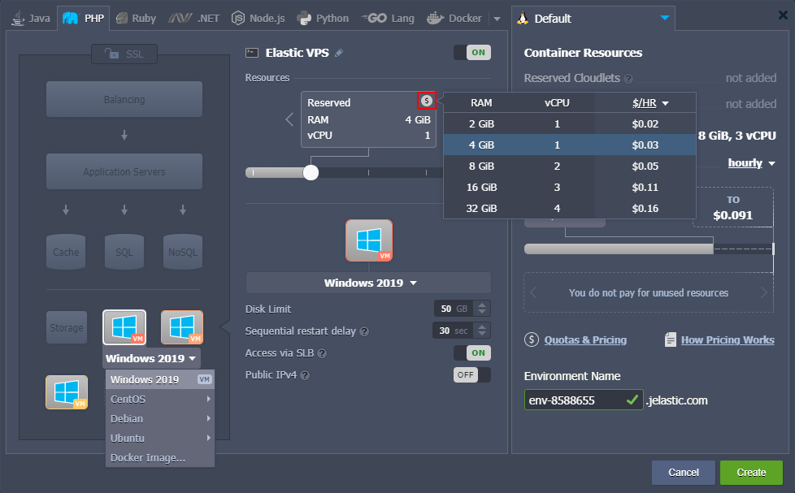
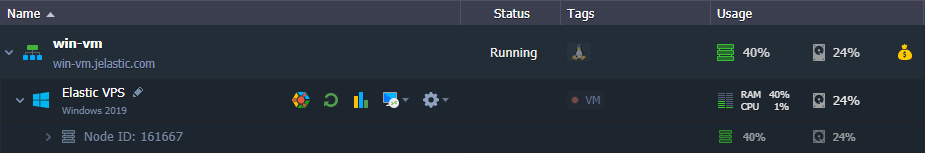
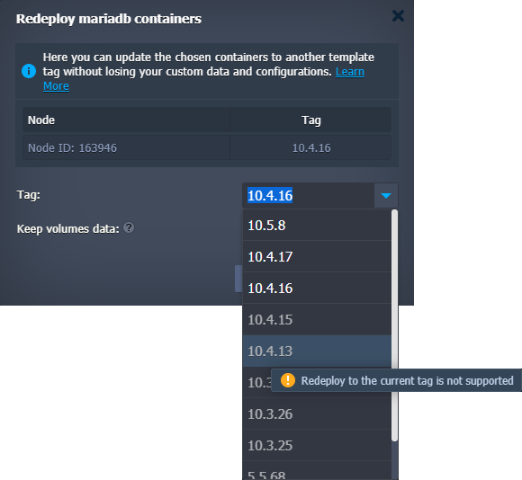
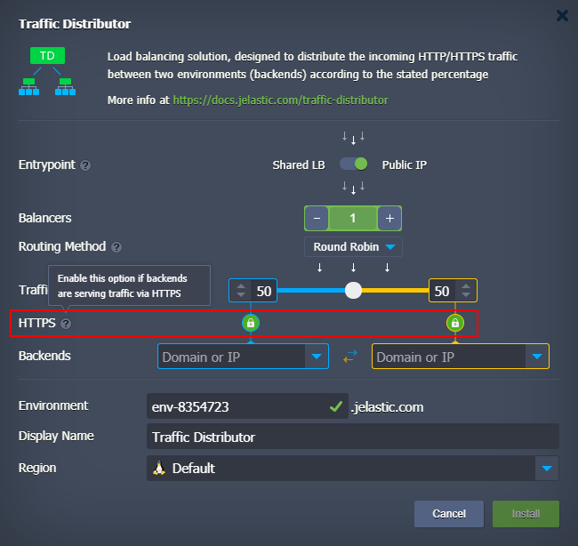
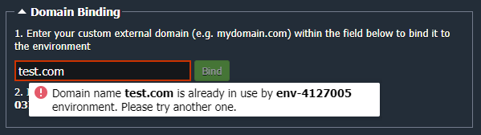

# Virtuozzo Application Platform 6.0

*This document is preliminary and subject to change.*

In this document, you will find all of the new features, enhancements and visible changes included to the **PaaS 6.0** release.

{}
{}
## Windows VMs Support
Implemented support of the traditional virtual machines with Windows workloads
{}

{}
## Tomcat/TomEE Hot Deploy
Added the *HOT_DEPLOY* variable to enable/disable restartless application deployment for the Tomcat/TomEE servers
{}

{}
## Non-Downgradable Software Stacks
Added functionality for disabling redeployment to a version lower than the current one
{}

{}
## Extended Target Node Filtering in Cloud Scripting
Added target node filtering by OS type when installing JPS update packages
{}
{}

{}
{}
## Traffic Distributor Package Update
Updated the Traffic Distributor package to integrate an ability to connect backends via SSL and to add some optimizations
{}

{}
## Extended Logs in Tasks Manager
Added information from the error's *log* field to the response in tasks manager
{}

{}
## No Free Disk Error Clarification
Separated errors for the disk space shortage within a container and on a hardware host
{}

{}
## Binding Busy Domain Error Clarification
Clarified the validation message when binding a custom domain that is already used by another environment on the platform
{}

{}
## Run.log Logrotate
Added the *run.log* file to the list of logs that should be automatically rotated by the system
{}

{}
## API Changes
Listed all the changes to the public platform API in the current release
{}

{}
## Software Stack Versions
Actualized list of supported OS templates and software stack versions
{}
{}

{}
{}
## CentOS 6 End-of-Life

Removed CentOS 6 from the list of supported OS templates
{}

{}
## Fixes Compatible with Prior Versions
Bug fixes implemented in the current release and integrated to the previous platform versions through the appropriate patches
{}

{}
## Bug Fixes
List of fixes applied to the platform starting from the current release
{}
{}

## Windows VMs Support

Starting with the PaaS 6.0 release, [Windows VM](/win-vm/) support is implemented for the platforms. The feature availability depends on each particular service hosting provider as it requires additional configurations in order to be set up on a platform.

VM hosting at the platform is provided in a familiar way to the regular containers. Windows VM instances can be added via the topology wizard under the *VPS* section. However, there are a few peculiarities for virtual machines:

- a small VM label is displayed on the stack image for better clarity
- only fixed resources based on the several predefined plans (licenses) are available; the exact sizes and prices can vary for different platforms
- the *[horizontal scaling](/horizontal-scaling/)* and *IPv6* options are not available in the current implementation

Virtual machines are visually highlighted in the dashboard via the dedicated *VM* label and unique resource *Usage* icon (instead of the regular cloudlets-shaped one). For Windows VM, the following management options are available:

- Add-Ons - installs available pluggable modules (e.g. *Env Start/Stop Scheduler*)
- Restart Node(s) - restarts a VM
- Statistics - shows real-time and historical VM's [resource consumption](/view-app-statistics/)
- Remote Desktop - provides [RDP-related functionality](/win-rdp-access/) for Windows VM
- Additionally - lists additional options (if any)

Regardless of the actual consumption, *VM Resources* (*vCPU* and *Memory*) cost is always fixed, predefined by resource plan (license). *Disk*, *Network*, and *Options* are billed separately, just as for containers.

[More info](/win-vm/)

{}[Back to the top](#back){}

## Tomcat/TomEE Hot Deploy

Tomcat and TomEE application servers provide support for the ***hot deploy*** feature, which allows speeding up deployment and avoiding downtime during the process. In short, it means that server adjustments are made while the server is still running (i.e. without restart). However, as not all applications are compatible with such a flow, the platform implemented a special ***HOT_DEPLOY*** variable that controls the *hot deploy* feature. This variable is not set and considered disabled by default. If needed, it can be manually added and enabled by providing the "*true*", "*1*", or "*enabled*" value.

[More info](/tomcat/)

{}[Back to the top](#back){}

## Non-Downgradable Software Stacks

The platform provides out-of-the-box support for multiple [software stacks](/software-stacks-versions/) to build topologies that meet the most demanding users' requirements. Moreover, most of the stacks have at least a few releases to choose from. These versions can be freely switched at any time due to the **[Containers Redeploy](/container-redeploy/)** feature.

However, not all of the software solutions provide backward compatibility. If there are substantial differences between the releases, downgrading a software version can result in unforeseen problems. In the current PaaS 6.0 upgrade, all the stacks were analyzed to locate those vulnerable to the issue and explicitly restricted from downgrading during the redevelopment process.

Currently, redeployment to the lower version is forbidden on the following stacks:

- *MariaDB*
- *MongoDB*
- *MySQL*
- *Percona*
- *PostgreSQL*
- *Couchbase*

{}[Back to the top](#back){}

## CentOS 6 End-of-Life

**CentOS 6** software stack support has officially reached its [end-of-life](https://wiki.centos.org/About/Product). It will no longer get any updates and security fixes. In order to ensure that users operate with reliable and secure stacks only, CentOS 6 was removed from the list of [supported OS templates](/container-image-requirements/) on the platform. After the 6.0 upgrade, the creation of the new containers based on the CentOS 6 will not be possible, while any existing instance will remain fully operable. However, we strictly recommend updating to the *7th* or *8th* release versions via built-in [redeploy functionality](/container-redeploy/).

[More info](/container-image-requirements/)

{}[Back to the top](#back){}

## Traffic Distributor Package Update

**[Traffic Distributor](/traffic-distributor/)** is a package powered by the platform, which helps control traffic flow between environments. It is an easy-to-manage solution suitable for multiple use cases and hosting scenarios (*Blue-Green Deploy*, *Failover Protection*, *A/B Testing*). In the present 6.0 PaaS upgrade, PaaS team integrated the ability to choose between proxying traffic to backends over SSL or without it. The corresponding **HTTPS** config within the ***Traffic Distributor*** package UI is shown in the image below:

Also, the default value for the ***proxy_connect_timeout*** setting in Traffic Distributor was increased to 60 seconds to reduce the number of reconfigurations due to the false-positive backend failures. However, upon selecting the *Failover* routing method, this parameter is automatically changed to the 20 seconds value.

[More info](/traffic-distributor/)

{}[Back to the top](#back){}

## Extended Logs in Tasks Manager

Dashboard's [tasks manager](/dashboard-guide/#tasks-panel) provides all the vital information on the account activities. It helps developers with troubleshooting, issues analysis, and action tracking. In the current 6.0 PaaS release, the tasks manager was improved by providing additional log information for errors. This ***log*** field is present in the response of some error messages and contains valuable data for debugging.

{}[Back to the top](#back){}

## No Free Disk Error Clarification

The platform has two types of the "*No free disk space*" error. The first one relates to the particular node and can be handled by the container owner. The second one reports the disk space shortage on the host (hardware server), which can only be resolved by the service hosting provider. In the present 6.0 upgrade, additional clarifications were added to separate such issues in the dashboard and provide correct resolution steps, i.e. either to increase disk space or contact support.

{}[Back to the top](#back){}

## Binding Busy Domain Error Clarification

In the current PaaS 6.0 upgrade, a validation message for the binding of a [custom domain](/custom-domains/#how-to-bind-domain-to-environment) that is already used by some other environment on the platform was improved. For now, instead of a general error, it explicitly notifies that the specified domain is already in use. Moreover, if an external domain belongs to the same account, the error message will point to the appropriate environment.

{}[Back to the top](#back){}

## Run.log Logrotate

*Logrotate* is a standard UNIX rotation and compression tool for log files. The platform automatically rotates all the main log files on the containers to ensure efficient disk space utilization without losing any crucial information from the log files. In the present 6.0 platform release, the ***run.log*** file was added to the list of logs that should be automatically rotated by the system.

{}[Back to the top](#back){}

## Extended Target Node Filtering in Cloud Scripting

The ***[targetNodes](https://docs.cloudscripting.com/creating-manifest/visual-settings/#target-nodes)*** parameter is an optional config for the JPS add-on solutions that defines environments suitable for installation. In the current PaaS 6.0 release, its functionality was extended with an additional **guestOSType** filter, which lists the suitable OS templates for the add-on installation. The possible values are:

- *LINUX*
- *WINDOWS2008*
- *WINDOWS2012*
- *WINDOWS2016*
- *WINDOWS2019*

For example, this parameter can be used to hide unnecessary (not supported) add-ons for the Windows-based nodes and vice versa.

[More info](https://docs.cloudscripting.com/creating-manifest/visual-settings/#target-nodes)

{}[Back to the top](#back){}

## API Changes

Below, you can find a list of all changes to the public API in the 6.0 platform version (compared to the preceding [5.9.8](/release-notes-598/#api-changes) ones):

- added new ***Get***, ***SetSLBAccessEnabled***, ***SetOptions***, and ***ApplyData*** methods to the **nodegroup** service
- added a new ***GetNodeTags*** method to the **control** service
- added the *lang* optional parameter to the ***RecoverPassword*** method from the **account** service
- changed the *search* parameter to mandatory for the ***SearchActions*** method from the **tracking** service

Also, all the deprecated methods were explicitly marked in the API documentation.

[More info](https://www.virtuozzo.com/application-platform-api-docs/)

{}[Back to the top](#back){}

## Fixes Compatible with Prior Versions

Below, you can find the fixes that were implemented in the PaaS 6.0 release and also integrated into previous platform versions by means of the appropriate patches.

{}
**#**|**Compatible from**|**Description**
---|:---:|---
JE-46524|3.3|The "*Can't read SSL certificate result:0*" error occurs during the *Let's Encrypt* add-on installation
JE-56808|3.3|The *Mattermost Chat Service* application does not work after installation from the Marketplace
JE-56836|3.3|Incorrect CSS styles for the *Dokuwiki* application from the Marketplace
JE-57107|3.3|The *Plesk* application does not work after installation from the Marketplace
JE-57192|3.3|The *Ghost* application does not work after installation from the Marketplace
JE-51924|5.0|The *MySQL/MariaDB Cluster* package installation should be restricted on account with insufficient quotas
JE-51882|5.4|Incorrect *Add ProxySQL* switcher state in the wizard for *MySQL/MariaDB Cluster* installed from the Marketplace
JE-54350|5.4|The minimum number of nodes for the *MySQL/MariaDB Cluster* package should be validated
JE-56429|5.4|An error occurs during the *optimization.sh* script execution on the LiteSpeed compute node of the *WordPress Cluster* package
JE-44501|5.7|Incorrect permissions for the */var/lib/proxysql/proxysql.log* file on the *ProxySQL* node of the *MySQL Cluster* package
JE-53193|5.7|An error occurs during the *Magento Cluster* package installation due to incorrect stack tags
JE-53195|5.7|An error occurs during the *WordPress Cluster* package installation due to incorrect stack tags
JE-53763|5.7|Missing description for the add-ons installed during the *WordPress Cluster* package installation
JE-54980|5.7|The *Strict-Transport-Security* support for the test SSL certificate in the *WordPress Cluster* package should be disabled
JE-55902|5.7|LiteSpeed-related options are displayed incorrectly in the *WordPress Standalone* package installation window
JE-57121|5.9.1|The *TimeZone Change* add-on installation fails on the *Ubuntu 20* VPS
JE-55026|5.9.2|Some redundant services are started on the *Ubuntu 20.04* nodes after reboot
{}

{}[Back to the top](#back){}

## Software Stack Versions

The software stack provisioning process is independent of the platform release, which allows new software solutions to be delivered as soon as they are ready. Herewith, due to the necessity to adapt and test new stack versions, there is a small delay between software release by its respective upstream maintainer and integration into the platform.

The most accurate and up-to-date list of the certified [software stack versions](/software-stacks-versions/) can be found on the dedicated documentation page.

[More info](/software-stacks-versions/)

{}[Back to the top](#back){}

## Bug Fixes

In the table below, you can see the list of bug fixes applied to the platform starting from PaaS 6.0 release:

{}
**#**|**Affected Versions**|**Description**
---|:---:|---
JE-44112|-|The *autofs* mounts are not available for the *systemd*-based containers at the start
JE-44165|-|Different description for the same error on the *Shared Storage* node
JE-44377|-|Unhandled error when adding a mount point to the *Shared Storage* node
JE-47032|-|Unhandled error when creating a mount point with the *unfsd* process stopped
JE-49956|5.7.6|An error occurs when adding a load balancer node with public IP to application server with public IP and bound custom domain 
JE-50494|-|FTP connection using "old" credentials can be established after the *FTP* add-on re-installation
JE-50828|-|Project update on the *Golang* servers fails for the password-protected repositories
JE-51077|5.7|The *vsftpd* service is still enabled on node after the FTP add-on removal
JE-51747|5.8.1|Container is stopped after the unsuccessful redeploy
JE-51825|5.8.1|The "*Wrong cloudlets counts*" error occurs when installing custom cluster with nodes in the *extra* layer
JE-51945|5.8.1|Account activation SMS cannot be re-sent on the same number during the registration
JE-52044|-|Warnings about deprecated parameters in logs after the *Ruby* server restart
JE-52063|5.7|Incorrect permissions for the */etc/autofs.conf* configuration file on the *Shared Storage* node
JE-52166|5.8.1|Unhandled error when enabling firewall for containers with incorrectly configured */etc/sysconfig/iptables-custom* file
JE-52561|-|Incorrect steps order in the *two-factor authentication* email
JE-52902|5.6|Incorrect CLI and platform versions comparison
JE-54255|5.9.2|Unhandled error when container cannot remove temporary locations during redeploy
JE-54680|any|The execution of the *SwapExtIps* API/CLI method between different regions should be validated
JE-54785|5.9.2|If HTTP to HTTPS redirect is enabled on the platform, it should work in the client libs as well
JE-54874|5.9.2|*Web SSH* console does not react on the keyboard inputs
JE-55003|any|FTP add-on should not be available for the *Memcached* nodes
JE-55025|-|An error occurs when creating a mount point from the *Ubuntu-based VPS* to a compute node
JE-55027|5.9.5|SSH connection to the *Ubuntu-based VPS* fails after container redeploy
JE-55090|-|An error occurs when creating a mount point from the *Ubuntu-based VPS* to a compute node
JE-55115|5.9.3|SSH connection to the *CentOS 7* container cannot be established
JE-55132|-|Some redundant services are started on the *Ubuntu 20.04* nodes after reboot
JE-55149|-|The "*Tag is not allowed*" error occurs during the container redeploy
JE-55230|5.9.2|Custom containers from the private *Google container repository* cannot be added
JE-55339|-|Incorrect permissions for the */var/lib/jelastic/overrides* folder on the *Tomcat* node
JE-55379|5.9.5|NFS mounts are missing on the non-master nodes of a layer
JE-55478|-|Incorrect validation during environment migration between regions
JE-55590|-|Zero downtime deployment option does not work with VCS projects on the *LiteSpeed* application servers
JE-55598|5.9.4|Bound custom domain is not released after the appropriate environment deletion
JE-55617|5.8.1|Mount point cannot be removed on the *Shared Storage* node after restart
JE-55629|any|Incorrect tags sorting in the node redeploy window
JE-55707|-|Zero downtime deployment option does not work with VCS projects on the *LEMP* application servers
JE-55776|5.8.1|Project cannot be deployed into environment with application server in the *extra* layer
JE-55815|-|An error occurs if node's home directory is a symlink
JE-55915|-|Internal network routes are missing after environment migration
JE-55943|5.9.6|NFS mounts does not work on the containers based on *CentOS 6*
JE-55962|-|The *latest* tag for custom containers disappears after its selection from the list
JE-56126|5.9.3|Container redeploy fails due to incorrect container status validation
JE-56145|5.9.4|An error occurs when adding nodes to the *Shared Storage* cluster
JE-56166|any|An error occurs when trying to deploy VCS project with submodules
JE-56278|5.9.6|Environment billing history does not work with custom localization
JE-56311|-|The *Let's Encrypt* add-on cannot be installed if environment has and entry alias
JE-56414|5.8.5|An error occurs during the container redeploy
JE-56497|-|Incorrect node's count validation in clusters
JE-56498|-|The *Apply* button in topology wizard should be disabled if there are validation warnings
JE-56556|-|List of shared environments in the collaboration email should be provided with the appropriate aliases
JE-56574|5.9.6|The password reset form should be in the same language as set in the dashboard
JE-56579|-|Incorrect *Disk Limit* slider behaviour when set below the minimum value
JE-56642|5.9.6|An error occurs when adding a large number of the VPS nodes simultaneously
JE-57217|5.9.6|An order is created by the *auto-refill* option for the removed users
JE-57299|any|Emails are displayed incorrectly in *DarkMode* on the iPhone/MacOS 
JE-57437|-|Transfer of an environment without VM nodes fails due to the target account not having a VM nodes support
{}

{}[Back to the top](#back){}