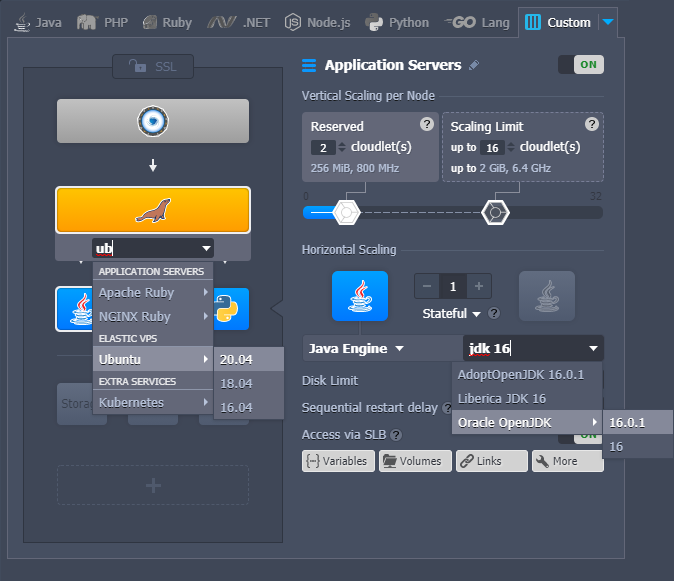
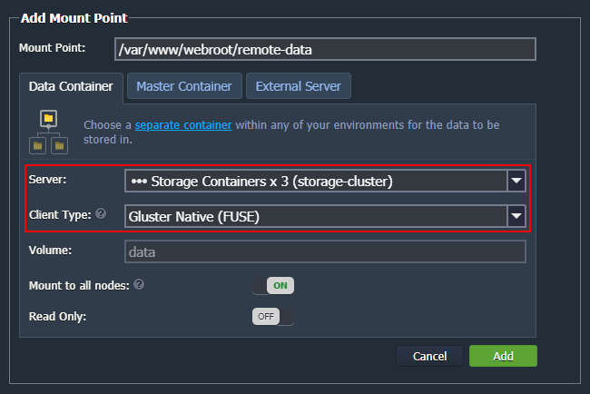
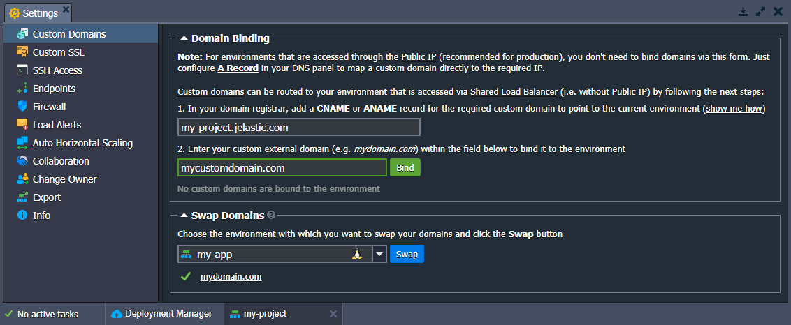

# Virtuozzo Application Platform 6.1

*This document is preliminary and subject to change.*

In this document, you will find all of the new features, enhancements and visible changes included to the **PaaS 6.1** release.

{}
{}
## Topology Wizard Improvements
Implemented a new flexible topology structure with the possibility to search for the required stacks
{}

{}
## GlusterFS Native Client for Storage Cluster
Provided support for the *Gluster Native Client* for distributed shared (cloud) storage
{}

{}
## JEM Commands Validation
Implemented error response for cases when incorrect JEM module or action is requested
{}
{}

{}
{}
## Custom Domains Tab Improvements
Reviewed texts and UI forms for the custom domain binding and swap domains functionality in the dashboard
{}

{}
## Apache PHP Redeployment Amendments
Optimized redeployment process for the *Apache PHP* template
{}

{}
## Default File Permissions Adjustments
Adjusted default file permissions for containers after an environment creation
{}

{}
## Keytool Utility for Java Containers
Allowed usage of the *keytool* utility with the sudo rights on the Java-based containers
{}

{}
## OnBeforeInit CS Event Improvements
Configured placeholders support and new trigger condition for the *onBeforeInit* event in Cloud Scripting
{}

{}
## VCS Deployment Errors Clarification
Improved description for the *VCS Deployment* errors to clarify the root cause of the issue and provide pointers for further troubleshooting
{}

{}
## Software Stack Versions
Actualized list of supported OS templates and software stack versions
{}
{}

{}
{}
## Debian 8 End-of-Life
Ceased support of the images based on the *Debian 8* OS
{}

{}
## Fixes Compatible with Prior Versions
Bug fixes implemented in the current release and integrated into the previous platform versions through the appropriate patches
{}

{}
## Bug Fixes
List of fixes applied to the platform starting from the current release
{}
{}

## Topology Wizard Improvements

A major overhaul of the topology builder for the environment wizard was performed in the current 6.1 PaaS release. The main change is the implementation of the ability to search for the required [software stack](/software-stacks-versions/) and add it to any layer. The standard approach recommends the following topology structure from top to bottom:

- **load balancers** *(green blocks)*
- **application servers** *(blue)*
- **databases** *(orange)*
- **extra** *(gray)*

With the new change, the configuration of the custom topologies is significantly simplified. For example, you can easily add Kubernetes nodes into the *application servers* section in the middle of the wizard.

Usually, when selecting a stack for a block ([layer](/paas-components-definition/#layer)) in the topology wizard, users are provided with a list of recommended software for the specific role according to the block position. For now, a new "**More…**" option is added to the stack selection drop-down list to choose a template from any role. For example, you can easily add a database into the central block, which is commonly reserved for application servers.

In order to help locate the required stack quicker, the **Search** field can be accessed by clicking on the current stack name at the top of the list. Start typing to see the relevant results grouped by their role. Additionally, the search option was added for the engine/version field in the central part of the wizard when a particular stack is already selected.

Other adjustments of the topology wizard include:

- renamed the **Docker** tab to **Custom** (since different [container types](/container-types/) are available - Kubernetes, Docker Native, etc.), adjusted the corresponding icon and descriptions of the available options
- added the default **Storage** block to the ***.NET*** tab
- implemented ***tags search*** when working with custom containers based on the Docker images in topology wizard and during [container redeploy](/container-redeploy/)

[More info](/setting-up-environment/)

{}[Back to the top](#back){}

## GlusterFS Native Client for Storage Cluster

Starting with the 6.1 platform release, [Shared Storage Cluster](/shared-storage-container/#shared-storage-auto-cluster) provides support of the **Gluster Native Client** for distributed shared (cloud) storage. Such a change allows connecting clients over the FUSE interface (in addition to the standard NFS).

Compared to the **NFS** protocol, GlusterFS offers greater reliability. It operates with multiple servers and is recommended for cases that require high concurrency, high performance of the write operations, and failover recovery upon emergencies. 

Currently, only the *Shared Storage Cluster* can export data using GlusterFS (i.e. as a Gluster Native server). At the same time, any node (except *alpine-based* containers) can operate as a client and mount data via the GlusterFS protocol.

When selecting a protocol, as a general rule, you choose NFS for better performance and Gluster Native for reliability:

- **[NFS](/nfs/)** - straightforward file system protocol, designed for accelerated processing and high performance
- **[Gluster Native (FUSE)](/glusterfs/)** - reliable file system protocol with automatic replication of the mounted data, designed for data backup and failover (requires less CPU/disk than NFS)

You can learn more about the [architecture implementation](https://docs.gluster.org/en/latest/Quick-Start-Guide/Architecture/) of GlusterFS from the official documentation.

[More info](/glusterfs/)

{}[Back to the top](#back){}

## Custom Domains Tab Improvements

The platform provides a [Domain Binding](/custom-domains/#how-to-bind-domain-to-environment) option that allows configuring custom domains for environments that are accessed via [Shared Load Balancer](/shared-load-balancer/) (i.e. without public IP). The process is simple - you just need to create the appropriate CNAME or ANAME record for your domain and bind it to the environment via the platform dashboard.

{}**Note:** For environments that are accessed through the [public IP](/public-ip/) (recommended for production), you don't need to bind domains via the dashboard. Just configure **[A Record](/custom-domains/#how-to-configure-dns-record)** in your DNS panel to map a custom domain directly to the required IP address.{}

In order to clarify the process to users, the appropriate specifics and detailed steps were added to the **Custom Domains** tab. For further convenience, the exact environment domain that should be used for CNAME or ANAME records was placed in a separate field with a quick copy button. Another UI adjustment is that the form explicitly denotes if the current environment does not have any bound domains.

Additionally, the **[Swap Domains](/swap-domains/)** section was provided with a list of bound domains. As a result, you can view the list of the current and target environment domains (in the *Domain Binding* and *Swap Domains* subsections, respectively).

[More info](/custom-domains/)

{}[Back to the top](#back){}

## Apache PHP Redeployment Amendments

Some adjustments were applied to the backups created via the [redeploy functionality](/container-redeploy/#creating-file-backup-copy-upon-image-redeployment) on the **Apache PHP** stacks. In addition to the latest backup (***{file_name}.backup***), the platform will create and keep a copy of the required config files for every redeployment to a different tag (***{file_name}.{time_stamp}***). Such an improvement allows you to track the changes better, simplifying analysis and rollback in case of necessity.

Also, when redeploying to the same tag, the platform won't overwrite the existing ***php.ini*** file.

[More info](/container-redeploy/#creating-file-backup-copy-upon-image-redeployment)

{}[Back to the top](#back){}

## Default File Permissions Adjustments

Starting with the PaaS 6.1 release, file permissions for containers after an environment creation are adjusted to match the default values required for some of the most popular applications. For example, such a change ensures that *cPanel* can be deployed without additional configurations.

{}[Back to the top](#back){}

## Keytool Utility for Java Containers

In order to allow a straightforward use of the Java *keytool* utility, a small adjustment was made to the Java-based containers. Namely, the application was added to the *sudoers* file, which allows using *keytool* with the *sudo* rights and adjusting the container's *keystore* even if it belongs to the *root* user.

{}[Back to the top](#back){}

## JEM Commands Validation

**JEM** (Jelastic Environment Manager) is a platform component responsible for all operations with containers. It supports a list of commands that users can call to perform specific actions on the containers (e.g. *jem service restart*). In order to improve user experience with the module, error notification was added for the cases when an incorrect module or action is specified for the *jem* command.

{}[Back to the top](#back){}

## OnBeforeInit CS Event Improvements

***[OnBeforeInit](https://docs.cloudscripting.com/creating-manifest/events/#onbeforeinit)*** is a Cloud Scripting event that is triggered before application installation. It is usually used to dynamically configure the installation form based on some specifics (e.g. account quotas). In the current 6.1 PaaS upgrade, the *onBeforeInit* event was improved to support placeholders, allowing validation of the collaborator account's permissions. Such a change ensures that the JPS installation frame can be correctly customized when installing as a [collaborator](/account-collaboration/).

Additionally, a new trigger condition was added for the *onBeforeInit* event. For now, it is possible to implement some custom initialization actions upon clicking a [custom button](https://docs.cloudscripting.com/creating-manifest/visual-settings/#custom-buttons).

[More info](https://docs.cloudscripting.com/creating-manifest/events/#onbeforeinit)

{}[Back to the top](#back){}

## Debian 8 End-of-Life

**Debian 8 "Jessie"** software stack [LTS support](https://wiki.debian.org/LTS) has officially ended. It will no longer get any updates and security fixes. In the current PaaS 6.1 release, this version was removed from the list of [supported OS templates](/container-image-requirements/) to ensure that users operate with reliable and secure stacks only. The platform restricts the creation of new Debian 8 containers, but all existing ones remain fully operable. However, we strongly recommend updating such instances to the 9th or 10th release versions via built-in [redeploy functionality](/container-redeploy/).

[More info](/container-image-requirements/)

{}[Back to the top](#back){}

## VCS Deployment Errors Clarification

In the current 6.1 platform version, error notifications for the failed VCS deployment operations were reviewed and adjusted to clarify the root cause of the issue or provide pointers for further troubleshooting. The new texts are aimed to help developers quicker resolve any problems related to the deployments from Git/SVN repositories.

{}[Back to the top](#back){}

## Fixes Compatible with Prior Versions

Below, you can find the fixes that were implemented in the PaaS 6.1 release and also integrated into previous platform versions by means of the appropriate patches.

{}
**#**|**Compatible from**|**Description**
---|:---:|---
JE-59234|any|An error occurs when enabling *Tomcat/TomEE auto-cluster* in the *Extra* layer of the topology wizard
JE-58510|3.3|*New Relic* add-on works incorrectly on some PHP 7 and PHP 8 nodes
JE-59431|3.3|The *GitBlit* application is not working after installation from the Marketplace
JE-59350|5.7|An error occurs when installing the *WordPress Cluster* from the Marketplace
{}

{}[Back to the top](#back){}

## Software Stack Versions

The software stack provisioning process is independent of the platform release, which allows new software solutions to be delivered as soon as they are ready. However, due to the necessity to adapt and test new stack versions, there is a small delay between software release by its respective upstream maintainer and integration into the platform.

The most accurate and up-to-date list of the certified [software stack versions](/software-stacks-versions/) can be found on the dedicated documentation page.

[More info](/software-stacks-versions/)

{}[Back to the top](#back){}

## Bug Fixes

In the table below, you can see the list of bug fixes applied to the platform starting from PaaS 6.1 release:

{}
**#**|**Affected Versions**|**Description**
---|:---:|---
JE-36371|5.4|During the node deletion, all firewall rules that use this node as a source should be removed as well
JE-38724|5.4|Incorrect min/max values for cloudlets and storage are returned via the *getExtendedAccountBillingHistoryByPeriod* API method
JE-44833|5.5|During deletion of the last node in the layer, all the corresponding add-ons should be removed as well
JE-45438|-|An error occurs after deploying a different project into the existing context
JE-46669|-|An error occurs during the frequent scaling out and scaling in of the application server layer
JE-47681|-|The Cloud Scripting *checkboxlist* field does not work
JE-47744|-|An error occurs when trying to remove a node after it was simultaneously mounted and scaled up
JE-48220|-|Environment isolation breaks if the same environment is in the isolated and non-isolated groups simultaneously
JE-48665|-|The topology wizard should display a warning if the account quotas are less than the selected node minimum requirements
JE-49905|-|Consequent application deployments fail on the Tomcat/TomEE nodes if the *unpackWARs* value is *false* in the *server.xml* config
JE-50028|-|Incorrect size of the drop-down list for the deployment window if some elements have long names
JE-51451|5.8|The "*keyboard*" icon in the *Web SSH* section of the dashboard should be converted to *SVG* format
JE-51875|5.8|The minimum requirements warnings are missing in the topology wizard if the auto-cluster was created via the *Import* functionality
JE-51885|5.8|The "*alert*" icon in the account activation form should be converted to *SVG* format
JE-51952|5.8|An error occurs when trying to install JPS without the *fixedCloudlets* value for the nodes in the *Extra* layer
JE-52616|5.8|The warning about removing a layer disappears in the topology wizard after switching to the different programming language tab
JE-53445|-|Incorrect OS detection for some custom Docker containers
JE-53457|-|Some elements are displayed incorrectly when moving the topology wizard window
JE-53752|5.7.6|An unnecessary warning about IP change is displayed when migration environment between regions of the same hardware server
JE-54034|5.4|An error occurs when trying to install a custom Docker image with alternative repositories (that use HTTPS link) but without the built-in HTTPS driver
JE-54271|5.9|An error occurs when trying to change topology after removing the application server layer with the *WildFly* auto-cluster
JE-54981|-|The Cloud Scripting *displayName* and *envDisplayName* fields should override the environment display name on UI
JE-55030|-|Typo in the *Remmina* RDP client name in the RDP connection information window in the dashboard
JE-55835|-|Incorrect firewall rules for the isolated environments
JE-55889|-|An error occurs when cloning an environment with active mounts
JE-56266|6.0|Incorrect registry credentials are used when creating a container
JE-56848|-|An error occurs during the container after-creation setup
JE-57037|-|An error occurs during the firewall rules management
JE-57082|6.0|The *Export* feature works incorrectly for the *Windows VM* nodes
JE-57218|-|Imported environments with Windows VM nodes have incorrect VM group icons
JE-57272|-|Incorrect image on the *502 application down* error page
JE-57343|-|Incorrect list of container volumes during the first redeploy if they were added via the CS script
JE-57564|-|An error occurs when creating a mount point without shared storage
JE-57846|-|An error should be reported when the container cannot adjust firewall rules
JE-57874|5.8|An error occurs when creating *NoSQL* containers
JE-57919|-|An error occurs when trying to resend environment transfer requests that have already expired
JE-57968|-|A load balancer is added to the *Kubernetes* environment if worker nodes are scaled by collaborator
JE-57976|-|The *SwapExtIps* API method should be restricted for the stopped environments
JE-58012|-|Redundant firewall adjustment call on the nodes during the environment start
JE-58076|-|The deployed VCS project is not changed after adjusting the repository link and updating the project
JE-58391|-|An error occurs when using the dashboard *Search* functionality
JE-58394|6.0.2|The change topology is not working for the environments with outdated (disabled by the service hosting provider) stacks
JE-58500|any|An error occurs when trying to add public IP to the Windows VM that already has an external IP address
JE-58571|6.0|An error occurs when trying to redeploy from the latest tag that was removed from the repository
JE-58592|-|The billing users in the POST group should not be deactivated after the invoice expiration if the balance remains positive
JE-58619|-|An error occurs during the environment creation
JE-58718|5.9.2|Invalid add-ons cannot be removed even with the *force* flag
JE-58756|-|Existing environment cannot be managed if the corresponding region becomes unavailable for the user
JE-58919|-|Duplicated JEM calls when creating VPS nodes
JE-58947|-|The *Red Hat* base image cannot be created
JE-58950|any|Some *TomEE* tags are missing the *auto-clustering* option in the topology wizard
JE-59007|-|Custom domain names should be validated and encoded before being bound to the environment
JE-59025|-|Incorrect credentials are sent for the *Minio* node created in the *Extra* layer
JE-59169|-|Duplicated requests are sent when making any call with the client lib and the *followRedirect* flag is enabled
JE-59206|-|Primary public IP should be switched to the remaining external IP address (if any) after the swap
JE-59226|-|Incorrect isolation is configured for the default "*My First Project*" environment group
JE-59323|-|An error occurs when cloning an environment with mounts to the *GlusterFS* cluster
JE-59359|6.0|The hostname of the cloned environment is not changed after migration to a different region
JE-59408|any|An error occurs during the node creation
{}

{}[Back to the top](#back){}