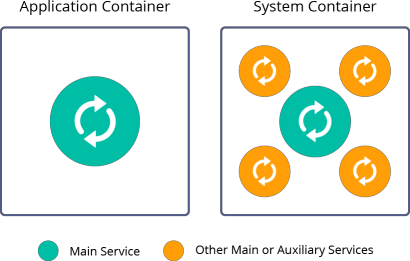

# What are Application Containers

An **application container** is a relatively new container type. It is an application, service, or even microservice centric solution that usually runs just a single process inside. As a result, application containers promote creating immutable and ephemeral infrastructure. If an application or service needs to be updated, a whole new container is built (with the required adjustments) from the appropriate image. Then, it is provisioned to replace the existing running container instance.

*<u>In the early days,</u>* such complexity, as well as the [lack of proper isolation](https://www.virtuozzo.com/company/blog/java-and-memory-limits-in-containers-lxc-docker-and-openvz/) and incompatibilities of application containers with some technologies (like Java and database runtimes), had greatly impacted the adoption speed of application containers. Developers had to implement significant adjustments to ensure that their technologies and additional functionality can be run inside application containers correctly.

Also, as a *stateless* solution, application containers cannot natively save state information inside, so such operations are delegated to the external persistent storage systems. However, according to the developers of the purely stateless containers, bringing the state to deployment is an obsolete way of architecture design. They assert that the best and cleanest approach for the containers is to perform operations that do not require keeping the state.

*<u>Nowadays,</u>* a lot of supplementary tools are implemented for convenient utilization of services that use application containers. As a result, developers can benefit from the highly specialized units of application containers without the downside of complex management.

Several application container implementations are actively developed: *Docker*, *CRI-O*, *containerd*, and some others. At the moment, the platform utilizes Docker as the most widely adopted technology for application containers. The platform provides comprehensive [deployment automation](/dockers-overview), [fast server provisioning](/dockers-management), and [stateful data storing/processing tools](/container-volumes) (sessions, logs, configs, etc.) for convenient utilization of application containers.

However, some applications and technologies may still have problems while migrating to application containers (due to lack of proper isolation, statelessness, and single-process requirements). This is especially relevant for the complex application container orchestration tools like Kubernetes. In case of difficulties with migration, [system containers](/what-are-system-containers) can be considered a better-suited alternative for containerization.

## What's next?

* [Docker Standard Support](/dockers-overview)
* [System Containers](/what-are-system-containers)
* [Supported OS Distributions](/docker-supported-distributions)
* [Container Redeploy](/container-redeploy)