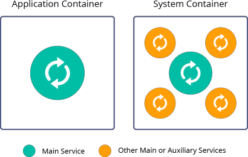

# What are System Containers

A **system container** (also known as *operating system container*) is the oldest container type. It is an operating system (OS) centric solution that behaves like a standalone system, which does not require specialized software or custom images such as Docker. System containers are quite similar to virtual machines (VMs) but with very low overhead and easy management.

System containers run full-featured init systems (*systemd*, *SysVinit*, *Upstart*, *OpenRC*, etc.), which allows spawning multiple processes (e.g. *OpenSSH*, *crond*, or *syslogd*) inside a single container under the same OS. System containers are most suitable for traditional or legacy monolithic applications, as they allow reusing architectures, tools, and configurations implemented for VMs.

The specifics of the system containers provide some benefits and peculiarities:

* It can be considered a *stateful* solution. System containers support [live migration (across host nodes, data centers, or even Clouds)](https://www.virtuozzo.com/company/blog/live-containers-migration-across-data-centers-aws-and-azure-integration/) and do not lose data/state after reboot. Such data persistence suits perfectly for running long-living stateful applications and services (including SQL, NoSQL, and in-memory database instances).
* System containers gracefully coexist with the Java ecosystem and do not require any special adjustment for making the Java process aware that they are running inside containers.
* System containers support the existing solutions for implementing hot redeployment without the need of restarting container or Java runtime. Also, they simplify and speed up the [clustering of Java EE / Jakarta EE application servers](https://www.virtuozzo.com/company/blog/glassfish-payara-auto-clustering-cloud-hosting/).

There are multiple different implementations of system containers: *BSD jails*, *Linux vServer*, *Solaris Zones*, *OpenVZ/Virtuozzo*, *LXC/LXD*. In the case of the platform, the *[Virtuozzo](https://www.virtuozzo.com/application-platform/)* solution is utilized, which helps to run thousands of system containers on the same host node and makes it easy to manage them just like a bunch of processes.

## What's next?

* [Docker Standard Support](/dockers-overview)
* [Application Containers](/what-are-application-containers)
* [Supported OS Distributions](/docker-supported-distributions)
* [Container Redeploy](/container-redeploy)