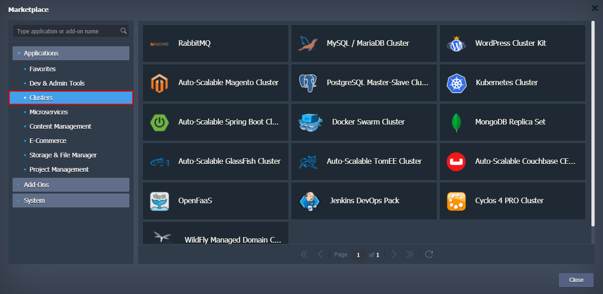
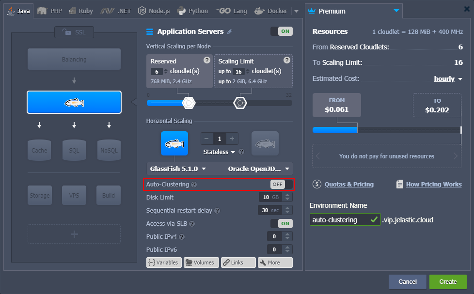
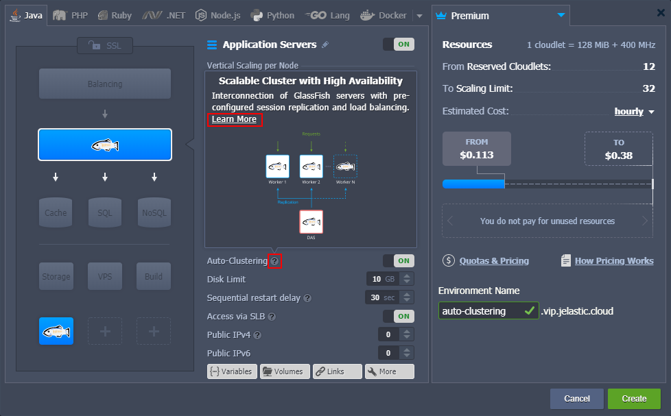
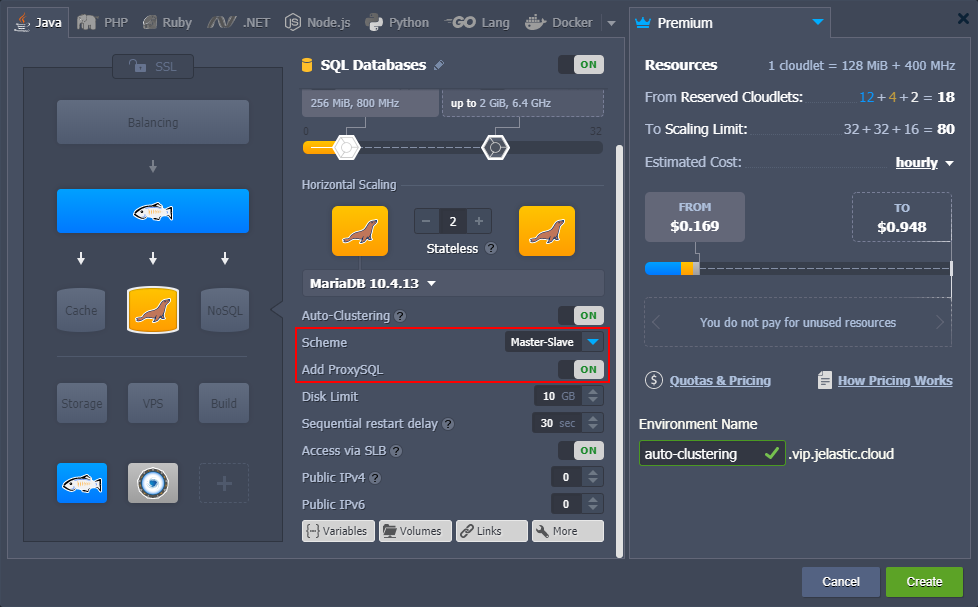

# What is Auto-Clustering

In the modern world, the importance of data availability cannot be underestimated. Herewith, you want to maintain immediate access to any required information at a moment's notice. Thus, for any production solution of any meaningful size, it is highly recommended to configure a **cluster**. Software clustering is the technique of using at least two instances for a service. Such redundancy not only provides reliability (the system can withstand a failure of at least one instance) but also helps to handle high load.

Based on the experience, the configuration of a cluster can be a challenging process that requires quite a lot of time investment. In order to help you out, the platform automates some of the most popular clusterization solutions and can perform them for you on-demand directly from [topology wizard](/setting-up-environment/). Such automation immensely simplifies and speeds up the creation of a reliable production-ready cluster for your project.

## Enabling Auto-Clustering

Currently, the following templates support the Auto-Clustering feature via the topology wizard:
- **application servers** - *[Tomcat/TomEE](/auto-clustering/#tomcattomee)*, *[GlassFish](/auto-clustering/#glassfish)*, *[Payara](/auto-clustering/#payara)*, *[Jenkins](/auto-clustering/#jenkins)*, *[WildFly](/auto-clustering/#wildfly)*
- **SQL databases** - *[MySQL](/auto-clustering/#mysql)*, *[MariaDB](/auto-clustering/#mariadb)*, *[Percona](/auto-clustering/#percona)*, *[PostgreSQL](/auto-clustering/#postgresql)*
- **NoSQL database** - *[Couchbase](/auto-clustering/#couchbase)*, *[MongoDB](/auto-clustering/#mongodb)*, *[Redis](/auto-clustering/#redis)*, *[OpenSearch](/auto-clustering/#opensearch)*
- **storage server** - *[Shared Storage Container](/auto-clustering/#shared-storage-container)*

{}**Tip:** In addition to the **Auto-Clustering** option in topology wizard, a number of prepackaged clusterization solutions can be found under the **Clusters** category of the platform [Marketplace](/marketplace/).

{}

1\. Select one of the listed stacks in the topology wizard. The appropriate **Auto-Clustering** switcher will be available in the central part of the frame.

2\. You can hover over the **hint** icon for additional information on this particular stack auto-clustering implementation. Within the description, you can find the **Learn More** link to documentation with a more extensive overview.

3\. Also, after enabling Auto-Clustering, some additional configs can appear for further customization of the cluster. For example, **MariaDB auto-cluster** allows to choose replication *Scheme* and add dedicated *ProxySQL* load balancer exclusively for this database cluster:

## Additional Materials on Auto-Clustering

The platform provides extensive documentation, multiple blog posts, and dedicated GitHub pages on the Auto-Clustering topic:
- [Auto-Clustering of Instances via Topology Wizard](/auto-clustering/) - lists stacks that support the feature, explains basic management via wizard and Cloud Scripting
- [MariaDB/MySQL Auto-Сlustering with Load Balancing and Replication](https://www.virtuozzo.com/company/blog/mysql-mariadb-database-auto-clustering-cloud-hosting/) - automatic clustering and replication for MariaDB and MySQL databases for high availability and performance
- [PostgreSQL Auto-Clustering with Asynchronous Master-Slave Replication](https://www.virtuozzo.com/company/blog/postgresql-auto-clustering-master-slave-replication/) - get multiple copies of essential data within automatic master-slave replication for PostgreSQL database
- [MongoDB Replica Set Auto-Сlustering for High Availability and Performance](/mongodb-auto-clustering/) - automatic clustering and replication for MongoDB databases for redundancy, automated failover, and high-availability
- [Out-of-Box GlassFish & Payara Clustering: Running Java EE Highly-Available Applications in the Cloud](https://www.virtuozzo.com/company/blog/glassfish-payara-auto-clustering-cloud-hosting/) - shows how to set up a highly-available cluster with GlassFish and Payara Micro for running Java EE applications
- [Jenkins Cluster Hosting for Continuous Integration and Delivery (CI/CD)](https://www.virtuozzo.com/company/blog/jenkins-cluster-hosting-continuous-integration-delivery/) - automate continuous integration and delivery of your Java applications using pre-configured master-slave Jenkins cluster
- [WildFly Managed Domain in Containers: Automatic Micro Clustering and Scaling](https://www.virtuozzo.com/company/blog/wildfly-managed-domain-in-containers-auto-micro-clustering-and-scaling/) - explains how to extend your WildFly from a standalone server to cluster in managed domain mode for running cloud-native microservices
- [Shared Storage Container Auto-Clustering](/shared-storage-container/) - configures a reliable storage cluster with *AutoFS*, *NFSv4*, and *GlusterFS* support
- [Solutions Collection on GitHub](https://github.com/jelastic-jps) - stores the platform automation solutions, including Auto-Clustering (e.g. [db-clustering](https://github.com/jelastic-jps/db-clustering), [wildfly](https://github.com/jelastic-jps/wildfly), [glassfish](https://github.com/jelastic-jps/glassfish), and other repositories)

## What's next?

- [Cluster in the Cloud](/cluster-in-cloud/)
- [Horizontal Scaling](/horizontal-scaling/)
- [Automatic Horizontal Scaling](/automatic-horizontal-scaling/)
- [Topology Wizard](/setting-up-environment/)
- [Marketplace](/marketplace/)
- [Software Stack Versions](/software-stacks-versions/)