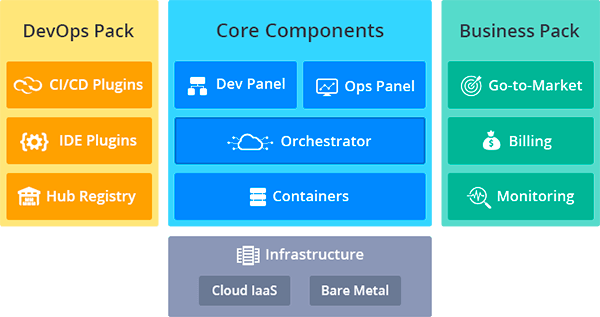
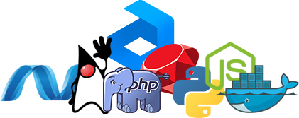

# What is PaaS & CaaS?

The platform is a [time-tested solution](https://www.virtuozzo.com/company/blog/5-year-anniversary-of-jelastic-lets-celebrate-together/) for cloud market, that combines benefits of both *Platform as a Service* (PaaS) and *Container as a Service* cloud models, provided within a single turnkey package. Such an approach unleashes the full potential of a cloud for enterprises, ISVs, hosting service providers and developers.
Combination of PaaS and CaaS solutions is much more than just a simple hosting platform. In fact, the provided software encompasses PaaS functionality, a complete infrastructure, smart orchestration, and containers support - all together.

The platform solutions provide the fastest deployment model, the maximum application density and comprehensive management for private, public and hybrid clouds, retaining the flexibility to customize infrastructure and application configurations.

Selling products directly to both **hosting providers (*public cloud*)** and **enterprises (*private* and *hybrid cloud*)** ensures benefits for all kinds of clients: 

* *enterprises* can slash costs and build a secure, scalable private cloud with our turnkey solution
* *hosting providers* can quickly address the developer market and deliver advanced PaaS functionality while achieving incredible application density and performance 
* and *developers* get the advantages of an advanced application environment with true elastic scaling, delivered with the highest performance at the lowest cost

From its inception, the PaaS was defined as an open platform supporting **multiple programming languages**. Today it supports Java, PHP, Ruby, Node.js, Python, .Net and, in addition, has the [Docker Standard Support](/dockers-overview) integrated.

Comparing to other solutions, the platform is unique in its **advanced functionality** and **simplicity**.
Here are some of the PaaS key benefits:

* a *turnkey Platform* for Public, Private, Hybrid and Multi-Cloud deployments with automated continuous integration, delivery and upgrade processes 
* support of numerous [software stacks](/software-stacks-versions), extended with [cartridges](/cartridges-overview) packaging model (more than 50 certified containers out-of-the-box) and custom [Docker containers](/dockers-overview)
* *automated replication *and true *automated scaling*, both [vertical](/automatic-vertical-scaling) and [horizontal](/automatic-horizontal-scaling) - all applications scale up and down on demand
* various *development environments* for the most comfortable work experience - intuitive [UI](/dashboard-guide/), open [API](/api-overview) and [SSH](/ssh-overview) access to containers 
* intelligent *workloads distribution* with multi-cloud and [multi-region](/environment-regions) management 
* *smart pricing integration* - alongside multiple billing systems support (like WHMCS, Odin Service Automation, custom ones etc.), the platform provides comprehensive billing engine, [quotas](/quotas-system) and access control policies
* 
embedded *troubleshooting tools* for [metering](/view-app-statistics), [monitoring](/load-alerts), [logging](/view-log-files), etc.

Summing this all up, the platform is able to bring a suitable [solution to meet any DevOps needs](https://jelastic.com/cloud-products/). Try it right now and you'll definitely love it!

## What's next?

* [PaaS Cluster Overview](/cluster-overview/)
* [Cloudlet](/cloudlet/)
* [Resources Utilization](/resources-utilization/)
* [Isolated Containers High Availability](/isolated-containers-migration/)
* [Cluster Access Levels](/cluster-access-levels/)