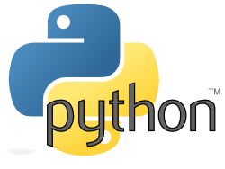
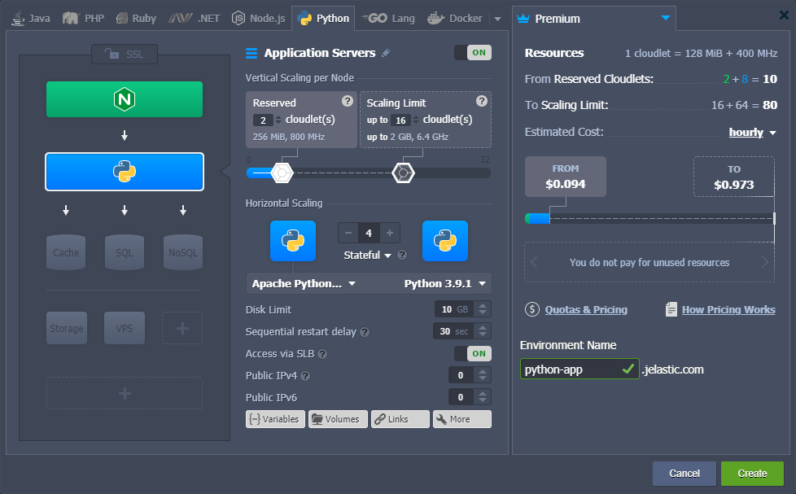
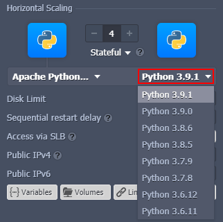
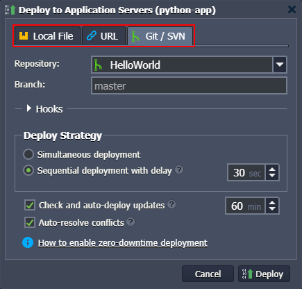
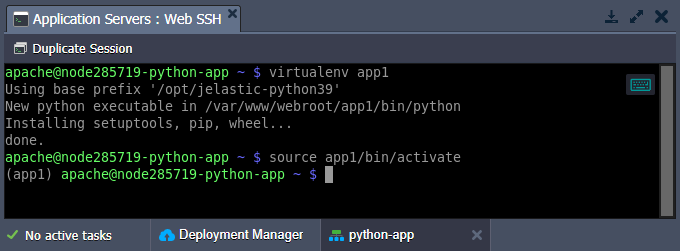
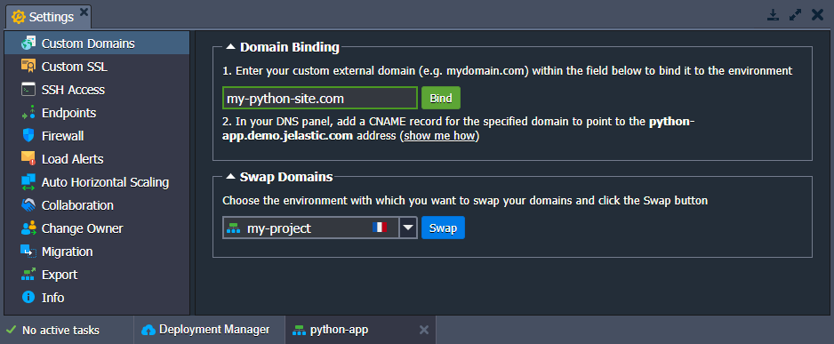
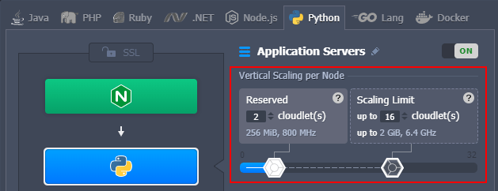
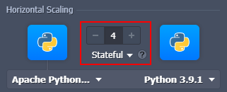
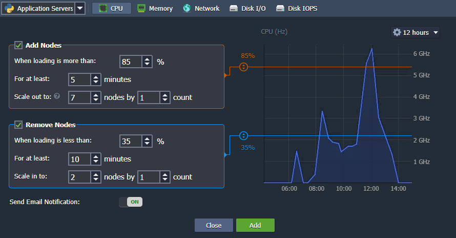

# Python Cloud Hosting

{}{}

The platform provides an out-of-box integration of the scalable *Apache* application server dedicated specially for the Python-based applications hosting. It is already optimized and prepared for immediate management, allowing to dive right into development without bothering about numerous orchestration tasks, i.e. making the hosting process maximally convenient for developers.

Through this article, you’ll get acquainted with the main tools and features available on the platform to provide the required level of Python cloud hosting. Use the table of content below to find required information within the guide quicker:

- [Python Environment Hosting](#python-environment-hosting)
- [Python Versioning](#python-versioning)
- [Python Application Deployment](#python-application-deployment)
- [Python Packages/Modules Management](#python-packagesmodules-management)
- [Domains Management](#domains-management)
- [Automatic Vertical Scaling](#automatic-vertical-scaling)
- [Manual Horizontal Scaling](#manual-horizontal-scaling)
- [Automatic Horizontal Scaling](#automatic-horizontal-scaling)
- [Database Connection to PHP Application](#database-connection-to-php-application)


## Python Environment Hosting

To start hosting your Python application at the platform, you need to [create](/setting-up-environment/) the appropriate environment via the powerful *topology wizard* (accessible through the **New Environment** button at the dashboard’s top panel).

Switch to the ***Python*** language tab and select the desired engine version. *Apache Python* application server is automatically added in a bundle with the *mod_wsgi* module. Specify resource limits and nodes' count, as well as add extra [software stacks](/software-stacks-versions/) or options (e.g. Public IPs) if required.

{}**Note:** This template utilizes a modern ***systemd*** initialization daemon.{}



{}**Notes:**

* Each instance is a fully independent [isolated container](/isolated-containers/).
* Instances of the same layer are automatically distributed across available hosts ensuring [high availability](/isolated-containers/#high-availability-for-applications).{}


## Python Versioning

Currently (at the time of this writing), the following Python versions are supported:

- 3.8.19
- 3.9.19
- 3.10.13
- 3.11.8
- 3.12.5

{}The up-to-date list of the releases available on the platform is provided via the dedicated, regularly (weekly) updated [Software Stack Versions](/software-stacks-versions/#engines) document.{}



You can select the required [version of Python](/python-versions/) directly from the topology wizard during the creation of a new environment, as well as adjust it for already existing ones using [container redeployment](/container-redeploy/).


## Python Application Deployment

Deployment to the managed application servers (*Apache Python*) is automated by the platform and can be performed using one of the following flows:

* from remote *VCS* repository (e.g. GitHub)
* via application *archive* uploaded by external URL or from the local machine



Git flow provides a possibility of sequential or simultaneous deploy, as well as [automatic redeployment](/git-svn-auto-deploy/) from the repository if new code changes appear.

Refer to the following guides for the detailed overview of the deployment process and the provided additional options:

- [Deployment Manager](/deployment-manager/)
- [Deployment Guide](/deployment-guide/)
- [Auto-Deploy Overview](/git-svn-auto-deploy/)
- [Deployment Hooks](/deployment-hooks/)

Check examples of the Python-based application hosting on the platform:

- [Django CMS](https://www.virtuozzo.com/company/blog/django-cms-installation-python-cloud-hosting/)
- [Mezzanine CMS](https://www.virtuozzo.com/company/blog/how-to-get-mezzanine-cms-inside-jelastic-cloud/)
- [Wagtail CMS](https://www.virtuozzo.com/company/blog/deploy-wagtail-python-cms/)


## Python Packages/Modules Management

In order to successfully deploy and run a Python application, some additional modules or other packages may be required to be installed. It is a common practice to run Python web applications in isolated ***[virtual environments](https://virtualenv.pypa.io/en/stable/)***, for example using the virtual environment tool, which allows managing projects independently and without the administrator privileges.

1\. Connect to the Python environment [via SSH](/ssh-access/) (using either a *local* or built-in *Web SSH* client)  to create and start a new virtual environment. Run the following commands:

```
virtualenv {appName}
source {appName}/bin/activate
```



2\. The management of the required software packages is commonly provided by ***[pip](https://pip.pypa.io/en/stable/)*** - a popular Python package management system for the [PiPI](https://pypi.org/) repository. Below, some of the most common commands are listed:

- ***pip install {packageName}*** - installs a necessary module
- ***pip uninstall {packageName}*** - removes previously installed module
- ***pip install -upgrade {packageName}*** - updates the specified module to its latest version
- ***pip install -r requirements.txt*** - installs all the modules, listed in the *requirements.txt* file
- ***pip list*** - shows the set of already installed modules

{}**Tip:** In the case of the preconfigured application packages (archives), all the dependencies are provided via the ***requirements.txt*** file, which is read during the deployment process to install the listed Python modules automatically. Also, it should contain the ***wsgi.py*** file with the entry point script for running an application inside a virtual environment using the *mod_wsgi* for Apache.{}


## Domains Management

If needed, the default domain name of your Python application can be replaced with a [custom one](/custom-domains/) via:

* **CNAME redirect** if using *Shared Load Balancer*; is recommended for ***dev*** and ***test*** environments
* **DNS A Record** if using *public IP*; can handle high traffic load and is suitable for ***production*** environments

In addition, the platform allows switching traffic between two environments quickly and without downtime (e.g. to seamlessly redirect customers to the newer application version) using the [swap domains](/swap-domains/) functionality or with the help of the ***SwapExtIps*** [API](https://docs.jelastic.com/api/#!/api/environment.Binder-method-SwapExtIps)/[CLI](/cli-ip-swap/) method.




## Automatic Vertical Scaling

Automatic vertical scaling implemented by the platform provides the exact amount of resources (RAM and CPU) that your application currently requires. As a result, you don’t need to waste your time continuously making load-related adjustments. And in combination with the [Pay-as-You-Use](https://www.virtuozzo.com/company/blog/deceptive-cloud-efficiency-do-you-really-pay-as-you-use/) pricing model, it ensures you never overpay for unused resources.

Just set the upper [cloudlets](/cloudlet/) limit (each one equals *128 MiB* of RAM and *400 MHz* of CPU) for your Python application server. Everything else will be handled by the platform automatically.



Refer to the [automatic vertical scaling](/automatic-vertical-scaling/) guide for additional details.


## Manual Horizontal Scaling

Horizontal scaling of the Python servers is no different from scaling any other instance at the platform - just specify the required number of nodes with the **+/-** buttons in the central part of the topology wizard. If needed, choose the preferred [scaling mode](/horizontal-scaling/#scaling-modes):

* ***Stateless*** - simultaneously creates all of the new nodes from the base image template
* ***Stateful*** - sequentially copies file system of the master container into the new nodes



{}**Tip:** For the proper request distribution, a [load balancer](/load-balancing/) instance is automatically added to the environment upon Python server scaling. Refer to the [horizontal scaling](/horizontal-scaling/#horizontal-scaling-specifics) documentation for more specifications.{}


## Automatic Horizontal Scaling

Navigate to the environment **Settings > [Auto Horizontal Scaling](/automatic-horizontal-scaling/)** section to set up custom triggers, which allow automatically increase/decrease the number of nodes due to the application load. Just choose a resource type to be monitored (*CPU*, *RAM*, *Network*, *Disk*) and the exact condition of scaling, the rest actions are automated. You’ll be informed about any changes with email notifications if the appropriate option is enabled.




## Database Connection to Python Application

A set of scalable and fully manageable database servers is available within the platform for you to easily install and use for the Python environment. To establish the connection, adjust your application following the instruction based on the database you require:

* [MySQL Connection](/connection-to-mysql-python/)
* [MongoDB Connection](/connection-to-mongodb-python/)

Besides, hosting at the platform allows using other built-in tools and features, for example:

- Custom or Built-In SSL
- Public IPv4 and IPv6
- A wide range of managed software stacks
- Container firewalls, endpoints, and environment isolation
- User-friendly UI and direct Web SSH access for management
- Open API and Cloud Scripting for automation
- Pay-as-you-use pricing model
- Collaboration functionality for teamwork
- Multi-cloud distribution

Explore high-quality Python hosting with the PaaS.


## What's next?

* [Setting Up Environment](/setting-up-environment/)
* [Dashboard Guide](/dashboard-guide/)
* [Deployment Guide](/deployment-guide/)
* [SSH Access](/ssh-access/)