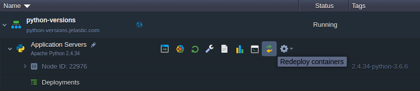

# Python Versions

The platform provides all the latest versions of the Python programming language and ensures a swift implementation of any further releases. The list of supported engine versions:

* *3.8.19*
* *3.9.19*
* *3.10.13*
* *3.11.8*
* *3.12.5*

{}The up-to-date list of the releases available on the platform is provided via the dedicated, regularly (weekly) updated [Software Stack Versions](/software-stacks-versions/#engines) document.{}

These can be selected during a new [environment creation](#create-python-environment) and adjusted for [existing Python instances](#change-python-version).

## Create Python Environment

1\. Access the topology wizard by clicking the **New Environment** button at the top of the dashboard.

2\. Navigate to the ***Python*** programming language tab, where the **Apache Python** application server is automatically selected, and choose the required engine version.

Adjust any other settings (e.g. [cloudlets limits](/automatic-vertical-scaling/), [public IPs](/public-ip/), [region](/environment-regions/), etc.), provide environment name and click **Create**.

## Change Python Version

The version of the existing Python instances can be changed with the [container redeploy](/container-redeploy/) feature.

1\. The appropriate dialog can be accessed in the following ways:

* from the central part of the topology wizard (can be accessed with the **Change Environment Topology** button next to the appropriate environment)

* using the **Redeploy container(s)** button next to the required node or layer

2\. Within the opened frame, you can adjust the following settings:

* **Tag** - select the needed Python engine version
* **Keep volumes data** - protect data in the volumes from erasing during redeploy
* **Simultaneous** or **Sequential deployment with delay** (for [scaled servers](/horizontal-scaling/) only) - choose whether all containers within a layer should be redeployed at once or one-by-one

Click **Redeploy** to proceed.

3\. Confirm an action via the appeared pop-up window.

That's it! In a minute the Python engine version of your container(s) will be updated.

## What's next?

* [Dashboard Guide](/dashboard-guide/)
* [Setting Up Environment](/setting-up-environment/)
* [Deployment Guide](/deployment-guide/)
* [Container Redeploy](/container-redeploy/)