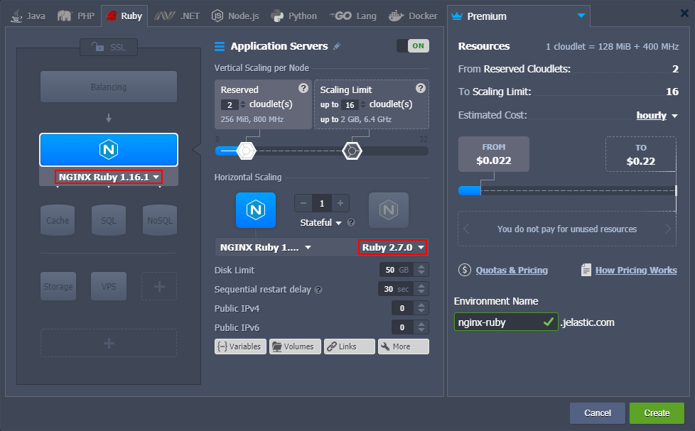
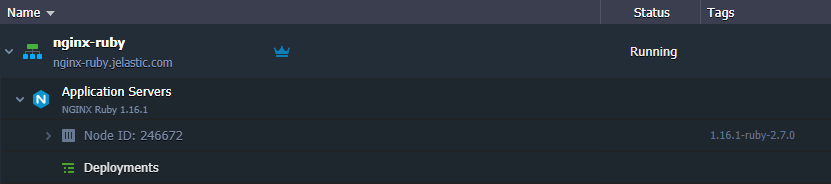

# NGINX Ruby

{}The *NGINX Ruby* stack is [HTTP/3](/http3/) ready with the feature support enabled by default since the *1.16.1* release for Ruby *2.4.9*, *2.5.7*, *2.6.5*, *2.7.0* versions and above. However, a [public IP address](/public-ip/) is required to bypass the Shared Load Balancer and work directly with the server over HTTP/3.{}

**NGINX Ruby** software stack is a combination of the highly popular, open-source *NGINX* web server with the pre-installed *Ruby* programming language. This combination utilizes the *Passenger* application server by default, but the stack can be easily reconfigured to change the [ruby application server](/ruby-application-server-config/) (to either *Puma* or *Unicorn*).

NGINX Ruby is suitable for any Ruby application due to its scalability, security, reliability, and cost-efficiency. Creating this stack at the platform can be done in just a few clicks in a matter of minutes.

{}**Note:** This template utilizes a modern ***systemd*** initialization daemon.{}

1\. Click the **New Environment** button at the top-left corner of the dashboard.

2\. Switch to the Ruby tab of the automatically opened topology wizard and choose **NGINX Ruby** as your application server. If needed, add any other stacks required for your environment.

Next, you can configure the [Ruby engine version](/ruby-versions/) and other parameters of the added stacks using the central part of the wizard (e.g. set [scaling limit](/automatic-vertical-scaling/), [nodes count](/horizontal-scaling/), attach [public IPs](/public-ip/), etc.). When ready, provide the desired environment name and click **Create**.

3\. In a minute, your environment will appear on the dashboard.

Now, you can proceed to the deployment of your application to the NGINX Ruby serber.

## What's next?

* [Deployment Guide](/deployment-guide/)
* [Ruby App Server Configuration](/ruby-application-server-config/)
* [Ruby Dependency Management](/ruby-dependency-management/)
* [Ruby Post Deploy Configuration](/ruby-post-deploy-configuration/)