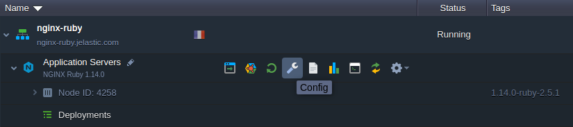
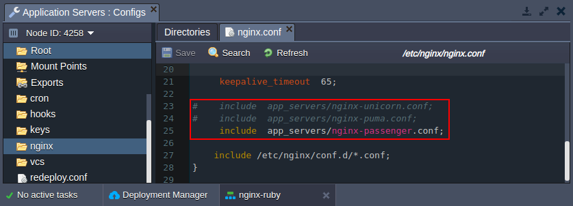
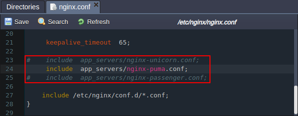
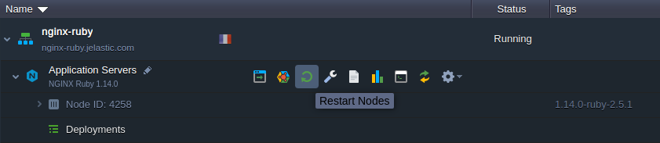
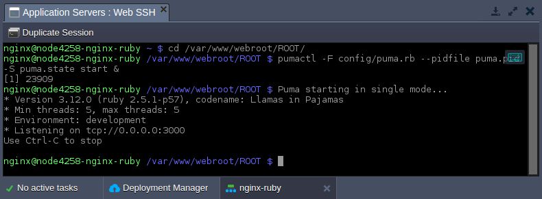

# Ruby Application Server Configuration

The platform provides Ruby application servers based on the two software stacks:

* **Apache Ruby**
* **NGINX Ruby**

Herewith, both ones are configured to utilize the **Passenger** application server by default, which is integrated via the appropriate custom module. Moreover, if needed, the *NGINX Ruby* stack can be easily configured to work with the different inbuilt servers:

* ***[Passenger](https://www.phusionpassenger.com/)*** - one of the most feature rich application servers for Ruby, which are invaluable for the modern web apps and microservice APIs
* ***[Puma](http://puma.io/)*** - a Ruby web server oriented on speed and parallelism due to fast and accurate HTTP 1.1 protocol parsing
* ***[Unicorn](https://bogomips.org/unicorn/)*** - an HTTP server, which takes advantage of the Unix/Unix-like kernels features for serving fast clients on low-latency, high-bandwidth connections

Let's see how it can be switched on the NGINX Ruby server.

## NGINX Application Server Modules
The **Passenger** module is used for all newly created Ruby environments by default. Follow the next steps to change to the different one:

1\. Click the **Config** button next to your *NGINX Ruby* application server.


2\. Within the opened [configuration file manager](/configuration-file-manager) panel, navigate to the **/etc/nginx/<i>nginx.conf**</i> file. Find the ***include app_servers*** strings:

* *include app_servers/nginx-unicorn.conf*
* *include app_servers/nginx-puma.conf*
* *include app_servers/nginx-passenger.conf*


3\. Uncomment the string with the required module and comment the previously active one.
{}**Note:** Only <u>*one*</u> string for the application server module should be active, otherwise you'll get the compatibility errors.{}

For example, we'll switch to ***Puma***.

4\. **Save** the changes and **Restart Nodes** of the NGINX application server to apply them.


5\. Access your node via SSH (e.g. using [Web SHH](/web-ssh-client)) and run the selected module with the appropriate command executed from the project directory:
```bash
cd /var/www/webroot/ROOT/
pumactl -F config/puma.rb --pidfile puma.pid -S puma.state start &
```
{}**Note:** For the ***Unicorn*** application server run the ***unicorn_rails -c config/unicorn.rb -D &*** command instead.{}


{}**Note:** If you would like to switch to the different module, it could be done in the same way, but you need to stop the currently running application server:

* *for Puma:* ***pumactl -F config/puma.rb --pidfile puma.pid -S puma.state stop***
* *for Unicorn:* ***ps aux | grep 'unicorn' | awk '{print $2}' | xargs kill -QUIT***
{}
That's all! Now you can work with the chosen Ruby NGINX module.


## What's next?
* [Deployment Guide](/deployment-guide/)
* [Configuration File Manager](/configuration-file-manager/)
* [Ruby Dependency Management](/ruby-dependency-management/)
* [Ruby Post Deploy Configuration](/ruby-post-deploy-configuration/)