# How to Deploy Redmine

**Redmine** is an open-source web-based system for projects managing and bugs tracking. Written using the Ruby on Rails framework, it is cross-platform and cross-database.

In this tutorial we will show you how to install and run your own Redmine application within the platform.

You can have a **Redmine** instance up and running within minutes using one-click install option.

<div data-app="redmine" data-width="280" data-theme="flat-green" data-text="Get it hosted now!" data-tx-empty="Type your email and click the button" data-tx-invalid-email="Invalid email, please check the spelling" data-tx-error="An error has occurred, please try again later" data-tx-success="Check your email" class="je-app">
</div>

The process is simple - just click **Get it hosted now**, type your email and install Redmine in a minute skipping the steps of manual installation.

Find the full list of applications available for one-click installation at our [Marketplace page](https://www.virtuozzo.com/application-platform/marketplace/).

In case you would like to configure and run your Redmine instance manually, just follow the step-by-step instruction below.


## Environment Creation

1\. Log in to the platform dashboard and click **Create environment** button.

2\. Navigate to the **Ruby** tab, pick **Apache** as your application server and **MySQL** as database. Specify cloudlet limits for chosen nodes, name your environment (e.g. *redmine*) and click **Create**.

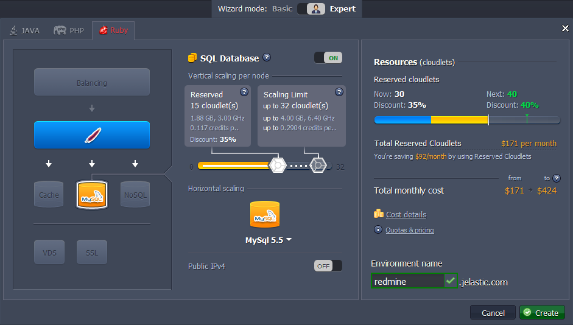

3\. Wait for creation to complete, it will take just a minute.

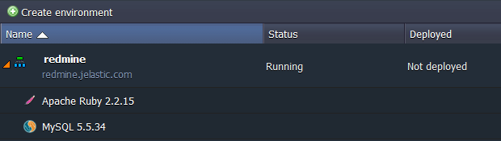


## Redmine Deployment

1\. Open the official [Redmine web-site](https://www.redmine.org/projects/redmine/wiki/Download) and download its latest stable release as **.tar.gz** or **.zip** archive.

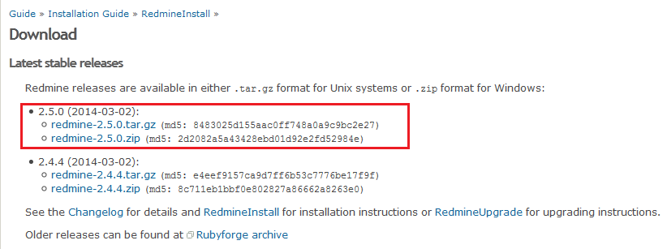

2\. Navigate back to the platform dashboard and upload this archive via Deployment Manager.

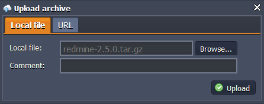

3\. Finally, deploy the Redmine package to the created before environment. For that click the **Deploy to..** button next to the uploaded archive and choose desired environment. 

Then select the application deployment type (*Production* in our case) and click **Deploy** button.

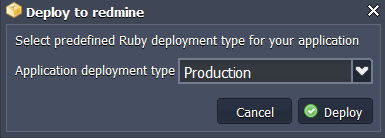

In a few moments Redmine will be hosted within chosen environment.


## Database Configurations

1\. Press **Open in Browser** button for MySQL node in the environment.

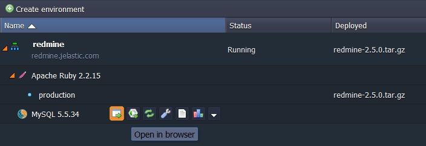

2\. Log in to the admin panel using credentials the platform sent you after environment creation. Navigate to the **SQL** tab.

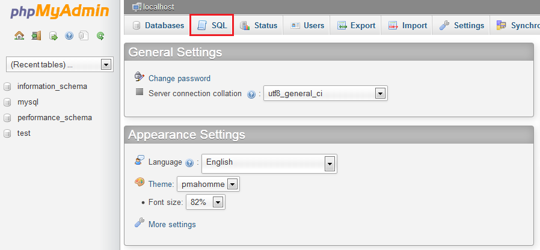

3\. You'll see the empty form for executing SQL request. Enter the following line there and click **Go** to create a new databese.

```
CREATE DATABASE redmine CHARACTER SET utf8;
```

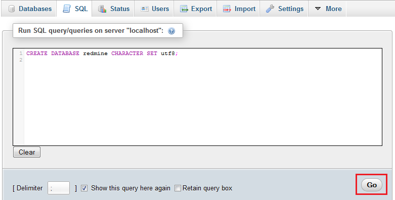 

4\. Then navigate back to the platform dashboard and click **Config** button next to the **Apache** server.

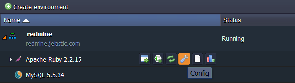

5\. In the opened Configuration Manager navigate to the **webroot > ROOT > config** folder, find ***database.yml.example*** file and copy its content.

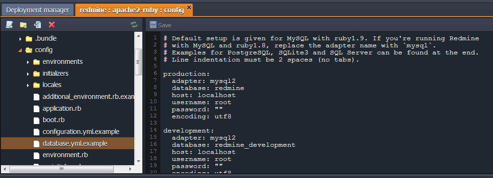

6\. Then create new ***database.yml*** file in the same (**config**) folder and paste the copied strings to it.

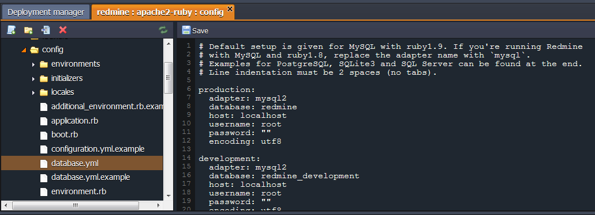

7\. Now you need to configure the connection to DB using the data of your MYSQL database.

Section for custom configurations should be chosen depending on the deployment type you've selected while environment creation (*production* in our case).

Specify MySQL ***host*** (URL to your database without *http://*) and credentials you've received while environment creation in ***username*** and ***password*** strings.

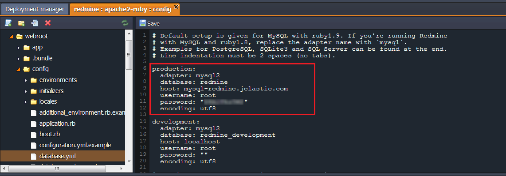

{}**Note:** In case you are going to change the deployment type to another one (*development* or *testing*) later, you should specify these connection parameters in all appropriate sections as well.{}

8\. **Save** the changes made.


## Application Server Configurations

1\. Click **Config** button for **Apache** node in your environment.


2\. In the **webroot > ROOT** folder create a new file and name it ***rake_deploy***.


3\. Paste the following strings into the newly created file:  

```
generate_secret_token
db:migrate
redmine:load_default_data
```

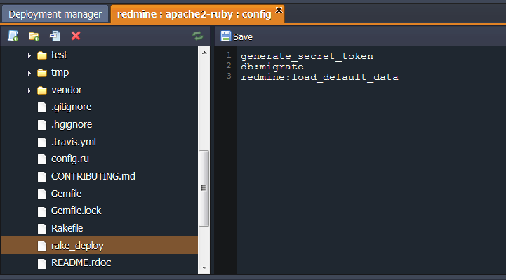

4\. **Save** the changes and **Restart** Apache node.

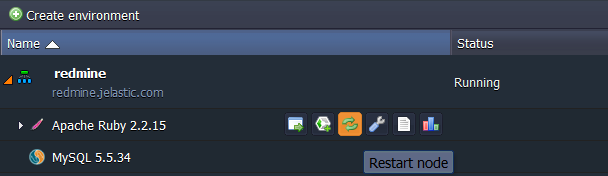

5\. Finally, press the **Open in Browser** button next to your environment.

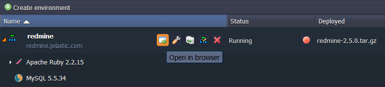

Your Redmine application's home page will be open.

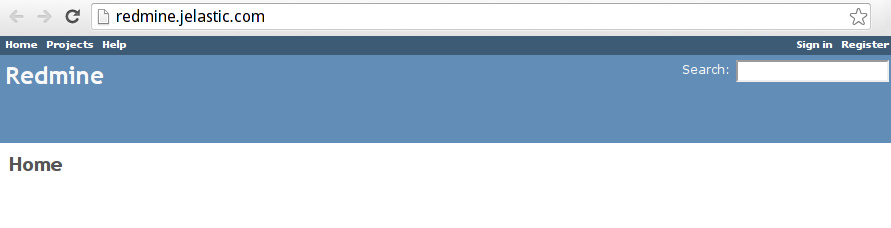

That's all. Now you have your own Redmine application up and running in the platform. Enjoy!


## What's next?

* [Deployment Manager](/deployment-manager/)
* [Deployment Guide](/deployment-guide/)
* [Ruby Post Deploy Configuration](/ruby-post-deploy-configuration/)
* [Ruby Dependency Management](/ruby-dependency-management/)

<script>
    (function(d, s, id) {
        var js, fjs = d.getElementsByTagName(s)[0];
        if (d.getElementById(id)) return;
        js = d.createElement(s); js.id = id;
        js.async = true;
        js.src = "//go.jelastic.com/widgets.js";
        fjs.parentNode.insertBefore(js, fjs);
    }(document, 'script', 'jelastic-jssdk'));
</script>
