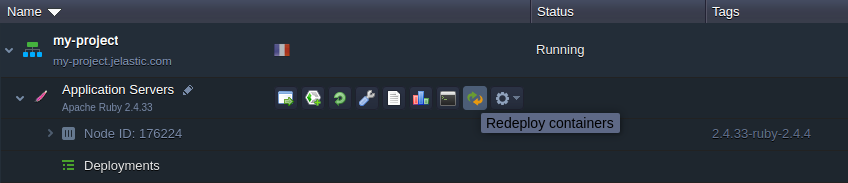

# Ruby Versions

The platform supports all of the latest major releases of the Ruby engine and provides the regular updates of the appropriate stacks, keeping them up-to-date. Currently, the following Ruby versions are available:

* *3.0.6*
* *3.1.6*
* *3.2.5*
* *3.3.4*

{}The up-to-date list of the releases available on the platform is provided via the dedicated, regularly (weekly) updated [Software Stack Versions](/software-stacks-versions/#engines) document.{}

You can choose the required one during [environment creation](#create-ruby-environment) and quickly [switch between](#change-ruby-version) them afterward.

## Create Ruby Environment

1\. Click the **New Environment** button at the top of the dashboard.

2\. Within the opened topology wizard, switch to the ***Ruby*** tab and select the desired application server (*Apache* or *NGINX*). Next, choose the engine version with the appropriate drop-down list in the central part of the frame.

Configure any other desired customization (e.g. cloudlets limit, [public IP](/public-ip/), [region](/environment-regions/), etc.) and click **Create**.

## Change Ruby Version

For the already existing environments, you can change the Ruby version by [redeploying container(s)](/container-redeploy/):

1\. There are two options to access container update dialog:

* via the topology wizard (use the **Change Environment Topology** button next to the appropriate environment) by clicking on the stack/tag version in the central dialog part

* with the appropriate **Rededeploy container(s)** button next to the required node/layer

2\. In the opened window, adjust the following settings:

* ***Tag*** - allows choosing the needed Ruby version
* ***Keep volumes data*** - saves data in [volumes](/container-volumes/)
* ***Simultaneous*** or ***Sequential deployment with delay*** (for [scaled servers](/horizontal-scaling/) only) - defines whether all containers within a layer should be redeployed at once or one-by-one, to avoid downtime

3\. Click **Redeploy** and confirm via the appeared pop-up frame.

In a minute, the Ruby version of your node(s) will be updated.

## What's next?

* [Dashboard Guide](/dashboard-guide/)
* [Setting Up Environment](/setting-up-environment/)
* [Ruby App Server Configuration](/ruby-application-server-config/)
* [Container Update](/container-redeploy/)