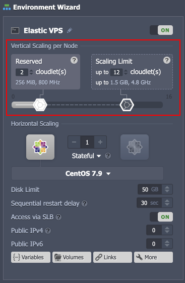

# Elastic VPS Billing

Billing is among the most critical hosting criteria. In this regard, the Virtuozzo Elastic Hosting Platform provides a number of remarkable benefits to stand out from the regular cloud hosting.

Usually, the hosting pricing is fixed, which can be bad for new projects with little traffic. When starting, you typically don't know the exact volume of the expected load. It makes it tricky to request the right amount of resources, ensuring that it is enough to handle the variable load without overpaying for the unused resources. However, the Virtuozzo Elastic Hosting Platform helps you solve this [right-sizing](https://thenewstack.io/the-right-sizing-problem-in-cloud-computing-and-how-to-solve-it/) problem through its default flexible pricing model. Here, you only pay for the services obtained rather than settling for a certain amount of resources that may or may not be used.

{}**Note:** The flexible pricing model is not available for VMs, you pay a fixed price for the bulk of resources that may or may not be used. If preferred, the similar subscription-based pricing can be configured manually for VPS instances on the platform as well.{}

## Pay-per-Use Pricing

In contrast to most vendors, Virtuozzo Elastic Hosting Platform provides a truly user-oriented **Pay-per-Use** charging approach with automatic scaling based on your current need. You don't need to guess or predict the incoming load with such an implementation. According to the environment's current requirements, the platform automatically provides the required resources (within the user-defined scaling diapason).

{}**TLDR:** You set a scaling limit (no surprise over top bills) but pay for the actually used resources only.

{}

Flexible usage-based pricing is ensured with the [automatic vertical scaling](/automatic-vertical-scaling/) feature and granular resource allocation using the [cloudlets](/cloudlet/) units (*128MiB* of RAM and *400MHz* of CPU). The process is fully automated. You can set the lower and upper limits for your environments during creation and change it for existing servers by hovering over and clicking the **Change Environment Topology** button. Provide the desired scaling range and confirm with **Apply** to re-adjusted at any time.

You can watch a short [video](https://www.youtube.com/watch?list=PLkntuNwly7TcU_IAoiZhxxQuq9nUsQQ5r&v=D7DuNpIq7h0&feature=emb_imp_woyt) on how flexible pricing works and the problems it helps to solve.

## What's next?

- [Elastic Hosting Platform](/virtuozzo-elastic-hosting-platform/)
- [CentOS Elastic VPS](/elastic-vps-centos/)
- [Ubuntu Elastic VPS](/elastic-vps-ubuntu/)
- [Debian Elastic VPS](/elastic-vps-debian/)
- [VzLinux Elastic VPS](/elastic-vps-vzlinux/)
- [Elastic Windows VM](/elastic-windows-vm/)