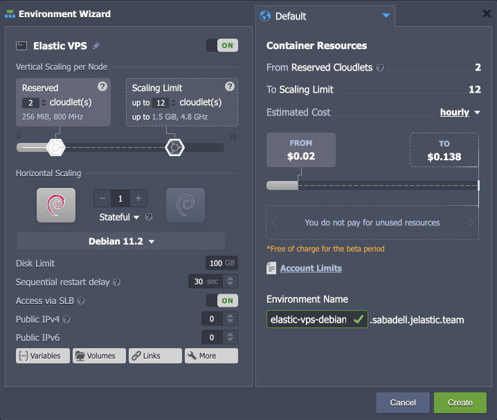
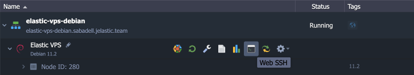

# Elastic Debian VPS

{}{}

**[Debian](https://www.debian.org/)** is a free operating system that commits to the principles of open-source software and offers a continually developing solution with flexible, secure, and versatile performance capabilities. Debian provides a set of basic programs and utilities to run an OS and a wide variety of supplementary application software packages. Such a solution has a lightweight core that can easily be customized up to your particular needs using the dedicated package manager for the required software and bundles installation.

The platform delivers Debian with all the benefits of Elastic VPS (security guarantees, cost efficiency, root permissions, etc.).

## Debian VPS Installation

1\. Click the **New Environment** button at the top of the dashboard.

2\. Within the opened wizard, select the required OS for your Elastic VPS server (**Debian** in our case).

Here, the following configuration options are available before the installation:

- ***Vertical Scaling per Node*** - configure the upper and lower resource limits for [automatic vertical scaling](/automatic-vertical-scaling/)
- ***Horizontal Scaling*** - set the required [number of same-type nodes](/horizontal-scaling/)
- ***Disk Limit*** - allocate required disk space quantity
- ***Sequential restart delay*** - set a delay between restart operation on different nodes (required to ensure availability of at least one server when restarting scaled VPS)
- ***Access via SLB*** - allow or deny access to your VPS via the platform's [Shared Load Balancer](/shared-load-balancer/#deny-access-via-shared-load-balancer)
- ***Public IP*** - add [public IP](/public-ip/) (IPv4 or IPv6) for external access
- ***Region*** - select the target [region](/environment-regions/)
- ***Environment Name*** - set the environment name within the platform domain

Click **Create** to proceed.

3\. In a few minutes, your VPS instance will be created.

That's all! You can start managing your VPS server right away with a built-in [Web SSH](/web-ssh-client/) client or check the after-creation email for additional access information.

## What's next?

- [Elastic Hosting Platform](/virtuozzo-elastic-hosting-platform/)
- [CentOS Elastic VPS](/elastic-vps-centos/)
- [Ubuntu Elastic VPS](/elastic-vps-ubuntu/)
- [VzLinux Elastic VPS](/elastic-vps-vzlinux/)
- [Elastic Windows VM](/elastic-windows-vm/)
- [Elastic VPS Billing](/elastic-vps-billing/)