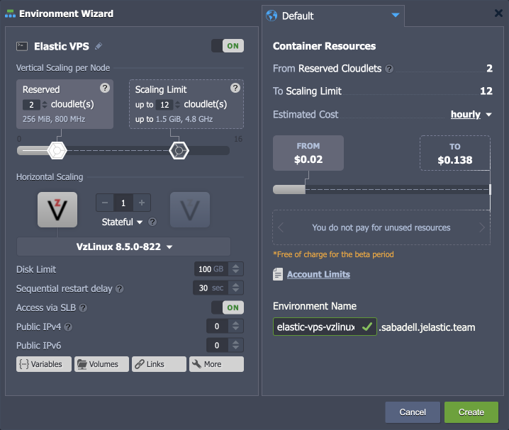
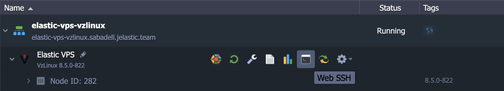

# Elastic VzLinux VPS

{}{}

**[VzLinux](https://vzlinux.org/)** is a free and open-source base operating system for OpenVz that is used as a guest operating system for containers and virtual machines. It has accumulated 20-years of experience in the field to provide consistent releases ahead of CentOS.​ VzLinux is optimized for running in high dense system container and virtual environments.​
 
The platform delivers VzLinux with all the benefits of Elastic VPS (security guarantees, cost efficiency, root permissions, etc.).

## VzLinux VPS Installation

1\. Click the **New Environment** button at the top of the dashboard.

2\. Within the opened wizard, select the required OS for your Elastic VPS server (**VzLinux** in our case).

{}**Tip:** The **VzLinux** template is based on the official *[virtuozzo/vzlinux8:8.5.0-822](https://hub.docker.com/r/virtuozzo/vzlinux8)* Docker image.{}

Here, the following configuration options are available before the installation:

- ***Vertical Scaling per Node*** - configure the upper and lower resource limits for [automatic vertical scaling](/automatic-vertical-scaling/)
- ***Horizontal Scaling*** - set the required [number of same-type nodes](/horizontal-scaling/)
- ***Disk Limit*** - allocate required disk space quantity
- ***Sequential restart delay*** - set a delay between restart operation on different nodes (required to ensure availability of at least one server when restarting scaled VPS) 
- ***Access via SLB*** - allow or deny access to your VPS via the platform's [Shared Load Balancer](/shared-load-balancer/#deny-access-via-shared-load-balancer)
- ***Public IP*** - add [public IP](/public-ip/) (IPv4 or IPv6) for external access
- ***Region*** - select the target [region](/environment-regions/)
- ***Environment Name*** - set the environment name within the platform domain

Click **Create** to proceed.

3\. In a few minutes, your VPS instance will be created.

That's all! You can start managing your VPS server right away with a built-in [Web SSH](/web-ssh-client/) client or check the after-creation email for additional access information.

## What's next?

- [Elastic Hosting Platform](/virtuozzo-elastic-hosting-platform/)
- [CentOS Elastic VPS](/elastic-vps-centos/)
- [Ubuntu Elastic VPS](/elastic-vps-ubuntu/)
- [Debian Elastic VPS](/elastic-vps-debian/)
- [Elastic Windows VM](/elastic-windows-vm/)
- [Elastic VPS Billing](/elastic-vps-billing/)