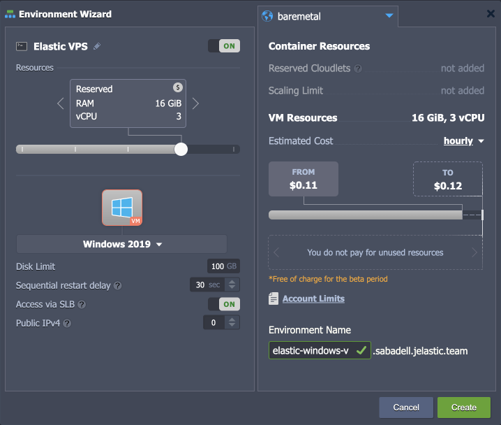
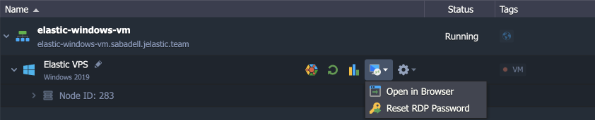

# Elastic Windows VM

{}{}

**[Windows](https://www.microsoft.com/)** hosting support allows developers and ISV companies to host web applications and services that are run on the Windows operating system. Platform combines the functionality of a Virtual Machine with the availability of the Cloud to complement the strength of the operating system. Windows Server is the platform for building an infrastructure of connected applications, networks, and web services, from the workgroup to the data center.

In this guide, we'll show how to create a Windows VM server and the VMs hosting specifics compared to the regular VPS containers used on the platform.

{}**Note:** The availability of the Window VMs on the platform depends on the particular service hosting provider settings.{}

## Windows VM Installation

1\. Click the **New Environment** button at the top of the dashboard.

2\. Within the opened wizard, select the required OS for your Elastic VPS server (**Windows VM** in our case).

Here, the following configuration options are available before the installation:

- ***Resources*** - choose from the available fixed plans for your virtual machine (hover over the price icon to view all the available tariffs)
- ***Disk Limit*** - allocate required disk space quantity
- ***Sequential restart delay*** - set a delay between restart operation on different nodes (required to ensure availability of at least one server when restarting scaled VMs)
- ***Access via SLB*** - allow or deny access to your VPS via the platform's [Shared Load Balancer](/shared-load-balancer/#deny-access-via-shared-load-balancer)
- ***Public IP*** - add [public IP](/public-ip/) (IPv4) for external access
- ***Region*** - select the target [region](/environment-regions/)
- ***Environment Name*** - set the environment name within the platform domain

Click **Create** to proceed.

3\. In a few minutes, your VM instance will be created.

{}**Tip:** You can find additional information on managing your [Windows VMs](/win-vm/) in the linked guide.{}

That's all! You can start managing your VPS server right away with a built-in [RDP](/win-rdp-access/) client or check the after-creation email for additional access information.

## What's next?

- [Elastic Hosting Platform](/virtuozzo-elastic-hosting-platform/)
- [CentOS Elastic VPS](/elastic-vps-centos/)
- [Ubuntu Elastic VPS](/elastic-vps-ubuntu/)
- [Debian Elastic VPS](/elastic-vps-debian/)
- [VzLinux Elastic VPS](/elastic-vps-vzlinux/)
- [Elastic VPS Billing](/elastic-vps-billing/)