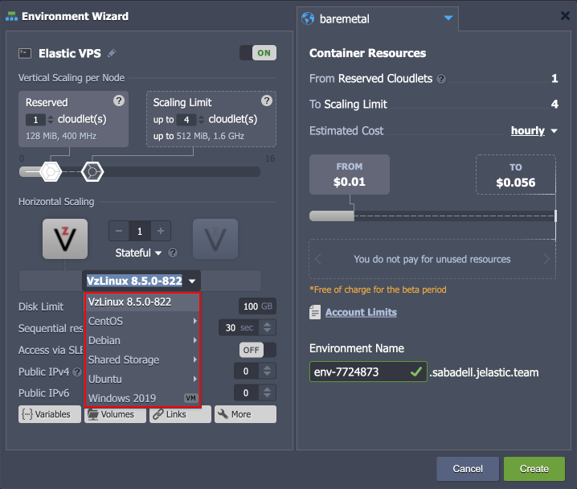

# Virtuozzo Elastic Hosting Platform

**Virtuozzo Elastic Hosting Platform** is a DevOps platform dedicated to VPS hosting specifically. [Virtual Private Server (VPS)](/vps/) is an individual container (virtual machine), which is basically a functional equivalent of a separate physical computer. Together with full isolation and focus on your particular needs, VPS ensures high level privacy and can be configured to run server software for your services and applications hosting.​

Main features of the Elastic VPS stacks:​

- ***insulation*** - each given VPS represents a completely independent instance and can’t be influenced by any other account on the hardware​
- ***full control*** - it is possible to manage your virtual machine in any preferred way due to the provided root permissions​
- ***scalability*** - the server can be automatically scaled vertically and horizontally by setting the resource limits and specific triggers within platform​
- ***cost effectiveness*** - VPS hosting is a relatively cheap web hosting service (compared to the cost of purchase and maintenance of a real dedicated physical server)

The platform offers several prepackaged templates for different popular operating systems (*CentOS*, *Debian*, *Ubuntu*, *VzLinux*, *Windows*), which covers most use cases. Below, you can find a list of all the VPS templates available on the platform:

- **[CentOS](/elastic-vps-centos/)** - a free community-driven project, with open-source code delivered from RHEL Linux distribution
- **[Ubuntu](/elastic-vps-ubuntu/)** - one of the most popular operating systems for running virtual private servers inside the Cloud
- **[Debian](/elastic-vps-debian/)** - a free operating system that commits to the principles of open-source software and offers a continually developing solution with flexible, secure, and versatile performance capabilities
- **[VzLinux](/elastic-vps-vzlinux/)** - a revolutionary approach to outsourcing website and IT management and is rapidly becoming the option of choice for businesses and individuals
- **[Windows VM](/elastic-windows-vm/)** (enabled by request) - virtual machine allows developers and ISV companies to host web applications and services that are based on the Windows operating system

{}**Tip:** Additionally, the **[Shared Storage](/shared-storage-container/)** template is available as a dedicated data storage node for your projects.{}

## Platform Benefits

Virtuozzo Elastic Hosting Platform provides numerous features that can significantly enhance your VPS development and hosting experience:

- automatic VPS instance installation based on the preferred OS
- [robust dashboard](/dashboard-guide/) with numerous environment and node management options; some features you may like:
  - [built-in file manager](/configuration-file-manager/)
  - [Web SSH client](/web-ssh-client/)
  - dedicated [public IP](/public-ip/) (IPv4 and IPv6)
  - built-in [statistics monitoring](/view-app-statistics/) and configurable [load alerts](/load-alerts/)
  - [powerful API](https://www.virtuozzo.com/application-platform-api-docs/) for automation and scripting
  - [flexible account collaboration](/account-collaboration/)
  - ensured account safety with [two-factor authentication](/two-factor-authentication/)
- automation [Import JPS](/environment-import/#jps-deployment--troubleshooting) tool
- the true [pay-per-use](/elastic-vps-billing/) pricing model

## What's next?

- [CentOS Elastic VPS](/elastic-vps-centos/)
- [Ubuntu Elastic VPS](/elastic-vps-ubuntu/)
- [Debian Elastic VPS](/elastic-vps-debian/)
- [VzLinux Elastic VPS](/elastic-vps-vzlinux/)
- [Elastic Windows VM](/elastic-windows-vm/)
- [Elastic VPS Billing](/elastic-vps-billing/)