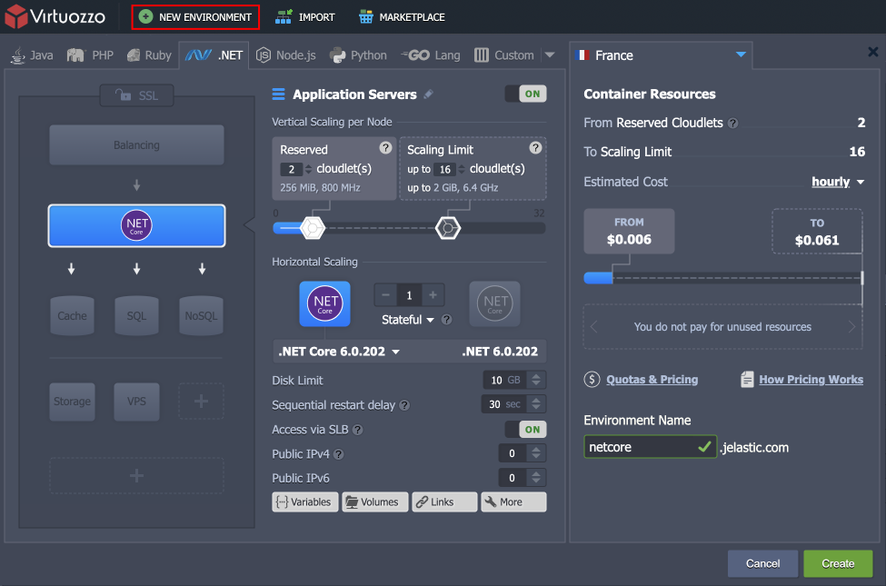
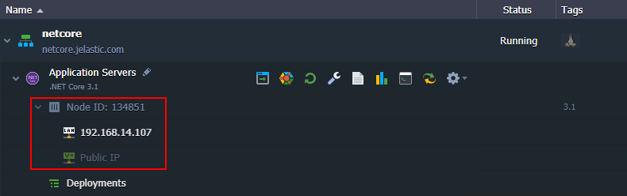
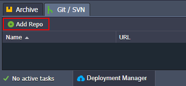
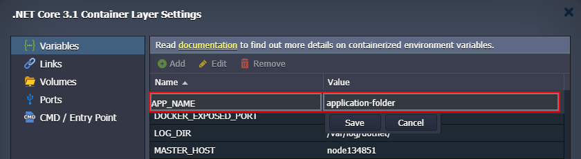
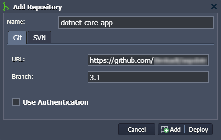
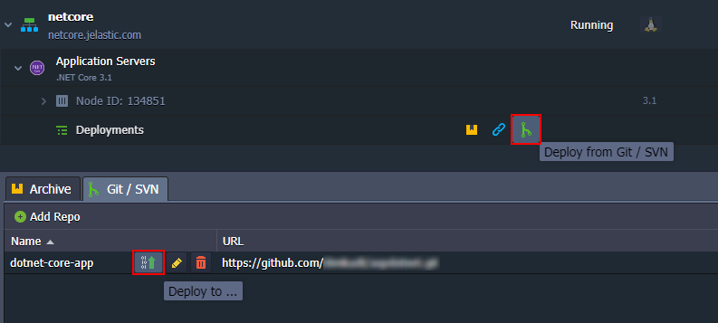
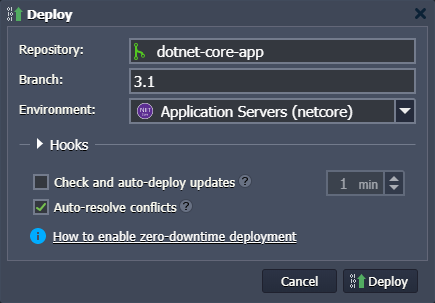

# .NET Core Application Server

**[.NET Core](https://docs.microsoft.com/en-us/dotnet/core/about)** is an open-source, cross-platform version of .NET for building websites, services, and console applications. Often it is used for cloud applications or refactoring large enterprise applications into microservices.

.NET Core consists of the following components:

* **[.NET Core runtime](https://github.com/dotnet/runtime/tree/master/src/coreclr)** - provides essential services (type system, assembly loading, garbage collector, etc.). [Framework libraries](https://github.com/dotnet/runtime/tree/master/src/libraries) provide primitive data types, app composition types, and fundamental utilities
* **[ASP.NET Core runtime](https://github.com/dotnet/aspnetcore)** - provides a framework for building modern, cloud-based, internet-connected applications (*web apps*, *IoT apps*, and *mobile backends*)
* **[.NET Core SDK](https://github.com/dotnet/sdk)** and language compilers ([Roslyn](https://github.com/dotnet/roslyn) and [F#](https://github.com/microsoft/visualfsharp)) - allow the development of the .NET Core projects
* **[dotnet command](https://docs.microsoft.com/en-us/dotnet/core/tools/dotnet)** - launches .NET Core applications and CLI commands. It selects and hosts the runtime, provides an assembly loading policy, and launches apps and tools

{}**Notes:**

- This stack availability depends on the particular hosting provider settings.
- This template utilizes a modern ***systemd*** initialization daemon.
{}

## Creating .NET Core Server

1\. Log in to the PaaS dashboard and click the **New Environment** button at the top-left corner.

2\. Within the opened [topology wizard](/setting-up-environment/), navigate to the **.NET** tab and select the ***.NET Core*** application server. Configure the other parameters (*[cloudlets](/cloudlet/)*, *disk limit*, *[public IPs](/public-ip/)*, etc.) up to your needs.

Click **Create** to proceed.

3\. Your environment with the *.NET Core* server will be created in a few minutes.

The application server operates in a separate container (node) - an isolated virtualized instance - provisioned for a software stack. The container has its own private IP and unique DNS record.

## Deploying Application to .NET Core Server

The platform provides multiple options to automatically [deploy projects](/deployment-guide/). In this example, we'll add a simple .NET project stored on GitHub.

1\. Open the ***Git/SVN*** tab of the **[Deployment Manager](/deployment-manager/#git--svn-projects)** to add a new repository. 

{}**Tip:** If you are interested in [creating your own .NET application](https://docs.microsoft.com/en-us/aspnet/core/tutorials/razor-pages/razor-pages-start) follow the official documentation.{}

2\. Provide the necessary *URL* and *Branch* for your project.

{}**Note:** .NET Core supports several specific [variables](/container-variables/) that can help with application deployment:

- ***APP_NAME*** - points to the particular folder (if there are multiple applications in a single repository) or runs a specific ***.dll*** file in your project
- ***ASPNETCORE_URLS*** - configures services to work with the specified URL
- ***RUN_OPTION*** - provides additional ***dotnet run*** options for your project

{}

Click **Add** to save the project in your Deployment Manager.

3\. Open the deployment dialog using one of the two buttons in the image below:

4\. Within the opened frame, you need to select an application to be deployed, branch, and the target environment.

{}**Note:** Similar to the *Python*, *Node.js*, and *Go* programming languages, the **.NET Core** has a single context (i.e. only one app can be deployed at a time).{}

Configure any other parameters according to your needs by following the deployment guide.

5\. In a minute, the application will be deployed and can be accessed using the **Open in Browser** button next to the .NET Core application server.

Your web application should be opened in a new browser tab. In our case, it is just a simple .NET website.

Use this guide as a reference to deploy your own application to the .NET Core server.

## What's next?

* [Windows VM](/win-vm/)
* [Windows RD Access](/win-rdp-access/)
* [Windows Roles & Features](/win-vps-roles-features/)