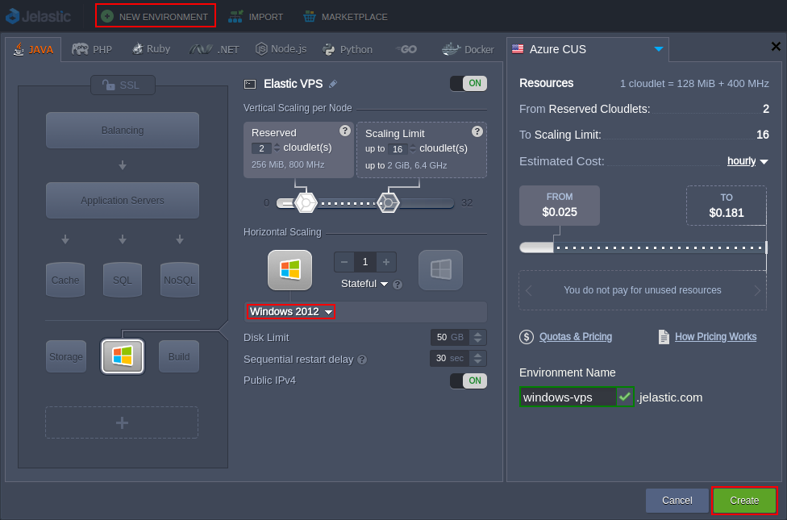

# Elastic Windows VPS

{}{}

Providing .NET/Windows hosting support, the platform allows developers and ISV companies to host web applications and services that are run on the Windows operating system. Besides the common [.NET Core](/net-core/) server, you also can get a separate dedicated virtual private server with the corresponding OS run inside.

**Elastic Windows VPS hosting** at the platform provides all the functionality of a *[virtual private server](/vps/)*, combining it with the availability of the *Cloud* and backing by the strength of the *Windows Operating System*:

* The ***[Windows Server OS](https://www.microsoft.com/en-us/windows)*** (2012 and optionally 2008 R2 versions are provided) allows you to run any Windows-based software on your virtual machine with the support of such widely used tools and technologies as *ASP.NET*, *PHP*, *SQL*, *Visual Studio*, *Active Directory*, etc.
* Thanks to the provided advanced management possibilities, the connection to VPS can be established via [RDP](/win-rdp-access/) (i.e. with either the inbuilt *Guacamole HTML5* tool or *local RD* client).
* The inbuilt [Server Manager](https://technet.microsoft.com/en-us/library/cc732455(v=ws.11).aspx) console represents a single tool, which makes your administration activities more efficient, allowing to manage server identity, display its status, set the appropriate roles and features, etc.

Having the benefits of the Windows OS, you can easily get highly available and ready to automatically scale (if needed) Windows-based virtual machine installed in just a few clicks.

{}**Note:** The availability of Windows hosting services (and **Windows VPS 2008** container in particular) depends on your hosting provider's settings.

Also, since Windows OS is proprietary software and can't be distributed freely (i.e. requires the license to be applied to the platform), you can be charged for using such containers (regardless of whether it's running or stopped). The availability and the price of Windows hosting services depend on your hosting provider settings.{}

## Windows VPS Hosting

To get Windows VPS hosted, access your platform dashboard and open environment topology wizard. Herein, click on the *VPS* section at the bottom left corner and choose ***Windows 2012*** (or ***Windows 2008***, if available) from the expandable options list.

{}**Note:** Custom Docker containers based on the *Windows OS* are [not supported](/container-image-requirements/) by the platform.{}

Specify the remaining options (for the detailed guidance, refer to the [Setting Up Environment](/setting-up-environment/) guide) and click the **Create** button.

{}**Note:** You'll automatically get the **[Public IP](/public-ip/)** address for each container added from the **VPS** section (one [per instance](/horizontal-scaling/)).{}

Once your Windows VPS is up, you can access the required server via the [remote desktop protocol](/win-rdp-access/) (RDP) to perform any configurations needed. After the connection is established, the inbuilt Server Manager is used to operate your VPS - to start with, examine the [basic operations](/win-vps-roles-features/) available within this tool.

## What's next?

* [.NET Core (Beta)](/net-core/)
* [Windows VM](/win-vm/)
* [Windows RD Access](/win-rdp-access/)
* [Windows Roles & Features](/win-vps-roles-features/)