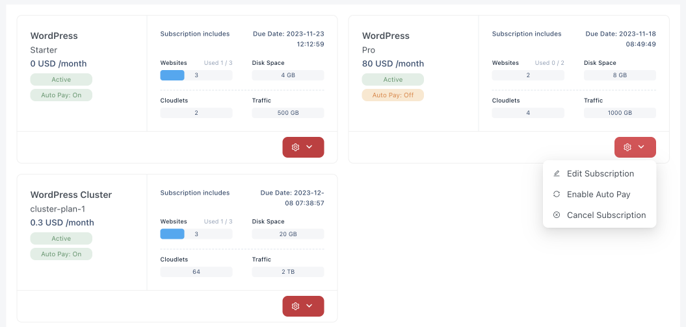

# WordPress Dashboard Overview

Virtuozzo Application Platform for WordPress provides a dedicated dashboard designed and optimized specifically for WordPress hosting. It has a deep integration with the product, offering just enough diagnostic information and management options to perform all the most frequently required operations without cluttering the screen or overwhelming a customer.

Below, we’ll provide an overview of the:

- [WordPress Dashboard](#wordpress-dashboard)
- [Account Settings](#account-settings)

## WordPress Dashboard

1\. The starting home page lists all the projects on the account with easily distinguishable statuses (*green* – active, *yellow* – action in progress, *red* - stopped).

2\. Using the tools panel, you can:

- switch between the **table** and **tile views** (the latter one gives a quick preview of the projects statistics in a real time)
- sort the list **alphabetically** or **by creation date** (in ascending or descending order)
- filter results using the **Search** field

Additionally, at the top-right corner of the home page, you can see the **Create New Project** button. Learn more at the dedicated [WordPress Project Creation](/wp-dashboard-project-installation/) guide.

3\. Each project has the following options available from the home page:

- Click the **name** to open a detailed project overview in the dedicated dashboard tab
- Click the **URL** to open your WordPress site in a new browser tab
- Click the **Datacenter Info** to view details on *Vendor*, *Country*, *Region*, etc.
- Expand the menu to get quick access to the **Stop** (**Start**), **Settings**, and **Delete** actions

4\. Clicking on the particular project opens a dedicated tab with detailed information and management options for the project.

Learn more at the [WordPress Project Management](/wp-dashboard-project-management/) guide.

## Account Settings

In the top-right corner of the dashboard, you can find a menu for managing your Virtuozzo Application Platform for WordPress account.

1\. It shows the account email address and Total Balance at the top. You can click the plus button next to your balance to refill it.

2\. The **Your Account** option will navigate you to the same-named section with the data related to the whole account:

- *User Information*
- *Payment Settings*
- *Invoices*
- *Subscriptions*
- *SSH Access Keys*

2.1. On the **User Information** tab, you can personalize the account by providing details in the dedicated form. Here you can specify the following information:

- **Email** of the account owner (uneditable)
- **Company** name for the account
- **Maintenance Time** (preferred time zone and hours) to perform support activities

The **Account Limits** table tracks all the platform’s core functionality availability and limits for your account. Additionally, for trial users, it provides a comparison with the paid account and the **Upgrade Account** button.

2.2. On the **Payment Settings** tab, you can go to the external billing system to **Manage** your billing information and payment methods.

2.3. The **Invoices** tab tracks all the generated invoices on your account and allows you to pay *open* and *expired* ones directly from the dashboard.

2.4. The **Subscriptions** section shows all subscriptions on the account.

Use the drop-down menu at the bottom of each subscription to manage it:

- **Edit Subscription** - opens the *Edit Subscription* dialog to change websites *Quantity*. The price per installation is calculated according to the remaining billing period.
  - *Upon upgrade* (increasing number of installations), the platform will automatically generate an additional “update quantity” invoice.
  - *In case of a downgrade* (no less than the number of installed websites), the platform will generate a refund invoice, and the account’s balance will be recharged.
- **Disable/Enable Auto Pay** - changes the *Auto Pay* option state for the selected subscription
- **Cancel Subscription** - terminates the subscription

2.5. The **SSH Access Keys** tab allows the management of public and private SSH keys on the account. It also provides information on the connection to your account and projects via SSH.

To add a new SSH key, click the appropriate button:

- **Add Public Key** - for gaining SSH access to your account and projects
- **Add Private Key** - for granting the platform access to the remote repositories with the corresponding public key

The platform supports the following key types:

- *ECDSA*
- *EdDSA*
- *RSA*

In the linked documents, you can learn more about [generating SSH keys](/ssh-generate-key/) and [connecting via SSH Gate](/ssh-gate-access/).

3\. The **System Settings** option will navigate you to the section with data related to project management:

- *SSL Certificates*
- *Git Configuration*
- *Backup Storage*

3.1. The **SSL Certificates** tab manages SSL certificates on the account. It automatically lists all the [Let’s Encrypt certificates](https://www.virtuozzo.com/company/blog/free-ssl-certificates-with-lets-encrypt/) issued for your projects and allows manually adding [custom SSL certificates](/custom-ssl/) with the **Add SSL** button.

The **Bind SSL** sub-tab allows binding and unbinding custom SSL to/from the required projects (you need to add a custom domain first).

3.2. The **Git Configuration** tab lists all the repositories added to the account.

Click the **Add Repo** button and provide the necessary information in the opened window to add a new repository:

- **Name** – a custom name for the application
- **URL** – the appropriate URL to the repository
- **Branch** – the required branch of the repo
- **Use Authentication** – tick to provide credentials (*Login* with either *Token* or *SSH key*)

If needed, existing repositories can be edited (adjusting the values provided during the addition) and removed using the appropriate buttons in the repo list.

3.3. The **Backup Storage** tab shows the list of all the storage instances created to keep backups for your WordPress projects.

In order to add a new storage, click the **Add Backup** button and provide the following data:

- tick the preferred backup storage option to select it
- if needed, enable *annual* and *auto pay* options
- set the number of storage nodes
- provide *display name* and *domain*
- choose required *region* (if available)

Click **Add** when ready. Your new storage product will be created in a few minutes. Learn more about the [backup and restore process](/wordpress-backups/).

4\. The Language list allows changing the dashboard localization to the preferred language. The availability and exact options depend on the service hosting provider configurations.

Use the **Dark Mode** toggle to switch between dashboard’s light and dark themes.

5\.Next, you can see the list of useful links for your platform:

- Help Center
- Terms Of Use
- Privacy Policy

6\. The last **Log Out** option will end your current session with the Virtuozzo Application Platform for WordPress.

You’ll need to log in again to continue your work with the dashboard.

## What's next?

- [WordPress PaaS](/virtuozzo-application-platform-for-wordpress/)
- [WordPress Project Installation](/wp-dashboard-project-installation/)
- [WordPress Project Management](/wp-dashboard-project-management/)
- [WordPress Topologies](/wordpress-topologies/)
- [WordPress Backups](/wordpress-backups/)
- [WordPress Security Settings](/wordpress-security/)
- [WordPress PHP Optimization](/wordpress-php-optimization/)