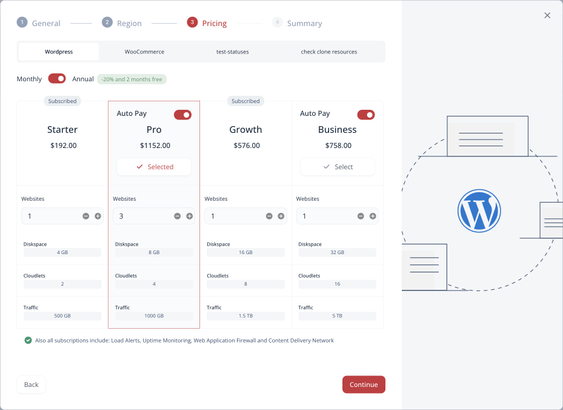

# WordPress Project Installation

Virtuozzo Application Platform for WordPress provides a quick and automated installation procedure for the new project creation. The built-in production/staging functionality helps implement various DevOps integrations. Let’s see these processes in detail:

- [Installing Project](#installing-project)
- [Staging Project](#staging-project)
- [Deleting Project](#deleting-project)

## Installing Project

The platform has a simple yet powerful installation wizard that automates the creation of new WordPress projects based on your needs.

1\. Click the **Create New Project** button at the top-right corner of the dashboard.

2\. In the opened wizard, you need to provide **Project** (an alias for easy identification) and **Sub-domain Names** as the first step.

Click **Continue** to proceed.

3\. Choose a **Region** from the interactive map (depending on the options available, only part of the map may be available) and **Continue** to the next step.

4\. On the **Pricing** step, you can see the list of existing subscriptions (if any) and add your new project to one of them using the **Apply Subscription** button. If the websites limit is reached, the new instance cannot be added to such a subscription.

5\. In case you don’t have any or want to add a new subscription (click the **Add A New Plan** button), configure the preferred topology as follows:

- choose the base *package* for your project (tabs at the top)
- use the toggle to switch between *monthly* and *annual* subscription
- click **Select** for the *tariff plan* based on the price and resource limits:
  - enable or disable the **Auto Pay** option for the required plan to make automatic charges using your default payment method
  - set the required number of **Websites** (i.e. how many projects it will be possible to create under this subscription)

{}**Tip:** If the listed tariffs are not suitable for your needs, you can contact the platform’s Support Team to discuss a personalized plan.{}

Click **Continue** to create your new subscription and add the project to with the **Apply Subscription** button (as described in the previous step).

6\. Lastly, review your project summary and click **Create New Project** to start the installation.

7\. Your new project will appear in the dashboard in a few minutes. Be sure to check your email for additional information on the project (e.g., access credentials for the database and WordPress admin panels).

Now you can proceed to the [Project Management](/wp-dashboard-project-management/) guide.

## Staging Project

If you want to create the *development/staging* pair for your project, the platform provides the built-in functionality to keep it organized (no need to create a separate project).

1\. A new project is considered “*production*” by default. In order to add a “*staging*” one, go to the required project and use the corresponding drop-down list (circled in the image below).

2\. After switching to **Staging**, click the *Copy from production* option to create the staging environment with the <u>*same topology*</u> as your production environment (with custom changes made up-to-date).

The platform will start the staging environment creation after the confirmation. Once it is ready, you can begin implementing your DevOps flow using the *stage* and *production* environments.

## Deleting Project

In order to delete a project, you can choose the appropriate **Delete** option from the project’s menu on the home page.

Alternatively, it can be done from the project’s page by navigating to the **Settings** section and clicking the **Delete Project** button at the bottom.

You’ll be asked to confirm the action by typing the project’s name.

{}**Note:** Deleting *production* will remove the whole project, while removing *[staging](#staging-project)* – only the corresponding environment (the production one will remain intact).{}

The project will be removed in a moment after the confirmation.

## What's next?

- [WordPress PaaS](/virtuozzo-application-platform-for-wordpress/)
- [WordPress Dashboard Overview](/wp-dashboard-overview/)
- [WordPress Project Management](/wp-dashboard-project-management/)
- [WordPress Topologies](/wordpress-topologies/)
- [WordPress Backups](/wordpress-backups/)
- [WordPress Security](/wordpress-security/)
- [WordPress PHP Optimization](/wordpress-php-optimization/)