# WordPress Project Management

All WordPress projects on the platform are provided with a dedicated page where you can view all the details, track monitoring data, deploy solutions, and perform other management operations.

Below, we’ve grouped all the functionality available for projects in the WordPress dashboard into the following groups:

- [Settings and Basic Actions](#settings-and-basic-actions)
- [General Data](#general-data)
- [WordPress Plugins](#wordpress-plugins)
- [Application Deployment](#application-deployment)
- [Environment Management](#environment-management)

## Settings and Basic Actions

1\. At the top of the project window, you can see the list of basic environment actions – **Stop** (**Start**), **Restart**, and **Settings**.

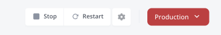

Just click the required button to perform the appropriate operation.

{}**Tip:** When restarting a **clustered solution**, you’ll see a drop-down list with all the nodes and node groups. For groups with several nodes, you can choose to restart *simultaneously* (all nodes at once) or *sequentially* (one by one). The latter option ensures that at least one node remains active and can process end-user requests (no downtime). The delay is needed to ensure that a node comes fully online before restarting the next one.

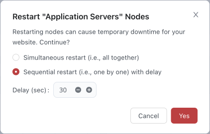
{}

2\. The button with a gear icon will redirect you to the project **Settings** page, which has several  sections, including an option to [delete the project](/wp-dashboard-project-installation/#deleting-project) at the bottom.

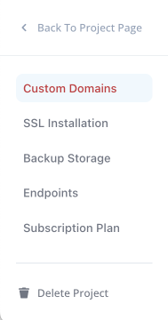

2.1. The **Custom Domains** section provides instruction and functionality for binding [custom domains](/custom-domains/) to your environment.

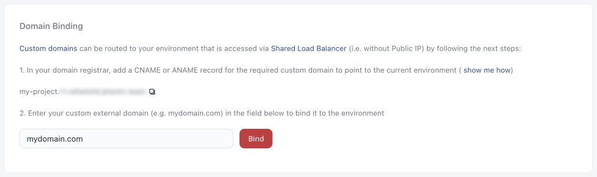

2.2. The **SSL Installation** section allows issuing new or viewing existing certificates. You can use automatic *[Let’s Encrypt SSL](https://www.virtuozzo.com/company/blog/free-ssl-certificates-with-lets-encrypt/)* or manually manage *custom SSL* for the project (you need to add custom domain first).

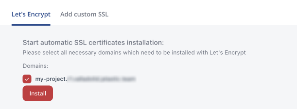

2.3. The **Backup Storage** section enables automatic backups for your project based on the specified schedule (*pre-defined*, *custom*, or *crontab*). Additionally, you can select backup storage (add it via [account settings](/wp-dashboard-overview/#account-settings)) and set a number of latest backups to keep. Learn more about the [backup and restore process](/wordpress-backups/).

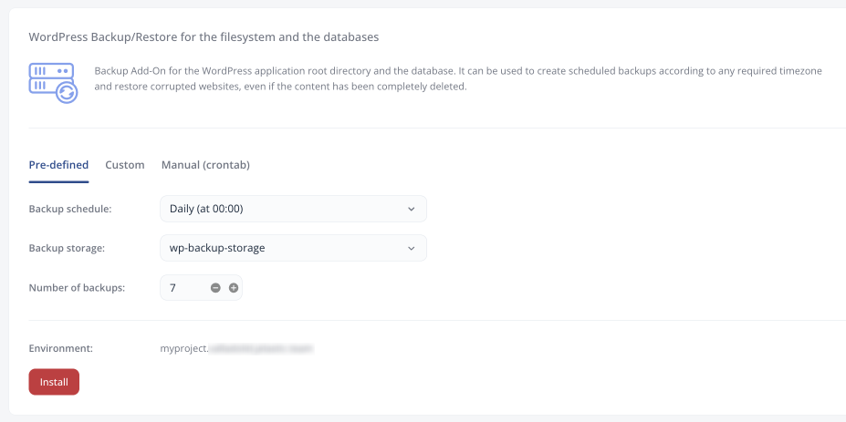

2.4. The **Endpoints** section shows a list of existing endpoints, allowing you to manage them, and creating new ones.

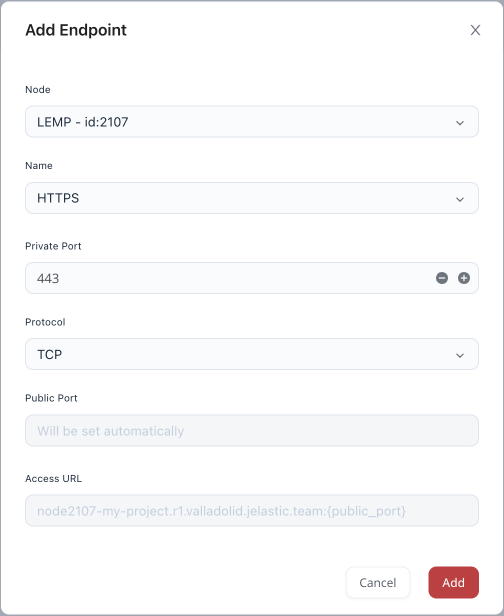

[Endpoints](/endpoints/) create a direct connection (over raw TCP or UDP protocol) to one of the project nodes without the mandatory *Public IP* address. It can be used to set up remote access. For example, one of the most common use cases is gaining remote access to your database instance using a local database client.

2.5. The **Subscription Plan** section shows subscription details of the current project and, depending on the hosting provider configurations, can provide the **Change Plan** option. It gives the ability to move the current project to a different plan within the same subscription.

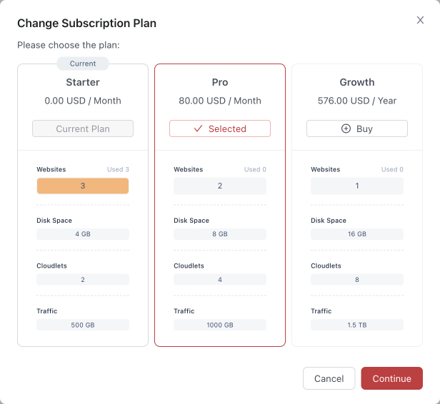

3\. Next to the buttons mentioned above, you can find a drop-down list to switch between [*Production* and *Staging* environments](/wp-dashboard-project-installation/#staging-project) for your project.

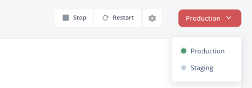

## General Data

The project’s ***Overview*** section provides the most frequently needed data for your project.

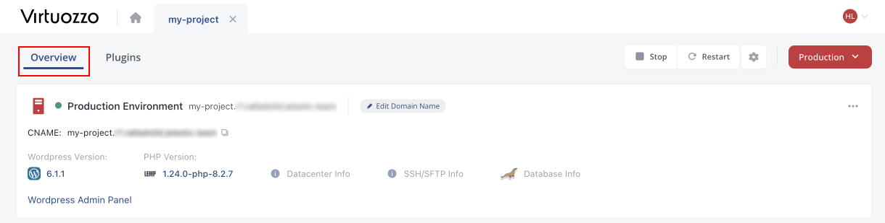

1\. The icon at the start shows whether the project is clustered or standalone solution. The colored dot next to it indicates project status (*green* – active, *yellow* – in progress, *red* – stopped). The name that follows defines whether the [environment is production or staging](/wp-dashboard-project-installation/#staging-project). Lastly, you can see the internal domain of the project.

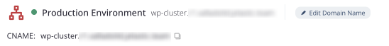

You can click the **Edit Domain Name** button to [bind a custom external domain](#settings-and-basic-actions).

2\. Far to the right, an expandable menu for application deployment is located. Here you can view and delete the default application or install a new one if there is none.

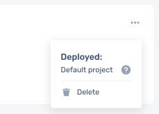

Learn more in the dedicated [Application Deployment](#application-deployment) section.

3\. Below that, the platform displays the automatically detected **WordPress version** and provides a link to the WordPress admin panel.

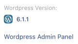

4\. The **PHP version** is shown as well.

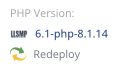

Hower over to see the **Redeploy** option that allows updating the PHP version. Click it and select a new tag with the preferable version. The operation will update your project containers to a new tag (version) without affecting the application inside.

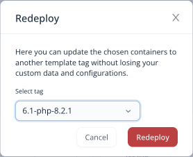

We recommend performing regular redeployments to the latest version to ensure your project’s container is running the up-to-date operating system and software stacks with all the latest vulnerability fixes. However, be aware that the operation will cause a brief downtime for the project. You can read more on the **[Redeployment](/container-redeploy/)** feature in the linked document.

5\. Click the **Datacenter Info** to check the relevant information.

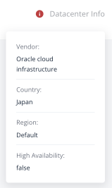

6\. Click the **SSH/SFTP Info** to see how you can access your project via the [SSH](/ssh-gate-access/#ssh-access-to-platform-account) and [SFTP](/ssh-protocols/) protocols. The drop-down list allows viewing information for different nodes of the cluster.

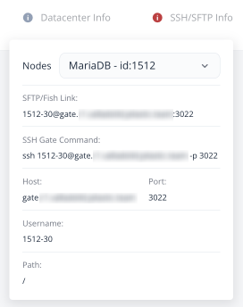

7\. You can click the **Database Info** to view the admin’s *Username*, an option to *Reset Password*, and redirect to the admin panel (an email with credentials was sent to you after the project creation). The drop-down list allows viewing information for different nodes of the cluster.

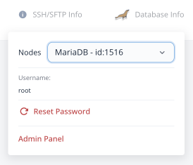

8\. If you have a custom application deployed, the appropriate label will be displayed.

## WordPress Plugins

The ***Plugins*** section lists all the WordPress plugins installed for your project. The list is automatically updated upon switching to this tab, so you always have up-to-date data.

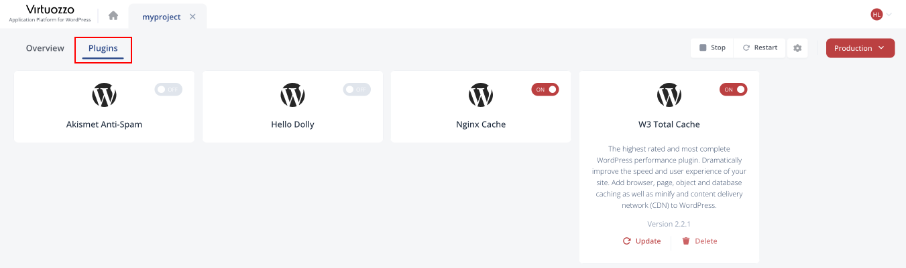

Here, you can hover over to view the plugin’s name and description. Use the toggle at the top to **Enable/Disable** it. You can **Update** your plugin if the appropriate option is available. Not-needed plugins can be removed with the **Delete** button.

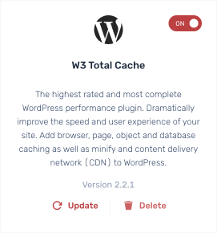

In order to add new plugins, you need to connect to your project via the ***WordPress admin panel*** (an email with credentials was sent to you after the project creation).

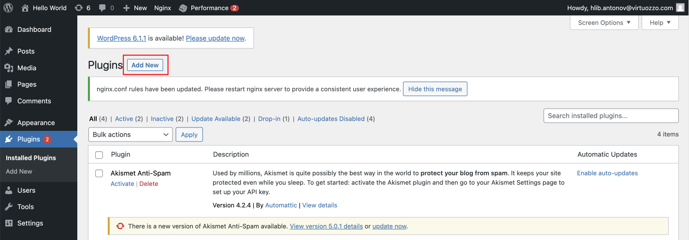

Go to the **Plugins** tab within the admin panel and choose the required plugin from the marketplace (or upload your custom one). Learn more at the official WordPress documentation - check the **[Managing Plugins](https://wordpress.org/support/article/managing-plugins/#finding-and-installing-plugins-1)** guide.

## Application Deployment

The application deployment menu is located at the right part of the overview section. Usually, a **Default project** is deployed during a new WordPress project creation. It is a sample website of the “Hello World” blog to help new users get started. Eventually, you may want to switch to something more suitable for your specific needs.

1\. Only one application can be deployed at a time. So, any existing solution should be removed before deploying a new application. Expand the deployment menu and click the **Delete** option.

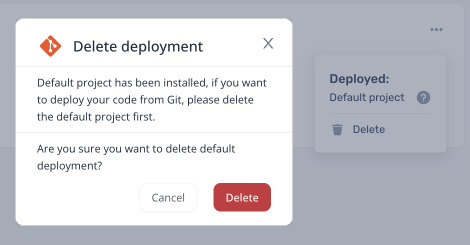

{}**Note:** This action may break the built-in integration with WordPress. Proceed only if you know exactly what you are doing.{}

Confirm the action via pop-up.

2\. If a project does not have any application deployed, the deployment menu will have the **Deploy** option.

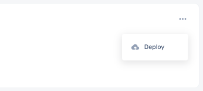

3\. Within the opened window, you can select the preferable Git repository from the list of ones added via the a[ccount settings](/wp-dashboard-overview/#account-settings). Optionally, tick the “*Check and auto-deploy updates (min*)” checkbox and provide the preferred period to enable automatic updates of the deployed application (only upon some changes).

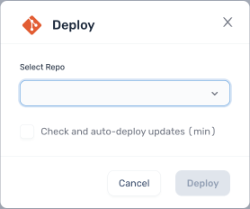

4\. In order to deploy an application from the new repository, choose the **Add New Repo** option from the list and provide the required details:

- **Name** – a custom name for the application
- **URL** – the appropriate URL to the repository
- **Branch** – the required branch of the repo
- **Use Authentication** – tick to provide credentials (*Login* with either *Token* or *SSH key*)

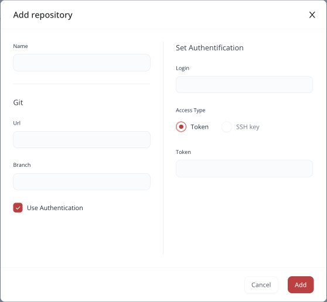

5\. After providing all the required data, click **Deploy** and wait a minute for the platform to automatically deploy the application to your project.

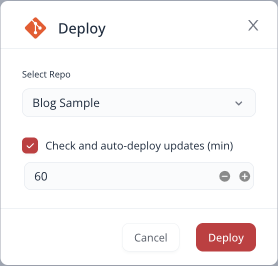

6\. For the deployed projects, the platform shows the Git URL and provides options to:

- **Pull** – manually initiate the application update from the repository
- **Edit** – switch to a different repo or adjust the auto-deploy feature (enable, disable, change interval)

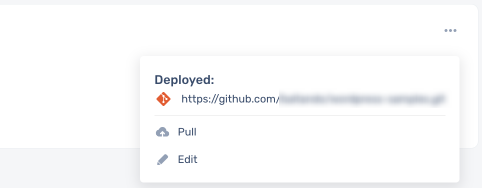

## Environment Management

The platform provides monitoring and file management options for your WordPress projects. Choose the required project and find the appropriate section at the bottom of the page.

You can use the buttons to the right (circled in the image above) to respectively:

- Maximize the section to a full screen.
- Split screen with the basic project information (the size of the section can be manually adjusted).
- Minimize the section to a single line at the bottom of the page.

1\. The ***Statistics*** tab of the section provides detailed information on the project consumption and is updated in real-time. Hover over the graphs for detailed data for that moment.

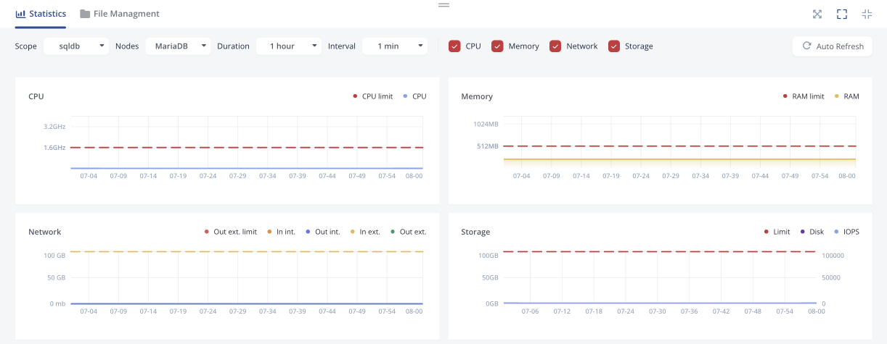

It is possible to adjust the displayed data using the tools panel:

- **Scope** – node type to show statistics (only available for clustered solutions with multiple nodes)
  - *bl* – load balancers (LiteSpeed ADC)
  - *cp* – application servers (LiteSpeed)
  - *nosql* – NoSQL databases (Redis)
  - *sql* – SQL databases (MariaDB)
  - *storage* – storage nodes (Shared Storage)
- **Nodes** – all or a specific node within the selected scope
- **Duration** – choose the required period (*hour*, *day*, or *month*)
- **Interval** – select the preferred interval (depends on the *Duration* option)
- **CPU, Memory, Network, Storage** – tick the data that should be displayed
- **Auto Refresh** – click to enable/disable data tracking in real time

2\. On the ***File Management*** tab, you can see your application files and perform basic management. You can select the needed node for the clustered solutions via the appropriate **Nodes** list at the top.

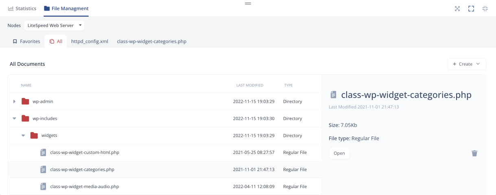

The **Favorites** tab is used for quick access to the main configuration files of the selected node. The **All** tab allows managing all project files. Select a file or folder to see additional information and actions to the right:

- **Folder** – you can create new files and folders inside, refresh content, or remove the directory.

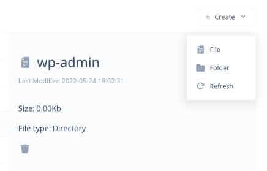

- **File** – you can open, refresh, or remove it. Opened files can be edited directly in the file manager. Changes can be saved to all nodes within the scope (for clusters only).

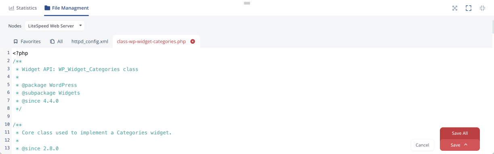

For [more management options](#general-data), connect via SSH or make adjustments via the database and WordPress admin panels.

## What's next?

- [WordPress PaaS](/virtuozzo-application-platform-for-wordpress/)
- [WordPress Dashboard Overview](/wp-dashboard-overview/)
- [WordPress Project Installation](/wp-dashboard-project-installation/)
- [WordPress Topologies](/wordpress-topologies/)
- [WordPress Backups](/wordpress-backups/)
- [WordPress Security](/wordpress-security/)
- [WordPress PHP Optimization](/wordpress-php-optimization/)