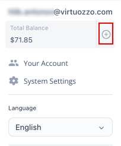
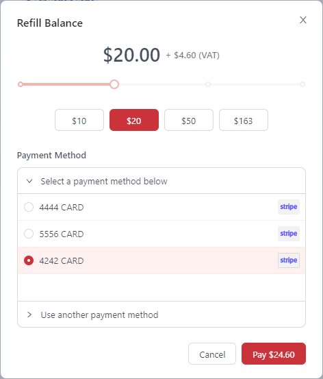
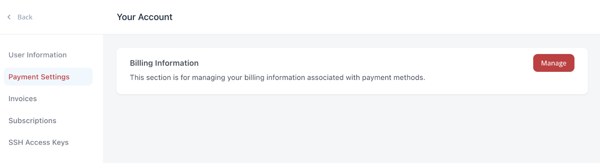
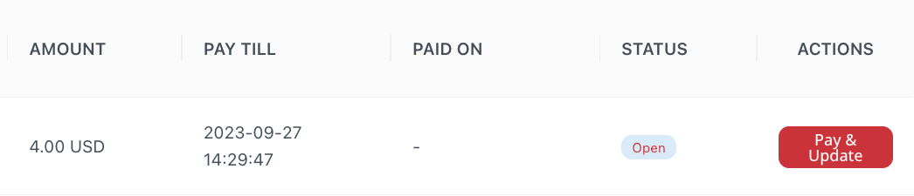
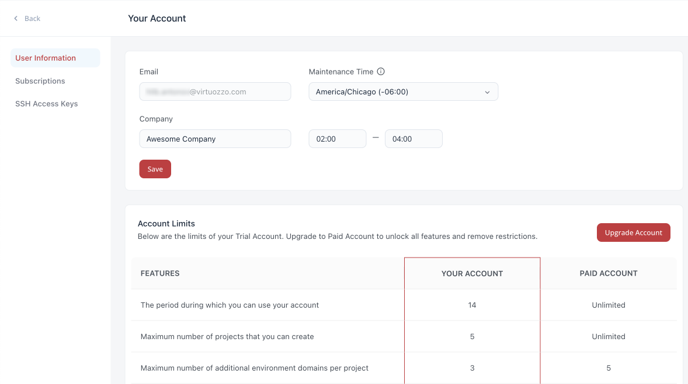
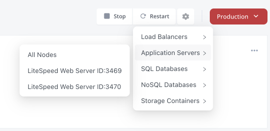
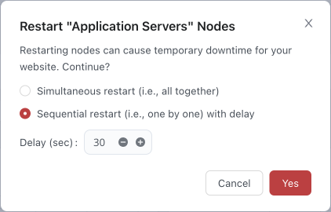
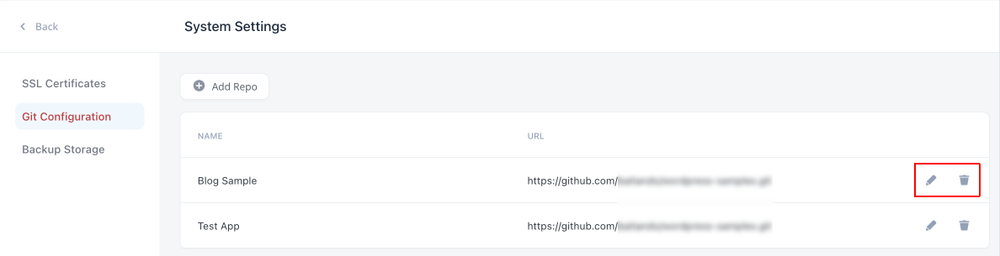
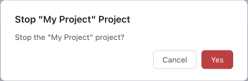
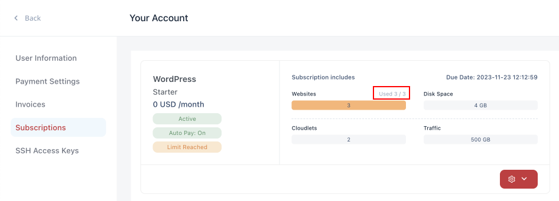

# Virtuozzo Application Platform for WordPress 2.2

*This document is preliminary and subject to change.*

In this document, you will find all of the new features, enhancements and visible changes included in the **Virtuozzo Application Platform for WordPress 2.2** release.

{}The general scope of changes is the same as for the *[Virtuozzo Application Platform (DevOps PaaS) 8.4](/release-notes-84/)* release. Below, we’ll highlight all the improvements specifics to the WordPress PaaS.{}

{}
{}
## Refill Balance from Dashboard
Implemented the possibility of refilling the account balance from the dashboard
{}

{}
## Pay Invoices from Dashboard
Added the button to pay the open or expired invoices
{}

{}
## Restart for Cluster Nodes
Implemented functionality to restart separate nodes and node groups for the WordPress clusters
{}
{}

{}
{}
## User Information Page Improvements
Updated the user information section and added the account limitation table
{}

{}
## Git Repositories Management
Added options to edit and remove the existing Git repository records
{}

{}
## Invasive Actions Confimation
Configured confirmation windows for action that can affect the user account or projects
{}

{}
## Service Plan Usage Data
Added a clear text caption for the used and total installations in the subscription
{}
{}

## Refill Balance from Dashboard

The possibility to refill the account balance from the dashboard was implemented in the current WordPress PaaS 2.2 release. The button is located next to the *Total Balance* value in the top-right menu.

Upon clicking the button, the ***Refill Balance*** dialog will be shown. Here, you can choose the refill sum (with taxes, if any) and payment method. Confirming the operation will redirect you to the external payment system to proceed with the payment.

Payment methods and billing information in general are managed at the external billing system. It can be accessed from the dashboard’s **[Your Account](/wp-dashboard-overview/#account-settings) > Payment Settings** section with the **Manage** button.

[More info](/wp-dashboard-overview/)

{}[Back to the top](#back){}

## Pay Invoices from Dashboard

In order to simplify the payment management, the **[Your Account](/wp-dashboard-overview/#account-settings) > Invoices** section was updated. Depending on the status (*open* or *expired*), a button to pay the invoice will be displayed in the new *Actions* column.

Click the pay button to see the confirmation window that will show all the related details on the invoice and subscription.

[More info](/wp-dashboard-overview/#account-settings)

{}[Back to the top](#back){}

## User Information Page Improvements

The **[Your Account](/wp-dashboard-overview/#account-settings) > User Information** section in the dashboard allows personalizing the account by providing details in the dedicated forms. In order to improve user experience, the following changes were applied to the section in the current WordPress PaaS 2.2 release:

- optimized UI
- adjusted information that can be provided
- reviewed texts
- added the *Account Limits* table

While working with the platform, some features can be completely or partially restricted (usually, for the *trial* accounts only). The new **Account Limits** table tracks all the platform’s core functionality availability and limits. Additionally, for trial users, it provides a comparison with the paid account.

[More info](/wp-dashboard-overview/#account-settings)

{}[Back to the top](#back){}

## Restart for Cluster Nodes

Virtuozzo Application Platform for WordPress provides support for the clustered solution that consists of multiple nodes across various node groups (application servers, load balancers, databases, etc.). The usage of several nodes per group provides redundancy and ensures high availability. In the current 2.2 platform release, the possibility to restart a separate node or group was implemented for the clustered solutions. Upon clicking the **Restart** button for the project, a drop-down list with all the groups will be shown. Hover over the particular option to select the specific node or all nodes in the group.

Additionally, when restarting a whole group with several nodes, you’ll get an option to perform the operation sequentially. In this mode, the restart will be triggered on the nodes one by one (not simultaneously on all of them). Also, a configurable delay between each restart is set. Such implementation ensures that at least one node remains active and can process end-user requests (no downtime). The delay is needed to ensure that a node comes fully online after the restart.

{}[Back to the top](#back){}

## Git Repositories Management

WordPress PaaS platform allows you to [deploy custom WordPress projects](/wp-dashboard-project-management/#application-deployment) from the remote Git repositories. You can add such repositories at the **System Settings > Git Configuration** section, which was updated to support the management of the already existing repos. For now, two new buttons were added at the right of each record:

- **Edit** – adjusts the repository details (same fields as during addition)
- **Delete** – removes the repository record from the dashboard

[More info](/wp-dashboard-overview/#account-settings)

{}[Back to the top](#back){}

## Invasive Actions Confimation

In the current 2.2 platform release, confirmation dialogs were added for all critical actions that can affect the user account or projects. It is necessary to ensure that invasive processes cannot be triggered by accident. After all the actions reviewed, additional confirmations were implemented for the following actions:

- *stopping/starting/restarting/deleting the project*
- *resetting the password for the node*
- *deleting custom SSL*
- *deleting SSH key*

{}[Back to the top](#back){}

## Service Plan Usage Data

In order to provide better clarity when tracking the number of used and available service plans per subscription, both the used and total number of plans are explicitly displayed for all the subscriptions. It complements the existing usage diagram, to make it easy to read the required data even for the large number of installations.

{}[Back to the top](#back){}