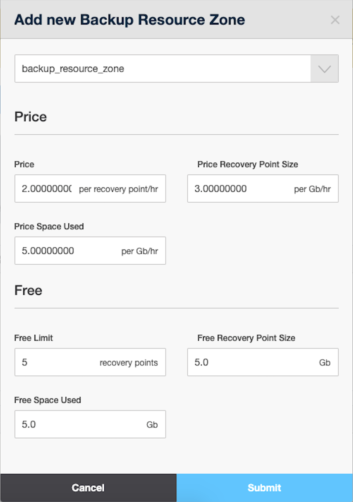

# .Billing for Backup Resource Zones v7.1PrivateBeta

The backup resource zone is available to users when it is present in the Access Control section of the users' bucket. In this document, you can find information on how to manage pricing and access to backup resource zones available in your cloud.

## Configure Access Control

The access to backup resource zones is configured in the Access Control section of the bucket. To give access to a backup resource zone for users to whom the bucket is assigned:

1.  Go to your **Control Panel** &gt; **Admin** &gt; **Buckets** menu.
2.  Click a label of a destination bucket and open the **Other** tab from the *Access Control* section. 
3.  Click the **Add New Backup Resource Zone** (**+**) button in the *Limits for Backup Resource Zones* box. 
4.  Select a backup resource zone that you want to add to the bucket and click the **Submit** button. 

Select the **Duplicate to rate card** checkbox before clicking **Submit** to add a backup resource zone to Rate Card of the bucket with the default price and free limit of 0. 

{.image-center width="700"}

When the backup resource zone is added to the Access Control section, users to whom the bucket is assigned will be able to use this zone. Go to the *Rate Card* tab to set a price for using backups available to users assigned to this bucket.

If no backup resource zones are added to Access Control, users under the bucket have access to none of the backup resource zones available on the system.

------------------------------------------------------------------------

## Configure Rate Card

The prices and free limits for backup resource zones are configured in the Rate Card section of the bucket. To set a price and free limit for a backup resource zone: 

1.  Go to your Control Panel &gt; **Admin** &gt; **Buckets** menu.
2.  Click a label of a destination bucket and open the **Other** tab from the **Rate Card** section. 
3.  Click the **Add New Backup Resource Zone** (**+**) button in the *Pricing for Backup Resource Zones* box.

4.  Select a backup resource zone that you want to add to the bucket and enter the following settings: 
    **Price**

    -   *Price* - set the price for a recovery point per hour charged for recovery points stored in the backup resource zone under this bucket
    -   *Price Recovery Point Size* - set the price for a recovery point size (Gb/hour) charged for recovery points stored in the backup resource zone under this bucket
    -   *Price Space Used* - set the price for a total disk size (Gb/hour) charged for all backups of a particular virtual server in the backup resource zone under this bucket

    **Free **

    -   *Free Limit* - set the number of recovery points (recovery point/hour) that users can store in the backup resource zone for free under this bucket
    -   *Free Recovery Point Size* - set the free size (Gb/hour) that users can consume to store their recovery points in the backup resource zone under this bucket
    -   *Free Space Used* - set the free size (Gb/hour) that users can consume to store all backups of a particular virtual server in the backup resource zone under this bucket

5.  When you are finished, click the **Submit** button. 

{.image-center width="220"}

If you only add the prices and free limits for a backup resource zone in Rate Card but don't add the backup resource zone to Access Control, users under the bucket have no access to the backup resource zone. To give users under the bucket access to the backup resource zone, you need to add this zone to Access Control.

## Attachments:

{width="8" height="8"} [OnApp › Company\_bucket\_for\_ORG\_B.gif](attachments/194479047/194479045.gif) (image/gif)
{width="8" height="8"} [backup\_plugin\_bucket.png](attachments/194479047/194479046.png) (image/png)

