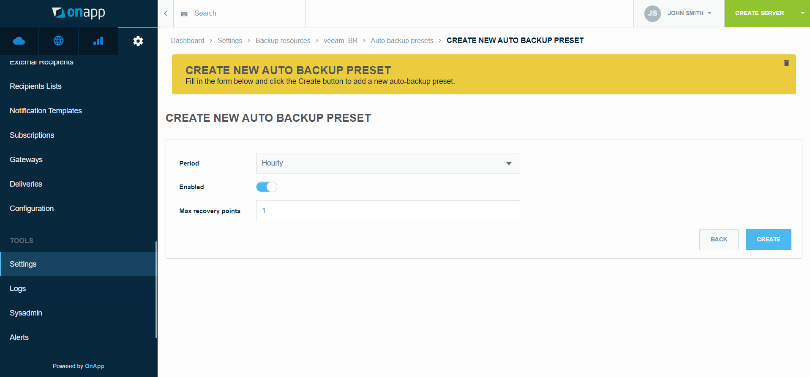
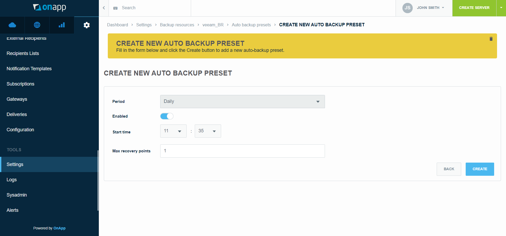
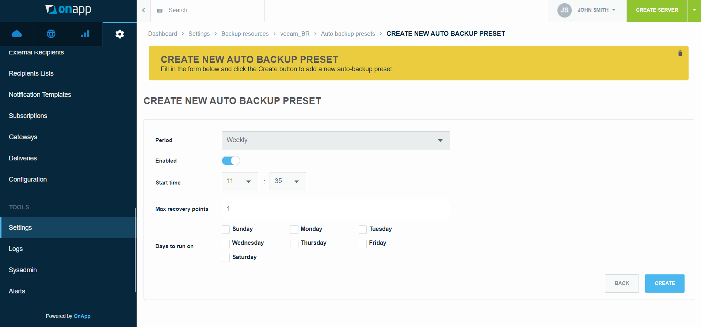
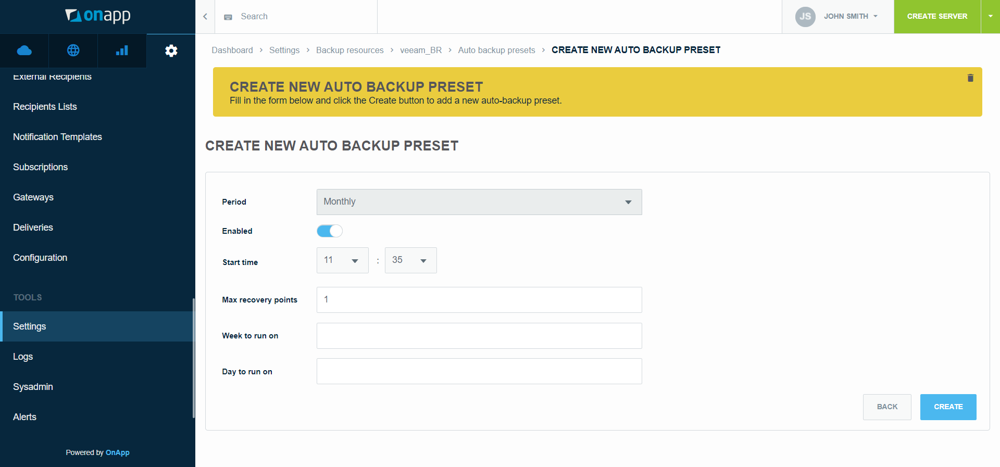
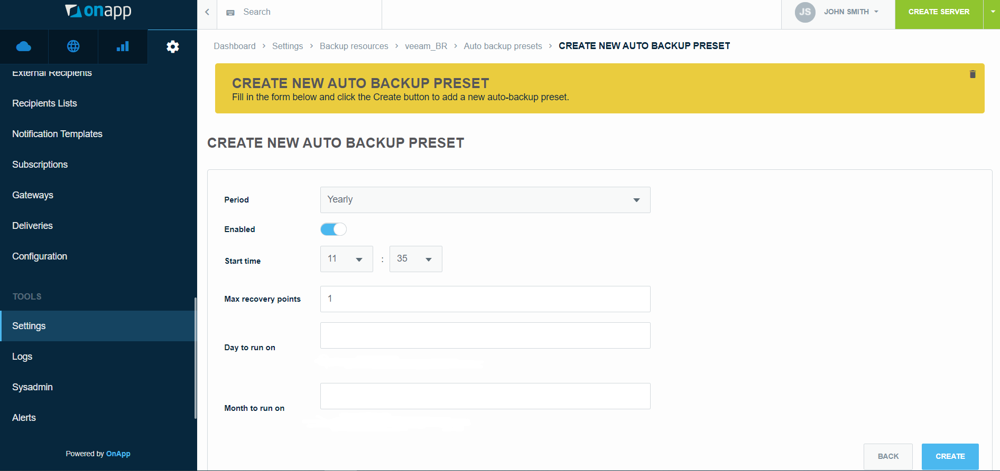
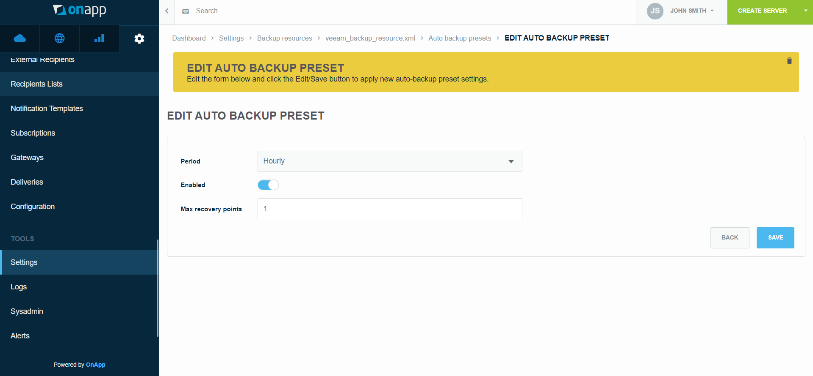
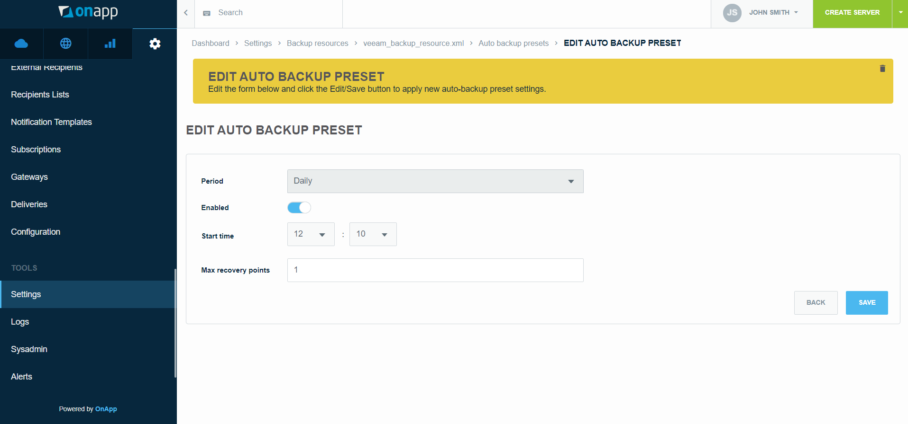
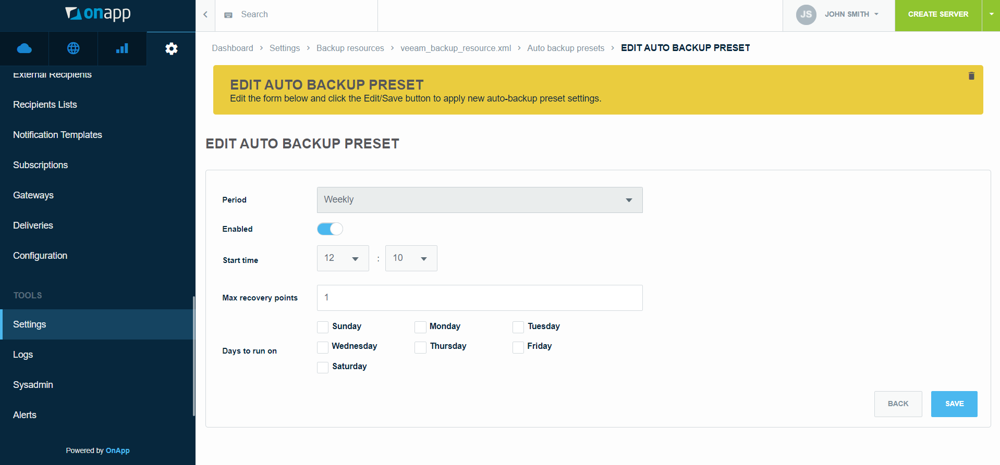
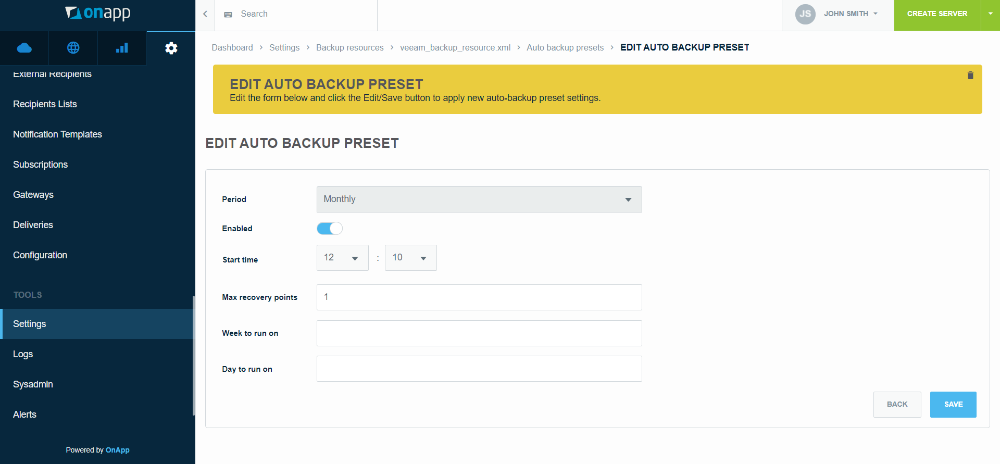
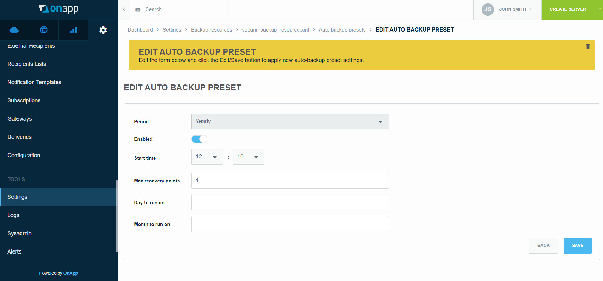

# .Create and Manage Auto Backup Presets v7.1PrivateBeta

After installing your [plugin](https://devopsdocs.onapp.com/display/IN/Installing+Plugins), creating backup [resource](.Create_and_Manage_Backup_Resources_v7.1PrivateBeta) and backup resource [zone](.Create_and_Manage_Backup_Resource_Zones_v7.1PrivateBeta) you can configure auto backup presets. Auto backup presets enable you to schedule when backups are automatically run on your third-party service to back up virtual servers hosted in OnApp. You can schedule backups to be run hourly, daily, weekly, monthly and yearly. In this document, you can find information on how to manage auto backup presets for your backup resource.  

To create, edit, and delete auto backup presets, refer to the following sections. 

------------------------------------------------------------------------

## Create Auto Backup Preset

-   For the R1Soft backup plugin, only an hourly auto backup preset is available. After the backup resource is created, one hourly preset is automatically added on this resource. You cannot create more hourly auto backup presets. To edit the default hourly preset, refer to [Edit Auto Backup Preset](#id-.CreateandManageAutoBackupPresetsv7.1PrivateBeta-edit).
-   For the Veeam backup plugin, all types of auto backup presets are available. You can create an unlimited number of auto backup presets for Veeam-based backup resources.

To create an auto backup preset, follow the next steps: 

1.  Go to your Control Panel &gt;** Admin** &gt; **Settings** menu. 
2.  Click the **Backup Resources** icon. 
3.  Click the **Actions** button next to the required backup resource and then click **Auto backup presets**.
4.  Click {width="26"} or the **New Auto Backup Preset** button.
5.  On the page that appears, select the *Period* and enter details, depending on the selected period: 

**Hourly 
**

1.  -   *Enabled *- turn the slider to the right to enable the auto backup preset
    -   *Max recovery points* - type the maximum number of recovery points to be created for a virtual server

        -   The recovery point represents a point-in-time full backup from which you can [restore a virtual server](.Manage_Virtual_Server_Recovery_Points_v7.1PrivateBeta). The *Max recovery points *option is used to set a total amount of recovery points that can be created for a destination VS. When the maximum limit is reached, new recovery points overwrite the existing ones.

        -   For the Veeam backup plugin, you can skip the *Max recovery points* option because you control the limit of recovery points via [Retention Policy](https://helpcenter.veeam.com/docs/backup/vsphere/retention_policy.html?ver=95) in Veeam Backup & Replication UI.

{.image-center width="700"}

**Daily 
**

-   -   *Enabled -*  turn the slider to the right to enable the auto backup preset
    -   *Start time* - select the start time for running the auto backup preset
    -   *Max recovery points* - type the maximum number of recovery points to be created for a virtual server
    -   Frequency - specify the frequency of how often to run the auto backup presetFor example, set 1 to run the auto backup preset every day, 2 - every second day, 3 - every third day, etc. 

{.image-center width="700"}

**Weekly
**

-   -   *Enabled *- turn the slider to the right to enable the auto backup preset
    -   *Start time* - select the start time for running the auto backup preset
    -   *Max recovery points* - type the maximum number of recovery points to be created for a virtual server
    -   *Days to run on* - select the day or days of the week when to run the auto backup preset 

{.image-center width="700"}

**Monthly**

For the Veeam backup plugin, to see the Week to run on option in UI, change the /onapp/interface/vendor/backups/plugins/veeam/config.xml file by setting the week\_of\_the\_month\_to\_run parameter to true:

``` java
<monthly>
  <day_of_the_week_to_run>true</day_of_the_week_to_run>
  <week_of_the_month_to_run>true</week_of_the_month_to_run>
</monthly>
```

-   -   *Enabled - *turn the slider to the right to enable the auto backup preset
    -   *Start time* - select the start time for running the auto backup preset
    -   *Max recovery points* - set the maximum number of recovery points to be created for a virtual server
    -   Week to run on - specify the week when to run the auto backup preset 
        For example, set *0* to run the auto backup preset on the first week of the month, *1* - the second week, *2* - the third week, *3* - the fourth week, or *4* - the fifth week.
    -   *Day to run on* - type the day or days of the week when to run the auto backup preset 
        For example, set *0* to run the auto backup preset on Sunday,* 1* - Monday, *2* - Tuesday, *3* - Wednesday, *4* - Thursday, *5* - Friday, or *6* - Saturday.

{.image-center width="700"}

**Yearly**

-   -   *Enabled *- turn the slider to the right to enable the auto backup preset
    -   *Start time* - select the start time for running the auto backup preset
    -   *Max recovery points* - type the maximum number of recovery points to be created for a virtual server
    -   *Day to run on* - type the day or days of the week when to run the auto backup preset 
        For example, set *0* to run the auto backup preset on Sunday,* 1* - Monday, *2* - Tuesday, *3* - Wednesday, *4* - Thursday, *5* - Friday, or *6* - Saturday.
    -   Month to run on - type the month or months of the year when to run the auto backup presetFor example, set 0 to run the auto backup preset in January, 1 - February, 2 - March, 3 - April, 4 - May, 5 - June, 6 - July, 7 - August, 8 - September, 9 - October, 10 - November, or 11 - December.

{.image-center width="700"}

     6. Click the **Create** button. 

You can also configure the re-run period for auto-backup in case of auto-backup transaction failure. By default, it is set to 3 hours, but you may change the time value in the info\_hub.yaml configuration file.

------------------------------------------------------------------------

## Edit Auto Backup Preset

When you edit an auto backup preset of a resource that is already attached to a virtual server, changes you make will not affect the existing backup schedule. For changes to be applied, detach the backup resource from the virtual server, edit the auto backup preset, and attach the resource again. When detaching the backup resource from the virtual server, all recovery points are deleted.

To edit an auto backup preset, follow the next steps: 

1.  Go to your Control Panel &gt;** Admin** &gt; **Settings** menu. 
2.  Click the **Backup Resources** icon. 
3.  Click the **Actions** button next to the required backup resource and then click **Auto backup presets**.
4.  On the page that appears, click the **Actions** button next to the required auto backup preset and then click **Edit**. You can change the following properties of the auto backup preset, depending on the selected period:

**Hourly 
**

-   -   *Enabled *- turn the slider to the right to enable the auto backup preset
    -   *Max recovery points* - type the maximum number of recovery points to be created for a virtual server

{.image-center width="700"}

**Daily 
**

-   -   *Enabled -*  turn the slider to the right to enable the auto backup preset
    -   *Start time* - select the start time for running the auto backup preset
    -   *Max recovery points* - type the maximum number of recovery points to be created for a virtual server
    -   Frequency - specify the frequency of how often to run the auto backup preset 
        For example, set 1 to run the auto backup preset every day, 2 - every second day, 3 - every third day, etc. 

{.image-center width="700"}

**Weekly
**

-   -   *Enabled *- turn the slider to the right to enable the auto backup preset
    -   *Start time* - select the start time for running the auto backup preset
    -   *Max recovery points* - type the maximum number of recovery points to be created for a virtual server
    -   *Days to run on* - select the day or days of the week when to run the auto backup preset 

{.image-center width="700"}

**Monthly
**

For the Veeam backup plugin, to see the Week to run on option in UI, change the /onapp/interface/vendor/backups/plugins/veeam/config.xml file by setting the week\_of\_the\_month\_to\_run parameter to true:

``` java
<monthly>
  <day_of_the_week_to_run>true</day_of_the_week_to_run>
  <week_of_the_month_to_run>true</week_of_the_month_to_run>
</monthly>
```

-   -   *Enabled - *turn the slider to the right to enable the auto backup preset
    -   *Start time* - select the start time for running the auto backup preset
    -   *Max recovery points* - set the maximum number of recovery points to be created for a virtual server
    -   *Week to run on* - specify the week when to run the auto backup preset
        For example, set *0* to run the auto backup preset on the first week of the month, *1* - the second week, *2* - the third week, *3* - the fourth week, or *4* - the fifth week.
    -   *Day to run on* - type the day or days of the week when to run the auto backup preset
        For example, set *0* to run the auto backup preset on Sunday,* 1* - Monday, *2* - Tuesday, *3* - Wednesday, *4* - Thursday, *5* - Friday, or *6* - Saturday.

{.image-center width="700"}

**Yearly**

-   -   *Enabled *- turn the slider to the right to enable the auto backup preset
    -   *Start time* - select the start time for running the auto backup preset
    -   *Max recovery points* - type the maximum number of recovery points to be created for a virtual server
    -   *Day to run on* - type the day or days of the week when to run the auto backup preset 
        For example, set *0* to run the auto backup preset on Sunday,* 1* - Monday, *2* - Tuesday, *3* - Wednesday, *4* - Thursday, *5* - Friday, or *6* - Saturday.
    -   Month to run on - type the month or months of the year when to run the auto backup presetFor example, set 0 to run the auto backup preset in January, 1 - February, 2 - March, 3 - April, 4 - May, 5 - June, 6 - July, 7 - August, 8 - September, 9 - October, 10 - November, or 11 - December.

{.image-center width="700"}

     5. Click the **Save **button. 

You can also configure the re-run period for auto-backup in the case of auto-backup transaction failure. By default, it is set to 3 hours, but you may change the time value in the info\_hub.yaml configuration file.

------------------------------------------------------------------------

## Delete Auto Backup Preset

To delete an auto backup preset, follow the next steps: 

1.  Go to your Control Panel &gt; **Admin** &gt;** Settings** menu. 
2.  Click the **Backup Resources** icon. 
3.  Click the **Actions** button next to the required backup resource and then click **Auto backup presets**.
4.  On the page that appears, click the **Actions** button next to the required auto backup preset and then click **Delete**.
5.  Click the **OK* ***button to confirm your action. 

## Attachments:

{width="8" height="8"} [image2022-1-27\_11-2-34.png](attachments/194479087/194479076.png) (image/png)
{width="8" height="8"} [image2022-2-4\_11-47-25.png](attachments/194479087/194479077.png) (image/png)
{width="8" height="8"} [image2022-2-4\_11-54-31.png](attachments/194479087/194479078.png) (image/png)
{width="8" height="8"} [image2022-2-4\_11-58-27.png](attachments/194479087/194479079.png) (image/png)
{width="8" height="8"} [image2022-2-4\_12-1-33.png](attachments/194479087/194479080.png) (image/png)
{width="8" height="8"} [image2022-2-4\_12-7-2.png](attachments/194479087/194479081.png) (image/png)
{width="8" height="8"} [image2022-2-4\_12-11-32.png](attachments/194479087/194479082.png) (image/png)
{width="8" height="8"} [image2022-2-4\_12-12-16.png](attachments/194479087/194479083.png) (image/png)
{width="8" height="8"} [image2022-2-4\_12-13-22.png](attachments/194479087/194479084.png) (image/png)
{width="8" height="8"} [image2022-2-4\_12-14-16.png](attachments/194479087/194479085.png) (image/png)
{width="8" height="8"} [image2022-2-4\_12-15-16.png](attachments/194479087/194479086.png) (image/png)

