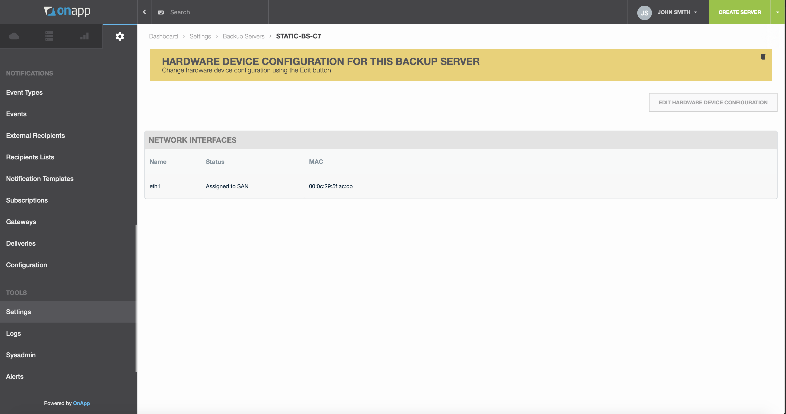
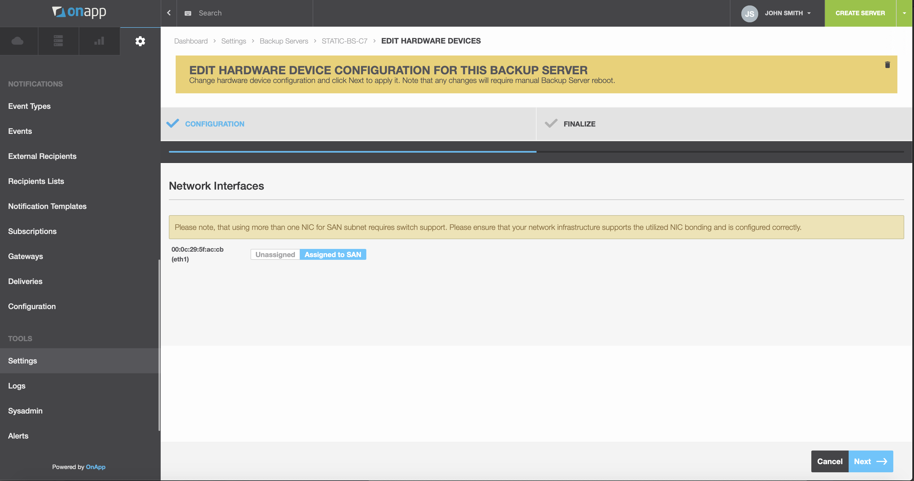

# .Manage Backup Servers Hardware Devices v7.1PrivateBeta

You can manage Integrated Storage Static Backup Server network interfaces at any time after the [Backup server creation](.Create_and_Manage_Backup_Servers_v7.1PrivateBeta).

To edit IS Static Backup Server Hardware Devices configuration:

1.  Go to Control Panel &gt; **Admin** &gt; **Settings** menu &gt; **Backup Servers** &gt; label of a backup server &gt; **Tools** &gt; **Hardware Devices**.
2.  The page that loads displays Network Interfaces details:

    -   *Name*
    -   *Status *
    -   *MAC address*

3.  Click the **Edit Hardware Device Configuration** button.
4.  Configure network interfaces. For each backup server NIC, you can use one of the following options:
    -   *Unassigned* - leave the NIC unused.
    -   *Assigned to SAN* - select this option to use this interface for storage network. In this case, NIC interface will be bonded with virtual network interface of the Storage Controller Server.

5.  Click **Next**.
6.  After devices are successfully reconfigured, click **Finish**.

{.rwui_button .rwui_inline-block .rwui_size_large .rwui_id_8dae6e3d-de5a-4b89-be90-d52823336432}
Leave feedback

## Attachments:

{width="8" height="8"} [Screen Shot 2019-08-21 at 12.25.50.png](attachments/194479170/194479168.png) (image/png)
{width="8" height="8"} [Screen Shot 2019-08-21 at 12.26.04.png](attachments/194479170/194479169.png) (image/png)

