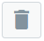
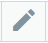
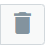

# .Template Store v7.1PrivateBeta

Template store enables you to organize individual templates into groups that can be used as a paid resource for buckets. This allows you to easily create groups of templates which can be added to the bucket to limit the amount or types of templates that are available to a user. Also you can add ISO and OVA templates to the template store and set prices for these templates in the bucket. After ISO or OVA template is added to the template store, you can create a VS using this template.

Prices for templates are set in the bucket's Rate Card. For more information, refer to [Configure Resource Allocation And Prices](.Configure_Resource_Allocation_and_Prices_v7.1PrivateBeta).

------------------------------------------------------------------------

## Template Group Management

The template groups have hierarchical (tree) structure:

-   Template group – e.g., OS
-   Child group
-   Templates

Click the Template group's label to expand the list of child groups, then click the template group's label to view the list of templates, respectively.

In the **Search** box, select the checkbox next to the desired filter option to filter the templates by operating system, virtualization, architecture, and the availability of guest agents.

------------------------------------------------------------------------

### Add Template Group

1.  Go to your Control Panel &gt; **Cloud** &gt; **Templates** &gt; **Template Store **menu.
2.  Click {width="26"} **** upper right or the Create New Template Group button lower right.
3.  On the page that appears, fill in the following:

-   -   *Label* - specify the name of your group
    -   Specify the Windows Licensing type: MAK, KMS, or User license
    -   For KMS licensing, set the following parameters:
        -   *Server Label* – the name of the KMS server
        -   *KMS Server Host* – the hostname of the licensing server
        -   *KMS Server Port* – the port used to connect to the licensing server

       4. Click **Save**.

You can add child template groups to your template group by clicking {width="26"} &gt; **Add Child** next to your template group.

------------------------------------------------------------------------

### Assign Template to Template Group

1.  Go to your Control Panel &gt; **Cloud** &gt; **Templates** &gt; **Template Store** menu.
2.  Click {width="26"} next to the required child group's label, then select **Add Template**.
3.  Choose the template from the drop-down list and click **Save**.

------------------------------------------------------------------------

### Remove Template from Template Group

1.  Go to your Control Panel &gt; **Cloud** &gt; **Templates** &gt; **Template Store** menu.
2.  Click the template group's label, then click the name of the template group from which you wish to remove a template.
3.  Сlick {width="26"} next to a template you want to remove.
4.  Confirm the deletion.

------------------------------------------------------------------------

### Edit or Delete Template Group

1.  Go to your Control Panel &gt; **Cloud** &gt; **Templates** &gt; **Template Store **menu.
2.  On the page that follows, you'll see the list of all template groups created within your cloud:
    -   Click the group's label, then click the child group label to see the list of templates assigned to this group.
    -   Click {width="26"} next to a group to edit its name.
    -   Click {width="26"} to delete a group.

------------------------------------------------------------------------

## Add ISO to Template Store

Before VS creation from ISO, you should add ISO to the Template store. To add ISO template to the template store:

1.  Go to your Control Panel &gt; **Cloud** &gt; **Templates** &gt; **Template Store** menu.
2.  Click {width="26"} next to specific template group and click **Add ISO**.
3.  Choose ISO from the drop-down list.
4.  Click **Save**.

------------------------------------------------------------------------

## Add OVA to Template Store

When the OVA file is uploaded and converted into a template, you should add this template to the template store before creating a virtual server. To add an OVA template to the template store:

1.  Go to your Control Panel &gt; **Cloud** &gt; **Templates** &gt; **Template Store** menu.
2.  Click {width="26"} next to OVA template group and click **Add OVA**.
3.  Choose the required OVA from the drop-down list.
4.  Click **Save**.

## Attachments:

{width="8" height="8"} [image2022-10-17\_15-43-54.png](attachments/194478684/194478679.png) (image/png)
{width="8" height="8"} [image2022-10-17\_15-46-45.png](attachments/194478684/194478680.png) (image/png)
{width="8" height="8"} [image2022-10-17\_15-49-55.png](attachments/194478684/194478681.png) (image/png)
{width="8" height="8"} [image2022-10-17\_15-50-49.png](attachments/194478684/194478682.png) (image/png)
{width="8" height="8"} [image2022-10-17\_15-51-23.png](attachments/194478684/194478683.png) (image/png)

