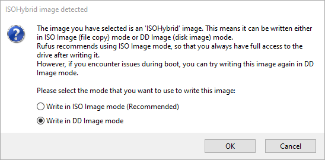

# Preparing for Installation from USB Storage Drives v7.1Beta

Installing Virtuozzo Hybrid Server from a USB storage drive requires a 2 GB or higher-capacity USB drive and the Virtuozzo Hybrid Server 9 distribution ISO image.

Make a bootable USB drive by transferring the distribution image to it.

Be careful to specify the correct drive to transfer the image to.

On Linux, you can use `dd`:

``` java
# dd if=<VZ9_ISO_image> of=/dev/sdb
```

On Windows, you can use [Rufus](https://rufus.ie/):

1.  In the **Drive Properties** section, select your flash drive from the **Device** drop-down menu and click **SELECT**. Then, select the distribution image from your local machine.
2.  Click **START**.
    

3.  In the dialog, select **Write in DD Image mode** and click **OK**.
    {.image-center width="450"}

## Attachments:

{width="8" height="8"} [rufus1.png](194478115.png) (image/png)
{width="8" height="8"} [rufus2.png](194478116.png) (image/png)

