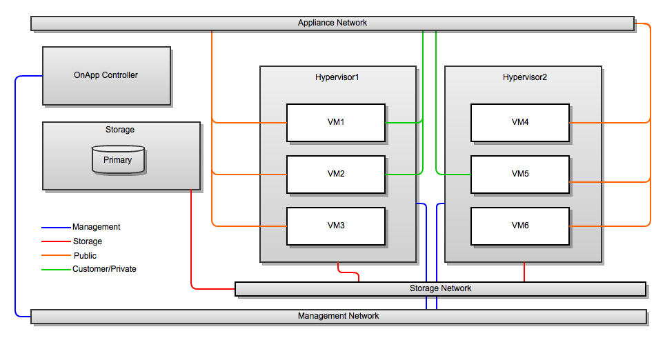
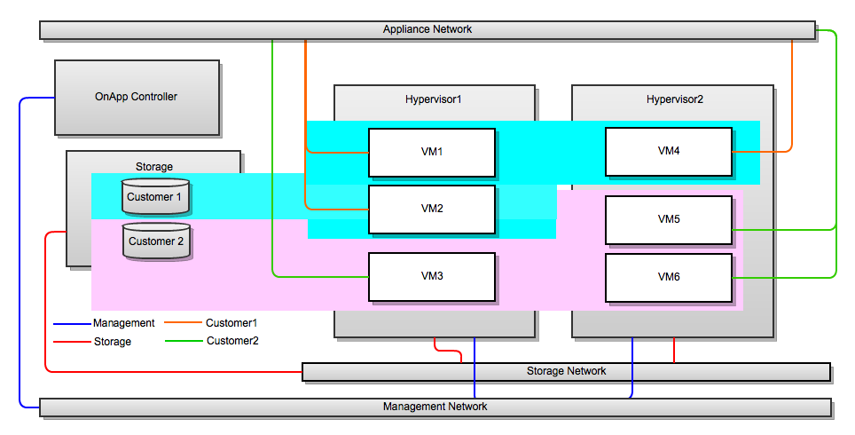

# Use Cases

OnApp provides different cloud models and deployment strategies for you to build an environment that is right for your needs. This document is an overview of the following services you can build with OnApp: 

-   **[Public Cloud](#UseCases-public)**
-   **[Virtual Private Cloud](#UseCases-private)**
-   **[VPS Cloud](#UseCases-vps)**
-   **[Hybrid Cloud Hosting](#UseCases-hybrid)**
-   **[Traditional VPS Model](#UseCases-traditional)**

## Pay-as-you-go Public Cloud

------------------------------------------------------------------------

You can use OnApp to set up a complete pay-as-you-go public cloud and provide your users with the following: 

-   Enable users to build virtual servers and other cloud resources.
-   Set different prices for RAM, CPU, and storage.
-   Create different compute zones with different pricing.

{.image-right width="250"}

## Virtual Private Cloud

------------------------------------------------------------------------

Use OnApp to offer virtual private cloud services or run a private cloud alongside a public cloud. 

-   Group compute, network, and storage resources into a single private cloud resource for users.
-   Provide your users with all the benefits of a private cloud enhanced by the resources of the public cloud.

{.image-right width="250"}

## VPS Cloud

------------------------------------------------------------------------

Use OnApp to create a cloud hosting service with resources packaged as a pre-configured VPS:

-   Group cloud resources into packages that you can offer on a monthly/plan billing basis. 
-   Provide your users with packages that are the building blocks for their VSs. 
-   Facilitate the transition of traditional VPS customers to the cloud.

{.image-right width="250"}

## Hybrid Cloud Hosting

------------------------------------------------------------------------

It is where dedicated hosting meets the cloud. You can use OnApp to offer hybrid servers to users and compete with every dedicated server provider out there:

-   Allocate compute resources on a one-to-one basis: each user gets a dedicated compute resource for their hosted service.
-   Get a failover provided by the rest of the cloud (for example, one compute resource might act as a failover for five *live* compute resources).

{.image-right width="250"}

## Traditional VPS Model

------------------------------------------------------------------------

You can use OnApp to provide traditional VPS services based on local storage:

-   OnApp doesn't demand that you have a SAN back-end.
-   OnApp can provide users with traditional VPSs using local storage.

{.image-right width="250"}

## Attachments:

{width="8" height="8"} [vps.png](attachments/194479507/195790903.png) (image/png)
{width="8" height="8"} [hybridcloud.png](attachments/194479507/195790904.png) (image/png)
{width="8" height="8"} [vpscloud.png](attachments/194479507/195790905.png) (image/png)
{width="8" height="8"} [privatecloud.png](attachments/194479507/195790906.png) (image/png)
{width="8" height="8"} [publiccloud.png](attachments/194479507/195790907.png) (image/png)

